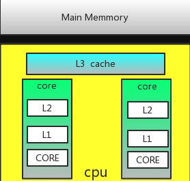
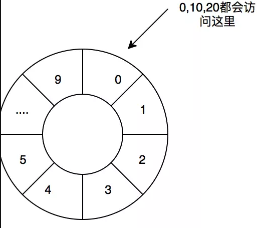
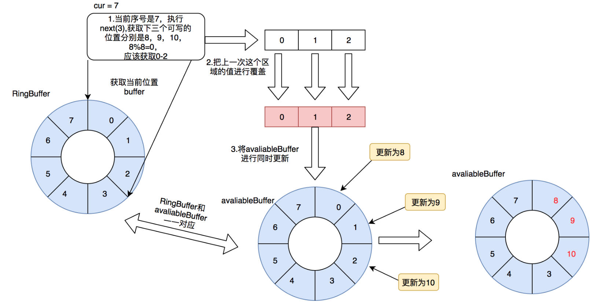
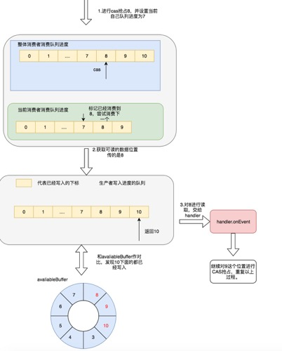
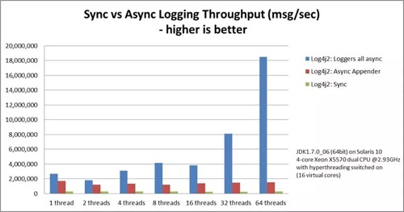

> 本文由 [简悦 SimpRead](http://ksria.com/simpread/) 转码， 原文地址 https://juejin.im/post/5b5f10d65188251ad06b78e3

1. 何为队列
=======

听到队列相信大家对其并不陌生，在我们现实生活中队列随处可见，去超市结账，你会看见大家都会一排排的站得好好的，等待结账，为什么要站得一排排的，你想象一下大家都没有素质，一窝蜂的上去结账，不仅让这个超市崩溃，还会容易造成各种踩踏事件，当然这些事其实在我们现实中也是会经常发生。

当然在计算机世界中，队列是属于一种数据结构，队列采用的 FIFO(first in firstout)，新元素（等待进入队列的元素）总是被插入到尾部，而读取的时候总是从头部开始读取。在计算中队列一般用来做排队 (如线程池的等待排队，锁的等待排队)，用来做解耦（生产者消费者模式），异步等等。

2.jdk 中的队列
==========

在 jdk 中的队列都实现了 java.util.Queue 接口，在队列中又分为两类，一类是线程不安全的，ArrayDeque，LinkedList 等等，还有一类都在 java.util.concurrent 包下属于线程安全，而在我们真实的环境中，我们的机器都是属于多线程，当多线程对同一个队列进行排队操作的时候，如果使用线程不安全会出现，覆盖数据，数据丢失等无法预测的事情，所以我们这个时候只能选择线程安全的队列。在 jdk 中提供的线程安全的队列下面简单列举部分队列:

| 队列名字              | 是否加锁 | 数据结构   | 关键技术点    | 是否有锁 | 是否有界 |
| --------------------- | -------- | ---------- | ------------- | -------- | -------- |
| ArrayBlockingQueue    | 是       | 数组 array | ReentrantLock | 有锁     | 有界     |
| LinkedBlockingQueue   | 是       | 链表       | ReentrantLock | 有锁     | 有界     |
| LinkedTransferQueue   | 否       | 链表       | CAS           | 无锁     | 无界     |
| ConcurrentLinkedQueue | 否       | 链表       | CAS           | 无锁     | 无界     |

我们可以看见，我们无锁的队列是无界的，有锁的队列是有界的，这里就会涉及到一个问题，我们在真正的线上环境中，无界的队列，对我们系统的影响比较大，有可能会导致我们内存直接溢出，所以我们首先得排除无界队列，当然并不是无界队列就没用了，只是在某些场景下得排除。其次还剩下 ArrayBlockingQueue，LinkedBlockingQueue 两个队列，他们两个都是用 ReentrantLock 控制的线程安全，他们两个的区别一个是数组，一个是链表，在队列中，一般获取这个队列元素之后紧接着会获取下一个元素，或者一次获取多个队列元素都有可能，而数组在内存中地址是连续的，在操作系统中会有缓存的优化 (下面也会介绍缓存行)，所以访问的速度会略胜一筹，我们也会尽量去选择 ArrayBlockingQueue。而事实证明在很多第三方的框架中，比如早期的 log4j 异步，都是选择的 ArrayBlockingQueue。

当然 ArrayBlockingQueue，也有自己的弊端，就是性能比较低，为什么 jdk 会增加一些无锁的队列，其实就是为了增加性能，很苦恼，又需要无锁，又需要有界，这个时候恐怕会忍不住说一句你咋不上天呢？但是还真有人上天了。

3.Disruptor
===========

Disruptor 就是上面说的那个天，Disruptor 是英国外汇交易公司 LMAX 开发的一个高性能队列，并且是一个开源的并发框架，并获得 2011Duke’s 程序框架创新奖。能够在无锁的情况下实现网络的 Queue 并发操作，基于 Disruptor 开发的系统单线程能支撑每秒 600 万订单。目前，包括 Apache Storm、Camel、Log4j2 等等知名的框架都在内部集成了 Disruptor 用来替代 jdk 的队列，以此来获得高性能。

3.1 为什么这么牛逼？
------------

上面已经把 Disruptor 吹出了花了，你肯定会产生疑问，他真的能有这么牛逼吗，我的回答是当然的，在 Disruptor 中有三大杀器:

*   CAS
*   消除伪共享
*   RingBuffer 有了这三大杀器，Disruptor 才变得如此牛逼。

### 3.1.1 锁和 CAS

我们 ArrayBlockingQueue 为什么会被抛弃的一点，就是因为用了重量级 lock 锁，在我们加锁过程中我们会把锁挂起，解锁后，又会把线程恢复, 这一过程会有一定的开销，并且我们一旦没有获取锁，这个线程就只能一直等待，这个线程什么事也不能做。

CAS（compare and swap），顾名思义先比较在交换，一般是比较是否是老的值，如果是的进行交换设置，大家熟悉乐观锁的人都知道 CAS 可以用来实现乐观锁，CAS 中没有线程的上下文切换，减少了不必要的开销。 这里使用 JMH，用两个线程，每次 1 一次调用，在我本机上进行测试，代码如下:

```
@BenchmarkMode({Mode.SampleTime})
@OutputTimeUnit(TimeUnit.MILLISECONDS)
@Warmup(iterations=3, time = 5, timeUnit = TimeUnit.MILLISECONDS)
@Measurement(iterations=1,batchSize = 100000000)
@Threads(2)
@Fork(1)
@State(Scope.Benchmark)
public class Myclass {
    Lock lock = new ReentrantLock();
    long i = 0;
    AtomicLong atomicLong = new AtomicLong(0);
    @Benchmark
    public void measureLock() {
        lock.lock();
        i++;
        lock.unlock();
    }
    @Benchmark
    public void measureCAS() {
        atomicLong.incrementAndGet();
    }
    @Benchmark
    public void measureNoLock() {
        i++;
    }
}
复制代码

```

测试出来结果如下:

| 测试项目 | 测试结果 |
| -------- | -------- |
| Lock     | 26000ms  |
| CAS      | 4840ms   |
| 无锁     | 197ms    |

可以看见 Lock 是五位数，CAS 是四位数，无锁更小是三位数。 由此我们可以知道 Lock>CAS > 无锁。

而我们的 Disruptor 中使用的就是 CAS，他利用 CAS 进行队列中的一些下标设置，减少了锁的冲突，提高了性能。

另外对于 jdk 中其他的无锁队列也是使用 CAS，原子类也是使用 CAS。

### 3.1.2 伪共享

谈到了伪共享就不得不说计算机 CPU 缓存, 缓存大小是 CPU 的重要指标之一，而且缓存的结构和大小对 CPU 速度的影响非常大，CPU 内缓存的运行频率极高，一般是和处理器同频运作，工作效率远远大于系统内存和硬盘。实际工作时，CPU 往往需要重复读取同样的数据块，而缓存容量的增大，可以大幅度提升 CPU 内部读取数据的命中率，而不用再到内存或者硬盘上寻找，以此提高系统性能。但是从 CPU 芯片面积和成本的因素来考虑，缓存都很小。



CPU 缓存可以分为一级缓存，二级缓存，如今主流 CPU 还有三级缓存，甚至有些 CPU 还有四级缓存。每一级缓存中所储存的全部数据都是下一级缓存的一部分，这三种缓存的技术难度和制造成本是相对递减的，所以其容量也是相对递增的。

为什么 CPU 会有 L1、L2、L3 这样的缓存设计？主要是因为现在的处理器太快了，而从内存中读取数据实在太慢（一个是因为内存本身速度不够，另一个是因为它离 CPU 太远了，总的来说需要让 CPU 等待几十甚至几百个时钟周期），这个时候为了保证 CPU 的速度，就需要延迟更小速度更快的内存提供帮助，而这就是缓存。对这个感兴趣可以把电脑 CPU 拆下来，自己把玩一下。

每一次你听见 intel 发布新的 cpu 什么, 比如 i7-7700k,8700k，都会对 cpu 缓存大小进行优化，感兴趣可以自行下来搜索，这些的发布会或者发布文章。

Martin 和 Mike 的 QConpresentation 演讲中给出了一些每个缓存时间：

| 从 CPU 到                                 | 大约需要的 CPU 周期 | 大约需要的时间 |
| ----------------------------------------- | ------------------- | -------------- |
| 主存                                      |                     | 约 60-80 纳秒  |
| QPI 总线传输 (between sockets, not drawn) |                     | 约 20ns        |
| L3 cache                                  | 约 40-45 cycles     | 约 15ns        |
| L2 cache                                  | 约 10 cycles        | 约 3ns         |
| L1 cache                                  | 约 3-4 cycles       | 约 1ns         |
| 寄存器                                    |                     | 1 cycle        |

#### 缓存行

在 cpu 的多级缓存中，并不是以独立的项来保存的，而是类似一种 pageCahe 的一种策略，以缓存行来保存，而缓存行的大小通常是 64 字节，在 Java 中 Long 是 8 个字节，所以可以存储 8 个 Long, 举个例子，你访问一个 long 的变量的时候，他会把帮助再加载 7 个，我们上面说为什么选择数组不选择链表，也就是这个原因，在数组中可以依靠缓冲行得到很快的访问。

缓存行是万能的吗？NO，因为他依然带来了一个缺点，我在这里举个例子说明这个缺点，可以想象有个数组队列，ArrayQueue，他的数据结构如下:

```
class ArrayQueue{
    long maxSize;
    long currentIndex;
}
复制代码

```

对于 maxSize 是我们一开始就定义好的，数组的大小，对于 currentIndex，是标志我们当前队列的位置，这个变化比较快，可以想象你访问 maxSize 的时候，是不是把 currentIndex 也加载进来了，这个时候，其他线程更新 currentIndex, 就会把 cpu 中的缓存行置位无效，请注意这是 CPU 规定的，他并不是只吧 currentIndex 置位无效，如果此时又继续访问 maxSize 他依然得继续从内存中读取，但是 MaxSize 却是我们一开始定义好的，我们应该访问缓存即可，但是却被我们经常改变的 currentIndex 所影响。

#### Padding 的魔法

为了解决上面缓存行出现的问题，在 Disruptor 中采用了 Padding 的方式，

```
class LhsPadding
{
    protected long p1, p2, p3, p4, p5, p6, p7;
}

class Value extends LhsPadding
{
    protected volatile long value;
}

class RhsPadding extends Value
{
    protected long p9, p10, p11, p12, p13, p14, p15;
}
复制代码

```

其中的 Value 就被其他一些无用的 long 变量给填充了。这样你修改 Value 的时候，就不会影响到其他变量的缓存行。

最后顺便一提，在 jdk8 中提供了 @Contended 的注解，当然一般来说只允许 Jdk 中内部，如果你自己使用那就得配置 Jvm 参数 -RestricContentended = fase，将限制这个注解置位取消。很多文章分析了 ConcurrentHashMap，但是都把这个注解给忽略掉了，在 ConcurrentHashMap 中就使用了这个注解，在 ConcurrentHashMap 每个桶都是单独的用计数器去做计算，而这个计数器由于时刻都在变化，所以被用这个注解进行填充缓存行优化，以此来增加性能。

### 3.1.3RingBuffer

在 Disruptor 中采用了数组的方式保存了我们的数据，上面我们也介绍了采用数组保存我们访问时很好的利用缓存，但是在 Disruptor 中进一步选择采用了环形数组进行保存数据，也就是 RingBuffer。在这里先说明一下环形数组并不是真正的环形数组，在 RingBuffer 中是采用取余的方式进行访问的，比如数组大小为 10，0 访问的是数组下标为 0 这个位置，其实 10，20 等访问的也是数组的下标为 0 的这个位置。

> 实际上，在这些框架中取余并不是使用 % 运算，都是使用的 & 与运算，这就要求你设置的大小一般是 2 的 N 次方也就是，10,100,1000 等等，这样减去 1 的话就是，1，11，111，就能很好的使用 index & (size -1), 这样利用位运算就增加了访问速度。 如果在 Disruptor 中你不用 2 的 N 次方进行大小设置，他会抛出 buffersize 必须为 2 的 N 次方异常。

当然其不仅解决了数组快速访问的问题，也解决了不需要再次分配内存的问题，减少了垃圾回收，因为我们 0，10，20 等都是执行的同一片内存区域，这样就不需要再次分配内存，频繁的被 JVM 垃圾回收器回收。



自此三大杀器已经说完了，有了这三大杀器为 Disruptor 如此高性能垫定了基础。接下来还会在讲解如何使用 Disruptor 和 Disruptor 的具体的工作原理。

3.2Disruptor 怎么使用
-----------------

下面举了一个简单的例子:

```java
ublic static void main(String[] args) throws Exception {
        // 队列中的元素
        class Element {
            @Contended
            private String value;


            public String getValue() {
                return value;
            }

            public void setValue(String value) {
                this.value = value;
            }
        }

        // 生产者的线程工厂
        ThreadFactory threadFactory = new ThreadFactory() {
            int i = 0;
            @Override
            public Thread newThread(Runnable r) {
                return new Thread(r, "simpleThread" + String.valueOf(i++));
            }
        };

        // RingBuffer生产工厂,初始化RingBuffer的时候使用
        EventFactory<Element> factory = new EventFactory<Element>() {
            @Override
            public Element newInstance() {
                return new Element();
            }
        };

        // 处理Event的handler
        EventHandler<Element> handler = new EventHandler<Element>() {
            @Override
            public void onEvent(Element element, long sequence, boolean endOfBatch) throws InterruptedException {
                System.out.println("Element: " + Thread.currentThread().getName() + ": " + element.getValue() + ": " + sequence);
//                Thread.sleep(10000000);
            }
        };


        // 阻塞策略
        BlockingWaitStrategy strategy = new BlockingWaitStrategy();

        // 指定RingBuffer的大小
        int bufferSize = 8;

        // 创建disruptor，采用单生产者模式
        Disruptor<Element> disruptor = new Disruptor(factory, bufferSize, threadFactory, ProducerType.SINGLE, strategy);

        // 设置EventHandler
        disruptor.handleEventsWith(handler);

        // 启动disruptor的线程
        disruptor.start();
        for (int i = 0; i < 10; i++) {
            disruptor.publishEvent((element, sequence) -> {
                System.out.println("之前的数据" + element.getValue() + "当前的sequence" + sequence);
                element.setValue("我是第" + sequence + "个");
            });

        }
    }
```

在 Disruptor 中有几个比较关键的: ThreadFactory：这是一个线程工厂，用于我们 Disruptor 中生产者消费的时候需要的线程。 EventFactory：事件工厂，用于产生我们队列元素的工厂，在 Disruptor 中，他会在初始化的时候直接填充满 RingBuffer，一次到位。 EventHandler：用于处理 Event 的 handler，这里一个 EventHandler 可以看做是一个消费者，但是多个 EventHandler 他们都是独立消费的队列。 WorkHandler: 也是用于处理 Event 的 handler，和上面区别在于，多个消费者都是共享同一个队列。 WaitStrategy：等待策略，在 Disruptor 中有多种策略，来决定消费者获消费时，如果没有数据采取的策略是什么？下面简单列举一下 Disruptor 中的部分策略

*   BlockingWaitStrategy：通过线程阻塞的方式，等待生产者唤醒，被唤醒后，再循环检查依赖的 sequence 是否已经消费。
  
*   BusySpinWaitStrategy：线程一直自旋等待，可能比较耗 cpu
  
*   LiteBlockingWaitStrategy：线程阻塞等待生产者唤醒，与 BlockingWaitStrategy 相比，区别在 signalNeeded.getAndSet, 如果两个线程同时访问一个访问 waitfor, 一个访问 signalAll 时，可以减少 lock 加锁次数.
  
*   LiteTimeoutBlockingWaitStrategy：与 LiteBlockingWaitStrategy 相比，设置了阻塞时间，超过时间后抛异常。
  
*   YieldingWaitStrategy：尝试 100 次，然后 Thread.yield() 让出 cpu
  

EventTranslator: 实现这个接口可以将我们的其他数据结构转换为在 Disruptor 中流通的 Event。

3.3 工作原理
--------

上面已经介绍了 CAS，减少伪共享, RingBuffer 三大杀器，介绍下来说一下 Disruptor 中生产者和消费者的整个流程。

### 3.3.1 生产者

对于生产者来说，可以分为多生产者和单生产者，用 ProducerType.Single, 和 ProducerType.MULTI 区分，多生产者和单生产者来说多了 CAS，因为单生产者由于是单线程，所以不需要保证线程安全。

在 disruptor 中通常用 disruptor.publishEvent 和 disruptor.publishEvents() 进行单发和群发。

在 disruptor 发布一个事件进入队列需要下面几个步骤:

1.  首先获取 RingBuffer 中下一个在 RingBuffer 上可以发布的位置，这个可以分为两类:

*   从来没有写过的位置
*   已经被所有消费者读过，可以在写的位置。 如果没有读取到会一直尝试去读，disruptor 做的很巧妙，并没有一直占据 CPU，而是通过 LockSuport.park()，进行了一下将线程阻塞挂起操作，为的是不让 CPU 一直进行这种空循环，不然其他线程都抢不到 CPU 时间片。 获取位置之后会进行 cas 进行抢占，如果是单线程就不需要。

2.  接下来调用我们上面所介绍的 EventTranslator 将第一步中 RingBuffer 中那个位置的 event 交给 EventTranslator 进行重写。
3.  进行发布，在 disruptor 还有一个额外的数组用来记录当前 ringBuffer 所在位置目前最新的序列号是多少，拿上面那个 0，10，20 举例，写到 10 的时候这个 avliableBuffer 就在对应的位置上记录目前这个是属于 10，有什么用呢后面会介绍。进行发布的时候需要更新这个 avliableBuffer，然后进行唤醒所有阻塞的生产者。

下面简单画一下流程，上面我们拿 10 举例是不对的，因为 bufferSize 必须要 2 的 N 次方，所以我们这里拿 Buffersize=8 来举例: 下面介绍了当我们已经 push 了 8 个 event 也就是一圈的时候，接下来再 push 3 条消息的一些过程: 1. 首先调用 next(3)，我们当前在 7 这个位置上所以接下来三条是 8，9，10，取余也就是 0，1，2。 2. 重写 0，1，2 这三个内存区域的数据。 3. 写 avaliableBuffer。



对了不知道大家对上述流程是不是很熟悉呢，对的那就是类似我们的 2PC，两阶段提交，先进行 RingBuffer 的位置锁定，然后在进行提交和通知消费者。具体 2PC 的介绍可以参照我的另外一篇文章[再有人问你分布式事务，给他看这篇文章](https://juejin.im/post/5b5a0bf9f265da0f6523913b)。

### 3.3.1 消费者

对于消费者来说，上面介绍了分为两种，一种是多个消费者独立消费，一种是多个消费者消费同一个队列，这里介绍一下较为复杂的多个消费者消费同一个队列，能理解这个也就能理解独立消费。 在我们的 disruptor.strat() 方法中会启动我们的消费者线程以此来进行后台消费。在消费者中有两个队列需要我们关注，一个是所有消费者共享的进度队列，还有个是每个消费者独立消费进度队列。 1. 对消费者共享队列进行下一个 Next 的 CAS 抢占，以及对自己消费进度的队列标记当前进度。 2. 为自己申请可读的 RingBuffer 的 Next 位置，这里的申请不仅仅是申请到 next，有可能会申请到比 Next 大的一个范围，阻塞策略的申请的过程如下:

*   获取生产者对 RingBuffer 最新写的位置
*   判断其是否小于我要申请读的位置
*   如果大于则证明这个位置已经写了，返回给生产者。
*   如果小于证明还没有写到这个位置，在阻塞策略中会进行阻塞，其会在生产者提交阶段进行唤醒。 3. 对这个位置进行可读校验，因为你申请的位置可能是连续的，比如生产者目前在 7，接下来申请读，如果消费者已经把 8 和 10 这个序列号的位置写进去了，但是 9 这个位置还没来得及写入，由于第一步会返回 10，但是 9 其实是不能读的，所以得把位置向下收缩到 8。  4. 如果收缩完了之后比当前 next 要小，则继续循环申请。 5. 交给 handler.onEvent() 处理

一样的我们举个例子，我们要申请 next=8 这个位置。 1. 首先在共享队列抢占进度 8，在独立队列写入进度 7 2. 获取 8 的可读的最大位置，这里根据不同的策略进行，我们选择阻塞，由于生产者生产了 8，9，10，所以返回的是 10，这样和后续就不需要再次和 avaliableBuffer 进行对比了。 3. 最后交给 handler 进行处理。



4.Log4j 中的 Disruptor
====================

下面的图展现了 Log4j 使用 Disruptor,ArrayBlockingQueue 以及同步的 Log4j 吞吐量的对比，可以看见使用了 Disruptor 完爆了其他的，当然还有更多的框架使用了 Disruptor，这里就不做介绍了。



最后
==

本文介绍了传统的阻塞队列的缺点，后文重点吹逼了下 Disruptor，以及他这么牛逼的原因，以及具体的工作流程。

如果以后有人问你叫你设计一个高效无锁队列，需要怎么设计？相信你能从文章中总结出答案，如果对其有疑问或者想和我交流思路，可以关注我的公众号，加我好友和我一起讨论。

最后这篇文章被我收录于 JGrowing，一个全面，优秀，由社区一起共建的 Java 学习路线，如果您想参与开源项目的维护，可以一起共建，github 地址为:[github.com/javagrowing…](https://link.juejin.im?target=https%3A%2F%2Fgithub.com%2Fjavagrowing%2FJGrowing) 麻烦给个小星星哟。