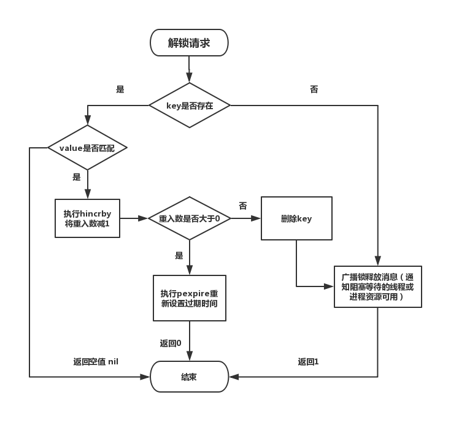
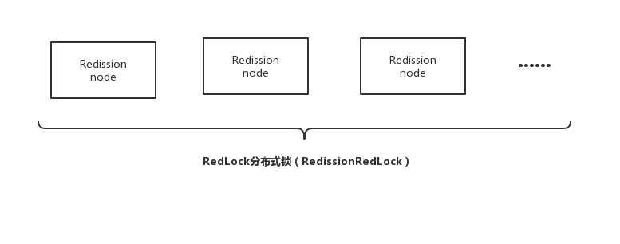

目前几乎很多大型网站及应用都是分布式部署的，分布式场景中的数据一致性问题一直是一个比较重要的话题。分布式的CAP理论告诉我们“任何一个分布式系统都无法同时满足一致性（Consistency）、可用性（Availability）和分区容错性（Partition tolerance），最多只能同时满足两项。”所以，很多系统在设计之初就要对这三者做出取舍。在互联网领域的绝大多数的场景中，都需要牺牲强一致性来换取系统的高可用性，系统往往只需要保证“最终一致性”，只要这个最终时间是在用户可以接受的范围内即可。

在很多场景中，我们为了保证数据的最终一致性，需要很多的技术方案来支持，比如分布式事务、分布式锁等。有的时候，我们需要保证一个方法在同一时间内只能被同一个线程执行。在单机环境中，Java中其实提供了很多并发处理相关的API，但是这些API在分布式场景中就无能为力了。也就是说单纯的Java Api并不能提供分布式锁的能力。所以针对分布式锁的实现目前有多种方案。

针对分布式锁的实现，目前比较常用的有以下几种方案：

> 基于数据库实现分布式锁 基于缓存（redis，memcached，tair）实现分布式锁 基于Zookeeper实现分布式锁

在分析这几种实现方案之前我们先来想一下，我们需要的分布式锁应该是怎么样的？（这里以方法锁为例，资源锁同理）

------

|        特性        | ReentrantLock |    mysql分布式锁    | zookeeper分布式锁  |         redis分布式锁          |
| :----------------: | :-----------: | :-----------------: | :----------------: | :----------------------------: |
| lock、unlock原子性 |    CAS自旋    |   insert、悲观锁    |  add/delete node   |           setnx、lua           |
|   线程阻塞与唤醒   |  LockSupport  | select...for update | watch partent node |       subscribe/publish        |
|       可重入       |     state     |       不支持        |       不知道       |            hash存储            |
| 保证加解锁线程相同 | 记录ThreadId  | connection.commit() |    记录ThreadId    | 随机数/记录RedssionId+threadId |
|  服务宕机避免死锁  |    无影响     |      自动释放       |      自动释放      |      过期时间或者自动续期      |
|      单点问题      |    无影响     |       不支持        |       高可用       |          RedLock算法           |
|        性能        |      好       |         差          |         差         |               好               |

# 数据库实现分布式锁

## (1) 基于数据库表

要实现分布式锁，最简单的方式可能就是直接创建一张锁表，然后通过操作该表中的数据来实现了。

当我们要锁住某个方法或资源时，我们就在该表中增加一条记录，想要释放锁的时候就删除这条记录。

创建这样一张数据库表：

```mysql
CREATE TABLE `methodLock` (
  `id` int(11) NOT NULL AUTO_INCREMENT COMMENT '主键',
  `method_name` varchar(64) NOT NULL DEFAULT '' COMMENT '锁定的方法名',
  `desc` varchar(1024) NOT NULL DEFAULT '备注信息',
  `update_time` timestamp NOT NULL DEFAULT CURRENT_TIMESTAMP ON UPDATE CURRENT_TIMESTAMP COMMENT '保存数据时间，自动生成',
  PRIMARY KEY (`id`),
  UNIQUE KEY `uidx_method_name` (`method_name `) USING BTREE
) ENGINE=InnoDB DEFAULT CHARSET=utf8 COMMENT='锁定中的方法';
```

当我们想要锁住某个方法时，执行以下SQL：

```
insert into methodLock(method_name,desc) values (‘method_name’,‘desc’)
```

因为我们对`method_name`做了唯一性约束，这里如果有多个请求同时提交到数据库的话，数据库会保证只有一个操作可以成功，那么我们就可以认为操作成功的那个线程获得了该方法的锁，可以执行方法体内容。

当方法执行完毕之后，想要释放锁的话，需要执行以下Sql:

```
delete from methodLock where method_name ='method_name'
```

上面这种简单的实现有以下几个问题：

> 1、这把锁强依赖数据库的可用性，数据库是一个单点，一旦数据库挂掉，会导致业务系统不可用。
>
> 2、这把锁==没有失效时间==，一旦解锁操作失败，就会导致锁记录一直在数据库中，其他线程无法再获得到锁。
>
> 3、这把锁只能是非阻塞的，因为数据的insert操作，一旦插入失败就会直接报错。没有获得锁的线程并不会进入排队队列，要想再次获得锁就要再次触发获得锁操作。
>
> 4、这把锁是==非重入==的，同一个线程在没有释放锁之前无法再次获得该锁。因为数据中数据已经存在了。

当然，我们也可以有其他方式解决上面的问题。

- 数据库是单点？搞两个数据库，数据之前双向同步。一旦挂掉快速切换到备库上。
- 没有失效时间？只要做一个定时任务，每隔一定时间把数据库中的超时数据清理一遍。
- 非阻塞的？搞一个while循环，直到insert成功再返回成功。
- 非重入的？在数据库表中加个字段，记录当前获得锁的机器的主机信息和线程信息，那么下次再获取锁的时候先查询数据库，如果当前机器的主机信息和线程信息在数据库可以查到的话，直接把锁分配给他就可以了。

------

## (2) 基于数据库排他锁

除了可以通过增删操作数据表中的记录以外，其实还可以借助数据中自带的锁来实现分布式的锁。

我们还用刚刚创建的那张数据库表。可以通过数据库的排他锁来实现分布式锁。 基于MySql的InnoDB引擎，可以使用以下方法来实现加锁操作：

```java
public boolean lock(){
    connection.setAutoCommit(false)
    while(true){
        try{
            result = select * from methodLock where method_name=xxx for update;
            if(result==null){
                return true;
            }
        }catch(Exception e){

        }
        sleep(1000);
    }
    return false;
}
```

在查询语句后面增加`for update`，数据库会在查询过程中给数据库表增加排他锁（这里再多提一句，InnoDB引擎在加锁的时候，只有通过索引进行检索的时候才会使用行级锁，否则会使用表级锁。这里我们希望使用行级锁，就要给method_name添加索引，值得注意的是，这个索引一定要创建成唯一索引，否则会出现多个重载方法之间无法同时被访问的问题。重载方法的话建议把参数类型也加上。）。当某条记录被加上排他锁之后，其他线程无法再在该行记录上增加排他锁。

我们可以认为获得排它锁的线程即可获得分布式锁，当获取到锁之后，可以执行方法的业务逻辑，执行完方法之后，再通过以下方法解锁：

```
public void unlock(){
    connection.commit();
}
```

通过`connection.commit()`操作来释放锁。

这种方法可以有效的解决上面提到的无法释放锁和阻塞锁的问题。

- 阻塞锁？ ==for update`语句会在执行成功后立即返回，在执行失败时一直处于阻塞状态，直到成功==。
- 锁定之后服务宕机，无法释放？使用这种方式，服务宕机之后数据库会自己把锁释放掉。

但是还是无法直接解决数据库单点和可重入问题。

**这里还可能存在另外一个问题，虽然我们对method_name 使用了唯一索引，并且显示使用for update来使用行级锁。但是，MySql会对查询进行优化，即便在条件中使用了索引字段，但是否使用索引来检索数据是由 MySQL 通过判断不同执行计划的代价来决定的，如果 MySQL 认为全表扫效率更高，比如对一些很小的表，它就不会使用索引，这种情况下 InnoDB 将使用表锁，而不是行锁。如果发生这种情况就悲剧了。。。**

------

**还有一个问题，就是我们要使用排他锁来进行分布式锁的lock，那么一个排他锁长时间不提交，就会占用数据库连接。一旦类似的连接变得多了，就可能把数据库连接池撑爆**

## (3) 总结

总结一下使用数据库来实现分布式锁的方式，这两种方式都是依赖数据库的一张表，一种是通过表中的记录的存在情况确定当前是否有锁存在，另外一种是通过数据库的排他锁来实现分布式锁。

### 数据库实现分布式锁的优点

- 直接借助数据库，容易理解。

### 数据库实现分布式锁的缺点

- 会有各种各样的问题，比如实现失效时间，可重入问题，在解决问题的过程中会使整个方案变得越来越复杂。

- 操作数据库需要一定的开销，性能问题需要考虑。

- 使用数据库的行级锁并不一定靠谱，尤其是当我们的锁表并不大的时候。

#zookeeper实现分布式锁

## (1) 如何使用zookeeper实现分布式锁？

在描述算法流程之前，先看下zookeeper中几个关于节点的有趣的性质：

1. 有序节点：假如当前有一个父节点为/lock，我们可以在这个父节点下面创建子节点；zookeeper提供了一个可选的有序特性，例如我们可以创建子节点“/lock/node-”并且指明有序，那么zookeeper在生成子节点时会根据当前的子节点数量自动添加整数序号，也就是说如果是第一个创建的子节点，那么生成的子节点为/lock/node-0000000000，下一个节点则为/lock/node-0000000001，依次类推。
2. 临时节点：客户端可以建立一个临时节点，在会话结束或者会话超时后，zookeeper会自动删除该节点。
3. 事件监听：在读取数据时，我们可以同时对节点设置事件监听，当节点数据或结构变化时，zookeeper会通知客户端。当前zookeeper有如下四种事件：1）节点创建；2）节点删除；3）节点数据修改；4）子节点变更。

下面描述使用zookeeper实现分布式锁的算法流程，假设锁空间的根节点为/lock：

1. 客户端连接zookeeper，并在/lock下创建**临时的**且**有序的**子节点，第一个客户端对应的子节点为/lock/lock-0000000000，第二个为/lock/lock-0000000001，以此类推。
2. 客户端获取/lock下的子节点列表，判断自己创建的子节点是否为当前子节点列表中**序号最小**的子节点，如果是则认为获得锁，否则监听/lock的子节点变更消息，获得子节点变更通知后重复此步骤直至获得锁；
3. 执行业务代码；
4. 完成业务流程后，删除对应的子节点释放锁。

步骤1中创建的==临时节点能够保证在故障的情况下锁也能被释放==，考虑这么个场景：假如客户端a当前创建的子节点为序号最小的节点，获得锁之后客户端所在机器宕机了，客户端没有主动删除子节点；如果创建的是永久的节点，那么这个锁永远不会释放，导致死锁；由于创建的是临时节点，客户端宕机后，过了一定时间zookeeper没有收到客户端的心跳包判断会话失效，将临时节点删除从而释放锁。

另外细心的朋友可能会想到，在步骤2中获取子节点列表与设置监听这两步操作的原子性问题，考虑这么个场景：客户端a对应子节点为/lock/lock-0000000000，客户端b对应子节点为/lock/lock-0000000001，客户端b获取子节点列表时发现自己不是序号最小的，但是在设置监听器前客户端a完成业务流程删除了子节点/lock/lock-0000000000，客户端b设置的监听器岂不是丢失了这个事件从而导致永远等待了？这个问题不存在的。因为zookeeper提供的API中设置监听器的操作与读操作是**原子执行**的，也就是说在读子节点列表时同时设置监听器，保证不会丢失事件。

最后，对于这个算法有个极大的优化点：假如当前有1000个节点在等待锁，如果获得锁的客户端释放锁时，这1000个客户端都会被唤醒，这种情况称为“羊群效应”；在这种羊群效应中，zookeeper需要通知1000个客户端，这会阻塞其他的操作，最好的情况应该只唤醒新的最小节点对应的客户端。应该怎么做呢？在设置事件监听时，每个客户端应该对刚好在它之前的子节点设置事件监听，例如子节点列表为/lock/lock-0000000000、/lock/lock-0000000001、/lock/lock-0000000002，序号为1的客户端监听序号为0的子节点删除消息，序号为2的监听序号为1的子节点删除消息。

所以调整后的分布式锁算法流程如下：

1. 客户端连接zookeeper，并在/lock下创建**临时的**且**有序的**子节点，第一个客户端对应的子节点为/lock/lock-0000000000，第二个为/lock/lock-0000000001，以此类推。
2. 客户端获取/lock下的子节点列表，==判断自己创建的子节点是否为当前子节点列表中**序号最小**的子节点，如果是则认为获得锁，否则**监听刚好在自己之前一位的子节点删除消息==**，获得子节点变更通知后重复此步骤直至获得锁；
3. 执行业务代码；
4. 完成业务流程后，删除对应的子节点释放锁。

## (2) Curator的源码分析

虽然zookeeper原生客户端暴露的API已经非常简洁了，但是实现一个分布式锁还是比较麻烦的…我们可以直接使用[curator](http://curator.apache.org/index.html)这个开源项目提供的zookeeper分布式锁实现。

我们只需要引入下面这个包（基于maven）：

```
<dependency>
    <groupId>org.apache.curator</groupId>
    <artifactId>curator-recipes</artifactId>
    <version>4.0.0</version>
</dependency>
```

然后就可以用啦！代码如下：

```java
public static void main(String[] args) throws Exception {
    //创建zookeeper的客户端
    RetryPolicy retryPolicy = new ExponentialBackoffRetry(1000, 3);
    CuratorFramework client = CuratorFrameworkFactory.newClient("10.21.41.181:2181,10.21.42.47:2181,10.21.49.252:2181", retryPolicy);
    client.start();

    //创建分布式锁, 锁空间的根节点路径为/curator/lock
    InterProcessMutex mutex = new InterProcessMutex(client, "/curator/lock");
    mutex.acquire();
    //获得了锁, 进行业务流程
    System.out.println("Enter mutex");
    //完成业务流程, 释放锁
    mutex.release();
    
    //关闭客户端
    client.close();
}
```

可以看到关键的核心操作就只有mutex.acquire()和mutex.release()，简直太方便了！

下面来分析下获取锁的源码实现。acquire的方法如下：

```java
/*
 * 获取锁，当锁被占用时会阻塞等待，这个操作支持同线程的可重入（也就是重复获取锁），acquire的次数需要与release的次数相同。
 * @throws Exception ZK errors, connection interruptions
 */
@Override
public void acquire() throws Exception
{
    if ( !internalLock(-1, null) )
    {
        throw new IOException("Lost connection while trying to acquire lock: " + basePath);
    }
}
```

这里有个地方需要注意，当与zookeeper通信存在异常时，acquire会直接抛出异常，需要使用者自身做重试策略。代码中调用了internalLock(-1, null)，参数表明在锁被占用时永久阻塞等待。internalLock的代码如下：

```java
private boolean internalLock(long time, TimeUnit unit) throws Exception
{

    //这里处理同线程的可重入性，如果已经获得锁，那么只是在对应的数据结构中增加acquire的次数统计，直接返回成功
    Thread currentThread = Thread.currentThread();
    LockData lockData = threadData.get(currentThread);
    if ( lockData != null )
    {
        // re-entering
        lockData.lockCount.incrementAndGet();
        return true;
    }

    //这里才真正去zookeeper中获取锁
    String lockPath = internals.attemptLock(time, unit, getLockNodeBytes());
    if ( lockPath != null )
    {
        //获得锁之后，记录当前的线程获得锁的信息，在重入时只需在LockData中增加次数统计即可
        LockData newLockData = new LockData(currentThread, lockPath);
        threadData.put(currentThread, newLockData);
        return true;
    }

    //在阻塞返回时仍然获取不到锁，这里上下文的处理隐含的意思为zookeeper通信异常
    return false;
}
```

代码中增加了具体注释，不做展开。看下zookeeper获取锁的具体实现：

```java
String attemptLock(long time, TimeUnit unit, byte[] lockNodeBytes) throws Exception
{
    //参数初始化，此处省略
    //...
   
    //自旋获取锁
    while ( !isDone )
    {
        isDone = true;

        try
        {
            //在锁空间下创建临时且有序的子节点
            ourPath = driver.createsTheLock(client, path, localLockNodeBytes);
            //判断是否获得锁（子节点序号最小），获得锁则直接返回，否则阻塞等待前一个子节点删除通知
            hasTheLock = internalLockLoop(startMillis, millisToWait, ourPath);
        }
        catch ( KeeperException.NoNodeException e )
        {
            //对于NoNodeException，代码中确保了只有发生session过期才会在这里抛出NoNodeException，因此这里根据重试策略进行重试
            if ( client.getZookeeperClient().getRetryPolicy().allowRetry(retryCount++, System.currentTimeMillis() - startMillis, RetryLoop.getDefaultRetrySleeper()) )
            {
                isDone = false;
            }
            else
            {
                throw e;
            }
        }
    }

    //如果获得锁则返回该子节点的路径
    if ( hasTheLock )
    {
        return ourPath;
    }

    return null;
}
```

上面代码中主要有两步操作：

- driver.createsTheLock：创建临时且有序的子节点，里面实现比较简单不做展开，主要关注几种节点的模式：1）PERSISTENT（永久）；2）PERSISTENT_SEQUENTIAL（永久且有序）；3）EPHEMERAL（临时）；4）EPHEMERAL_SEQUENTIAL（临时且有序）。
- internalLockLoop：阻塞等待直到获得锁。

看下internalLockLoop是怎么判断锁以及阻塞等待的，这里删除了一些无关代码，只保留主流程：

```java
//自旋直至获得锁
while ( (client.getState() == CuratorFrameworkState.STARTED) && !haveTheLock )
{
    //获取所有的子节点列表，并且按序号从小到大排序
    List<String>        children = getSortedChildren();
    
    //根据序号判断当前子节点是否为最小子节点
    String              sequenceNodeName = ourPath.substring(basePath.length() + 1); // +1 to include the slash
    PredicateResults    predicateResults = driver.getsTheLock(client, children, sequenceNodeName, maxLeases);
    if ( predicateResults.getsTheLock() )
    {
        //如果为最小子节点则认为获得锁
        haveTheLock = true;
    }
    else
    {
        //否则获取前一个子节点
        String  previousSequencePath = basePath + "/" + predicateResults.getPathToWatch();

        //这里使用对象监视器做线程同步，当获取不到锁时监听前一个子节点删除消息并且进行wait()，当前一个子节点删除（也就是锁释放）时，回调会通过notifyAll唤醒此线程，此线程继续自旋判断是否获得锁
        synchronized(this)
        {
            try 
            {
                //这里使用getData()接口而不是checkExists()是因为，如果前一个子节点已经被删除了那么会抛出异常而且不会设置事件监听器，而checkExists虽然也可以获取到节点是否存在的信息但是同时设置了监听器，这个监听器其实永远不会触发，对于zookeeper来说属于资源泄露
                client.getData().usingWatcher(watcher).forPath(previousSequencePath);

                //如果设置了阻塞等待的时间
                if ( millisToWait != null )
                {
                    millisToWait -= (System.currentTimeMillis() - startMillis);
                    startMillis = System.currentTimeMillis();
                    if ( millisToWait <= 0 )
                    {
                        doDelete = true;    // 等待时间到达，删除对应的子节点
                        break;
                    }
                    
                    //等待相应的时间
                    wait(millisToWait);
                }
                else
                {
                   //永远等待
                    wait();
                }
            }
            catch ( KeeperException.NoNodeException e ) 
            {
                //上面使用getData来设置监听器时，如果前一个子节点已经被删除那么会抛出NoNodeException，只需要自旋一次即可，无需额外处理
            }
        }
    }
}
```

具体逻辑见注释，不再赘述。代码中设置的事件监听器，在事件发生回调时只是简单的notifyAll唤醒当前线程以重新自旋判断，比较简单不再展开。

# Redis实现分布式锁

> 首先，为了确保分布式锁可用，我们至少要确保锁的实现同时满足以下四个条件：
>
> 1. 互斥性。在任意时刻，只有一个客户端能持有锁。
> 2. 不会发生死锁。即使有一个客户端在持有锁的期间崩溃而没有主动解锁，也能保证后续其他客户端能加锁。
> 3. 解铃还须系铃人。加锁和解锁必须是同一个客户端，客户端自己不能把别人加的锁给解了，即不能误解锁。
> 4. 具有容错性。只要大多数Redis节点正常运行，客户端就能够获取和释放锁。

## (1) 用 Redis 实现分布式锁的正确姿势

### a. 主要思路

通过 set key value px milliseconds nx 命令实现加锁， 通过Lua脚本实现解锁。核心实现命令如下：

```lua
//获取锁（unique_value可以是UUID等）
SET resource_name unique_value NX PX  30000

//释放锁（lua脚本中，一定要比较value，防止误解锁）
if redis.call("get",KEYS[1]) == ARGV[1] then
    return redis.call("del",KEYS[1])
else
    return 0
end
```

这种实现方式主要有以下几个要点：

- set 命令要用 set key value px milliseconds nx，替代 setnx + expire 需要分两次执行命令的方式，保证了原子性，
- value 要具有唯一性，可以使用UUID.randomUUID().toString()方法生成，用来标识这把锁是属于哪个请求加的，在解锁的时候就可以有依据；
- 释放锁时要验证 value 值，防止误解锁；
- 通过 Lua 脚本来避免 Check And Set 模型的并发问题，因为在释放锁的时候因为涉及到多个Redis操作 （利用了eval命令执行Lua脚本的原子性）；

### b. 完整代码实现如下：

```java
public class RedisTool {

    private static final String LOCK_SUCCESS = "OK";
    private static final String SET_IF_NOT_EXIST = "NX";
    private static final String SET_WITH_EXPIRE_TIME = "PX";
    private static final Long RELEASE_SUCCESS = 1L;

    /**
     * 获取分布式锁(加锁代码)
     * @param jedis Redis客户端
     * @param lockKey 锁
     * @param requestId 请求标识
     * @param expireTime 超期时间
     * @return 是否获取成功
     */
    public static boolean getDistributedLock(Jedis jedis, String lockKey, String requestId, int expireTime) {

        String result = jedis.set(lockKey, requestId, SET_IF_NOT_EXIST, SET_WITH_EXPIRE_TIME, expireTime);

        if (LOCK_SUCCESS.equals(result)) {
            return true;
        }
        return false;
    }

    /**
     * 释放分布式锁(解锁代码)
     * @param jedis Redis客户端
     * @param lockKey 锁
     * @param requestId 请求标识
     * @return 是否释放成功
     */
    public static boolean releaseDistributedLock(Jedis jedis, String lockKey, String requestId) {

        String script = "if redis.call('get', KEYS[1]) == ARGV[1] then return redis.call('del', KEYS[1]) else               return 0 end";
        
        Object result = jedis.eval(script, Collections.singletonList(lockKey), C                                                   ollections.singletonList(requestId));

        if (RELEASE_SUCCESS.equals(result)) {
            return true;
        }
        return false;

    }
}
```

#### 加锁代码分析

首先，set()加入了NX参数，可以保证如果已有key存在，则函数不会调用成功，也就是只有一个客户端能持有锁，满足互斥性。其次，由于我们对锁设置了过期时间，即使锁的持有者后续发生崩溃而没有解锁，锁也会因为到了过期时间而自动解锁（即key被删除），不会发生死锁。最后，因为我们将value赋值为requestId，用来标识这把锁是属于哪个请求加的，那么在客户端在解锁的时候就可以进行校验是否是同一个客户端。

#### 解锁代码分析

将Lua代码传到jedis.eval()方法里，并使参数KEYS[1]赋值为lockKey，ARGV[1]赋值为requestId。在执行的时候，首先会获取锁对应的value值，检查是否与requestId相等，如果相等则解锁（删除key）。

#### 这种方式仍存在单点风险

**以上实现在 Redis 正常运行情况下是没问题的，但如果存储锁对应key的那个节点挂了的话，就可能存在丢失锁的风险，导致出现多个客户端持有锁的情况，这样就不能实现资源的独享了。**

1. 客户端A从master获取到锁
2. 在master将锁同步到slave之前，master宕掉了（Redis的主从同步通常是异步的）。
3. 主从切换，slave节点被晋级为master节点
4. 客户端B取得了同一个资源被客户端A已经获取到的另外一个锁。导致存在同一时刻存不止一个线程获取到锁的情况。

**所以在这种实现之下，不论Redis的部署架构是单机模式、主从模式、哨兵模式还是集群模式，都存在这种风险。因为Redis的主从同步是异步的。 运行的是，Redis 之父 antirez 提出了 redlock算法 可以解决这个问题。**

### (2) Redisson 实现分布式可重入锁

#### 什么是 Redisson

Redisson是一个在Redis的基础上实现的Java驻内存数据网格（In-Memory Data Grid）。它不仅提供了一系列的分布式的Java常用对象，还实现了可重入锁（Reentrant Lock）、公平锁（Fair Lock、联锁（MultiLock）、 红锁（RedLock）、 读写锁（ReadWriteLock）等，还提供了许多分布式服务。Redisson提供了使用Redis的最简单和最便捷的方法。Redisson的宗旨是促进使用者对Redis的关注分离（Separation of Concern），从而让使用者能够将精力更集中地放在处理业务逻辑上。

#### Redisson 分布式重入锁用法

Redisson 支持单点模式、主从模式、哨兵模式、集群模式，这里以单点模式为例：

```java
// 1.构造redisson实现分布式锁必要的Config
Config config = new Config();
config.useSingleServer().setAddress("redis://127.0.0.1:5379").setPassword("123456").setDatabase(0);
// 2.构造RedissonClient
RedissonClient redissonClient = Redisson.create(config);
// 3.获取锁对象实例（无法保证是按线程的顺序获取到）
RLock rLock = redissonClient.getLock(lockKey);
try {
    /**
     * 4.尝试获取锁
     * waitTimeout 尝试获取锁的最大等待时间，超过这个值，则认为获取锁失败
     * leaseTime   锁的持有时间,超过这个时间锁会自动失效（值应设置为大于业务处理的时间，确保在锁有效期内业务能处理完）
     */
    boolean res = rLock.tryLock((long)waitTimeout, (long)leaseTime, TimeUnit.SECONDS);
    if (res) {
        //成功获得锁，在这里处理业务
    }
} catch (Exception e) {
    throw new RuntimeException("aquire lock fail");
}finally{
    //无论如何, 最后都要解锁
    rLock.unlock();
}
```

#### 加锁源码分析

##### 1. 通过 getLock 方法获取对象

**org.redisson.Redisson#getLock()**

```java
@Override
public RLock getLock(String name) {
    /**
     *  构造并返回一个 RedissonLock 对象 
     * commandExecutor: 与 Redis 节点通信并发送指令的真正实现。需要说明一下，CommandExecutor 实现是通过 eval 命令来执行 Lua 脚本
     * name: 锁的全局名称
     * id: Redisson 客户端唯一标识，实际上就是一个 UUID.randomUUID()
     */
    return new RedissonLock(commandExecutor, name, id);
}
```

2. ##### 通过tryLock方法尝试获取锁

**org.redisson.RedissonLock#tryLock**

```java
@Override
public boolean tryLock(long waitTime, long leaseTime, TimeUnit unit) throws InterruptedException {
    //取得最大等待时间
    long time = unit.toMillis(waitTime);
    //记录下当前时间
    long current = System.currentTimeMillis();
    //取得当前线程id（判断是否可重入锁的关键）
    long threadId = Thread.currentThread().getId();
    //1.尝试申请锁，返回还剩余的锁过期时间
    Long ttl = tryAcquire(leaseTime, unit, threadId);
    //2.如果为空，表示申请锁成功
    if (ttl == null) {
        return true;
    }
    //3.申请锁的耗时如果大于等于最大等待时间，则申请锁失败
    time -= System.currentTimeMillis() - current;
    if (time <= 0) {
        /**
         * 通过 promise.trySuccess 设置异步执行的结果为null
         * Promise从Uncompleted-->Completed ,通知 Future 异步执行已完成
         */
        acquireFailed(threadId);
        return false;
    }
    
    current = System.currentTimeMillis();

    /**
     * 4.订阅锁释放事件，并通过await方法阻塞等待锁释放，有效的解决了无效的锁申请浪费资源的问题：
     * 基于信息量，当锁被其它资源占用时，当前线程通过 Redis 的 channel 订阅锁的释放事件，一旦锁释放会发消息通知待等待的线程进行竞争
     * 当 this.await返回false，说明等待时间已经超出获取锁最大等待时间，取消订阅并返回获取锁失败
     * 当 this.await返回true，进入循环尝试获取锁
     */
    RFuture<RedissonLockEntry> subscribeFuture = subscribe(threadId);
    //await 方法内部是用CountDownLatch来实现阻塞，获取subscribe异步执行的结果（应用了Netty 的 Future）
    if (!await(subscribeFuture, time, TimeUnit.MILLISECONDS)) {
        if (!subscribeFuture.cancel(false)) {
            subscribeFuture.onComplete((res, e) -> {
                if (e == null) {
                    unsubscribe(subscribeFuture, threadId);
                }
            });
        }
        acquireFailed(threadId);
        return false;
    }

    try {
        //计算获取锁的总耗时，如果大于等于最大等待时间，则获取锁失败
        time -= System.currentTimeMillis() - current;
        if (time <= 0) {
            acquireFailed(threadId);
            return false;
        }

        /**
         * 5.收到锁释放的信号后，在最大等待时间之内，循环一次接着一次的尝试获取锁
         * 获取锁成功，则立马返回true，
         * 若在最大等待时间之内还没获取到锁，则认为获取锁失败，返回false结束循环
         */
        while (true) {
            long currentTime = System.currentTimeMillis();
            // 再次尝试申请锁
            ttl = tryAcquire(leaseTime, unit, threadId);
            // 成功获取锁则直接返回true结束循环
            if (ttl == null) {
                return true;
            }

            //超过最大等待时间则返回false结束循环，获取锁失败
            time -= System.currentTimeMillis() - currentTime;
            if (time <= 0) {
                acquireFailed(threadId);
                return false;
            }

            /**
             * 6.阻塞等待锁（通过信号量(共享锁)阻塞,等待解锁消息）：
             */
            currentTime = System.currentTimeMillis();
            if (ttl >= 0 && ttl < time) {
                //如果剩余时间(ttl)小于wait time ,就在 ttl 时间内，从Entry的信号量获取一个许可(除非被中断或者一直没有可用的许可)。
                getEntry(threadId).getLatch().tryAcquire(ttl, TimeUnit.MILLISECONDS);
            } else {
                //则就在wait time 时间范围内等待可以通过信号量
                getEntry(threadId).getLatch().tryAcquire(time, TimeUnit.MILLISECONDS);
            }

            //7.更新剩余的等待时间(最大等待时间-已经消耗的阻塞时间)
            time -= System.currentTimeMillis() - currentTime;
            if (time <= 0) {
                acquireFailed(threadId);
                return false;
            }
        }
    } finally {
        //7.无论是否获得锁,都要取消订阅解锁消息
        unsubscribe(subscribeFuture, threadId);
    }
}
```

其中 tryAcquire 内部通过调用 tryLockInnerAsync 实现申请锁的逻辑。申请锁并返回锁有效期还剩余的时间，如果为空说明锁未被其它线程申请则直接获取并返回，如果获取到时间，则进入等待竞争逻辑。

**org.redisson.RedissonLock#tryLockInnerAsync**

**流程图：**
[]

**实现源码：**

```java
<T> RFuture<T> tryLockInnerAsync(long leaseTime, TimeUnit unit, long threadId, RedisStrictCommand<T> command) {
    internalLockLeaseTime = unit.toMillis(leaseTime);

    /**
     * 通过 EVAL 命令执行 Lua 脚本获取锁，保证了原子性
     */
    return commandExecutor.evalWriteAsync(getName(), LongCodec.INSTANCE, command,
              // 1.如果缓存中的key不存在，则执行 hset 命令(hset key UUID+threadId 1),然后通过 pexpire 命令设置锁的过期时间(即锁的租约时间)
              // 返回空值 nil ，表示获取锁成功
              "if (redis.call('exists', KEYS[1]) == 0) then " +
                  "redis.call('hset', KEYS[1], ARGV[2], 1); " +
                  "redis.call('pexpire', KEYS[1], ARGV[1]); " +
                  "return nil; " +
              "end; " +
               // 如果key已经存在，并且value也匹配，表示是当前线程持有的锁，则执行 hincrby 命令，重入次数加1，并且设置失效时间
              "if (redis.call('hexists', KEYS[1], ARGV[2]) == 1) then " +
                  "redis.call('hincrby', KEYS[1], ARGV[2], 1); " +
                  "redis.call('pexpire', KEYS[1], ARGV[1]); " +
                  "return nil; " +
              "end; " +
               //如果key已经存在，但是value不匹配，说明锁已经被其他线程持有，通过 pttl 命令获取锁的剩余存活时间并返回，至此获取锁失败
              "return redis.call('pttl', KEYS[1]);",
               //这三个参数分别对应KEYS[1]，ARGV[1]和ARGV[2]
               Collections.<Object>singletonList(getName()), internalLockLeaseTime, getLockName(threadId));
}
```


**参数说明：**

- KEYS[1]就是Collections.singletonList(getName())，表示分布式锁的key；
- ARGV[1]就是internalLockLeaseTime，即锁的租约时间（持有锁的有效时间），默认30s；
- ARGV[2]就是getLockName(threadId)，是获取锁时set的唯一值 value，即UUID+threadId。

### 解锁源码分析

unlock 内部通过 get(unlockAsync(Thread.currentThread().getId())) 调用 unlockInnerAsync 解锁。

**org.redisson.RedissonLock#unlock**

```java
@Override
public void unlock() {
    try {
        get(unlockAsync(Thread.currentThread().getId()));
    } catch (RedisException e) {
        if (e.getCause() instanceof IllegalMonitorStateException) {
            throw (IllegalMonitorStateException) e.getCause();
        } else {
            throw e;
        }
    }
}
```


get方法利用是 CountDownLatch 在异步调用结果返回前将当前线程阻塞，然后通过 Netty 的 FutureListener 在异步调用完成后解除阻塞，并返回调用结果。

**org.redisson.command.CommandAsyncService#get**

```java
@Override
public <V> V get(RFuture<V> future) {
    if (!future.isDone()) {   //任务还没完成
        // 设置一个单线程的同步控制器
        CountDownLatch l = new CountDownLatch(1);
        future.onComplete((res, e) -> {
            //操作完成时，唤醒在await()方法中等待的线程
            l.countDown();
        });

        boolean interrupted = false;
        while (!future.isDone()) {
            try {
                //阻塞等待
                l.await();
            } catch (InterruptedException e) {
                interrupted = true;
                break;
            }
        }

        if (interrupted) {
            Thread.currentThread().interrupt();
        }
    }
    
    if (future.isSuccess()) {
        return future.getNow();
    }

    throw convertException(future);
}
```

**org.redisson.RedissonLock#unlockInnerAsync**

**流程图：**


**实现源码：**

```java
protected RFuture<Boolean> unlockInnerAsync(long threadId) {
    /**
     * 通过 EVAL 命令执行 Lua 脚本获取锁，保证了原子性
     */
    return commandExecutor.evalWriteAsync(getName(), LongCodec.INSTANCE, RedisCommands.EVAL_BOOLEAN,
            //如果分布式锁存在，但是value不匹配，表示锁已经被其他线程占用，无权释放锁，那么直接返回空值（解铃还须系铃人）
            "if (redis.call('hexists', KEYS[1], ARGV[3]) == 0) then " +
                "return nil;" +
            "end; " +
             //如果value匹配，则就是当前线程占有分布式锁，那么将重入次数减1
            "local counter = redis.call('hincrby', KEYS[1], ARGV[3], -1); " +
             //重入次数减1后的值如果大于0，表示分布式锁有重入过，那么只能更新失效时间，还不能删除
            "if (counter > 0) then " +
                "redis.call('pexpire', KEYS[1], ARGV[2]); " +
                "return 0; " +
            "else " +
             //重入次数减1后的值如果为0，这时就可以删除这个KEY，并发布解锁消息，返回1
                "redis.call('del', KEYS[1]); " +
                "redis.call('publish', KEYS[2], ARGV[1]); " +
                "return 1; "+
            "end; " +
            "return nil;",
            //这5个参数分别对应KEYS[1]，KEYS[2]，ARGV[1]，ARGV[2]和ARGV[3]
            Arrays.<Object>asList(getName(), getChannelName()), LockPubSub.UNLOCK_MESSAGE, internalLockLeaseTime, getLockName(threadId));

}
```

### 解锁消息处理

**org.redisson.pubsub#onMessage**

```java
public class LockPubSub extends PublishSubscribe<RedissonLockEntry> {

    public static final Long UNLOCK_MESSAGE = 0L;
    public static final Long READ_UNLOCK_MESSAGE = 1L;

    public LockPubSub(PublishSubscribeService service) {
        super(service);
    }
    
    @Override
    protected RedissonLockEntry createEntry(RPromise<RedissonLockEntry> newPromise) {
        return new RedissonLockEntry(newPromise);
    }

    @Override
    protected void onMessage(RedissonLockEntry value, Long message) {

        /**
         * 判断是否是解锁消息
         */
        if (message.equals(UNLOCK_MESSAGE)) {
            Runnable runnableToExecute = value.getListeners().poll();
            if (runnableToExecute != null) {
                runnableToExecute.run();
            }

            /**
             * 释放一个信号量，唤醒等待的entry.getLatch().tryAcquire去再次尝试申请锁
             */
            value.getLatch().release();
        } else if (message.equals(READ_UNLOCK_MESSAGE)) {
            while (true) {
                /**
                 * 如果还有其他Listeners回调，则也唤醒执行
                 */
                Runnable runnableToExecute = value.getListeners().poll();
                if (runnableToExecute == null) {
                    break;
                }
                runnableToExecute.run();
            }

            value.getLatch().release(value.getLatch().getQueueLength());
        }
    }
}
```

### 总结对比

通过 Redisson 实现分布式可重入锁（实现二），比纯自己通过set key value px milliseconds nx +lua 实现（实现一）的效果更好些，虽然基本原理都一样，因为通过分析源码可知，RedissonLock有以下优点：

- 支持可重入，采用hash存储，primary key 为lockName，subKey为RedissonId + thtreadId（保证只能加锁的线程才能释放锁），value为重入数。
- 考虑了失败重试
- 可以设置锁的最大等待时间
- 通过redis发布与订阅实现锁释放时的线程唤醒，比自旋效率更高
- 支持锁续期，避免出现没有过期时间，或者过期时间设置过长，服务宕机导致的锁长时间无法释放

需要特别注意的是，RedissonLock 同样没有解决 节点挂掉的时候，存在丢失锁的风险的问题。

## (3) redlock算法

Redis 官网对 redLock 算法的介绍大致如下：

> [The Redlock algorithm](https://redis.io/topics/distlock)

在分布式版本的算法里我们假设我们有N个Redis master节点，这些节点都是完全独立的，我们不用任何复制或者其他隐含的分布式协调机制。之前我们已经描述了在Redis单实例下怎么安全地获取和释放锁。我们确保将在每（N)个实例上使用此方法获取和释放锁。在我们的例子里面我们把N设成5，这是一个比较合理的设置，所以我们需要在5台机器上面或者5台虚拟机上面运行这些实例，这样保证他们不会同时都宕掉。为了取到锁，客户端应该执行以下操作:

1. 获取当前Unix时间，以毫秒为单位。
2. 依次尝试从5个实例，使用相同的key和具有唯一性的value（例如UUID）获取锁。当向Redis请求获取锁时，客户端应该设置一个尝试从某个Reids实例获取锁的最大等待时间（超过这个时间，则立马询问下一个实例），这个超时时间应该小于锁的失效时间。例如你的锁自动失效时间为10秒，则超时时间应该在5-50毫秒之间。这样可以避免服务器端Redis已经挂掉的情况下，客户端还在死死地等待响应结果。如果服务器端没有在规定时间内响应，客户端应该尽快尝试去另外一个Redis实例请求获取锁。
3. 客户端使用当前时间减去开始获取锁时间（步骤1记录的时间）就得到获取锁消耗的时间。当且仅当从大多数（N/2+1，这里是3个节点）的Redis节点都取到锁，并且使用的总耗时小于锁失效时间时，锁才算获取成功。
4. 如果取到了锁，key的真正有效时间 = 有效时间（获取锁时设置的key的自动超时时间） - 获取锁的总耗时（询问各个Redis实例的总耗时之和）（步骤3计算的结果）。
5. 如果因为某些原因，最终获取锁失败（即没有在至少 “N/2+1 ”个Redis实例取到锁或者“获取锁的总耗时”超过了“有效时间”），客户端应该在所有的Redis实例上进行解锁（即便某些Redis实例根本就没有加锁成功，这样可以防止某些节点获取到锁但是客户端没有得到响应而导致接下来的一段时间不能被重新获取锁）。

## # 用 Redisson 实现分布式锁(红锁 RedissonRedLock)及源码分析（实现三）

这里以三个单机模式为例，需要特别注意的是他们完全互相独立，不存在主从复制或者其他集群协调机制。

```
Config config1 = new Config();
config1.useSingleServer().setAddress("redis://172.0.0.1:5378").setPassword("a123456").setDatabase(0);
RedissonClient redissonClient1 = Redisson.create(config1);

Config config2 = new Config();
config2.useSingleServer().setAddress("redis://172.0.0.1:5379").setPassword("a123456").setDatabase(0);
RedissonClient redissonClient2 = Redisson.create(config2);

Config config3 = new Config();
config3.useSingleServer().setAddress("redis://172.0.0.1:5380").setPassword("a123456").setDatabase(0);
RedissonClient redissonClient3 = Redisson.create(config3);

/**
 * 获取多个 RLock 对象
 */
RLock lock1 = redissonClient1.getLock(lockKey);
RLock lock2 = redissonClient2.getLock(lockKey);
RLock lock3 = redissonClient3.getLock(lockKey);

/**
 * 根据多个 RLock 对象构建 RedissonRedLock （最核心的差别就在这里）
 */
RedissonRedLock redLock = new RedissonRedLock(lock1, lock2, lock3);

try {
    /**
     * 4.尝试获取锁
     * waitTimeout 尝试获取锁的最大等待时间，超过这个值，则认为获取锁失败
     * leaseTime   锁的持有时间,超过这个时间锁会自动失效（值应设置为大于业务处理的时间，确保在锁有效期内业务能处理完）
     */
    boolean res = redLock.tryLock((long)waitTimeout, (long)leaseTime, TimeUnit.SECONDS);
    if (res) {
        //成功获得锁，在这里处理业务
    }
} catch (Exception e) {
    throw new RuntimeException("aquire lock fail");
}finally{
    //无论如何, 最后都要解锁
    redLock.unlock();
}
```

**最核心的变化就是需要构建多个 RLock ,然后根据多个 RLock 构建成一个 RedissonRedLock，因为 redLock 算法是建立在多个互相独立的 Redis 环境之上的（为了区分可以叫为 Redission node），Redission node 节点既可以是单机模式(single)，也可以是主从模式(master/salve)，哨兵模式(sentinal)，或者集群模式(cluster)。这就意味着，不能跟以往这样只搭建 1个 cluster、或 1个 sentinel 集群，或是1套主从架构就了事了，需要为 RedissonRedLock 额外搭建多几套独立的 Redission 节点。 比如可以搭建3个 或者5个 Redission节点，具体可看视资源及业务情况而定。**

**下图是一个利用多个 Redission node 最终 组成 RedLock分布式锁的例子，需要特别注意的是每个 Redission node 是互相独立的，不存在任何复制或者其他隐含的分布式协调机制。**

[]
[]

## # Redisson 实现redlock算法源码分析（RedLock）

**加锁核心代码**

**org.redisson.RedissonMultiLock#tryLock**

```
public boolean tryLock(long waitTime, long leaseTime, TimeUnit unit) throws InterruptedException {
    long newLeaseTime = -1;
    if (leaseTime != -1) {
        newLeaseTime = unit.toMillis(waitTime)*2;
    }
    
    long time = System.currentTimeMillis();
    long remainTime = -1;
    if (waitTime != -1) {
        remainTime = unit.toMillis(waitTime);
    }
    long lockWaitTime = calcLockWaitTime(remainTime);
    /**
     * 1. 允许加锁失败节点个数限制（N-(N/2+1)）
     */
    int failedLocksLimit = failedLocksLimit();
    /**
     * 2. 遍历所有节点通过EVAL命令执行lua加锁
     */
    List<RLock> acquiredLocks = new ArrayList<>(locks.size());
    for (ListIterator<RLock> iterator = locks.listIterator(); iterator.hasNext();) {
        RLock lock = iterator.next();
        boolean lockAcquired;
        /**
         *  3.对节点尝试加锁
         */
        try {
            if (waitTime == -1 && leaseTime == -1) {
                lockAcquired = lock.tryLock();
            } else {
                long awaitTime = Math.min(lockWaitTime, remainTime);
                lockAcquired = lock.tryLock(awaitTime, newLeaseTime, TimeUnit.MILLISECONDS);
            }
        } catch (RedisResponseTimeoutException e) {
            // 如果抛出这类异常，为了防止加锁成功，但是响应失败，需要解锁所有节点
            unlockInner(Arrays.asList(lock));
            lockAcquired = false;
        } catch (Exception e) {
            // 抛出异常表示获取锁失败
            lockAcquired = false;
        }
        
        if (lockAcquired) {
            /**
             *4. 如果获取到锁则添加到已获取锁集合中
             */
            acquiredLocks.add(lock);
        } else {
            /**
             * 5. 计算已经申请锁失败的节点是否已经到达 允许加锁失败节点个数限制 （N-(N/2+1)）
             * 如果已经到达， 就认定最终申请锁失败，则没有必要继续从后面的节点申请了
             * 因为 Redlock 算法要求至少N/2+1 个节点都加锁成功，才算最终的锁申请成功
             */
            if (locks.size() - acquiredLocks.size() == failedLocksLimit()) {
                break;
            }

            if (failedLocksLimit == 0) {
                unlockInner(acquiredLocks);
                if (waitTime == -1 && leaseTime == -1) {
                    return false;
                }
                failedLocksLimit = failedLocksLimit();
                acquiredLocks.clear();
                // reset iterator
                while (iterator.hasPrevious()) {
                    iterator.previous();
                }
            } else {
                failedLocksLimit--;
            }
        }

        /**
         * 6.计算 目前从各个节点获取锁已经消耗的总时间，如果已经等于最大等待时间，则认定最终申请锁失败，返回false
         */
        if (remainTime != -1) {
            remainTime -= System.currentTimeMillis() - time;
            time = System.currentTimeMillis();
            if (remainTime <= 0) {
                unlockInner(acquiredLocks);
                return false;
            }
        }
    }

    if (leaseTime != -1) {
        List<RFuture<Boolean>> futures = new ArrayList<>(acquiredLocks.size());
        for (RLock rLock : acquiredLocks) {
            RFuture<Boolean> future = ((RedissonLock) rLock).expireAsync(unit.toMillis(leaseTime), TimeUnit.MILLISECONDS);
            futures.add(future);
        }
        
        for (RFuture<Boolean> rFuture : futures) {
            rFuture.syncUninterruptibly();
        }
    }

    /**
     * 7.如果逻辑正常执行完则认为最终申请锁成功，返回true
     */
    return true;
}
```


用单实例的正确实现
---------

命令：`set resource_name my_random_value NX PX timeout_millis`，在 key `resource_name` 不存在时（`NX`选项的作用）设置这个 key 的值为 `my_random_value`、超时时间设为 `timeout_millis`（`PX`选项的作用）。

删除 key 的时候用 Lua 脚本来检测 key 的值是否为 `my_random_value`，是才允许删除；需要保证这个值在所有客户端里唯一；（借助 Lua 实现一个 CAS 操作）

### 一些注意点与问题

*   一个分布式锁==必须设置超时时间==，否则一旦某个客户端获取锁成功后与 Redis 无法通信，那么它会一直持有这个锁，其他客户端无法获得锁。  
    这个过期时间叫做锁的有效时间（lock validity time），客户端必须在这个时间内完成对资源的访问操作。
    
*   设置 key 与超时时间必须在一个命令里完成。如果客户端在设置了 key 后、设置超时时间前崩溃，那么它会一直持有这个锁。
  
*   释放锁时必须检查 key 对应的值是否与自己持有的一致（通过 ==Lua 实现 CAS==），防止误删其他客户端持有的锁。防止出现：客户端 A 准备释放持有的锁时，检测到值与自己持有的一致，然后由于某种原因被长时间阻塞，锁的超时时间到达后客户端 B 获取了锁，此时客户端 A 执行不检查 key 值的删除操作就会破坏了锁。
  
*   ==异步主从复制问题==。Redis 的复制是异步的，在主从模式下，客户端 A 在 master 节点拿到了锁，master 节点在把 A 创建的锁的 key 写入 slave 之前宕机了，slave 变成了 master，客户端 B 从新的 master 拿到了和 A 持有的相同的锁（因为原来的 slave 里还没有 A 持有的锁的信息），这种情况是单节点实现无法解决的。
  
*   锁有效时间的设置多长比较合适？如果设置太短，锁可能在客户端完成对资源的访问之前就过期，从而失去保护；如果设置太长，一旦某个持有锁的客户端释放锁失败，那么就会导致所有其他客户端都无法获取锁，从而使系统长时间无法正常工作。
  
*   客户端 A 再获得锁后发生了阻塞（比如因为 GC、CPU 竞争、虚存的缺页故障、网络延时等），它获得的锁过期了，客户端 B 获得了锁；此时 A 从阻塞中恢复，它不知道自己持有的锁已经过期，依然向共享资源发起写数据请求，而此时锁实际是被 B 持有，A、B 的写请求就有可能冲突。[Martin](https://martin.kleppmann.com/2016/02/08/how-to-do-distributed-locking.html) 给的方法是 fencing token–一个单调递增的数字，当客户端获取锁成功后随同锁一起返回给客户端。客户端在访问共享资源时带着这个 token，这样共享资源的字符就能对它进行检查，可以拒绝掉延迟到来的访问请求（避免冲突）。
  

RedLock 算法
----------

假定有 5 个 Redis master 节点，RedLock 算法步骤如下：  
1. 获取当前时间（单位毫秒）；  
2. 轮流用相同的 key 和随机值在 N 个节点上请求锁，在这一步，客户端在每个 master 上请求锁时，会有一个比总的锁释放时间小的多的超时时间。比如如果锁自动释放时间是 10 秒钟，那每个节点锁请求的超时时间可能是 5-50 毫秒的范围，这样可以防止一个客户端在某个宕掉的 master 节点上阻塞过长时间，**如果一个 master 节点不可用了，我们应该尽快尝试下一个 master 节点**。  
3. 客户端计算第二步中获取锁所花的时间，只有当客户端在大多数 master 节点上成功获取了锁（这里是 3），而且总共消耗的时间不超过锁释放时间，这个锁就认为是获取成功了。  
4. 如果锁获取成功，那现在锁自动释放的时间就是最初的锁释放时间减去当前获取锁所消耗的时间。  
5. 如果锁获取失败了，不管是因为获取成功的锁不超过一半还是因为消耗时间超过了锁释放时间，客户端都会到每个 master 节点上释放锁，即便是那些认为没有获取成功的锁。

### 失败的重试

当一个客户端获取锁失败时，这个客户端应该在一个随机延时后进行重试，采用随机延时是为了避免不同客户端同时重试导致谁都无法拿到锁的情况出现。

客户端在大多数 Redis 节点请求锁的时间越短，出现多个客户端同时竞争锁和重试的时间窗口就越小、可能性越低。（通过并发请求多个节点的锁减小获取锁的时间窗口，这样多个客户端获取锁的时间窗口出现交叉的可能性就小了）。

一旦没有获取到多数节点的锁，一定要尽快释放获取成功的锁。

Martin 对 Redlock 的看法
--------------------

Redlock 是建立在网络延迟有边界、操作的执行时间有边界的同步系统基础的假设上的；当这些条件不满足的时候就会违背锁的安全性。

参考阅读
----

[how-to-do-distributed-locking](https://martin.kleppmann.com/2016/02/08/how-to-do-distributed-locking.html)  
[Reids 作者对 Martin 的回复](http://antirez.com/news/101)  
[Hacker News 上的讨论](https://news.ycombinator.com/item?id=11059738)