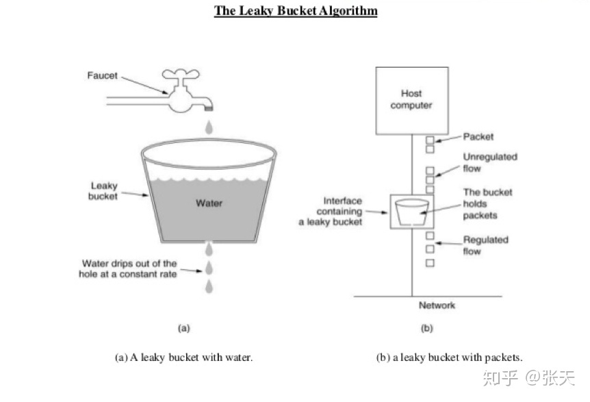
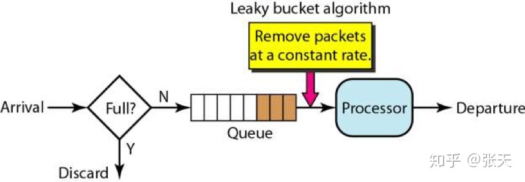
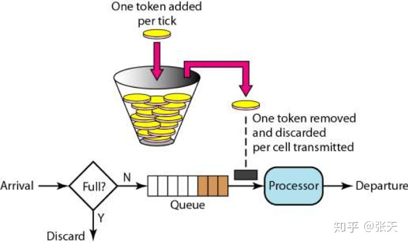
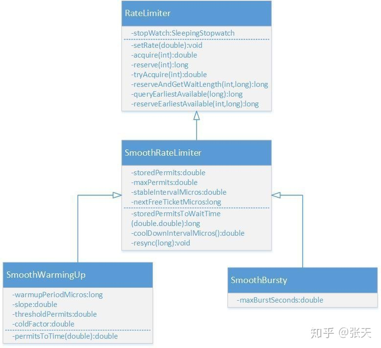
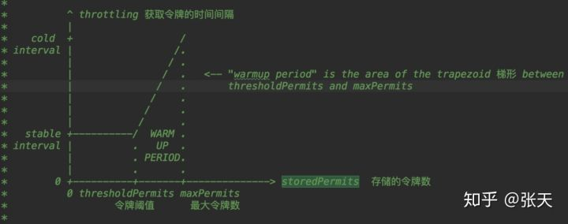

> 本文由 [简悦 SimpRead](http://ksria.com/simpread/) 转码， 原文地址 https://zhuanlan.zhihu.com/p/60979444

限流是保护高并发系统的三把利器之一，另外两个是缓存和降级。限流在很多场景中用来限制并发和请求量，比如说秒杀抢购，保护自身系统和下游系统不被巨型流量冲垮等。

限流的目的是通过对并发访问 / 请求进行限速或者一个时间窗口内的的请求进行限速来保护系统，一旦达到限制速率则可以拒绝服务或进行流量整形。

常用的限流方式和场景有：限制总并发数（比如数据库连接池、线程池）、限制瞬时并发数（如 nginx 的 limit_conn 模块，用来限制瞬时并发连接数，Java 的 Semaphore 也可以实现）、限制时间窗口内的平均速率（如 Guava 的 RateLimiter、nginx 的 limit_req 模块，限制每秒的平均速率）；其他还有如限制远程接口调用速率、限制 MQ 的消费速率。另外还可以根据网络连接数、网络流量、CPU 或内存负载等来限流。

比如说，我们需要限制方法被调用的并发数不能超过 100（同一时间并发数），则我们可以用信号量 `Semaphore`实现。可如果我们要限制方法在一段时间内平均被调用次数不超过 100，则需要使用 `RateLimiter`。

### 限流的基础算法

我们先来讲解一下两个限流相关的基本算法：漏桶算法和令牌桶算法。



从上图中，我们可以看到，就像一个漏斗一样，进来的水量就好像访问流量一样，而出去的水量就像是我们的系统处理请求一样。当访问流量过大时，这个漏斗中就会积水，如果水太多了就会溢出。

==漏桶算法的实现往往依赖于队列，请求到达如果队列未满则直接放入队列，然后有一个处理器按照固定频率从队列头取出请求进行处理==（`如推送工程里的：KafkaConsumer QpsHelper`）。如果请求量大，则会导致队列满，那么新来的请求就会被抛弃。



令牌桶算法则是一个存放固定容量令牌的桶，按照固定速率往桶里添加令牌。桶中存放的令牌数有最大上限，超出之后就被丢弃或者拒绝。当流量或者网络请求到达时，每个请求都要获取一个令牌，如果能够获取到，则直接处理，并且令牌桶删除一个令牌。如果获取不同，该请求就要被限流，要么直接丢弃，要么在缓冲区等待。



令牌桶和漏桶对比：

*   令牌桶是按照固定速率往桶中添加令牌，请求是否被处理需要看桶中令牌是否足够，当令牌数减为零时则拒绝新的请求；漏桶则是按照常量固定速率流出请求，流入请求速率任意，当流入的请求数累积到漏桶容量时，则新流入的请求被拒绝；
*   令牌桶限制的是平均流入速率，允许突发请求，只要有令牌就可以处理，支持一次拿 3 个令牌，4 个令牌；漏桶限制的是常量流出速率，即流出速率是一个固定常量值，比如都是 1 的速率流出，而不能一次是 1，下次又是 2，从而平滑突发流入速率；
*   ==令牌桶允许一定程度的突发，而漏桶主要目的是平滑流出速率==；

### Guava RateLimiter

`Guava`是 Java 领域优秀的开源项目，它包含了 Google 在 Java 项目中使用一些核心库，包含集合 (Collections)，缓存 (Caching)，并发编程库 (Concurrency)，常用注解 (Common annotations)，String 操作，I/O 操作方面的众多非常实用的函数。 Guava 的 `RateLimiter`提供了令牌桶算法实现：平滑突发限流 (SmoothBursty) 和平滑预热限流 (SmoothWarmingUp) 实现。



`RateLimiter`的类图如上所示，其中 `RateLimiter`是入口类，它提供了两套工厂方法来创建出两个子类。这很符合《Effective Java》中的用静态工厂方法代替构造函数的建议，毕竟该书的作者也正是 Guava 库的主要维护者，二者配合 "食用" 更佳。

```java
// RateLimiter提供了两个工厂方法，最终会调用下面两个函数，生成RateLimiter的两个子类。
static RateLimiter create(SleepingStopwatch stopwatch, double permitsPerSecond) {
 RateLimiter rateLimiter = new SmoothBursty(stopwatch, 1.0 /* maxBurstSeconds */);
    rateLimiter.setRate(permitsPerSecond);
 return rateLimiter;
}
static RateLimiter create(
 SleepingStopwatch stopwatch, double permitsPerSecond, long warmupPeriod, TimeUnit unit,
 double coldFactor) {
 RateLimiter rateLimiter = new SmoothWarmingUp(stopwatch, warmupPeriod, unit, coldFactor);
    rateLimiter.setRate(permitsPerSecond);
 return rateLimiter;
}
```

### 平滑突发限流

使用 `RateLimiter`的静态方法创建一个限流器，设置每秒放置的令牌数为 5 个。返回的 RateLimiter 对象可以保证 1 秒内不会给超过 5 个令牌，并且以固定速率进行放置，达到平滑输出的效果。

```java
public void testSmoothBursty() {
 RateLimiter r = RateLimiter.create(5);
 while (true) {
 System.out.println("get 1 tokens: " + r.acquire() + "s");
 }
 /**
     * output: 基本上都是0.2s执行一次，符合一秒发放5个令牌的设定。
     * get 1 tokens: 0.0s 
     * get 1 tokens: 0.182014s
     * get 1 tokens: 0.188464s
     * get 1 tokens: 0.198072s
     * get 1 tokens: 0.196048s
     * get 1 tokens: 0.197538s
     * get 1 tokens: 0.196049s
     */
}
```

`RateLimiter`使用令牌桶算法，会进行令牌的累积，如果获取令牌的频率比较低，则不会导致等待，直接获取令牌。

```java
public void testSmoothBursty2() {
 RateLimiter r = RateLimiter.create(2);
 while (true)
 {
    System.out.println("get 1 tokens: " + r.acquire(1) + "s");
 try {
    Thread.sleep(2000);
 } catch (Exception e) {}
 System.out.println("get 1 tokens: " + r.acquire(1) + "s");
 System.out.println("get 1 tokens: " + r.acquire(1) + "s");
 System.out.println("get 1 tokens: " + r.acquire(1) + "s");
 System.out.println("end");
 /**
       * output:
       * get 1 tokens: 0.0s
       * get 1 tokens: 0.0s
       * get 1 tokens: 0.0s
       * get 1 tokens: 0.0s
       * end
       * get 1 tokens: 0.499796s
       * get 1 tokens: 0.0s
       * get 1 tokens: 0.0s
       * get 1 tokens: 0.0s
       */
 }
}
```

`RateLimiter`由于会累积令牌，所以可以应对突发流量。在下面代码中，有一个请求会直接请求 5 个令牌，但是由于此时令牌桶中有累积的令牌，足以快速响应。 `RateLimiter`在没有足够令牌发放时，采用滞后处理的方式，也就是前一个请求获取令牌所需等待的时间由下一次请求来承受，也就是代替前一个请求进行等待。

```java
public void testSmoothBursty3() {
 RateLimiter r = RateLimiter.create(5);
 while (true)
 {
    System.out.println("get 5 tokens: " + r.acquire(5) + "s");
    System.out.println("get 1 tokens: " + r.acquire(1) + "s");
    System.out.println("get 1 tokens: " + r.acquire(1) + "s");
    System.out.println("get 1 tokens: " + r.acquire(1) + "s");
    System.out.println("end");
 /**
       * output:
       * get 5 tokens: 0.0s
       * get 1 tokens: 0.996766s 滞后效应，需要替前一个请求进行等待
       * get 1 tokens: 0.194007s
       * get 1 tokens: 0.196267s
       * end
       * get 5 tokens: 0.195756s
       * get 1 tokens: 0.995625s 滞后效应，需要替前一个请求进行等待
       * get 1 tokens: 0.194603s
       * get 1 tokens: 0.196866s
       */
 }
}
```

### 平滑预热限流

`RateLimiter`的 `SmoothWarmingUp`是带有预热期的平滑限流，它启动后会有一段预热期，逐步将分发频率提升到配置的速率。 比如下面代码中的例子，创建一个平均分发令牌速率为 2，预热期为 3 分钟。由于设置了预热时间是 3 秒，令牌桶一开始并不会 0.5 秒发一个令牌，而是形成一个平滑线性下降的坡度，频率越来越高，在 3 秒钟之内达到原本设置的频率，以后就以固定的频率输出。这种功能适合系统刚启动需要一点时间来 “热身” 的场景。

```java
public void testSmoothwarmingUp() {
 RateLimiter r = RateLimiter.create(2, 3, TimeUnit.SECONDS);
 while (true)
 {
   System.out.println("get 1 tokens: " + r.acquire(1) + "s");
   System.out.println("get 1 tokens: " + r.acquire(1) + "s");
   System.out.println("get 1 tokens: " + r.acquire(1) + "s");
   System.out.println("get 1 tokens: " + r.acquire(1) + "s");
   System.out.println("end");
 /**
       * output:
       * get 1 tokens: 0.0s
       * get 1 tokens: 1.329289s
       * get 1 tokens: 0.994375s
       * get 1 tokens: 0.662888s  上边三次获取的时间相加正好为3秒
       * end
       * get 1 tokens: 0.49764s  正常速率0.5秒一个令牌
       * get 1 tokens: 0.497828s
       * get 1 tokens: 0.49449s
       * get 1 tokens: 0.497522s
       */
 }
}
```

### 源码分析

看完了 `RateLimiter`的基本使用示例后，我们来学习一下它的实现原理。先了解一下几个比较重要的成员变量的含义。

```
//SmoothRateLimiter.java
//当前存储令牌数
double storedPermits;
//最大存储令牌数
double maxPermits;
//添加令牌时间间隔
double stableIntervalMicros;
/**
 * 下一次请求可以获取令牌的起始时间
 * 由于RateLimiter允许预消费，上次请求预消费令牌后
 * 下次请求需要等待相应的时间到nextFreeTicketMicros时刻才可以获取令牌
 */
private long nextFreeTicketMicros = 0L;

```

### 平滑突发限流

`RateLimiter`的原理就是每次调用 `acquire`时用当前时间和 `nextFreeTicketMicros`进行比较，根据二者的间隔和添加单位令牌的时间间隔 `stableIntervalMicros`来刷新存储令牌数 `storedPermits`。然后 acquire 会进行休眠，直到 `nextFreeTicketMicros`。

`acquire`函数如下所示，它会调用 `reserve`函数计算获取目标令牌数所需等待的时间，然后使用 `SleepStopwatch`进行休眠，最后返回等待时间。

```java
public double acquire(int permits) {
 // 计算获取令牌所需等待的时间
 long microsToWait = reserve(permits);
 // 进行线程sleep
    stopwatch.sleepMicrosUninterruptibly(microsToWait);
 return 1.0 * microsToWait / SECONDS.toMicros(1L);
}
final long reserve(int permits) {
    checkPermits(permits);
 // 由于涉及并发操作，所以使用synchronized进行并发操作
 synchronized (mutex()) {
    return reserveAndGetWaitLength(permits, stopwatch.readMicros());
 }
}
final long reserveAndGetWaitLength(int permits, long nowMicros) {
 // 计算从当前时间开始，能够获取到目标数量令牌时的时间
 long momentAvailable = reserveEarliestAvailable(permits, nowMicros);
 // 两个时间相减，获得需要等待的时间
 return max(momentAvailable - nowMicros, 0);
}
```

`reserveEarliestAvailable`是刷新令牌数和下次获取令牌时间 `nextFreeTicketMicros`的关键函数。它有三个步骤，一是调用 `resync`函数增加令牌数，二是计算预支付令牌所需额外等待的时间，三是更新下次获取令牌时间 `nextFreeTicketMicros`和存储令牌数 `storedPermits`。

这里涉及 `RateLimiter`的一个特性，也就是可以预先支付令牌，并且所需等待的时间在下次获取令牌时再实际执行。详细的代码逻辑的解释请看注释。

```java
final long reserveEarliestAvailable(int requiredPermits, long nowMicros) {
 // 刷新令牌数，相当于每次acquire时在根据时间进行令牌的刷新
    resync(nowMicros);
 long returnValue = nextFreeTicketMicros;
 // 获取当前已有的令牌数和需要获取的目标令牌数进行比较，计算出可以目前即可得到的令牌数。
 double storedPermitsToSpend = min(requiredPermits, this.storedPermits);
 // freshPermits是需要预先支付的令牌，也就是目标令牌数减去目前即可得到的令牌数
 double freshPermits = requiredPermits - storedPermitsToSpend;
 // 因为会突然涌入大量请求，而现有令牌数又不够用，因此会预先支付一定的令牌数
 // waitMicros即是产生预先支付令牌的数量时间，则将下次要添加令牌的时间应该计算时间加上watiMicros
 long waitMicros = storedPermitsToWaitTime(this.storedPermits, storedPermitsToSpend)
 + (long) (freshPermits * stableIntervalMicros);
 // storedPermitsToWaitTime在SmoothWarmingUp和SmoothBuresty的实现不同，用于实现预热缓冲期
 // SmoothBuresty的storedPermitsToWaitTime直接返回0，所以watiMicros就是预先支付的令牌所需等待的时间
 try {
 // 更新nextFreeTicketMicros,本次预先支付的令牌所需等待的时间让下一次请求来实际等待。
 this.nextFreeTicketMicros = LongMath.checkedAdd(nextFreeTicketMicros, waitMicros);
 } catch (ArithmeticException e) {
 this.nextFreeTicketMicros = Long.MAX_VALUE;
 }
 // 更新令牌数，最低数量为0
 this.storedPermits -= storedPermitsToSpend;
 // 返回旧的nextFreeTicketMicros数值，无需为预支付的令牌多加等待时间。
 return returnValue;
}
// SmoothBurest
long storedPermitsToWaitTime(double storedPermits, double permitsToTake) {
 return 0L;
}
```

`resync`函数用于增加存储令牌，核心逻辑就是 `(nowMicros-nextFreeTicketMicros)/stableIntervalMicros`。当前时间大于 `nextFreeTicketMicros`时进行刷新，否则直接返回。

```java
void resync(long nowMicros) {
 // 当前时间晚于nextFreeTicketMicros，所以刷新令牌和nextFreeTicketMicros
 if (nowMicros > nextFreeTicketMicros) {
 // coolDownIntervalMicros函数获取每机秒生成一个令牌，SmoothWarmingUp和SmoothBuresty的实现不同
 // SmoothBuresty的coolDownIntervalMicros直接返回stableIntervalMicros
 // 当前时间减去要更新令牌的时间获取时间间隔，再除以添加令牌时间间隔获取这段时间内要添加的令牌数
      storedPermits = min(maxPermits,
          storedPermits
 + (nowMicros - nextFreeTicketMicros) / coolDownIntervalMicros());
      nextFreeTicketMicros = nowMicros;
 }
 // 如果当前时间早于nextFreeTicketMicros，则获取令牌的线程要一直等待到nextFreeTicketMicros,该线程获取令牌所需
 // 额外等待的时间由下一次获取的线程来代替等待。
}
double coolDownIntervalMicros() {
 return stableIntervalMicros;
}
```

下面我们举个例子，让大家更好的理解 `resync`和 `reserveEarliestAvailable`函数的逻辑。

比如 `RateLimiter`的 `stableIntervalMicros`为 500，也就是 1 秒发两个令牌，storedPermits 为 0，nextFreeTicketMicros 为 155391849 `57`48。线程一 acquire(2)，当前时间为 155391849 `62`48，首先 `resync`函数计算，(1553918496248 - 1553918495748)/500 = 1，所以当前可获取令牌数为 1，但是由于可以预支付，所以 nextFreeTicketMicros= nextFreeTicketMicro + 1 * 500 = 155391849 `67`48。线程一无需等待。

紧接着，线程二也来 acquire(2)，首先 `resync`函数发现当前时间早于 `nextFreeTicketMicros`，所以无法增加令牌数，所以需要预支付 2 个令牌，nextFreeTicketMicros= nextFreeTicketMicro + 2 * 500 = 155391849 `77`48。线程二需要等待 155391849 `67`48 时刻，也就是线程一获取时计算的 nextFreeTicketMicros 时刻。同样的，线程三获取令牌时也需要等待到线程二计算的 nextFreeTicketMicros 时刻。

### 平滑预热限流

上述就是平滑突发限流 RateLimiter 的实现，下面我们来看一下加上预热缓冲期的实现原理。 `SmoothWarmingUp`实现预热缓冲的关键在于其分发令牌的速率会随时间和令牌数而改变，速率会先慢后快。表现形式如下图所示，令牌刷新的时间间隔由长逐渐变短。等存储令牌数从 maxPermits 到达 thresholdPermits 时，发放令牌的时间价格也由 coldInterval 降低到了正常的 stableInterval。



`SmoothWarmingUp`的相关代码如下所示，相关的逻辑都写在注释中。

```java
// SmoothWarmingUp，等待时间就是计算上图中梯形或者正方形的面积。
long storedPermitsToWaitTime(double storedPermits, double permitsToTake) {
 /**
    * 当前permits超出阈值的部分
    */
 double availablePermitsAboveThreshold = storedPermits - thresholdPermits;
 long micros = 0;
 /**
    * 如果当前存储的令牌数超出thresholdPermits
    */
 if (availablePermitsAboveThreshold > 0.0) {
 /**
     * 在阈值右侧并且需要被消耗的令牌数量
     */
 double permitsAboveThresholdToTake = min(availablePermitsAboveThreshold, permitsToTake);

 /**
        * 梯形的面积
        *
        * 高 * (顶 * 底) / 2
        *
        * 高是 permitsAboveThresholdToTake 也就是右侧需要消费的令牌数
        * 底 较长 permitsToTime(availablePermitsAboveThreshold)
        * 顶 较短 permitsToTime(availablePermitsAboveThreshold - permitsAboveThresholdToTake)
        */
    micros = (long) (permitsAboveThresholdToTake
 * (permitsToTime(availablePermitsAboveThreshold)
 + permitsToTime(availablePermitsAboveThreshold - permitsAboveThresholdToTake)) / 2.0);
 /**
        * 减去已经获取的在阈值右侧的令牌数
        */
    permitsToTake -= permitsAboveThresholdToTake;
 }
 /**
    * 平稳时期的面积，正好是长乘宽
    */
    micros += (stableIntervalMicros * permitsToTake);
 return micros;
}

double coolDownIntervalMicros() {
 /**
    * 每秒增加的令牌数为 warmup时间/maxPermits. 这样的话，在warmuptime时间内，就就增张的令牌数量
    * 为 maxPermits
    */
 return warmupPeriodMicros / maxPermits;
}
```

### 后记

`RateLimiter`只能用于单机的限流，如果想要集群限流，则需要引入 `redis`或者阿里开源的 `sentinel`中间件，请大家继续关注。

```java
// 通过lua脚本操作redis，给key设置过期时间（即令牌桶的interval时间），如果key不存在，set key tokenSize，过期key自动删除，以此来实现令牌桶

RRateLimiter rateLimiter = redisson.getRateLimiter("myRateLimiter");
// 初始化
// 最大流速 = 每1秒钟产生10个令牌
rateLimiter.trySetRate(RateType.OVERALL, 10, 1, RateIntervalUnit.SECONDS);

CountDownLatch latch = new CountDownLatch(2);
limiter.acquire(3);
// ...

Thread t = new Thread(() -> {
    limiter.acquire(2);
    // ...        
});
```

### 参考

*   [https://jinnianshilongnian.iteye.com/blog/2305117](https://link.zhihu.com/?target=https%3A//jinnianshilongnian.iteye.com/blog/2305117)
*   [https://segmentfault.com/a/1190000012875897](https://link.zhihu.com/?target=https%3A//segmentfault.com/a/1190000012875897)
