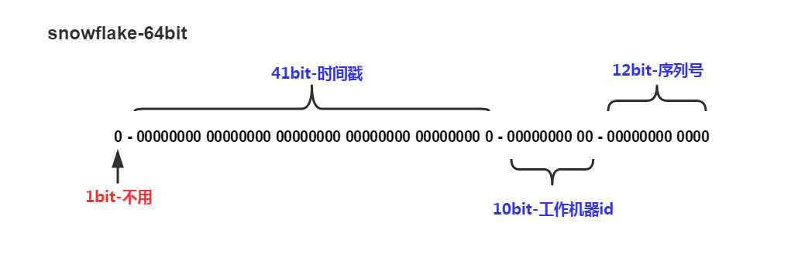
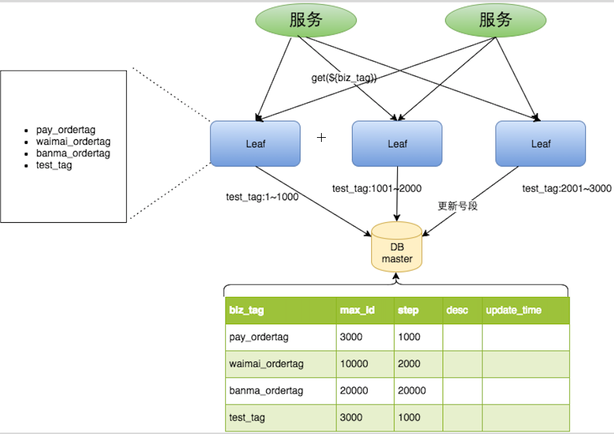

# 分布式ID的特性

- 唯一性：确保生成的ID是全网唯一的。
- 有序递增性：确保生成的ID是对于某个用户或者业务是按一定的数字有序递增的。
- 高可用性：确保任何时候都能正确的生成ID。
- 带时间：ID里面包含时间，一眼扫过去就知道哪天的交易。

# 分布式ID的生成方案

## 1.  UUID

算法的核心思想是结合机器的网卡、当地时间、一个随记数来生成UUID。

- 优点：本地生成，生成简单，性能好，没有高可用风险
- 缺点：长度过长，存储冗余，且无序不可读，查询效率低，不利于mysql索引；信息不安全，基于 MAC 地址生成 UUID 的算法可能会造成 MAC 地址泄露

## 2.  数据库自增ID

使用数据库的id自增策略，如 MySQL 的 auto_increment。并且可以使用两台数据库分别设置不同步长，生成不重复ID的策略来实现高可用。

- 优点：数据库生成的ID绝对有序，高可用实现方式简单
- 缺点：需要独立部署数据库实例，成本高，有性能瓶颈

## 3.  批量生成ID

一次按需批量生成多个ID，每次生成都需要访问数据库，将数据库修改为最大的ID值，并在内存中记录当前值及最大值。

- 优点：避免了每次生成ID都要访问数据库并带来压力，提高性能
- 缺点：属于本地生成策略，存在单点故障，服务重启造成ID不连续

## 4.  Redis生成ID

Redis的所有命令操作都是单线程的，本身提供像 incr 和 increby 这样的自增原子命令，所以能保证生成的 ID 肯定是唯一有序的。

- 优点：不依赖于数据库，灵活方便，且性能优于数据库；数字ID天然排序，对分页或者需要排序的结果很有帮助。
- 缺点：如果系统中没有Redis，还需要引入新的组件，增加系统复杂度；需要编码和配置的工作量比较大。

考虑到单节点的性能瓶颈，可以使用 Redis 集群来获取更高的吞吐量。假如一个集群中有5台 Redis。可以初始化每台 Redis 的值分别是1, 2, 3, 4, 5，然后步长都是 5。各个 Redis 生成的 ID 为：

```
A：1, 6, 11, 16, 21
B：2, 7, 12, 17, 22
C：3, 8, 13, 18, 23
D：4, 9, 14, 19, 24
E：5, 10, 15, 20, 25
复制代码
```

随便负载到哪个机确定好，未来很难做修改。步长和初始值一定需要事先确定。使用 Redis 集群也可以方式单点故障的问题。

另外，比较适合使用 Redis 来生成每天从0开始的流水号。比如订单号 = 日期 + 当日自增长号。可以每天在 Redis 中生成一个 Key ，使用 INCR 进行累加。

## 5.  Twitter的snowflake算法

Twitter 利用 zookeeper 实现了一个全局ID生成的服务 Snowflake：[github.com/twitter/sno…](https://link.juejin.im?target=https%3A%2F%2Fgithub.com%2Ftwitter%2Fsnowflake)，MongoDB的ObjectID可以算作是和 snowflake 类似方法，通过 “时间 + 机器码 + pid+inc” 共 12 个字节，通过 4+3+2+3 的方式最终标识成一个 24 长度的十六进制字符。



如上图的所示，Twitter 的 Snowflake 算法由下面几部分组成：

- **1位符号位：**

由于 long 类型在 java 中带符号的，最高位为符号位，正数为 0，负数为 1，且实际系统中所使用的ID一般都是正数，所以最高位为 0。

- **41位时间戳（毫秒级）：**

需要注意的是此处的 41 位时间戳并非存储当前时间的时间戳，而是存储时间戳的差值（当前时间戳 - 起始时间戳），这里的起始时间戳一般是ID生成器开始使用的时间戳，由程序来指定，所以41位毫秒时间戳最多可以使用 `(1 << 41) / (1000x60x60x24x365) = 69年`。

- **10位数据机器位：**

包括5位数据标识位和5位机器标识位，这10位决定了分布式系统中最多可以部署 `1 << 10 = 1024` s个节点。超过这个数量，生成的ID就有可能会冲突。

- **12位毫秒内的序列：**

这 12 位计数支持每个节点每毫秒（同一台机器，同一时刻）最多生成 `1 << 12 = 4096个ID`

加起来刚好64位，为一个Long型。

- 优点：高性能，低延迟，按时间有序，一般不会造成ID碰撞
- 缺点：需要独立的开发和部署，依赖于机器的时钟

#### 简单实现

```java
public class IdWorker {
    /**
     * 起始时间戳 2017-04-01
     */
    private final long epoch = 1491004800000L;
    /**
     * 机器ID所占的位数
     */
    private final long workerIdBits = 5L;
    /**
     * 数据标识ID所占的位数
     */
    private final long dataCenterIdBits = 5L;
    /**
     * 支持的最大机器ID,结果是31
     */
    private final long maxWorkerId = ~(-1L << workerIdBits);
    /**
     * 支持的最大数据标识ID,结果是31
     */
    private final long maxDataCenterId = ~(-1 << dataCenterIdBits);
    /**
     * 毫秒内序列在id中所占的位数
     */
    private final long sequenceBits = 12L;
    /**
     * 机器ID向左移12位
     */
    private final long workerIdShift = sequenceBits;
    /**
     * 数据标识ID向左移17(12+5)位
     */
    private final long dataCenterIdShift = sequenceBits + workerIdBits;
    /**
     * 时间戳向左移22(12+5+5)位
     */
    private final long timestampShift = sequenceBits + workerIdBits + dataCenterIdBits;
    /**
     * 生成序列的掩码，这里为4095 (0b111111111111=0xfff=4095)
     */
    private final long sequenceMask = ~(-1L << sequenceBits);
    /**
     * 数据标识ID（0～31）
     */
    private long dataCenterId;
    /**
     * 机器ID（0～31）
     */
    private long workerId;
    /**
     * 毫秒内序列（0～4095）
     */
    private long sequence;
    /**
     * 上次生成ID的时间戳
     */
    private long lastTimestamp = -1L;

    public IdWorker(long dataCenterId, long workerId) {
        if (dataCenterId > maxDataCenterId || dataCenterId < 0) {
            throw new IllegalArgumentException(String.format("dataCenterId can't be greater than %d or less than 0", maxDataCenterId));
        }
        if (workerId > maxWorkerId || workerId < 0) {
            throw new IllegalArgumentException(String.format("worker Id can't be greater than %d or less than 0", maxWorkerId));
        }
        this.dataCenterId = dataCenterId;
        this.workerId = workerId;
    }

    /**
     * 获得下一个ID (该方法是线程安全的)
     * @return snowflakeId
     */
    public synchronized long nextId() {
        long timestamp = timeGen();
        //如果当前时间小于上一次ID生成的时间戳,说明系统时钟回退过,这个时候应当抛出异常
        if (timestamp < lastTimestamp) {
            throw new RuntimeException(String.format("Clock moved backwards.  Refusing to generate id for %d milliseconds", lastTimestamp - timestamp));
        }
        //如果是同一时间生成的，则进行毫秒内序列
        if (timestamp == lastTimestamp) {
            sequence = (sequence + 1) & sequenceMask;
            //毫秒内序列溢出
            if (sequence == 0) {
                //阻塞到下一个毫秒,获得新的时间戳
                timestamp = nextMillis(lastTimestamp);
            }
        } else {//时间戳改变，毫秒内序列重置
            sequence = 0L;
        }
        lastTimestamp = timestamp;
        //移位并通过按位或运算拼到一起组成64位的ID
        return ((timestamp - epoch) << timestampShift) |
                (dataCenterId << dataCenterIdShift) |
                (workerId << workerIdShift) |
                sequence;
    }

    /**
     * 返回以毫秒为单位的当前时间
     * @return 当前时间(毫秒)
     */
    protected long timeGen() {
        return System.currentTimeMillis();
    }

    /**
     * 阻塞到下一个毫秒，直到获得新的时间戳
     * @param lastTimestamp 上次生成ID的时间截
     * @return 当前时间戳
     */
    protected long nextMillis(long lastTimestamp) {
        long timestamp = timeGen();
        while (timestamp <= lastTimestamp) {
            timestamp = lastTimestamp;
        }
        return timestamp;
    } 
}
```

## 6. Zookeeper SessionId

Session是Zookeeper中的会话实体，代表了一个客户端会话。SessionID用来唯一标识一个会话，因此Zookeeper必须保证sessionID的全局唯一性，在每次客户端向服务端发起"会话创建"请求时，服务端都会为其分配一个sessionID。那么Zookeeper是如何实现的呢？

在SessionTracker初始化的时候，会调用initializeNextSession方法来生成一个初始化的sessionID，之后在Zookeeper的正常运行过程中，会在该sessionID的基础上为每个会话进行分配。

```java
/** 
    * Generates an initial sessionId. High order byte is serverId, next 5 
    * 5 bytes are from timestamp, and low order 2 bytes are 0s. 
    */  
   public static long initializeNextSession(long id) {  
     long nextSid = 0;  
       nextSid = (System.currentTimeMillis() << 24) >>> 8; //这里的版本是3.4.6  
       nextSid =  nextSid | (id <<56);  
       return nextSid;  
   }  
```

上面这个方法就是Zookeeper初始化的算法。可以看出sessionID的生成可以分为以下5个步骤：

1. 获取当前时间的毫秒表示。我们假设System.currentTimeMillis()取出的值是1380895182327，其64位二进制表示是：0000000000000000000000010100000110000011110001000100110111110111 其中红色部分表示高24位，下划线部分表示低40位。
2. 左移24位。将步骤1中的数值左移24位，得到如下二进制表示的数值：0100000110000011110001000100110111110111000000000000000000000000
3. 无符号右移8位。再将步骤2中的数值无符号右移8位，得到如下二进制表示的数值：0000000001000001100000111100010001001101111101110000000000000000
4. 添加机器标识SID.在initializeNextSession方法中，出现了一个id变量，该变量就是当前Zookeeper服务器的SID值.SID就是当时配置在myid文件中的值，该值通常是一个整数。我们以2为例子。2的64位表示如下：0000000000000000000000000000000000000000000000000000000000000010。高56位都是0，将其左移56位，可以得到如下二进制表示的数值：0000001000000000000000000000000000000000000000000000000000000000
5. 将步骤3和步骤4得到的64位数值进行“|”操作：0000001001000001100000111100010001001101111101110000000000000000。这样就完成了一个sessioID的初始化。我们就可以得到一个单机唯一的序列号。算法概括为：高8位确定了所在机器，后56位使用当前时间的毫秒表示进行随机。

上面的算法就算完美吗？

答案是否定的，在zookeeper3.5.0以上的版本中对这个方法进行的修改。3.5.0版本的方法如下：

```java
/** 
    * Generates an initial sessionId. High order byte is serverId, next 5 
    * 5 bytes are from timestamp, and low order 2 bytes are 0s. 
    */  
   public static long initializeNextSession(long id) {  
       long nextSid;  
       nextSid = (<span style="color: #ff0000;">Time.currentElapsedTime()</span> << 24) >>> 8;  
       nextSid =  nextSid | (id <<56);  
       return nextSid;  
   }   
```

currentTimeMillis方法换成了另外一个方法。那么这个方法是什么呢？

```java
/** 
     * Returns time in milliseconds as does System.currentTimeMillis(), 
     * but uses elapsed time from an arbitrary epoch more like System.nanoTime(). 
     * The difference is that if somebody changes the system clock, 
     * Time.currentElapsedTime will change but nanoTime won't. On the other hand, 
     * all of ZK assumes that time is measured in milliseconds. 
     * @return  The time in milliseconds from some arbitrary point in time. 
     */  
    public static long currentElapsedTime() {  
        return System.nanoTime() / 1000000;  
    }  
```

使用了System.nanoTime()方法。原因是如果一些人去主动修改系统的时间，这样可能会出现问题。

Zookeeper使用了2行代码完成了生成全局唯一值的方法。然而我们直接使用jdk1.5以上自带的UUID不是也能生成全局唯一的值吗？

下面我们看看UUID和Zookeeper自己实现方法的一些比较：

- 根据UUID类的注释，A UUID represents a 128-bit value.一个UUID代表一个128位的值。然而Zookeeper使用64就产生了一个全局唯一的值。从资源占用上节省了一半。
- 从代码复杂程度上看，UUID的生成是严格按照国际标准实现的。算法的核心思想是结合机器的网卡、当地时间、一个随即数来生成。代码的复杂程度要比Zookeeper自身实现的高。复杂度高意味着在执行过程中需要消耗的资源就会增多。
- UUID的生成不需要外界因素的参与。直观的将就是不需要传递任何参数就可以完成。而Zookeeper自身实现的方法需要一个id，这个id就是我们在Zookeeper中配置的myid值。它的生成时需要条件的。

总结：

- 没有最好只有适合。适合自身的需要并且能够考虑到性能、资源的使用等方面才能设计出好的策略。
- 底层的运算使用位运算比较理想。很多地方都是这样运用的。毕竟位运算的速度是最快的。

## 7. 小米推送msgId

```java
/**
     * 生成msgId。 为了保证msgId的唯一性，msgId的生成算法如下： 
     * 1. 1位的消息类型（a－alias，s－single regid，t－topic）； 
     * 2. 5位的机器名字编码； 
     * 3. 2位的线程id；
     * 4. 12位的时间戳； 
     * 5. 2位的随机字符串。
     * <p>
     * ie: rsm01b01414548504937dR, alm05b0141454868094117 ...
     */
    private static String buildId(char prefix, long ts) {
        StringBuilder sb = new StringBuilder(1 + TIMESTAMP_LEN + TIMESTAMP_LEN + RANDOM_STR_LEN).append(prefix);
        fillChars(sb, SHORT_HOST_STR, 5, 'X');
        fillChars(sb, (Thread.currentThread().getId() % 100) + "", 2, '0');
        String strTs = "" + ts;
        fillChars(sb, strTs, TIMESTAMP_LEN, '0');
        for (int i = 0; i < RANDOM_STR_LEN; ++i) {
            sb.append(randomChar());
        }
        return sb.toString();
    }
```


## 8. Mongo ObjectId

ObjectId是一个12字节的  [BSON](https://link.jianshu.com?t=http://docs.mongodb.org/manual/reference/glossary/#term-bson) 类型字符串。按照字节顺序，一次代表：

 4字节：UNIX时间戳
 3字节：表示运行MongoDB的机器
 2字节：表示生成此_id的进程
 3字节：由一个随机数开始的计数器生成的值

## 9. 百度UidGenerator

UidGenerator是百度开源的分布式ID生成器，基于于snowflake算法的实现，看起来感觉还行。不过，国内开源的项目维护性真是担忧。

具体可以参考官网说明：[github.com/baidu/uid-g…](https://link.juejin.im?target=https%3A%2F%2Fgithub.com%2Fbaidu%2Fuid-generator%2Fblob%2Fmaster%2FREADME.zh_cn.md)

## 10. 美团Leaf实现

Leaf 是美团开源的分布式ID生成器，能保证全局唯一性、趋势递增、单调递增、信息安全，但也需要依赖关系数据库、Zookeeper等中间件。

1.  全局唯一性：不能出现重复的 ID 号，既然是唯一标识，这是最基本的要求。
2.  趋势递增：在 MySQL InnoDB 引擎中使用的是聚集索引，由于多数 RDBMS 使用 B-tree 的数据结构来存储索引数据，在主键的选择上面我们应该尽量使用有序的主键保证写入性能。
3.  单调递增：保证下一个 ID 一定大于上一个 ID，例如事务版本号、IM 增量消息、排序等特殊需求。
4.  信息安全：如果 ID 是连续的，恶意用户的扒取工作就非常容易做了，直接按照顺序下载指定 URL 即可；如果是订单号就更危险了，竞对可以直接知道我们一天的单量。所以在一些应用场景下，会需要 ID 无规则、不规则。

### 1.  普通数据库方案

以 MySQL 举例，利用给字段设置`auto_increment_increment`和`auto_increment_offset`来保证 ID 自增，每次业务使用下列 SQL 读写 MySQL 得到 ID 号。

```
begin;
REPLACE INTO Tickets64 (stub) VALUES ('a');
SELECT LAST_INSERT_ID();
commit;
```


这种方案的优缺点如下：

优点：

*   非常简单，利用现有数据库系统的功能实现，成本小，有 DBA 专业维护。
*   ID 号单调自增，可以实现一些对 ID 有特殊要求的业务。

缺点：

*   强依赖 DB，当 DB 异常时整个系统不可用，属于致命问题。配置主从复制可以尽可能的增加可用性，但是数据一致性在特殊情况下难以保证。主从切换时的不一致可能会导致重复发号。
*   ID 发号性能瓶颈限制在单台 MySQL 的读写性能。

对于 MySQL 性能问题，可用如下方案解决：在分布式系统中我们可以多部署几台机器，每台机器设置不同的初始值，且步长和机器数相等。比如有两台机器。设置步长 step 为 2，TicketServer1 的初始值为 1（1，3，5，7，9，11…）、TicketServer2 的初始值为 2（2，4，6，8，10…）。这是 Flickr 团队在 2010 年撰文介绍的一种主键生成策略（[Ticket Servers: Distributed Unique Primary Keys on the Cheap](http://code.flickr.net/2010/02/08/ticket-servers-distributed-unique-primary-keys-on-the-cheap/) ）。如下所示，为了实现上述方案分别设置两台机器对应的参数，TicketServer1 从 1 开始发号，TicketServer2 从 2 开始发号，两台机器每次发号之后都递增 2。

```
TicketServer1:
auto-increment-increment = 2
auto-increment-offset = 1

TicketServer2:
auto-increment-increment = 2
auto-increment-offset = 2
```

假设我们要部署 N 台机器，步长需设置为 N，每台的初始值依次为 0,1,2…N-1 那么整个架构就变成了如下图所示：


这种架构貌似能够满足性能的需求，但有以下几个缺点：

*   系统水平扩展比较困难，比如定义好了步长和机器台数之后，如果要添加机器该怎么做？假设现在只有一台机器发号是 1,2,3,4,5（步长是 1），这个时候需要扩容机器一台。可以这样做：把第二台机器的初始值设置得比第一台超过很多，比如 14（假设在扩容时间之内第一台不可能发到 14），同时设置步长为 2，那么这台机器下发的号码都是 14 以后的偶数。然后摘掉第一台，把 ID 值保留为奇数，比如 7，然后修改第一台的步长为 2。让它符合我们定义的号段标准，对于这个例子来说就是让第一台以后只能产生奇数。扩容方案看起来复杂吗？貌似还好，现在想象一下如果我们线上有 100 台机器，这个时候要扩容该怎么做？简直是噩梦。所以系统水平扩展方案复杂难以实现。
*   ID 没有了单调递增的特性，只能趋势递增，这个缺点对于一般业务需求不是很重要，可以容忍。
*   数据库压力还是很大，每次获取 ID 都得读写一次数据库，只能靠堆机器来提高性能。

Leaf 这个名字是来自德国哲学家、数学家莱布尼茨的一句话： >There are no two identical leaves in the world > “世界上没有两片相同的树叶”

综合对比上述几种方案，每种方案都不完全符合我们的要求。所以 Leaf 分别在上述第二种和第三种方案上做了相应的优化，实现了 Leaf-segment 和 Leaf-snowflake 方案。

### 2.  Leaf-segment 数据库方案

第一种 Leaf-segment 方案，在使用数据库的方案上，做了如下改变： - 原方案每次获取 ID 都得读写一次数据库，造成数据库压力大。改为利用 proxy server 批量获取，每次获取一个 segment(step 决定大小) 号段的值。用完之后再去数据库获取新的号段，可以大大的减轻数据库的压力。 - 各个业务不同的发号需求用 biz_tag 字段来区分，每个 biz-tag 的 ID 获取相互隔离，互不影响。如果以后有性能需求需要对数据库扩容，不需要上述描述的复杂的扩容操作，只需要对 biz_tag 分库分表就行。

数据库表设计如下：

```
+
| Field       | Type         | Null | Key | Default           | Extra                       |
+
| biz_tag     | varchar(128) | NO   | PRI |                   |                             |
| max_id      | bigint(20)   | NO   |     | 1                 |                             |
| step        | int(11)      | NO   |     | NULL              |                             |
| desc        | varchar(256) | YES  |     | NULL              |                             |
| update_time | timestamp    | NO   |     | CURRENT_TIMESTAMP | on update CURRENT_TIMESTAMP |
+
```

重要字段说明：biz_tag 用来区分业务，max_id 表示该 biz_tag 目前所被分配的 ID 号段的最大值，step 表示每次分配的号段长度。原来获取 ID 每次都需要写数据库，现在只需要把 step 设置得足够大，比如 1000。那么只有当 1000 个号被消耗完了之后才会去重新读写一次数据库。读写数据库的频率从 1 减小到了 1/step，大致架构如下图所示：



test_tag 在第一台 Leaf 机器上是 1~1000 的号段，当这个号段用完时，会去加载另一个长度为 step=1000 的号段，假设另外两台号段都没有更新，这个时候第一台机器新加载的号段就应该是 3001~4000。同时数据库对应的 biz_tag 这条数据的 max_id 会从 3000 被更新成 4000，更新号段的 SQL 语句如下：

```
Begin
UPDATE table SET max_id=max_id+step WHERE biz_tag=xxx
SELECT tag, max_id, step FROM table WHERE biz_tag=xxx
Commit
```

这种模式有以下优缺点：

优点：

*   Leaf 服务可以很方便的线性扩展，性能完全能够支撑大多数业务场景。
*   ID 号码是趋势递增的 8byte 的 64 位数字，满足上述数据库存储的主键要求。
*   容灾性高：Leaf 服务内部有号段缓存，即使 DB 宕机，短时间内 Leaf 仍能正常对外提供服务。
*   可以自定义 max_id 的大小，非常方便业务从原有的 ID 方式上迁移过来。

缺点：

*   ID 号码不够随机，能够泄露发号数量的信息，不太安全。
*   TP999 数据波动大，当号段使用完之后还是会 hang 在更新数据库的 I/O 上，tg999 数据会出现偶尔的尖刺。
*   DB 宕机会造成整个系统不可用。

### 双 buffer 优化

对于第二个缺点，Leaf-segment 做了一些优化，简单的说就是：

Leaf 取号段的时机是在号段消耗完的时候进行的，也就意味着号段临界点的 ID 下发时间取决于下一次从 DB 取回号段的时间，并且在这期间进来的请求也会因为 DB 号段没有取回来，导致线程阻塞。如果请求 DB 的网络和 DB 的性能稳定，这种情况对系统的影响是不大的，但是假如取 DB 的时候网络发生抖动，或者 DB 发生慢查询就会导致整个系统的响应时间变慢。

为此，我们希望 DB 取号段的过程能够做到无阻塞，不需要在 DB 取号段的时候阻塞请求线程，即当号段消费到某个点时就异步的把下一个号段加载到内存中。而不需要等到号段用尽的时候才去更新号段。这样做就可以很大程度上的降低系统的 TP999 指标。详细实现如下图所示：


采用双 buffer 的方式，Leaf 服务内部有两个号段缓存区 segment。当前号段已下发 10% 时，如果下一个号段未更新，则另启一个更新线程去更新下一个号段。当前号段全部下发完后，如果下个号段准备好了则切换到下个号段为当前 segment 接着下发，循环往复。

*   每个 biz-tag 都有消费速度监控，通常推荐 segment 长度设置为服务高峰期发号 QPS 的 600 倍（10 分钟），这样即使 DB 宕机，Leaf 仍能持续发号 10-20 分钟不受影响。
  
*   每次请求来临时都会判断下个号段的状态，从而更新此号段，所以偶尔的网络抖动不会影响下个号段的更新。
  

### Leaf 高可用容灾

对于第三点 “DB 可用性” 问题，我们目前采用一主两从的方式，同时分机房部署，Master 和 Slave 之间采用**半同步方式 [5]** 同步数据。同时使用公司 Atlas 数据库中间件 (已开源，改名为 [DBProxy](http://tech.meituan.com/dbproxy-introduction.html)) 做主从切换。当然这种方案在一些情况会退化成异步模式，甚至在**非常极端**情况下仍然会造成数据不一致的情况，但是出现的概率非常小。如果你的系统要保证 100% 的数据强一致，可以选择使用 “类 Paxos 算法” 实现的强一致 MySQL 方案，如 MySQL 5.7 前段时间刚刚 GA 的 [MySQL Group Replication](https://dev.mysql.com/doc/refman/5.7/en/group-replication.html)。但是运维成本和精力都会相应的增加，根据实际情况选型即可。


同时 Leaf 服务分 IDC 部署，内部的服务化框架是 “MTthrift RPC”。服务调用的时候，根据负载均衡算法会优先调用同机房的 Leaf 服务。在该 IDC 内 Leaf 服务不可用的时候才会选择其他机房的 Leaf 服务。同时服务治理平台 OCTO 还提供了针对服务的过载保护、一键截流、动态流量分配等对服务的保护措施。

Leaf-segment 方案可以生成趋势递增的 ID，同时 ID 号是可计算的，不适用于订单 ID 生成场景，比如竞对在两天中午 12 点分别下单，通过订单 id 号相减就能大致计算出公司一天的订单量，这个是不能忍受的。面对这一问题，我们提供了 Leaf-snowflake 方案。


Leaf-snowflake 方案完全沿用 snowflake 方案的 bit 位设计，即是 “1+41+10+12” 的方式组装 ID 号。对于 workerID 的分配，当服务集群数量较小的情况下，完全可以手动配置。Leaf 服务规模较大，动手配置成本太高。所以使用 Zookeeper 持久顺序节点的特性自动对 snowflake 节点配置 wokerID。Leaf-snowflake 是按照下面几个步骤启动的：

1.  启动 Leaf-snowflake 服务，连接 Zookeeper，在 leaf_forever 父节点下检查自己是否已经注册过（是否有该顺序子节点）。
2.  如果有注册过直接取回自己的 workerID（zk 顺序节点生成的 int 类型 ID 号），启动服务。
3.  ==如果没有注册过，就在该父节点下面创建一个持久顺序节点，创建成功后取回顺序号当做自己的 workerID 号==，启动服务。


### 弱依赖 ZooKeeper

除了每次会去 ZK 拿数据以外，也会在本机文件系统上缓存一个 workerID 文件。当 ZooKeeper 出现问题，恰好机器出现问题需要重启时，能保证服务能够正常启动。这样做到了对三方组件的弱依赖。一定程度上提高了 SLA

### 解决时钟问题

因为这种方案依赖时间，如果机器的时钟发生了回拨，那么就会有可能生成重复的 ID 号，需要解决时钟回退的问题。


参见上图整个启动流程图，服务启动时首先检查自己是否写过 ZooKeeper leaf_forever 节点：

1.  若写过，则用自身系统时间与 leaf_forever/${self} 节点记录时间做比较，若小于 leaf_forever/${self} 时间则认为机器时间发生了大步长回拨，服务启动失败并报警。
2.  若未写过，证明是新服务节点，直接创建持久节点 leaf_forever/${self}并写入自身系统时间，接下来综合对比其余 Leaf 节点的系统时间来判断自身系统时间是否准确，具体做法是取 leaf_temporary 下的所有临时节点 (所有运行中的 Leaf-snowflake 节点) 的服务 IP：Port，然后通过 RPC 请求得到所有节点的系统时间，计算 sum(time)/nodeSize。
3.  若 abs(系统时间 - sum(time)/nodeSize ) < 阈值，认为当前系统时间准确，正常启动服务，同时写临时节点 leaf_temporary/${self} 维持租约。
4.  否则认为本机系统时间发生大步长偏移，启动失败并报警。
5.  每隔一段时间 (3s) 上报自身系统时间写入 leaf_forever/${self}。

由于强依赖时钟，对时间的要求比较敏感，在机器工作时 NTP 同步也会造成秒级别的回退，建议可以直接关闭 NTP 同步。要么在时钟回拨的时候直接不提供服务直接返回 ERROR_CODE，等时钟追上即可。**或者做一层重试，然后上报报警系统，更或者是发现有时钟回拨之后自动摘除本身节点并报警**，如下：

```
 
 if (timestamp < lastTimestamp) {
            long offset = lastTimestamp - timestamp;
            if (offset <= 5) {
                try {
                	
                    wait(offset << 1);
                    timestamp = timeGen();
                    if (timestamp < lastTimestamp) {
                       
                        throwClockBackwardsEx(timestamp);
                      }    
                } catch (InterruptedException e) {  
                   throw  e;
                }
            } else {
                throwClockBackwardsEx(timestamp);
            }
        }
```

**从上线情况来看，在 2017 年闰秒出现那一次出现过部分机器回拨，由于 Leaf-snowflake 的策略保证，成功避免了对业务造成的影响。**

Leaf 在美团点评公司内部服务包含金融、支付交易、餐饮、外卖、酒店旅游、猫眼电影等众多业务线。目前 Leaf 的性能在 4C8G 的机器上 QPS 能压测到近 5w/s，TP999 1ms，已经能够满足大部分的业务的需求。每天提供亿数量级的调用量，作为公司内部公共的基础技术设施，必须保证高 SLA 和高性能的服务，我们目前还仅仅达到了及格线，还有很多提高的空间。
