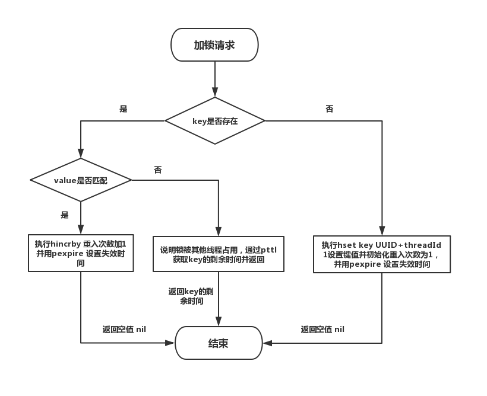

在某些场景中，多个进程必须以互斥的方式独占共享资源，这时用分布式锁是最直接有效的。

随着互联网技术快速发展，数据规模增大，分布式系统越来越普及，一个应用往往会部署在多台机器上（多节点），在有些场景中，为了保证数据不重复，要求在同一时刻，同一任务只在一个节点上运行，即保证某一方法同一时刻只能被一个线程执行。在单机环境中，应用是在同一进程下的，只需要保证单进程多线程环境中的线程安全性，通过 JAVA 提供的 volatile、ReentrantLock、synchronized 以及 concurrent 并发包下一些线程安全的类等就可以做到。而在多机部署环境中，不同机器不同进程，就需要在多进程下保证线程的安全性了。因此，分布式锁应运而生。

## # 实现分布式锁的三种选择

- 基于数据库实现分布式锁
- 基于zookeeper实现分布式锁
- 基于Redis缓存实现分布式锁

以上三种方式都可以实现分布式锁，其中，从健壮性考虑， 用 zookeeper 会比用 Redis 实现更好，但从性能角度考虑，基于 Redis 实现性能会更好，如何选择，还是取决于业务需求。

## # 基于 Redis 实现分布式锁的三种方案

- 用 Redis 实现分布式锁的正确姿势（实现一）
- 用 Redisson 实现分布式可重入锁（RedissonLock）（实现二）
- 用 Redisson 实现分布式锁(红锁 RedissonRedLock)（实现三）

**本文主要探讨基于 Redis 实现分布式锁的方案，主要分析并对比了以上三种方案，并大致分析了 Redisson 的 RedissonLock 、 RedissonRedLock 源码。**

## # 分布式锁需满足四个条件

首先，为了确保分布式锁可用，我们至少要确保锁的实现同时满足以下四个条件：

1. 互斥性。在任意时刻，只有一个客户端能持有锁。
2. 不会发生死锁。即使有一个客户端在持有锁的期间崩溃而没有主动解锁，也能保证后续其他客户端能加锁。
3. 解铃还须系铃人。加锁和解锁必须是同一个客户端，客户端自己不能把别人加的锁给解了，即不能误解锁。
4. 具有容错性。只要大多数Redis节点正常运行，客户端就能够获取和释放锁。

## # 用 Redis 实现分布式锁的正确姿势（实现一）

### 主要思路

通过 set key value px milliseconds nx 命令实现加锁， 通过Lua脚本实现解锁。核心实现命令如下：

```
//获取锁（unique_value可以是UUID等）
SET resource_name unique_value NX PX  30000

//释放锁（lua脚本中，一定要比较value，防止误解锁）
if redis.call("get",KEYS[1]) == ARGV[1] then
    return redis.call("del",KEYS[1])
else
    return 0
end
```

这种实现方式主要有以下几个要点：

- set 命令要用 set key value px milliseconds nx，替代 setnx + expire 需要分两次执行命令的方式，保证了原子性，
- value 要具有唯一性，可以使用UUID.randomUUID().toString()方法生成，用来标识这把锁是属于哪个请求加的，在解锁的时候就可以有依据；
- 释放锁时要验证 value 值，防止误解锁；
- 通过 Lua 脚本来避免 Check And Set 模型的并发问题，因为在释放锁的时候因为涉及到多个Redis操作 （利用了eval命令执行Lua脚本的原子性）；

### 完整代码实现如下：

```
public class RedisTool {

    private static final String LOCK_SUCCESS = "OK";
    private static final String SET_IF_NOT_EXIST = "NX";
    private static final String SET_WITH_EXPIRE_TIME = "PX";
    private static final Long RELEASE_SUCCESS = 1L;

    /**
     * 获取分布式锁(加锁代码)
     * @param jedis Redis客户端
     * @param lockKey 锁
     * @param requestId 请求标识
     * @param expireTime 超期时间
     * @return 是否获取成功
     */
    public static boolean getDistributedLock(Jedis jedis, String lockKey, String requestId, int expireTime) {

        String result = jedis.set(lockKey, requestId, SET_IF_NOT_EXIST, SET_WITH_EXPIRE_TIME, expireTime);

        if (LOCK_SUCCESS.equals(result)) {
            return true;
        }
        return false;
    }

    /**
     * 释放分布式锁(解锁代码)
     * @param jedis Redis客户端
     * @param lockKey 锁
     * @param requestId 请求标识
     * @return 是否释放成功
     */
    public static boolean releaseDistributedLock(Jedis jedis, String lockKey, String requestId) {

        String script = "if redis.call('get', KEYS[1]) == ARGV[1] then return redis.call('del', KEYS[1]) else               return 0 end";
        
        Object result = jedis.eval(script, Collections.singletonList(lockKey), C                                                   ollections.singletonList(requestId));

        if (RELEASE_SUCCESS.equals(result)) {
            return true;
        }
        return false;

    }
}
```

### 加锁代码分析

首先，set()加入了NX参数，可以保证如果已有key存在，则函数不会调用成功，也就是只有一个客户端能持有锁，满足互斥性。其次，由于我们对锁设置了过期时间，即使锁的持有者后续发生崩溃而没有解锁，锁也会因为到了过期时间而自动解锁（即key被删除），不会发生死锁。最后，因为我们将value赋值为requestId，用来标识这把锁是属于哪个请求加的，那么在客户端在解锁的时候就可以进行校验是否是同一个客户端。

### 解锁代码分析

将Lua代码传到jedis.eval()方法里，并使参数KEYS[1]赋值为lockKey，ARGV[1]赋值为requestId。在执行的时候，首先会获取锁对应的value值，检查是否与requestId相等，如果相等则解锁（删除key）。

### 这种方式仍存在单点风险

**以上实现在 Redis 正常运行情况下是没问题的，但如果存储锁对应key的那个节点挂了的话，就可能存在丢失锁的风险，导致出现多个客户端持有锁的情况，这样就不能实现资源的独享了。**

1. 客户端A从master获取到锁
2. 在master将锁同步到slave之前，master宕掉了（Redis的主从同步通常是异步的）。
3. 主从切换，slave节点被晋级为master节点
4. 客户端B取得了同一个资源被客户端A已经获取到的另外一个锁。导致存在同一时刻存不止一个线程获取到锁的情况。

**所以在这种实现之下，不论Redis的部署架构是单机模式、主从模式、哨兵模式还是集群模式，都存在这种风险。因为Redis的主从同步是异步的。 运行的是，Redis 之父 antirez 提出了 redlock算法 可以解决这个问题。**

## # Redisson 实现分布式可重入锁及源码分析 （RedissonLock）（实现二）

### 什么是 Redisson

Redisson是一个在Redis的基础上实现的Java驻内存数据网格（In-Memory Data Grid）。它不仅提供了一系列的分布式的Java常用对象，还实现了可重入锁（Reentrant Lock）、公平锁（Fair Lock、联锁（MultiLock）、 红锁（RedLock）、 读写锁（ReadWriteLock）等，还提供了许多分布式服务。Redisson提供了使用Redis的最简单和最便捷的方法。Redisson的宗旨是促进使用者对Redis的关注分离（Separation of Concern），从而让使用者能够将精力更集中地放在处理业务逻辑上。

### Redisson 分布式重入锁用法

Redisson 支持单点模式、主从模式、哨兵模式、集群模式，这里以单点模式为例：

```
// 1.构造redisson实现分布式锁必要的Config
Config config = new Config();
config.useSingleServer().setAddress("redis://127.0.0.1:5379").setPassword("123456").setDatabase(0);
// 2.构造RedissonClient
RedissonClient redissonClient = Redisson.create(config);
// 3.获取锁对象实例（无法保证是按线程的顺序获取到）
RLock rLock = redissonClient.getLock(lockKey);
try {
    /**
     * 4.尝试获取锁
     * waitTimeout 尝试获取锁的最大等待时间，超过这个值，则认为获取锁失败
     * leaseTime   锁的持有时间,超过这个时间锁会自动失效（值应设置为大于业务处理的时间，确保在锁有效期内业务能处理完）
     */
    boolean res = rLock.tryLock((long)waitTimeout, (long)leaseTime, TimeUnit.SECONDS);
    if (res) {
        //成功获得锁，在这里处理业务
    }
} catch (Exception e) {
    throw new RuntimeException("aquire lock fail");
}finally{
    //无论如何, 最后都要解锁
    rLock.unlock();
}
```

### 加锁源码分析

**1.通过 getLock 方法获取对象**

**org.redisson.Redisson#getLock()**

```
@Override
public RLock getLock(String name) {
    /**
     *  构造并返回一个 RedissonLock 对象 
     * commandExecutor: 与 Redis 节点通信并发送指令的真正实现。需要说明一下，CommandExecutor 实现是通过 eval 命令来执行 Lua 脚本
     * name: 锁的全局名称
     * id: Redisson 客户端唯一标识，实际上就是一个 UUID.randomUUID()
     */
    return new RedissonLock(commandExecutor, name, id);
}
```

**2.通过tryLock方法尝试获取锁**

tryLock方法里的调用关系大致如下：

[]

**org.redisson.RedissonLock#tryLock**

```
@Override
public boolean tryLock(long waitTime, long leaseTime, TimeUnit unit) throws InterruptedException {
    //取得最大等待时间
    long time = unit.toMillis(waitTime);
    //记录下当前时间
    long current = System.currentTimeMillis();
    //取得当前线程id（判断是否可重入锁的关键）
    long threadId = Thread.currentThread().getId();
    //1.尝试申请锁，返回还剩余的锁过期时间
    Long ttl = tryAcquire(leaseTime, unit, threadId);
    //2.如果为空，表示申请锁成功
    if (ttl == null) {
        return true;
    }
    //3.申请锁的耗时如果大于等于最大等待时间，则申请锁失败
    time -= System.currentTimeMillis() - current;
    if (time <= 0) {
        /**
         * 通过 promise.trySuccess 设置异步执行的结果为null
         * Promise从Uncompleted-->Completed ,通知 Future 异步执行已完成
         */
        acquireFailed(threadId);
        return false;
    }
    
    current = System.currentTimeMillis();

    /**
     * 4.订阅锁释放事件，并通过await方法阻塞等待锁释放，有效的解决了无效的锁申请浪费资源的问题：
     * 基于信息量，当锁被其它资源占用时，当前线程通过 Redis 的 channel 订阅锁的释放事件，一旦锁释放会发消息通知待等待的线程进行竞争
     * 当 this.await返回false，说明等待时间已经超出获取锁最大等待时间，取消订阅并返回获取锁失败
     * 当 this.await返回true，进入循环尝试获取锁
     */
    RFuture<RedissonLockEntry> subscribeFuture = subscribe(threadId);
    //await 方法内部是用CountDownLatch来实现阻塞，获取subscribe异步执行的结果（应用了Netty 的 Future）
    if (!await(subscribeFuture, time, TimeUnit.MILLISECONDS)) {
        if (!subscribeFuture.cancel(false)) {
            subscribeFuture.onComplete((res, e) -> {
                if (e == null) {
                    unsubscribe(subscribeFuture, threadId);
                }
            });
        }
        acquireFailed(threadId);
        return false;
    }

    try {
        //计算获取锁的总耗时，如果大于等于最大等待时间，则获取锁失败
        time -= System.currentTimeMillis() - current;
        if (time <= 0) {
            acquireFailed(threadId);
            return false;
        }

        /**
         * 5.收到锁释放的信号后，在最大等待时间之内，循环一次接着一次的尝试获取锁
         * 获取锁成功，则立马返回true，
         * 若在最大等待时间之内还没获取到锁，则认为获取锁失败，返回false结束循环
         */
        while (true) {
            long currentTime = System.currentTimeMillis();
            // 再次尝试申请锁
            ttl = tryAcquire(leaseTime, unit, threadId);
            // 成功获取锁则直接返回true结束循环
            if (ttl == null) {
                return true;
            }

            //超过最大等待时间则返回false结束循环，获取锁失败
            time -= System.currentTimeMillis() - currentTime;
            if (time <= 0) {
                acquireFailed(threadId);
                return false;
            }

            /**
             * 6.阻塞等待锁（通过信号量(共享锁)阻塞,等待解锁消息）：
             */
            currentTime = System.currentTimeMillis();
            if (ttl >= 0 && ttl < time) {
                //如果剩余时间(ttl)小于wait time ,就在 ttl 时间内，从Entry的信号量获取一个许可(除非被中断或者一直没有可用的许可)。
                getEntry(threadId).getLatch().tryAcquire(ttl, TimeUnit.MILLISECONDS);
            } else {
                //则就在wait time 时间范围内等待可以通过信号量
                getEntry(threadId).getLatch().tryAcquire(time, TimeUnit.MILLISECONDS);
            }

            //7.更新剩余的等待时间(最大等待时间-已经消耗的阻塞时间)
            time -= System.currentTimeMillis() - currentTime;
            if (time <= 0) {
                acquireFailed(threadId);
                return false;
            }
        }
    } finally {
        //7.无论是否获得锁,都要取消订阅解锁消息
        unsubscribe(subscribeFuture, threadId);
    }
}
```

其中 tryAcquire 内部通过调用 tryLockInnerAsync 实现申请锁的逻辑。申请锁并返回锁有效期还剩余的时间，如果为空说明锁未被其它线程申请则直接获取并返回，如果获取到时间，则进入等待竞争逻辑。

**org.redisson.RedissonLock#tryLockInnerAsync**

**流程图：**
[]

**实现源码：**

```
<T> RFuture<T> tryLockInnerAsync(long leaseTime, TimeUnit unit, long threadId, RedisStrictCommand<T> command) {
    internalLockLeaseTime = unit.toMillis(leaseTime);

    /**
     * 通过 EVAL 命令执行 Lua 脚本获取锁，保证了原子性
     */
    return commandExecutor.evalWriteAsync(getName(), LongCodec.INSTANCE, command,
              // 1.如果缓存中的key不存在，则执行 hset 命令(hset key UUID+threadId 1),然后通过 pexpire 命令设置锁的过期时间(即锁的租约时间)
              // 返回空值 nil ，表示获取锁成功
              "if (redis.call('exists', KEYS[1]) == 0) then " +
                  "redis.call('hset', KEYS[1], ARGV[2], 1); " +
                  "redis.call('pexpire', KEYS[1], ARGV[1]); " +
                  "return nil; " +
              "end; " +
               // 如果key已经存在，并且value也匹配，表示是当前线程持有的锁，则执行 hincrby 命令，重入次数加1，并且设置失效时间
              "if (redis.call('hexists', KEYS[1], ARGV[2]) == 1) then " +
                  "redis.call('hincrby', KEYS[1], ARGV[2], 1); " +
                  "redis.call('pexpire', KEYS[1], ARGV[1]); " +
                  "return nil; " +
              "end; " +
               //如果key已经存在，但是value不匹配，说明锁已经被其他线程持有，通过 pttl 命令获取锁的剩余存活时间并返回，至此获取锁失败
              "return redis.call('pttl', KEYS[1]);",
               //这三个参数分别对应KEYS[1]，ARGV[1]和ARGV[2]
               Collections.<Object>singletonList(getName()), internalLockLeaseTime, getLockName(threadId));
}
```


**参数说明：**

- KEYS[1]就是Collections.singletonList(getName())，表示分布式锁的key；
- ARGV[1]就是internalLockLeaseTime，即锁的租约时间（持有锁的有效时间），默认30s；
- ARGV[2]就是getLockName(threadId)，是获取锁时set的唯一值 value，即UUID+threadId。

### 解锁源码分析

unlock 内部通过 get(unlockAsync(Thread.currentThread().getId())) 调用 unlockInnerAsync 解锁。

**org.redisson.RedissonLock#unlock**

```
@Override
public void unlock() {
    try {
        get(unlockAsync(Thread.currentThread().getId()));
    } catch (RedisException e) {
        if (e.getCause() instanceof IllegalMonitorStateException) {
            throw (IllegalMonitorStateException) e.getCause();
        } else {
            throw e;
        }
    }
}
```


get方法利用是 CountDownLatch 在异步调用结果返回前将当前线程阻塞，然后通过 Netty 的 FutureListener 在异步调用完成后解除阻塞，并返回调用结果。

**org.redisson.command.CommandAsyncService#get**

```
@Override
public <V> V get(RFuture<V> future) {
    if (!future.isDone()) {   //任务还没完成
        // 设置一个单线程的同步控制器
        CountDownLatch l = new CountDownLatch(1);
        future.onComplete((res, e) -> {
            //操作完成时，唤醒在await()方法中等待的线程
            l.countDown();
        });

        boolean interrupted = false;
        while (!future.isDone()) {
            try {
                //阻塞等待
                l.await();
            } catch (InterruptedException e) {
                interrupted = true;
                break;
            }
        }

        if (interrupted) {
            Thread.currentThread().interrupt();
        }
    }
    
    if (future.isSuccess()) {
        return future.getNow();
    }

    throw convertException(future);
}
```

**org.redisson.RedissonLock#unlockInnerAsync**

**流程图：**


**实现源码：**

```
protected RFuture<Boolean> unlockInnerAsync(long threadId) {
    /**
     * 通过 EVAL 命令执行 Lua 脚本获取锁，保证了原子性
     */
    return commandExecutor.evalWriteAsync(getName(), LongCodec.INSTANCE, RedisCommands.EVAL_BOOLEAN,
            //如果分布式锁存在，但是value不匹配，表示锁已经被其他线程占用，无权释放锁，那么直接返回空值（解铃还须系铃人）
            "if (redis.call('hexists', KEYS[1], ARGV[3]) == 0) then " +
                "return nil;" +
            "end; " +
             //如果value匹配，则就是当前线程占有分布式锁，那么将重入次数减1
            "local counter = redis.call('hincrby', KEYS[1], ARGV[3], -1); " +
             //重入次数减1后的值如果大于0，表示分布式锁有重入过，那么只能更新失效时间，还不能删除
            "if (counter > 0) then " +
                "redis.call('pexpire', KEYS[1], ARGV[2]); " +
                "return 0; " +
            "else " +
             //重入次数减1后的值如果为0，这时就可以删除这个KEY，并发布解锁消息，返回1
                "redis.call('del', KEYS[1]); " +
                "redis.call('publish', KEYS[2], ARGV[1]); " +
                "return 1; "+
            "end; " +
            "return nil;",
            //这5个参数分别对应KEYS[1]，KEYS[2]，ARGV[1]，ARGV[2]和ARGV[3]
            Arrays.<Object>asList(getName(), getChannelName()), LockPubSub.UNLOCK_MESSAGE, internalLockLeaseTime, getLockName(threadId));

}
```

### 解锁消息处理

**org.redisson.pubsub#onMessage**

```
public class LockPubSub extends PublishSubscribe<RedissonLockEntry> {

    public static final Long UNLOCK_MESSAGE = 0L;
    public static final Long READ_UNLOCK_MESSAGE = 1L;

    public LockPubSub(PublishSubscribeService service) {
        super(service);
    }
    
    @Override
    protected RedissonLockEntry createEntry(RPromise<RedissonLockEntry> newPromise) {
        return new RedissonLockEntry(newPromise);
    }

    @Override
    protected void onMessage(RedissonLockEntry value, Long message) {

        /**
         * 判断是否是解锁消息
         */
        if (message.equals(UNLOCK_MESSAGE)) {
            Runnable runnableToExecute = value.getListeners().poll();
            if (runnableToExecute != null) {
                runnableToExecute.run();
            }

            /**
             * 释放一个信号量，唤醒等待的entry.getLatch().tryAcquire去再次尝试申请锁
             */
            value.getLatch().release();
        } else if (message.equals(READ_UNLOCK_MESSAGE)) {
            while (true) {
                /**
                 * 如果还有其他Listeners回调，则也唤醒执行
                 */
                Runnable runnableToExecute = value.getListeners().poll();
                if (runnableToExecute == null) {
                    break;
                }
                runnableToExecute.run();
            }

            value.getLatch().release(value.getLatch().getQueueLength());
        }
    }

}
```

### 总结对比

通过 Redisson 实现分布式可重入锁（实现二），比纯自己通过set key value px milliseconds nx +lua 实现（实现一）的效果更好些，虽然基本原理都一样，因为通过分析源码可知，RedissonLock
是可重入的，并且考虑了失败重试，可以设置锁的最大等待时间， 在实现上也做了一些优化，减少了无效的锁申请，提升了资源的利用率。

**需要特别注意的是，RedissonLock 同样没有解决 节点挂掉的时候，存在丢失锁的风险的问题。而现实情况是有一些场景无法容忍的，所以 Redisson 提供了实现了redlock算法的 RedissonRedLock，RedissonRedLock 真正解决了单点失败的问题，代价是需要额外的为 RedissonRedLock 搭建Redis环境。**

**所以，如果业务场景可以容忍这种小概率的错误，则推荐使用 RedissonLock， 如果无法容忍，则推荐使用 RedissonRedLock。**

## # redlock算法

Redis 官网对 redLock 算法的介绍大致如下：

> [The Redlock algorithm](https://redis.io/topics/distlock)

在分布式版本的算法里我们假设我们有N个Redis master节点，这些节点都是完全独立的，我们不用任何复制或者其他隐含的分布式协调机制。之前我们已经描述了在Redis单实例下怎么安全地获取和释放锁。我们确保将在每（N)个实例上使用此方法获取和释放锁。在我们的例子里面我们把N设成5，这是一个比较合理的设置，所以我们需要在5台机器上面或者5台虚拟机上面运行这些实例，这样保证他们不会同时都宕掉。为了取到锁，客户端应该执行以下操作:

1. 获取当前Unix时间，以毫秒为单位。
2. 依次尝试从5个实例，使用相同的key和具有唯一性的value（例如UUID）获取锁。当向Redis请求获取锁时，客户端应该设置一个尝试从某个Reids实例获取锁的最大等待时间（超过这个时间，则立马询问下一个实例），这个超时时间应该小于锁的失效时间。例如你的锁自动失效时间为10秒，则超时时间应该在5-50毫秒之间。这样可以避免服务器端Redis已经挂掉的情况下，客户端还在死死地等待响应结果。如果服务器端没有在规定时间内响应，客户端应该尽快尝试去另外一个Redis实例请求获取锁。
3. 客户端使用当前时间减去开始获取锁时间（步骤1记录的时间）就得到获取锁消耗的时间。当且仅当从大多数（N/2+1，这里是3个节点）的Redis节点都取到锁，并且使用的总耗时小于锁失效时间时，锁才算获取成功。
4. 如果取到了锁，key的真正有效时间 = 有效时间（获取锁时设置的key的自动超时时间） - 获取锁的总耗时（询问各个Redis实例的总耗时之和）（步骤3计算的结果）。
5. 如果因为某些原因，最终获取锁失败（即没有在至少 “N/2+1 ”个Redis实例取到锁或者“获取锁的总耗时”超过了“有效时间”），客户端应该在所有的Redis实例上进行解锁（即便某些Redis实例根本就没有加锁成功，这样可以防止某些节点获取到锁但是客户端没有得到响应而导致接下来的一段时间不能被重新获取锁）。

## # 用 Redisson 实现分布式锁(红锁 RedissonRedLock)及源码分析（实现三）

这里以三个单机模式为例，需要特别注意的是他们完全互相独立，不存在主从复制或者其他集群协调机制。

```
Config config1 = new Config();
config1.useSingleServer().setAddress("redis://172.0.0.1:5378").setPassword("a123456").setDatabase(0);
RedissonClient redissonClient1 = Redisson.create(config1);

Config config2 = new Config();
config2.useSingleServer().setAddress("redis://172.0.0.1:5379").setPassword("a123456").setDatabase(0);
RedissonClient redissonClient2 = Redisson.create(config2);

Config config3 = new Config();
config3.useSingleServer().setAddress("redis://172.0.0.1:5380").setPassword("a123456").setDatabase(0);
RedissonClient redissonClient3 = Redisson.create(config3);

/**
 * 获取多个 RLock 对象
 */
RLock lock1 = redissonClient1.getLock(lockKey);
RLock lock2 = redissonClient2.getLock(lockKey);
RLock lock3 = redissonClient3.getLock(lockKey);

/**
 * 根据多个 RLock 对象构建 RedissonRedLock （最核心的差别就在这里）
 */
RedissonRedLock redLock = new RedissonRedLock(lock1, lock2, lock3);

try {
    /**
     * 4.尝试获取锁
     * waitTimeout 尝试获取锁的最大等待时间，超过这个值，则认为获取锁失败
     * leaseTime   锁的持有时间,超过这个时间锁会自动失效（值应设置为大于业务处理的时间，确保在锁有效期内业务能处理完）
     */
    boolean res = redLock.tryLock((long)waitTimeout, (long)leaseTime, TimeUnit.SECONDS);
    if (res) {
        //成功获得锁，在这里处理业务
    }
} catch (Exception e) {
    throw new RuntimeException("aquire lock fail");
}finally{
    //无论如何, 最后都要解锁
    redLock.unlock();
}
```

**最核心的变化就是需要构建多个 RLock ,然后根据多个 RLock 构建成一个 RedissonRedLock，因为 redLock 算法是建立在多个互相独立的 Redis 环境之上的（为了区分可以叫为 Redission node），Redission node 节点既可以是单机模式(single)，也可以是主从模式(master/salve)，哨兵模式(sentinal)，或者集群模式(cluster)。这就意味着，不能跟以往这样只搭建 1个 cluster、或 1个 sentinel 集群，或是1套主从架构就了事了，需要为 RedissonRedLock 额外搭建多几套独立的 Redission 节点。 比如可以搭建3个 或者5个 Redission节点，具体可看视资源及业务情况而定。**

**下图是一个利用多个 Redission node 最终 组成 RedLock分布式锁的例子，需要特别注意的是每个 Redission node 是互相独立的，不存在任何复制或者其他隐含的分布式协调机制。**

[]
[]

## # Redisson 实现redlock算法源码分析（RedLock）

**加锁核心代码**

**org.redisson.RedissonMultiLock#tryLock**

```
public boolean tryLock(long waitTime, long leaseTime, TimeUnit unit) throws InterruptedException {
    long newLeaseTime = -1;
    if (leaseTime != -1) {
        newLeaseTime = unit.toMillis(waitTime)*2;
    }
    
    long time = System.currentTimeMillis();
    long remainTime = -1;
    if (waitTime != -1) {
        remainTime = unit.toMillis(waitTime);
    }
    long lockWaitTime = calcLockWaitTime(remainTime);
    /**
     * 1. 允许加锁失败节点个数限制（N-(N/2+1)）
     */
    int failedLocksLimit = failedLocksLimit();
    /**
     * 2. 遍历所有节点通过EVAL命令执行lua加锁
     */
    List<RLock> acquiredLocks = new ArrayList<>(locks.size());
    for (ListIterator<RLock> iterator = locks.listIterator(); iterator.hasNext();) {
        RLock lock = iterator.next();
        boolean lockAcquired;
        /**
         *  3.对节点尝试加锁
         */
        try {
            if (waitTime == -1 && leaseTime == -1) {
                lockAcquired = lock.tryLock();
            } else {
                long awaitTime = Math.min(lockWaitTime, remainTime);
                lockAcquired = lock.tryLock(awaitTime, newLeaseTime, TimeUnit.MILLISECONDS);
            }
        } catch (RedisResponseTimeoutException e) {
            // 如果抛出这类异常，为了防止加锁成功，但是响应失败，需要解锁所有节点
            unlockInner(Arrays.asList(lock));
            lockAcquired = false;
        } catch (Exception e) {
            // 抛出异常表示获取锁失败
            lockAcquired = false;
        }
        
        if (lockAcquired) {
            /**
             *4. 如果获取到锁则添加到已获取锁集合中
             */
            acquiredLocks.add(lock);
        } else {
            /**
             * 5. 计算已经申请锁失败的节点是否已经到达 允许加锁失败节点个数限制 （N-(N/2+1)）
             * 如果已经到达， 就认定最终申请锁失败，则没有必要继续从后面的节点申请了
             * 因为 Redlock 算法要求至少N/2+1 个节点都加锁成功，才算最终的锁申请成功
             */
            if (locks.size() - acquiredLocks.size() == failedLocksLimit()) {
                break;
            }

            if (failedLocksLimit == 0) {
                unlockInner(acquiredLocks);
                if (waitTime == -1 && leaseTime == -1) {
                    return false;
                }
                failedLocksLimit = failedLocksLimit();
                acquiredLocks.clear();
                // reset iterator
                while (iterator.hasPrevious()) {
                    iterator.previous();
                }
            } else {
                failedLocksLimit--;
            }
        }

        /**
         * 6.计算 目前从各个节点获取锁已经消耗的总时间，如果已经等于最大等待时间，则认定最终申请锁失败，返回false
         */
        if (remainTime != -1) {
            remainTime -= System.currentTimeMillis() - time;
            time = System.currentTimeMillis();
            if (remainTime <= 0) {
                unlockInner(acquiredLocks);
                return false;
            }
        }
    }

    if (leaseTime != -1) {
        List<RFuture<Boolean>> futures = new ArrayList<>(acquiredLocks.size());
        for (RLock rLock : acquiredLocks) {
            RFuture<Boolean> future = ((RedissonLock) rLock).expireAsync(unit.toMillis(leaseTime), TimeUnit.MILLISECONDS);
            futures.add(future);
        }
        
        for (RFuture<Boolean> rFuture : futures) {
            rFuture.syncUninterruptibly();
        }
    }

    /**
     * 7.如果逻辑正常执行完则认为最终申请锁成功，返回true
     */
    return true;
}
```


## # 参考文献

[1][Distributed locks with Redis](https://redis.io/topics/distlock)

[2][Distributed locks with Redis 中文版](http://redis.cn/topics/distlock.html)

[3][SET - Redis](https://redis.io/commands/set)

[4][EVAL command](https://redis.io/commands/eval)

[5] [Redisson](https://github.com/redisson/redisson)

[6][Redis分布式锁的正确实现方式](https://wudashan.cn/2017/10/23/Redis-Distributed-Lock-Implement/#组件依赖)

[7][Redlock实现分布式锁](https://mp.weixin.qq.com/s/JLEzNqQsx-Lec03eAsXFOQ)

[8][Redisson实现Redis分布式锁](https://mp.weixin.qq.com/s/iaZcc7QGbGHkZkfLeYp1yg)