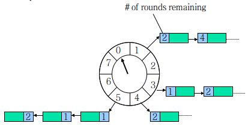
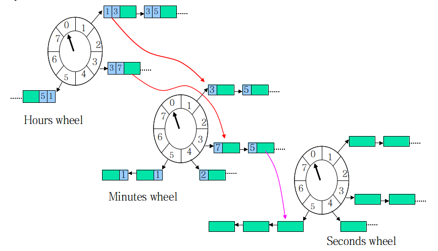

适用场景：

1. 定时任务（5分钟后执行xx任务/每隔1天执行一次）
2. 超时控制（xx分钟没有动作就断开连接）
3. 频率限制（最快只能每5s调用一次API/ 对同一个站点下页面的抓取最低要间隔5s）

------

## 1. Timer 是什么

一个Timer本质上是这样的一个数据结构：deadline越近的任务拥有越高优先级，提供以下3种基本操作：

1. `schedule` 新增
2. `cancel` 删除
3. `expire` 执行到期的任务
4. `updateDeadline` 更新到期时间 (可选)

`expire`通常有两种工作方式：

1. 轮询
   每隔一个时间片就去查找哪些任务已经到期；
2. 睡眠/唤醒
   1. 不停地查找deadline最近的任务，如到期则执行；否则sleep直到其到期。
   2. 在sleep期间，如果有任务被cancel或schedule，则deadline最近的任务有可能改变，线程会被唤醒并重新进行1的逻辑。

------

## 2. 数据结构的选择

具体实现的数据结构可以有很多选择：

*假设任务持有自己在总体任务集合中对应的节点，cancel时不需要查找的过程。*

### 2.1 有序链表

`schedule`: O(n)
`cancel`: O(1) // 双向链表的节点删除
`expire`: O(1) // 不停地查看第一个就可以了

### 2.2 堆`heap`

Timer由于按deadline排列任务的性质，用堆来实现最直观不过了。
`schedule`: O(log2N) // 调整heap
`cancel` : O(log2N) // 调整heap
`expire`: O(1)

JDK中的`DelayQueue`用的就是这种实现方式，它在内部用一个`PriorityQueue`保存所有的`Delayed`对象，`Delayed`接口中只有一个方法`long getDelay(TimeUnit unit);`，返回该任务的deadline距离当前时间还有多久，堆顶保存了最快到期的任务。

`DelayQueue#take()`方法如下：

```java
public E take() throws InterruptedException {
    final ReentrantLock lock = this.lock;
    lock.lockInterruptibly();
    try {
        for (;;) {
            // 找最快到期的
            E first = q.peek();
            if (first == null)
                available.await();
            else {
                long delay = first.getDelay(TimeUnit.NANOSECONDS);
                // 到期了，返回该任务
                if (delay <= 0)
                    return q.poll();
                else if (leader != null)
                    available.await();
                else {
                    // 让当前线程sleep，时间为first的延迟时间
                    Thread thisThread = Thread.currentThread();
                    leader = thisThread;
                    try {
                        available.awaitNanos(delay);
                        // 其他线程插入新任务/取消任务会引起堆的调整，并中断take()线程，
                        // 醒来后进入下一次判断。这就是整个逻辑为什么要在一个循环内的原因。
                    } finally {
                        if (leader == thisThread)
                            leader = null;
                    }
                }
            }
        }
    } finally {
        if (leader == null && q.peek() != null)
            available.signal();
        lock.unlock();
    }
}
```

### 2.3 `Hash Wheel Timer`



一个`Hash Wheel Timer`是一个环形结构，可以想象成时钟，分为很多格子，一个格子代表一段时间（越短Timer精度越高），并用一个List保存在该格子上到期的所有任务，同时一个指针随着时间流逝一格一格转动，并执行对应List中所有到期的任务。任务通过`取模`决定应该放入哪个格子。

以上图为例，假设一个格子是1秒，则整个wheel能表示的时间段为8s，假如当前指针指向2，此时需要调度一个3s后执行的任务，显然应该加入到(2+3=5)的方格中，指针再走3次就可以执行了；如果任务要在10s后执行，应该等指针走完一个round零2格再执行，因此应放入4，同时将round（1）保存到任务中。检查到期任务时应当只执行round为0的，格子上其他任务的round应减1。

`schedule`: O(1)
`cancel` : O(1)
`expire` : 最坏情况O(n)，平均O(1) // 显然格子越多每个格子对应的List就越短，越接近O(1)；最坏情况下所有的任务都在一个格子中，O(n)。

Netty3中的`HashedWheelTimer`类是对该算法的一个实现，用于IO事件的超时管理。里面提到了两个概念：

1. `Tick Duration`：即一个格子代表的时间，默认为100ms，因为IO事件不需要那么精确；
2. `Ticks per Wheel (Wheel Size)`：一个Wheel含有多少个格子，默认为512个，如果任务较多可以增大这个参数。

内部主要的状态：

```
// 转动指针的线程
private final Worker worker = new Worker();
final Thread workerThread;

// wheel，一个数组，每个格子上的任务列表用一个Set保存（背后是一个ConcurrentIdentityHashMap，
// 这是为了快速找到任务对象删除，个人觉得用一个双向链表也可以）。
final Set<HashedWheelTimeout>[] wheel;      

// 所有任务列表的iterator
final ReusableIterator<HashedWheelTimeout>[] iterators;

// 指针位置
volatile int wheelCursor;
```

现在来看看该Timer是如何支持前面提到的3个动作的：
`schedule`：

```
public Timeout newTimeout(TimerTask task, long delay, TimeUnit unit) {
    // ... ...
    delay = unit.toMillis(delay);
    HashedWheelTimeout timeout = new HashedWheelTimeout(task, currentTime + delay);
    scheduleTimeout(timeout, delay);
    return timeout;
}
void scheduleTimeout(HashedWheelTimeout timeout, long delay) {
    // ... ...
    // 计算round和格子相对当前指针的偏移
    final long lastRoundDelay = delay % roundDuration;
    final long lastTickDelay = delay % tickDuration;
    final long relativeIndex =
        lastRoundDelay / tickDuration + (lastTickDelay != 0? 1 : 0);

    final long remainingRounds =
        delay / roundDuration - (delay % roundDuration == 0? 1 : 0);

    // 加入任务到对应的格子中
    lock.readLock().lock();
    try {
        int stopIndex = (int) (wheelCursor + relativeIndex & mask);
        timeout.stopIndex = stopIndex;
        timeout.remainingRounds = remainingRounds;

        wheel[stopIndex].add(timeout);
    } finally {
        lock.readLock().unlock();
    }
}
```

`cancel`:
cancel是在代表任务的`HashWheelTimeout`类中实现的：

```
public void cancel() {
    // ... ...
    wheel[stopIndex].remove(this); // 简单地将自己从对应的任务列表中移除
}
```

`expire`:
内部有一个专门的Worker线程负责转动指针轮询并`expire`：

```
private final class Worker implements Runnable {
    // ... ...
    public void run() {
        // 保存所有的过期任务
        List<HashedWheelTimeout> expiredTimeouts = new ArrayList<HashedWheelTimeout>();

        startTime = System.currentTimeMillis();
        tick = 1;

        while (!shutdown.get()) {
            final long deadline = waitForNextTick();    // 休眠直到下一个tick代表的时间到来
            if (deadline > 0) {
                fetchExpiredTimeouts(expiredTimeouts, deadline);
                notifyExpiredTimeouts(expiredTimeouts);
            }
        }
    }

    private void fetchExpiredTimeouts(List<HashedWheelTimeout> expiredTimeouts, long deadline) {
        // ... ...
        int newWheelCursor = wheelCursor = wheelCursor + 1 & mask; // 格子指针前进一步
        ReusableIterator<HashedWheelTimeout> i = iterators[newWheelCursor];
        // 拿到当前格子中所有到期的（round==0）任务，并将其他任务的round-1
        fetchExpiredTimeouts(expiredTimeouts, i, deadline); 
        // ... ...
    }

    // 执行所有到期任务，没有使用新线程，因此任务应快速完成。
    private void notifyExpiredTimeouts(List<HashedWheelTimeout> expiredTimeouts) {
        // Notify the expired timeouts.
        for (int i = expiredTimeouts.size() - 1; i >= 0; i --) {
            expiredTimeouts.get(i).expire();
        }

        // Clean up the temporary list.
        expiredTimeouts.clear();
    }
    // ... ...
}
```

### 2.4 **分级的Hash Time Wheeler**

如果任务的时间跨度很大，数量也多，传统的`HashTimeWheeler`会造成任务的`round`很大，单个格子的任务List很长，并会维持很长一段时间。这时可将Wheel按时间粒度分级：



现在，每个任务除了要维护在当前轮子的`round`，还要计算在所有下级轮子的`round`。当本层的`round`为0时，任务按下级`round`值被*下放*到下级轮子，最终在最底层的轮子得到执行，==有时间轮降级的操作==。

现在，`schedule`的复杂度提高到了O(m)，m为轮子的级数，因为要计算每级的`round`值。

这种方式的优点在于能够保证任务链表的长度一直在比较短的状态，但缺点是需要更多的空间。