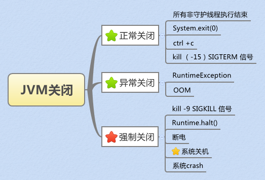
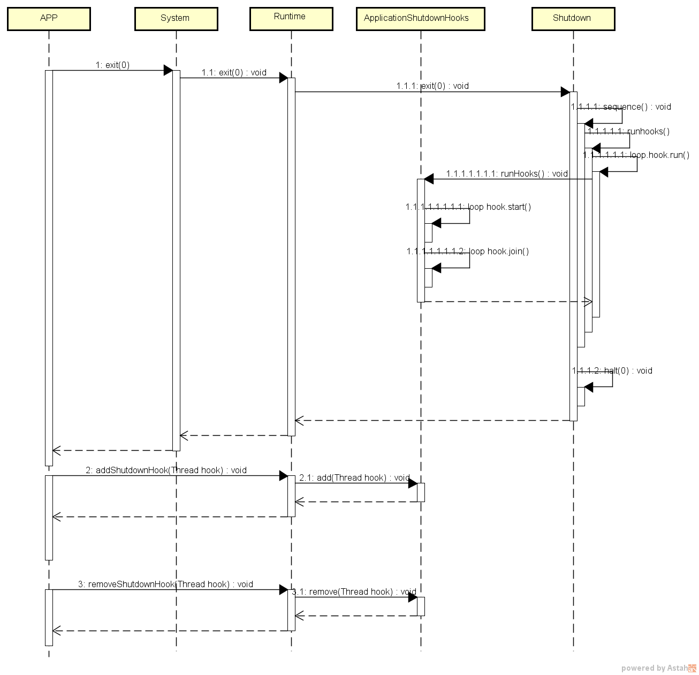

## 背景

后台应用一般维护线程池处理任务。虽然没有交易进入，但之前进入的交易，可能仍然在线程里运行。这个时候直接杀掉进程，可能导致线程池中未结束的交易异常。

但对于 Java 的线程，是没有绝对的办法从外部停止的。因此，我们通常采用等待的办法。如果使用的是`ExecutorService`，则可以调用`shutdown`方法关闭线程池，然后调用`awaitTermination`等待充分长的时间，正常情况下都可以就结束。特殊情况下没有结束，也只能调用`shutdownNow`方法强制结束（即便如此，也只是best-effort的操作）。

## JVM 关闭

首先，我们了解下哪些情况会导致JVM关闭，如下图

对于强制关闭的几种情况，系统关机，操作系统会通知JVM进程关闭并等待，一旦等待超时，系统会强制中止JVM进程；kill -9、Runtime.halt()、断电、系统crash这些种方式会直接无商量中止JVM进程，JVM完全没有执行扫尾工作的机会。因此对用应用程序而言，我们强烈不建议使用kill -9 这种暴力方式退出。
而对于正常关闭、异常关闭的几种情况，JVM关闭前，都会调用已注册的shutdown hooks，基于这种机制，我们可以将扫尾的工作放在shutdown hooks中，进而使我们的应用程序安全的退出。基于平台通用性的考虑，我们更推荐应用程序使用System.exit(0)这种方式退出JVM。

JVM 与 shutdown hooks 交互流程如下图所示，可以对照源码进一步的学习shutdown hooks工作原理。

注意：如果没有shutdown hooks，==执行kill命令后，正在执行的线程会被立即终止==。

z