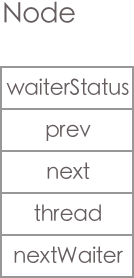
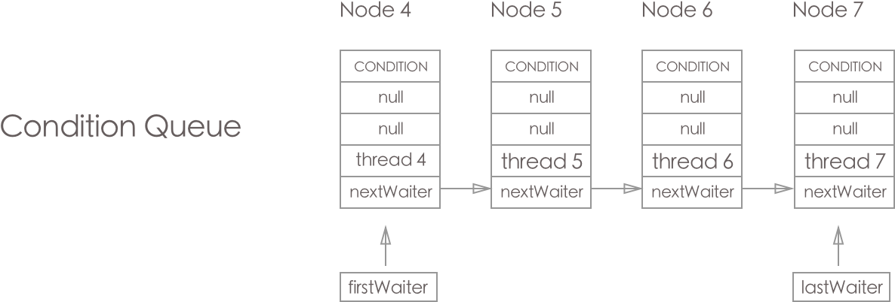
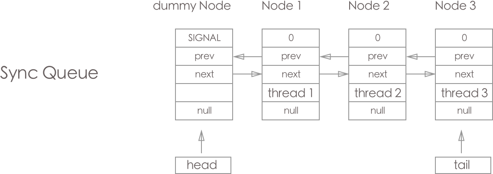

> 本文由 [简悦 SimpRead](http://ksria.com/simpread/) 转码， 原文地址 https://www.jianshu.com/p/e7659436538b

### 1. AbstractQueuedSynchronizer 定义

AbstractQueuedSynchronizer 是 JUC 中通过 Sync Queue(并发安全的 CLH Queue), Condition Queue(普通的 list) , volatile 变量 state 提供的 控制线程获取统一资源 (state) 的 Synchronized 工具.

主要特点:

```
1. 内部含有两条 Queue(Sync Queue, Condition Queue), 这两条 Queue 后面会详细说明.
2. AQS 内部定义获取锁(acquire), 释放锁(release)的主逻辑, 子类实现响应的模版方法即可
3. 支持共享和独占两种模式(共享模式时只用 Sync Queue, 独占模式有时只用 Sync Queue, 但若涉及 Condition, 则还有 Condition Queue); 独占是排他的.
4. 支持 不响应中断获取独占锁(acquire), 响应中断获取独占锁(acquireInterruptibly), 超时获取独占锁(tryAcquireNanos); 不响应中断获取共享锁(acquireShared), 响应中断获取共享锁(acquireSharedInterruptibly), 超时获取共享锁(tryAcquireSharedNanos);
5. 在子类的 tryAcquire, tryAcquireShared 中实现公平与非公平的区分


```

先看一个 demo(实现独占的但是非重入)

```
import java.io.IOException;
import java.io.ObjectInputStream;
import java.util.concurrent.TimeUnit;
import java.util.concurrent.locks.AbstractQueuedSynchronizer;
import java.util.concurrent.locks.Condition;
import java.util.concurrent.locks.Lock;

/**
 * 独占模式 并且不支持重入的 lock
 * Created by xujiankang on 2016/12/19.
 */
public class Mutex implements Lock, java.io.Serializable {

    // The sync object does all the hard work. We just forward to it
    private final Sync sync = new Sync();

    @Override
    public void lock() {
        sync.acquire(1);
    }

    // 支持中断式的获取 lock
    @Override
    public void lockInterruptibly() throws InterruptedException {
        sync.acquireInterruptibly(1);
    }
    // 尝试获取 lock
    @Override
    public boolean tryLock() {
        return sync.tryAcquire(1);
    }

    /**
     * 尝试 带 timeout 的获取 lock
     */
    @Override
    public boolean tryLock(long time, TimeUnit unit) throws InterruptedException {
        return sync.tryAcquireNanos(1, unit.toNanos(time));
    }

    /** 释放lock */
    @Override
    public void unlock() {
        sync.release(1);
    }

    @Override
    public Condition newCondition() {
        return sync.newCondition();
    }

    public boolean isLocked(){
        return sync.inHeldExclusively();
    }
    public boolean hasQueuedThreads(){
        return sync.hasQueuedThreads();
    }

    // internal helper class
    static class Sync extends AbstractQueuedSynchronizer{

        // report whether in locked state
        protected boolean inHeldExclusively(){ // 判断 lock 是否被占用
            return getState() == 1;
        }
        // 获取 lock
        // Acquire the lock if state is zero
        public boolean tryAcquire(int acquires){
            assert acquires == 1; // Otherwise unsed
            if(compareAndSetState(0, 1)){
                setExclusiveOwnerThread(Thread.currentThread());
                return true;
            }
            return false;
        }
        // 释放 lock
        // Releses the lock by setting state to zero
        protected boolean tryRelease(int release){
            assert release == 1; // Otherwise unused
            if(getState() == 0){
                throw new IllegalMonitorStateException();
            }
            setExclusiveOwnerThread(null);
            setState(0);
            return true;
        }

        // Provides a Condition
        Condition newCondition(){
            return new ConditionObject();
        }

        // Deserializes properly
        private void readObject(ObjectInputStream s)throws IOException, ClassNotFoundException{
            s.defaultReadObject();
            setState(0); // reset to unlocked state
        }
    }

}


```

继承 AQS 的子类通畅需要实现以下方法:

```
# 实现独占
tryAcquire
tryRelease
isHeldExclusively
# 实现共享
tryAcquireShared
tryReleaseShared


```

而一般的 lock 获取释放流程如下

```
# lock 获取
Acquire:
while(!tryAcquire(arg)){ // tryAcquire交由子类来实现, 改变 AQS 的state的值
   1. tryAcquire 获取lock没成功, 则入 Sync Queue
   2. 若当前节点是 head.next, 则再次尝试获取一下lock (tryAcquire)
   3. 获取 lock 失败, 则改变 前继节点的 waitStatus 的值(变成SIGNAL), 进行 blocked
}

# lock 释放
Release:
if(tryRelease(arg)){ / tryRelease交由子类来实现, 改变 AQS 的state的值
   1. 判断 lock 是否释放彻底
   2. 若自己被标记为SIGNAL, 则唤醒后继节点, 通知其去获取 AQS 中 state 的值
   3. 将自己的 waitStatus 进行复位到 0
}


```

整个 AQS 非为以下几部分

1.  Node 节点, 用于存放获取线程的节点, 存在于 Sync Queue, Condition Queue, 这些节点主要的区分在于 waitStatus 的值 (下面会详细叙述)
2.  Condition Queue, 这个队列是用于独占模式中, 只有用到 Condition.awaitXX 时才会将 node 加到 tail 上 (PS: 在使用 Condition 的前提是已经获取 Lock)
3.  Sync Queue, 独占 共享的模式中均会使用到的存放 Node 的 CLH queue(主要特点是, 队列中总有一个 dummy 节点, 后继节点获取锁的条件由前继节点决定, 前继节点在释放 lock 时会唤醒 sleep 中的后继节点)
4.  ConditionObject, 用于独占的模式, 主要是线程释放 lock, 加入 Condition Queue, 并进行相应的 signal 操作, 详情点击这里 [Java 8 源码分析 Condition](https://www.jianshu.com/p/52089c4eefdd)
5.  独占的获取 lock (acquire, release), 例如 ReentrantLock 就是使用这种, 详情点击这里 [Java 8 源码分析 ReentrantLock](https://www.jianshu.com/p/3f3417dbcac4)
6.  共享的获取 lock (acquireShared, releaseShared), 例如 [ReeantrantReadWriteLock](https://www.jianshu.com/p/6923c126e762), [Semaphore](https://www.jianshu.com/p/bb40a8073111), [CountDownLatch](https://www.jianshu.com/p/a042cf7a261c)  
    下面将一一讲解

### 2. AbstractQueuedSynchronizer 内部类 Node

Node 节点是代表获取 lock 的线程, 存在于 Condition Queue, Sync Queue 里面， 而其主要的分别就是 nextWaiter (标记共享还是独占),  
waitStatus 标记 node 的状态 (PS: 这是关键, 理解了 waitStatus 的变化流程, 就能理解整个 AQS)

下图就是 Node

 Node.png

见代码:

```
/**
 * 代表 Thread 存在于 Sync Queue 与 Condition Queue 的节点
 */
static final class Node {
    /** marker to indicate a node is wating in shared mode */
    /** 标识节点是否是 共享的节点(这样的节点只存在于 Sync Queue 里面) */
    static final Node SHARED = new Node();
    /** marker to indicate a node is waiting in exclusive mode */
    /** 标识节点是 独占模式 */
    static final Node EXCLUSIVE = null;

    /** waitStatus value yto indicate thread has cancelled */
    /**
     *  CANCELLED 说明节点已经 取消获取 lock 了(一般是由于 interrupt 或 timeout 导致的)
     *  很多时候是在 cancelAcquire 里面进行设置这个标识
     */
    static final int CANCELLED = 1;

    /** waitStatus value to indicate successor;s thread needs unparking */
    /**
     * SIGNAL 标识当前节点的后继节点需要唤醒(PS: 这个通常是在 独占模式下使用, 在共享模式下有时用 PROPAGATE)
     *
     */
    static final int SIGNAL = -1;

    /** waitStatus value to indicate thread is waiting on condition */
    /**
     * 当前节点在 Condition Queue 里面
     */
    static final int CONDITION = -2;
    /**
     * waitStatus value to indicate the next acquireShared should
     * unconditionally propagate
     */
    /**
     * 当前节点获取到 lock 或进行 release lock 时, 共享模式的最终状态是 PROPAGATE(PS: 有可能共享模式的节点变成 PROPAGATE 之前就被其后继节点抢占 head 节点, 而从Sync Queue中被踢出掉)
     */
    static final int PROPAGATE = -3;

    /**
     * Status field, taking only the values:
     *
     *  SIGNAL:     The successor of this node is (or will soon be)
     *              blocked (via park), so the current node must
     *              unpark its successor when is releases or
     *              cancels. To avoid races, acquire methods must
     *              first indicate they need a signal,
     *              then retry the atomic acquire, and then,
     *              on failure, block
     *  CANCELLED: This node is cancelled due to timeout or interrupt
     *              Nodes never leave this state. In particular,
     *              a thread with cancelled node never again blocks
     *  CONDITION: This node is currently on a condition queue.
     *              It will not be used as a sync queue node
     *              until transferred, at which time the status
     *              will be set to 0. (Use of this value here has
     *              nothing to do with other uses of the
     *              field, but simplifies mechanics)
     * PROPAGATE: A releaseShared should be propagated to other
     *              nodes. This is set (for head node only) in
     *              doReleaseShared to ensure propagation
     *              continues, even if other operations hava
     *              since intervened
     * 0:          None of the above(以上)
     *
     * The values are arranged numerically to simplify use.
     * Non-negative values mean that a node doesn't need to
     * signal. So, most code doesn't need to check for particular
     * values, just for sign
     *
     * The field is initialized to 0 for narmal sync nodes, and
     * CONDITION for condition nodes. It is modified using CAS
     * (or when possible, unconditional volatile writes)
     *
     */
    volatile int waitStatus;

    /**
     * 节点在 Sync Queue 里面时的前继节点(主要来进行 skip CANCELLED 的节点)
     * 注意: 根据 addWaiter方法:
     *  1. prev节点在队列里面, 则 prev != null 肯定成立
     *  2. prev != null 成立, 不一定 node 就在 Sync Queue 里面
     */
    volatile Node prev;

    /**
     * Node 在 Sync Queue 里面的后继节点, 主要是在release lock 时进行后继节点的唤醒
     * 而后继节点在前继节点上打上 SIGNAL 标识, 来提醒他 release lock 时需要唤醒
     */
    volatile Node next;

    /** 获取 lock 的引用 */
    volatile Thread thread;

    /**
     * 作用分成两种:
     *  1. 在 Sync Queue 里面, nextWaiter用来判断节点是 共享模式, 还是独占模式
     *  2. 在 Condition queue 里面, 节点主要是链接且后继节点 (Condition queue是一个单向的, 不支持并发的 list)
     */
    Node nextWaiter;

    /** 当前节点是否是共享模式 */
    final boolean isShared() {
        return nextWaiter == SHARED;
    }

    /**
     * 获取 node 的前继节点
     */
    final Node predecessor() throws NullPointerException{
        Node p = prev;
        if(p == null){
            throw new NullPointerException();
        }else{
            return p;
        }
    }

    Node(){
        // Used to establish initial head or SHARED marker
    }

    /**
     * 初始化 Node 用于 Sync Queue 里面
     */
    Node(Thread thread, Node mode){     // Used by addWaiter
        this.nextWaiter = mode;
        this.thread = thread;
    }

    /**
     * 初始化 Node 用于 Condition Queue 里面
     */
    Node(Thread thread, int waitStatus){ // Used by Condition
        this.waitStatus = waitStatus;
        this.thread = thread;
    }
}


```

waitStatus 的状态变化:

```
1. 线程刚入 Sync Queue 里面, 发现 独占锁被其他人获取, 则将其前继节点标记为 SIGNAL, 然后再尝试获取一下锁(调用 tryAcquire 方法)
2. 若 调用 tryAcquire 方法获取失败, 则判断一下是否前继节点被标记为 SIGNAL, 若是的话 直接 block(block前会确保前继节点被标记为SIGNAL, 因为前继节点在进行释放锁时根据是否标记为 SIGNAL 来决定唤醒后继节点与否 <- 这是独占的情况下)
3. 前继节点使用完lock, 进行释放, 因为自己被标记为 SIGNAL, 所以唤醒其后继节点


```

waitStatus 变化过程:

```
1. 独占模式下:  0(初始) -> signal(被后继节点标记为release需要唤醒后继节点) -> 0 (等释放好lock, 会恢复到0)
2. 独占模式 + 使用 Condition情况下: 0(初始) -> signal(被后继节点标记为release需要唤醒后继节点) -> 0 (等释放好lock, 会恢复到0)
   其上可能涉及 中断与超时, 只是多了一个 CANCELLED, 当节点变成 CANCELLED, 后就等着被清除
3. 共享模式下: 0(初始) -> PROPAGATE(获取 lock 或release lock 时) (获取 lock 时会调用 setHeadAndPropagate 来进行 传递式的唤醒后继节点, 直到碰到 独占模式的节点)
4. 共享模式 + 独占模式下: 0(初始) -> signal(被后继节点标记为release需要唤醒后继节点) -> 0 (等释放好lock, 会恢复到0)
其上的这些状态变化主要在: doReleaseShared , shouldParkAfterFailedAcquire 里面


```

### 3. AbstractQueuedSynchronizer 内部 Queue Condition Queue

Condition Queue 是一个并发不安全的, 只用于独占模式的队列 (PS: 为什么是并发不安全的呢? 主要是在操作 Condition 时, 线程必需获取 独占的 lock, 所以不需要考虑并发的安全问题);  
而当 Node 存在于 Condition Queue 里面, 则其只有 waitStatus, thread, nextWaiter 有值, 其他的都是 null(其中的 waitStatus 只能是 CONDITION, 0(0 代表 node 进行转移到 Sync Queue 里面, 或被中断 / timeout)); 这里有个注意点, 就是 当线程被中断或获取 lock 超时, 则一瞬间 node 会存在于 Condition Queue, Sync Queue 两个队列中.

见图:

 Condition Queue.png

节点 Node4, Node5, Node6, Node7 都是调用 Condition.awaitXX 方法 加入 Condition Queue(PS: 加入后会将原来的 lock 释放)

### 4. Condition Queue 入队列方法 addConditionWaiter

```
/**
 * Adds a new waiter to wait queue
 * 将当前线程封装成一个 Node 节点 放入大 Condition Queue 里面
 * 大家可以注意到, 下面对 Condition Queue 的操作都没考虑到 并发(Sync Queue 的队列是支持并发操作的), 这是为什么呢? 因为在进行操作 Condition 是当前的线程已经获取了AQS的独占锁, 所以不需要考虑并发的情况
 * @return
 */
private Node addConditionWaiter(){
    Node t = lastWaiter;                                // 1. Condition queue 的尾节点
    // If lastWaiter is cancelled, clean out              // 2.尾节点已经Cancel, 直接进行清除,
                                                          //    这里有1个问题, 1 何时出现t.waitStatus != Node.CONDITION -> 在对线程进行中断时 ConditionObject -> await -> checkInterruptWhileWaiting -> transferAfterCancelledWait "compareAndSetWaitStatus(node, Node.CONDITION, 0)" <- 导致这种情况一般是 线程中断或 await 超时
                                                          //    一个注意点: 当Condition进行 awiat 超时或被中断时, Condition里面的节点是没有被删除掉的, 需要其他 await 在将线程加入 Condition Queue 时调用addConditionWaiter而进而删除, 或 await 操作差不多结束时, 调用 "node.nextWaiter != null" 进行判断而删除 (PS: 通过 signal 进行唤醒时 node.nextWaiter 会被置空, 而中断和超时时不会)
    if(t != null && t.waitStatus != Node.CONDITION){
        unlinkCancelledWaiters();                        // 3. 调用 unlinkCancelledWaiters 对 "waitStatus != Node.CONDITION" 的节点进行删除(在Condition里面的Node的waitStatus 要么是CONDITION(正常), 要么就是 0 (signal/timeout/interrupt))
        t = lastWaiter;                                // 4. 获取最新的 lastWaiter
    }
    Node node = new Node(Thread.currentThread(), Node.CONDITION); // 5. 将线程封装成 node 准备放入 Condition Queue 里面
    if(t == null){
        firstWaiter = node;                           // 6 .Condition Queue 是空的
    }else{
        t.nextWaiter = node;                          // 7. 最加到 queue 尾部
    }
    lastWaiter = node;                                // 8. 重新赋值 lastWaiter
    return node;
}


```

### 5. Condition Queue 删除 Cancelled 节点的方法 unlinkCancelledWaiters

当 Node 在 Condition Queue 中, 若状态不是 CONDITION, 则一定是 被中断或超时

```
/**
 * 在 调用 addConditionWaiter 将线程放入 Condition Queue 里面时 或 awiat 方法获取 差不多结束时 进行清理 Condition queue 里面的因 timeout/interrupt 而还存在的节点
 * 这个删除操作比较巧妙, 其中引入了 trail 节点， 可以理解为traverse整个 Condition Queue 时遇到的最后一个有效的节点
 */
private void unlinkCancelledWaiters(){
    Node t = firstWaiter;
    Node trail = null;
    while(t != null){
        Node next = t.nextWaiter;               // 1. 先初始化 next 节点
        if(t.waitStatus != Node.CONDITION){   // 2. 节点不有效, 在Condition Queue 里面 Node.waitStatus 只有可能是 CONDITION 或是 0(timeout/interrupt引起的)
            t.nextWaiter = null;               // 3. Node.nextWaiter 置空
            if(trail == null){                  // 4. 一次都没有遇到有效的节点
                firstWaiter = next;            // 5. 将 next 赋值给 firstWaiter(此时 next 可能也是无效的, 这只是一个临时处理)
            }else{
                trail.nextWaiter = next;       // 6. next 赋值给 trail.nextWaiter, 这一步其实就是删除节点 t
            }
            if(next == null){                  // 7. next == null 说明 已经 traverse 完了 Condition Queue
                lastWaiter = trail;
            }
        }else{
            trail = t;                         // 8. 将有效节点赋值给 trail
        }
        t = next;
    }
}


```

### 6. Condition Queue 转移节点的方法 transferForSignal

transferForSignal 只有在节点被正常唤醒才调用的正常转移的方法

```
/**
 * 将 Node 从Condition Queue 转移到 Sync Queue 里面
 * 在调用transferForSignal之前, 会 first.nextWaiter = null;
 * 而我们发现 若节点是因为 timeout / interrupt 进行转移, 则不会进行这步操作; 两种情况的转移都会把 wautStatus 置为 0
 */
final boolean transferForSignal(Node node){
    /**
     * If cannot change waitStatus, the node has been cancelled
     */
    if(!compareAndSetWaitStatus(node, Node.CONDITION, 0)){ // 1. 若 node 已经 cancelled 则失败
        return false;
    }

    /**
     * Splice onto queue and try to set waitStatus of predecessor to
     * indicate that thread is (probably) waiting, If cancelled or
     * attempt to set waitStatus fails, wake up to resync (in which
     * case the waitStatus can be transiently and harmlessly wrong)
     */
    Node p = enq(node);                                 // 2. 加入 Sync Queue
    int ws = p.waitStatus;
    if(ws > 0 || !compareAndSetWaitStatus(p, ws, Node.SIGNAL)){ // 3. 这里的 ws > 0 指Sync Queue 中node 的前继节点cancelled 了, 所以, 唤醒一下 node ; compareAndSetWaitStatus(p, ws, Node.SIGNAL)失败, 则说明 前继节点已经变成 SIGNAL 或 cancelled, 所以也要 唤醒
        LockSupport.unpark(node.thread);
    }
    return true;
}


```

### 7. Condition Queue 转移节点的方法 transferAfterCancelledWait

transferAfterCancelledWait 在节点获取 lock 时被中断或获取超时才调用的转移方法

```
/**
 * 将 Condition Queue 中因 timeout/interrupt 而唤醒的节点进行转移
 */
final boolean transferAfterCancelledWait(Node node){
    if(compareAndSetWaitStatus(node, Node.CONDITION, 0)){ // 1. 没有 node 没有 cancelled , 直接进行转移 (转移后, Sync Queue , Condition Queue 都会存在 node)
        enq(node);
        return true;
    }

    /**
     * If we lost out to a signal(), then we can't proceed
     * until it finishes its enq(). Cancelling during an
     * incomplete transfer is both race and transient, so just
     * spin
     */
    while(!isOnSyncQueue(node)){                // 2.这时是其他的线程发送signal,将本线程转移到 Sync Queue 里面的工程中(转移的过程中 waitStatus = 0了, 所以上面的 CAS 操作失败)
        Thread.yield();                         // 这里调用 isOnSyncQueue判断是否已经 入Sync Queue 了
    }
    return false;
}


```

### 8. AbstractQueuedSynchronizer 内部 Queue Sync Queue

Sync Queue 是一个类似于 CLH Queue 的并发安全, 双向, 用于独占和共享两种模式下的 queue.  
而当 Node 存在于 Sync Queue 时, waitStatus,， prev, next, thread, nextWaiter 均可能有值; waitStatus 可能是 SIGNAL, 0, PROPAGATE, CANCELLED; 当节点不是 head 时一定 prev != null(而 node.prev != null 不能说明节点一定存在于 Sync Queue); node.next != null 则 node 一定存在于 Sync Queue, 而 node 存在于 Sync Queue 则 node.next 就不一定 != null; thread 则代表获取 lock 的线程; nextWaiter 用于标示共享还是独占的获取 lock

见图:

 Sync Queue.png

这个图代表有个线程获取 lock, 而 Node1, Node2, Node3 则在 Sync Queue 里面进行等待获取 lock(PS: 注意到 dummy Node 的 SINGNAL 这是叫获取 lock 的线程在释放 lock 时通知后继节点的标示)

### 9. Sync Queue 节点入 Queue 方法

这里有个地方需要注意, 就是初始化 head, tail 的节点, 不一定是 head.next, 因为期间可能被其他的线程进行抢占了

```
/**
 * Creates and enqueues node for current thread and given mode.
 *
 * @param mode Node.EXCLUSIVE for exclusive, Node.SHARED for shared
 * @return the new node
 */
/**
 * 将当前的线程封装成 Node 加入到 Sync Queue 里面
 */
private Node addWaiter(Node mode){
    Node node = new Node(Thread.currentThread(), mode);      // 1. 封装 Node
    // Try the fast path of enq; backup to full enq on failure
    Node pred = tail;
    if(pred != null){                           // 2. pred != null -> 队列中已经有节点, 直接 CAS 到尾节点
        node.prev = pred;                       // 3. 先设置 Node.pre = pred (PS: 则当一个 node在Sync Queue里面时  node.prev 一定 != null(除 dummy node), 但是 node.prev != null 不能说明其在 Sync Queue 里面, 因为现在的CAS可能失败 )
        if(compareAndSetTail(pred, node)){      // 4. CAS node 到 tail
            pred.next = node;                  // 5. CAS 成功, 将 pred.next = node (PS: 说明 node.next != null -> 则 node 一定在 Sync Queue, 但若 node 在Sync Queue 里面不一定 node.next != null)
            return node;
        }
    }
    enq(node);                                 // 6. 队列为空, 调用 enq 入队列
    return node;
}


/**
 * 这个插入会检测head tail 的初始化, 必要的话会初始化一个 dummy 节点, 这个和 ConcurrentLinkedQueue 一样的
 * Insert node into queue, initializing if necessary. See picture above.
 * @param node the node to insert
 * @return node's predecessor 返回的是前继节点
 */
/**
 * 将节点 node 加入队列
 * 这里有个注意点
 * 情况:
 *      1. 首先 queue是空的
 *      2. 初始化一个 dummy 节点
 *      3. 这时再在tail后面添加节点(这一步可能失败, 可能发生竞争被其他的线程抢占)
 *  这里为什么要加入一个 dummy 节点呢?
 *      这里的 Sync Queue 是CLH lock的一个变种, 线程节点 node 能否获取lock的判断通过其前继节点
 *      而且这里在当前节点想获取lock时通常给前继节点 打上 signal 的标识(表示前继节点释放lock需要通知我来获取lock)
 *      若这里不清楚的同学, 请先看看 CLH lock的资料 (这是理解 AQS 的基础)
 */
private Node enq(final Node node){
    for(;;){
        Node t = tail;
        if(t == null){ // Must initialize       // 1. 队列为空 初始化一个 dummy 节点 其实和 ConcurrentLinkedQueue 一样
            if(compareAndSetHead(new Node())){  // 2. 初始化 head 与 tail (这个CAS成功后, head 就有值了, 详情将 Unsafe 操作)
                tail = head;
            }
        }else{
            node.prev = t;                      // 3. 先设置 Node.pre = pred (PS: 则当一个 node在Sync Queue里面时  node.prev 一定 != null, 但是 node.prev != null 不能说明其在 Sync Queue 里面, 因为现在的CAS可能失败 )
            if(compareAndSetTail(t, node)){     // 4. CAS node 到 tail
                t.next = node;                  // 5. CAS 成功, 将 pred.next = node (PS: 说明 node.next != null -> 则 node 一定在 Sync Queue, 但若 node 在Sync Queue 里面不一定 node.next != null)
                return t;
            }
        }
    }
}


```

### 10. Sync Queue 节点出 Queue 方法

这里的出 Queue 的方法其实有两个

1.  新节点获取 lock, 调用 setHead 抢占 head, 并且剔除原 head
2.  节点因被中断或获取超时而进行 cancelled, 最后被剔除

```
/**
 * 设置 head 节点(在独占模式没有并发的可能, 当共享的模式有可能)
 */
private void setHead(Node node){
    head = node;
    node.thread = null; // 清除线程引用
    node.prev = null; // 清除原来 head 的引用 <- 都是 help GC
}


/**
 * Cancels an ongoing attempt to acquire.
 *
 * @param node the node
 */
/**
 * 清除因中断/超时而放弃获取lock的线程节点(此时节点在 Sync Queue 里面)
 */
private void cancelAcquire(Node node) {
    // Ignore if node doesn't exist
    if (node == null)
        return;

    node.thread = null;                 // 1. 线程引用清空

    // Skip cancelled predecessors
    Node pred = node.prev;
    while (pred.waitStatus > 0)       // 2.  若前继节点是 CANCELLED 的, 则也一并清除
        node.prev = pred = pred.prev;

    // predNext is the apparent node to unsplice. CASes below will
    // fail if not, in which case, we lost race vs another cancel
    // or signal, so no further action is necessary.
    Node predNext = pred.next;         // 3. 这里的 predNext也是需要清除的(只不过在清除时的 CAS 操作需要 它)

    // Can use unconditional write instead of CAS here.
    // After this atomic step, other Nodes can skip past us.
    // Before, we are free of interference from other threads.
    node.waitStatus = Node.CANCELLED; // 4. 标识节点需要清除

    // If we are the tail, remove ourselves.
    if (node == tail && compareAndSetTail(node, pred)) { // 5. 若需要清除额节点是尾节点, 则直接 CAS pred为尾节点
        compareAndSetNext(pred, predNext, null);    // 6. 删除节点predNext
    } else {
        // If successor needs signal, try to set pred's next-link
        // so it will get one. Otherwise wake it up to propagate.
        int ws;
        if (pred != head &&
                ((ws = pred.waitStatus) == Node.SIGNAL || // 7. 后继节点需要唤醒(但这里的后继节点predNext已经 CANCELLED 了)
                        (ws <= 0 && compareAndSetWaitStatus(pred, ws, Node.SIGNAL))) && // 8. 将 pred 标识为 SIGNAL
                pred.thread != null) {
            Node next = node.next;
            if (next != null && next.waitStatus <= 0) // 8. next.waitStatus <= 0 表示 next 是个一个想要获取lock的节点
                compareAndSetNext(pred, predNext, next);
        } else {
            unparkSuccessor(node); // 若 pred 是头节点, 则此刻可能有节点刚刚进入 queue ,所以进行一下唤醒
        }

        node.next = node; // help GC
    }
}


```

### 11. AbstractQueuedSynchronizer 独占的获取 lock

独占方式获取 lock 主要流程：

```
1. 调用 tryAcquire 尝试性的获取锁(一般都是由子类实现), 成功的话直接返回
2. tryAcquire 调用获取失败, 将当前的线程封装成 Node 加入到 Sync Queue 里面(调用addWaiter), 等待获取 signal 信号
3. 调用 acquireQueued 进行自旋的方式获取锁(有可能会 repeatedly blocking and unblocking)
4. 根据acquireQueued的返回值判断在获取lock的过程中是否被中断, 若被中断, 则自己再中断一下(selfInterrupt), 若是响应中断的则直接抛出异常


```

独占方式获取 lock 主要分成下面 3 类:

```
1. acquire 不响应中断的获取lock, 这里的不响应中断指的是线程被中断后会被唤醒, 并且继续获取lock,在方法返回时, 根据刚才的获取过程是否被中断来决定是否要自己中断一下(方法 selfInterrupt)
2. doAcquireInterruptibly 响应中断的获取 lock, 这里的响应中断, 指在线程获取 lock 过程中若被中断, 则直接抛出异常
3. doAcquireNanos 响应中断及超时的获取 lock, 当线程被中断, 或获取超时, 则直接抛出异常, 获取失败


```

### 12. AbstractQueuedSynchronizer 独占的获取 lock 方法 acquire

```
/** acquire 是用于获取锁的最常用的模式
 * 步骤
 *      1. 调用 tryAcquire 尝试性的获取锁(一般都是又子类实现), 成功的话直接返回
 *      2. tryAcquire 调用获取失败, 将当前的线程封装成 Node 加入到 Sync Queue 里面(调用addWaiter), 等待获取 signal 信号
 *      3. 调用 acquireQueued 进行自旋的方式获取锁(有可能会 repeatedly blocking and unblocking)
 *      4. 根据acquireQueued的返回值判断在获取lock的过程中是否被中断, 若被中断, 则自己再中断一下(selfInterrupt)
 *
 */
public final void acquire(int arg){
    if(!tryAcquire(arg)&&
        acquireQueued(addWaiter(Node.EXCLUSIVE), arg)){
        selfInterrupt();
    }
}


```

### 13. AbstractQueuedSynchronizer 循环获取 lock 方法 acquireQueued

```
    /**
     * 不支持中断的获取锁
     * 主逻辑:
     *  1. 当当前节点的前继节点是head节点时先 tryAcquire获取一下锁, 成功的话设置新 head, 返回
     *  2. 第一步不成功, 检测是否需要sleep, 需要的话就 sleep, 等待前继节点在释放lock时唤醒 或通过中断来唤醒
     *  3. 整个过程可能需要blocking nonblocking 几次
     */
    final boolean acquireQueued(final Node node, int arg){
        boolean failed = true;
        try {
            boolean interrupted = false;
            for(;;){
                final Node p = node.predecessor();      // 1. 获取当前节点的前继节点 (当一个n在 Sync Queue 里面, 并且没有获取 lock 的 node 的前继节点不可能是 null)
                if(p == head && tryAcquire(arg)){       // 2. 判断前继节点是否是head节点(前继节点是head, 存在两种情况 (1) 前继节点现在占用 lock (2)前继节点是个空节点, 已经释放 lock, node 现在有机会获取 lock); 则再次调用 tryAcquire尝试获取一下
                    setHead(node);                       // 3. 获取 lock 成功, 直接设置 新head(原来的head可能就直接被回收)
                    p.next = null; // help GC          // help gc
                    failed = false;
                    return interrupted;                // 4. 返回在整个获取的过程中是否被中断过 ; 但这又有什么用呢? 若整个过程中被中断过, 则最后我在 自我中断一下 (selfInterrupt), 因为外面的函数可能需要知道整个过程是否被中断过
                }
                if(shouldParkAfterFailedAcquire(p, node) && // 5. 调用 shouldParkAfterFailedAcquire 判断是否需要中断(这里可能会一开始 返回 false, 但在此进去后直接返回 true(主要和前继节点的状态是否是 signal))
                        parkAndCheckInterrupt()){      // 6. 现在lock还是被其他线程占用 那就睡一会, 返回值判断是否这次线程的唤醒是被中断唤醒
                    interrupted = true;
                }
            }
        }finally {
            if(failed){                             // 7. 在整个获取中出错
                cancelAcquire(node);                // 8. 清除 node 节点(清除的过程是先给 node 打上 CANCELLED标志, 然后再删除)
            }
        }
    }


```

### 14. AbstractQueuedSynchronizer 支持中断获取 lock 方法 doAcquireInterruptibly

```
/**
 * Acquire in exclusive interruptible mode.
 * @param arg the acquire argument
 */
private void doAcquireInterruptibly(int arg) throws InterruptedException{
    final Node node = addWaiter(Node.EXCLUSIVE);  // 1. 将当前的线程封装成 Node 加入到 Sync Queue 里面
    boolean failed = true;
    try {
        for(;;){
            final Node p = node.predecessor(); // 2. 获取当前节点的前继节点 (当一个n在 Sync Queue 里面, 并且没有获取 lock 的 node 的前继节点不可能是 null)
            if(p == head && tryAcquire(arg)){  // 3. 判断前继节点是否是head节点(前继节点是head, 存在两种情况 (1) 前继节点现在占用 lock (2)前继节点是个空节点, 已经释放 lock, node 现在有机会获取 lock); 则再次调用 tryAcquire尝试获取一下
                setHead(node);
                p.next = null; // help GC
                failed = false;
                return;
            }

            if(shouldParkAfterFailedAcquire(p, node) && // 4. 调用 shouldParkAfterFailedAcquire 判断是否需要中断(这里可能会一开始 返回 false, 但在此进去后直接返回 true(主要和前继节点的状态是否是 signal))
                    parkAndCheckInterrupt()){           // 5. 现在lock还是被其他线程占用 那就睡一会, 返回值判断是否这次线程的唤醒是被中断唤醒
                throw new InterruptedException();       // 6. 线程此时唤醒是通过线程中断, 则直接抛异常
            }
        }
    }finally {
        if(failed){                 // 7. 在整个获取中出错(比如线程中断)
            cancelAcquire(node);    // 8. 清除 node 节点(清除的过程是先给 node 打上 CANCELLED标志, 然后再删除)
        }
    }
}


```

### 15. AbstractQueuedSynchronizer 支持超时 & 中断获取 lock 方法 doAcquireNanos(int arg, long nanosTimeout)

```
/**
 * Acquire in exclusive timed mode
 *
 * @param arg the acquire argument
 * @param nanosTimeout max wait time
 * @return {@code true} if acquired
 */
private boolean doAcquireNanos(int arg, long nanosTimeout) throws InterruptedException{
    if(nanosTimeout <= 0L){
        return false;
    }

    final long deadline = System.nanoTime() + nanosTimeout; // 0. 计算截至时间
    final Node node = addWaiter(Node.EXCLUSIVE);  // 1. 将当前的线程封装成 Node 加入到 Sync Queue 里面
    boolean failed = true;

    try {
        for(;;){
            final Node p = node.predecessor(); // 2. 获取当前节点的前继节点 (当一个n在 Sync Queue 里面, 并且没有获取 lock 的 node 的前继节点不可能是 null)
            if(p == head && tryAcquire(arg)){  // 3. 判断前继节点是否是head节点(前继节点是head, 存在两种情况 (1) 前继节点现在占用 lock (2)前继节点是个空节点, 已经释放 lock, node 现在有机会获取 lock); 则再次调用 tryAcquire尝试获取一下
                setHead(node);
                p.next = null; // help GC
                failed = false;
                return true;
            }

            nanosTimeout = deadline - System.nanoTime(); // 4. 计算还剩余的时间
            if(nanosTimeout <= 0L){                      // 5. 时间超时, 直接返回
                return false;
            }
            if(shouldParkAfterFailedAcquire(p, node) && // 6. 调用 shouldParkAfterFailedAcquire 判断是否需要中断(这里可能会一开始 返回 false, 但在此进去后直接返回 true(主要和前继节点的状态是否是 signal))
                    nanosTimeout > spinForTimeoutThreshold){ // 7. 若没超时, 并且大于spinForTimeoutThreshold, 则线程 sleep(小于spinForTimeoutThreshold, 则直接自旋, 因为效率更高 调用 LockSupport 是需要开销的)
                LockSupport.parkNanos(this, nanosTimeout);
            }
            if(Thread.interrupted()){                           // 8. 线程此时唤醒是通过线程中断, 则直接抛异常
                throw new InterruptedException();
            }
        }
    }finally {
        if(failed){                 // 9. 在整个获取中出错(比如线程中断/超时)
            cancelAcquire(node);    // 10. 清除 node 节点(清除的过程是先给 node 打上 CANCELLED标志, 然后再删除)
        }
    }
}


```

### 16. AbstractQueuedSynchronizer 释放 lock 方法

整个释放 lock 流程

```
1. 调用子类的 tryRelease 方法释放获取的资源
2. 判断是否完全释放lock(这里有 lock 重复获取的情况)
3. 判断是否有后继节点需要唤醒, 需要的话调用unparkSuccessor进行唤醒


```

看代码:

```
/**
 * Releasing in exclusive mode. Implemented by unblocking one or
 * more threads if {@link #tryRelease(int)} returns true.
 * This method can be used to implement method {@link "Lock#unlock}.
 *
 * @param arg the release argument. This value is conveyed to
 *            {@link #tryRelease(int)} but is otherwise uninterpreted and
 *            can represent anything you like.
 * @return the value returned from {@link #tryRelease(int)}
 */
public final boolean release(int arg){
    if(tryRelease(arg)){   // 1. 调用子类, 若完全释放好, 则返回true(这里有lock重复获取)
        Node h = head;
        if(h != null && h.waitStatus != 0){ // 2. h.waitStatus !=0 其实就是 h.waitStatus < 0 后继节点需要唤醒
            unparkSuccessor(h);   // 3. 唤醒后继节点
        }
        return true;
    }
    return false;
}


/**
 * Wakes up node's successor, if one exists.
 * 唤醒 node 的后继节点
 * 这里有个注意点: 唤醒时会将当前node的标识归位为 0
 * 等于当前节点标识位 的流转过程: 0(刚加入queue) -> signal (被后继节点要求在释放时需要唤醒) -> 0 (进行唤醒后继节点)
 *
 */
private void unparkSuccessor(Node node) {
    logger.info("unparkSuccessor node:" + node + Thread.currentThread().getName());
    /*
     * If status is negative (i.e., possibly needing signal) try
     * to clear in anticipation of signalling.  It is OK if this
     * fails or if status is changed by waiting thread.
     */
    int ws = node.waitStatus;
    if (ws < 0)
        compareAndSetWaitStatus(node, ws, 0);       // 1. 清除前继节点的标识

    /*
     * Thread to unpark is held in successor, which is normally
     * just the next node.  But if cancelled or apparently null,
     * traverse backwards from tail to find the actual
     * non-cancelled successor.
     */
    Node s = node.next;
    logger.info("unparkSuccessor s:" + node + Thread.currentThread().getName());
    if (s == null || s.waitStatus > 0) {         // 2. 这里若在 Sync Queue 里面存在想要获取 lock 的节点,则一定需要唤醒一下(跳过取消的节点)　（PS: s == null发生在共享模式的竞争释放资源）
        s = null;
        for (Node t = tail; t != null && t != node; t = t.prev)
            if (t.waitStatus <= 0)              // 3. 找到 queue 里面最前面想要获取 Lock 的节点
                s = t;
    }
    logger.info("unparkSuccessor s:"+s);
    if (s != null)
        LockSupport.unpark(s.thread);
}


```

### 17. AbstractQueuedSynchronizer 获取共享 lock

共享方式获取 lock 流程:

```
1. 调用 tryAcquireShared 尝试性的获取锁(一般都是由子类实现), 成功的话直接返回
2. tryAcquireShared 调用获取失败, 将当前的线程封装成 Node 加入到 Sync Queue 里面(调用addWaiter), 等待获取 signal 信号
3. 在 Sync Queue 里面进行自旋的方式获取锁(有可能会 repeatedly blocking and unblocking
4. 当获取失败, 则判断是否可以 block(block的前提是前继节点被打上 SIGNAL 标示)
5. 共享与独占获取lock的区别主要在于 在共享方式下获取 lock 成功会判断是否需要继续唤醒下面的继续获取共享lock的节点(及方法 doReleaseShared)


```

共享方式获取 lock 主要分成下面 3 类:

```
1. acquireShared 不响应中断的获取lock, 这里的不响应中断指的是线程被中断后会被唤醒, 并且继续获取lock,在方法返回时, 根据刚才的获取过程是否被中断来决定是否要自己中断一下(方法 selfInterrupt)
2. doAcquireSharedInterruptibly 响应中断的获取 lock, 这里的响应中断, 指在线程获取 lock 过程中若被中断, 则直接抛出异常
3. doAcquireSharedNanos 响应中断及超时的获取 lock, 当线程被中断, 或获取超时, 则直接抛出异常, 获取失败


```

### 18. AbstractQueuedSynchronizer 获取共享 lock 方法 acquireShared

```
/**
 * 获取 共享 lock
 */
public final void acquireShared(int arg){
    if(tryAcquireShared(arg) < 0){  // 1. 调用子类, 获取共享 lock  返回 < 0, 表示失败
        doAcquireShared(arg);       // 2. 调用 doAcquireShared 当前 线程加入 Sync Queue 里面, 等待获取 lock
    }
}


```

### 19. AbstractQueuedSynchronizer 获取共享 lock 方法 doAcquireShared

```
/**
 * Acquire in shared uninterruptible mode
 * @param arg the acquire argument
 */
private void doAcquireShared(int arg){
    final Node node = addWaiter(Node.SHARED);       // 1. 将当前的线程封装成 Node 加入到 Sync Queue 里面
    boolean failed = true;

    try {
        boolean interrupted = false;
        for(;;){
            final Node p = node.predecessor();      // 2. 获取当前节点的前继节点 (当一个n在 Sync Queue 里面, 并且没有获取 lock 的 node 的前继节点不可能是 null)
            if(p == head){
                int r = tryAcquireShared(arg);      // 3. 判断前继节点是否是head节点(前继节点是head, 存在两种情况 (1) 前继节点现在占用 lock (2)前继节点是个空节点, 已经释放 lock, node 现在有机会获取 lock); 则再次调用 tryAcquireShared 尝试获取一下
                if(r >= 0){
                    setHeadAndPropagate(node, r);   // 4. 获取 lock 成功, 设置新的 head, 并唤醒后继获取  readLock 的节点
                    p.next = null; // help GC
                    if(interrupted){               // 5. 在获取 lock 时, 被中断过, 则自己再自我中断一下(外面的函数可能需要这个参数)
                        selfInterrupt();
                    }
                    failed = false;
                    return;
                }
            }

            if(shouldParkAfterFailedAcquire(p, node) && // 6. 调用 shouldParkAfterFailedAcquire 判断是否需要中断(这里可能会一开始 返回 false, 但在此进去后直接返回 true(主要和前继节点的状态是否是 signal))
                    parkAndCheckInterrupt()){           // 7. 现在lock还是被其他线程占用 那就睡一会, 返回值判断是否这次线程的唤醒是被中断唤醒
                interrupted = true;
            }
        }
    }finally {
        if(failed){             // 8. 在整个获取中出错(比如线程中断/超时)
            cancelAcquire(node);  // 9. 清除 node 节点(清除的过程是先给 node 打上 CANCELLED标志, 然后再删除)
        }
    }
}


```

### 20. AbstractQueuedSynchronizer 获取共享 lock 方法 doAcquireSharedInterruptibly

```
/**
 * Acquire in shared interruptible mode
 * @param arg the acquire argument
 */
private void doAcquireSharedInterruptibly(int arg) throws InterruptedException{
    final Node node = addWaiter(Node.SHARED);            // 1. 将当前的线程封装成 Node 加入到 Sync Queue 里面
    boolean failed = true;

    try {
        for(;;){
            final Node p = node.predecessor();          // 2. 获取当前节点的前继节点 (当一个n在 Sync Queue 里面, 并且没有获取 lock 的 node 的前继节点不可能是 null)
            if(p == head){
                int r = tryAcquireShared(arg);          // 3. 判断前继节点是否是head节点(前继节点是head, 存在两种情况 (1) 前继节点现在占用 lock (2)前继节点是个空节点, 已经释放 lock, node 现在有机会获取 lock); 则再次调用 tryAcquireShared 尝试获取一下
                if(r >= 0){
                    setHeadAndPropagate(node, r);       // 4. 获取 lock 成功, 设置新的 head, 并唤醒后继获取  readLock 的节点
                    p.next = null; // help GC
                    failed = false;
                    return;
                }
            }

            if(shouldParkAfterFailedAcquire(p, node) && // 5. 调用 shouldParkAfterFailedAcquire 判断是否需要中断(这里可能会一开始 返回 false, 但在此进去后直接返回 true(主要和前继节点的状态是否是 signal))
                    parkAndCheckInterrupt()){           // 6. 现在lock还是被其他线程占用 那就睡一会, 返回值判断是否这次线程的唤醒是被中断唤醒
                throw new InterruptedException();     // 7. 若此次唤醒是 通过线程中断, 则直接抛出异常
            }
        }
    }finally {
        if(failed){              // 8. 在整个获取中出错(比如线程中断/超时)
            cancelAcquire(node); // 9. 清除 node 节点(清除的过程是先给 node 打上 CANCELLED标志, 然后再删除)
        }
    }
}


```

### 21. AbstractQueuedSynchronizer 获取共享 lock 方法 doAcquireSharedNanos

```
/**
 * Acquire in shared timed mode
 *
 * @param arg the acquire argument
 * @param nanosTimeout max wait time
 * @return {@code true} if acquired
 */
private boolean doAcquireSharedNanos(int arg, long nanosTimeout) throws InterruptedException{
    if (nanosTimeout <= 0L){
        return false;
    }

    final long deadline = System.nanoTime() + nanosTimeout;  // 0. 计算超时的时间
    final Node node = addWaiter(Node.SHARED);               // 1. 将当前的线程封装成 Node 加入到 Sync Queue 里面
    boolean failed = true;

    try {
        for(;;){
            final Node p = node.predecessor();          // 2. 获取当前节点的前继节点 (当一个n在 Sync Queue 里面, 并且没有获取 lock 的 node 的前继节点不可能是 null)
            if(p == head){
                int r = tryAcquireShared(arg);          // 3. 判断前继节点是否是head节点(前继节点是head, 存在两种情况 (1) 前继节点现在占用 lock (2)前继节点是个空节点, 已经释放 lock, node 现在有机会获取 lock); 则再次调用 tryAcquireShared 尝试获取一下
                if(r >= 0){
                    setHeadAndPropagate(node, r);       // 4. 获取 lock 成功, 设置新的 head, 并唤醒后继获取  readLock 的节点
                    p.next = null; // help GC
                    failed = false;
                    return true;
                }
            }

            nanosTimeout = deadline - System.nanoTime(); // 5. 计算还剩余的 timeout , 若小于0 则直接return
            if(nanosTimeout <= 0L){
                return false;
            }
            if(shouldParkAfterFailedAcquire(p, node) &&         // 6. 调用 shouldParkAfterFailedAcquire 判断是否需要中断(这里可能会一开始 返回 false, 但在此进去后直接返回 true(主要和前继节点的状态是否是 signal))
                    nanosTimeout > spinForTimeoutThreshold){// 7. 在timeout 小于  spinForTimeoutThreshold 时 spin 的效率, 比 LockSupport 更高
                LockSupport.parkNanos(this, nanosTimeout);
            }
            if(Thread.interrupted()){                           // 7. 若此次唤醒是 通过线程中断, 则直接抛出异常
                throw new InterruptedException();
            }
        }
    }finally {
        if (failed){                // 8. 在整个获取中出错(比如线程中断/超时)
            cancelAcquire(node);    // 10. 清除 node 节点(清除的过程是先给 node 打上 CANCELLED标志, 然后再删除)
        }
    }
}


```

### 22. AbstractQueuedSynchronizer 释放共享 lock 方法

特点: 当 Sync Queue 中存在连续多个获取 共享 lock 的节点时, 会出现并发的唤醒后继节点 (因为共享模式下获取 lock 后会唤醒近邻的后继节点来获取 lock)

流程:

```
1. 调用子类的 tryReleaseShared来进行释放 lock
2. 判断是否需要唤醒后继节点来获取 lock


```

调用流分类

```
场景1: Sync Queue 里面存在 : 1(共享) -> 2(共享) -> 3(共享) -> 4(共享)
   节点1获取 lock 后调用 setHeadAndPropagate -> doReleaseShared 唤醒 节点2 —> 接下来 node 1 在 release 时再次 doReleaseShared, 而 node 2在获取 lock 后调用 setHeadAndPropagate 时再次 doReleaseShared -> 直至到 node 4, node 4的状态变成 PROPAGATE (期间可能有些节点还没设置为 PROPAGATE 就被其他节点调用 setHead 而踢出 Sync Queue)
   
场景2: Sync Queue 里面存在 : 1(共享) -> 2(共享) -> 3(独占) -> 4(共享)
   节点1获取 lock 后调用 setHeadAndPropagate -> doReleaseShared 唤醒 节点2 —> 接下来 node 1 在 release 时再次 doReleaseShared, 而 node 2 在获取 lock 后
   这是发现后继节点不是共享的, 则 Node 2 不在 setHeadAndPropagate 中调用 doReleaseShared, 而Node 3 没有获取lock, 将 Node 2 变成 SIGNAL, 而 node 2 在 release lock 时唤醒 node 3, 而 node 3 最终在 release lock 时 释放 node 4， node 4在release lock后状态还是保持 0


```

看代码:

```
private void doReleaseShared(){
    /**
     * Ensure that a release propagates, even if there are other
     * in-progress acquires/releases. This proceed in the usual
     * way of trying to unparkSuccessor of the head if it needs
     * signal. But if it does not, status is set to PROPAGATE to
     * ensure that upon release, propagation continues.
     * Additionally, we must loop in case a new node is added
     * while we are doing this. Also, unlike other uses of
     * unparkSuccessor, we need to know if CAS to reset status
     * fails, if so rechecking.
     */
    for(;;){
        Node h = head;                      // 1. 获取 head 节点, 准备 release
        if(h != null && h != tail){        // 2. Sync Queue 里面不为 空
            int ws = h.waitStatus;
            if(ws == Node.SIGNAL){         // 3. h节点后面可能是 独占的节点, 也可能是 共享的, 并且请求了唤醒(就是给前继节点打标记 SIGNAL)
                if(!compareAndSetWaitStatus(h, Node.SIGNAL, 0)){ // 4. h 恢复  waitStatus 值置0 (为啥这里要用 CAS 呢, 因为这里的调用可能是在 节点刚刚获取 lock, 而其他线程又对其进行中断, 所用cas就出现失败)
                    continue; // loop to recheck cases
                }
                unparkSuccessor(h);         // 5. 唤醒后继节点
            }
            else if(ws == 0 &&
                    !compareAndSetWaitStatus(h, 0, Node.PROPAGATE)){ //6. h后面没有节点需要唤醒, 则标识为 PROPAGATE 表示需要继续传递唤醒(主要是区别 独占节点最终状态0 (独占的节点在没有后继节点, 并且release lock 时最终 waitStatus 保存为 0))
                continue; // loop on failed CAS // 7. 同样这里可能存在竞争
            }
        }

        if(h == head){ // 8. head 节点没变化, 直接 return(从这里也看出, 一个共享模式的 节点在其唤醒后继节点时, 只唤醒一个, 但是 它会在 获取 lock 时唤醒, 释放 lock 时也进行, 所以或导致竞争的操作)
            break;           // head 变化了, 说明其他节点获取 lock 了, 自己的任务完成, 直接退出
        }

    }
}


```

### 23. AbstractQueuedSynchronizer 判断是否阻塞线程方法 shouldParkAfterFailedAcquire

```
    /**
     * shouldParkAfterFailedAcquire 这个方法最终的作用:
     *  本节点在进行 sleep 前一定需要给 前继节点打上 SIGNAL 标识(
     *  因为前继节点在 release lock 时会根据 这个标识决定是否需要唤醒后继节点来获取 lock,
     *  若释放时 标识是0, 则说明 Sync queue 里面没有等待获取lock的线程, 或Sync queue里面的节点正在获取 lock)
     *
     *  一般流程:
     *      1. 第一次进入此方法 前继节点状态是 0, 则 CAS 为SIGNAL 返回 false(干嘛返回的是FALSE <- 主要是为了再次 tryAcquire 一下, 说不定就能获取锁呢)
     *      2. 第二次进来 前继节点标志为SIGNAL, ok, 标识好了, 这下就可以安心睡觉, 不怕前继节点在释放lock后不进行唤醒我了
     */
    private static boolean shouldParkAfterFailedAcquire(Node pred, Node node){
        int ws = pred.waitStatus;
        if(ws == Node.SIGNAL){                                      // 1. 判断是否已经给前继节点打上标识SIGNAL, 为前继节点释放 lock 时唤醒自己做准备
            /**
             * This node has already set status asking a release
             * to signal it, so it can safely park
             */
            return true;
        }

        if(ws > 0){                                                 // 2. 遇到个 CANCELLED 的节点 (ws > 0 只可能是 CANCELLED 的节点, 也就是 获取中被中断, 或超时的节点)
            /**                                                     // 这里我们帮助删除
             * Predecessor was cancelled. Skip over predecessors and
             * indicate retry
             */
            do{
                node.prev = pred = pred.prev;                    // 3. 跳过所有 CANCELLED 的节点
            }while(pred.waitStatus > 0);
            pred.next = node;                                    // 跳过 CANCELLED 节点
        }
        else{
            /**
             * waitStatus must be 0 or PROPAGATE. Indicate that we
             * need a signal, but don't park yet. Caller will need to
             * retry to make sure it cannot acquire before parking
             */
            compareAndSetWaitStatus(pred, ws, Node.SIGNAL);     // 4. 到这里 ws 只可能是 0 或 PROPAGATE (用于 共享模式的, 所以在共享模式中的提醒前继节点唤醒自己的方式,
                                                                // 也是给前继节点打上 SIGNAL标识 见 方法 "doReleaseShared" -> "!compareAndSetWaitStatus(h, Node.SIGNAL, 0)" -> unparkSuccessor)
        }

        return false;
    }


```

### 24. AbstractQueuedSynchronizer 线程自己中断方法 selfInterrupt

```
    /**
     * 自我中断, 这主要是怕外面的线程不知道整个获取的过程中是否中断过, 所以才 ....
     */
    static void selfInterrupt(){
        Thread.currentThread().interrupt();
    }


```

### 25. AbstractQueuedSynchronizer 中断线程方法 parkAndCheckInterrupt

```
    /**
     * Convenience method to park and then check if interrupted
     *
     * @return {@code true} if interrupted
     */
    /**
     * 中断当前线程, 并且返回此次的唤醒是否是通过中断
     */
    private final boolean parkAndCheckInterrupt() {
        LockSupport.park(this);
        logger.info(Thread.currentThread().getName() + " " + "parkAndCheckInterrupt , ThreadName:" + Thread.currentThread().getName());
        return Thread.interrupted(); //  Thread.interrupted() 会清除中断标识, 并返上次的中断标识
    }


```

### 26. AbstractQueuedSynchronizer 一般方法

```
   /******************************************* Queue inspection methods ****************************/


    /**
     *  SyncQueue 里面是否有 node 节点
     */
    public final boolean hasQueuedThreads() {
        return head != tail;
    }

   
    /**
     * 获取 lock 是否发生竞争
     */
    public final boolean hasContented(){
        return head != null;
    }


    /**
     * Sync Queue 里面的有效的, 最前面的 node 节点
     */
    public final Thread getFirstQueuedThread(){
        return (head == tail) ? null : fullGetFirstQueuedThread();
    }

    /**
     * Sync Queue 里面的有效的, 最前面的 node 节点
     */
    private Thread fullGetFirstQueuedThread(){
        /**
         * The first node is normally head next. Try to get its
         * thread field, ensuring consistent reads: If thread
         * field is nulled out or s.prev is no longer head, then
         * some other thread(s) concurrently performed sethead in
         * between some of our reads. we try this twice before
         * restorting to traversal
         */

        Node h, s;
        Thread st;
        /**
         * 这里两次检测是怕线程 timeout 或 cancelled
         */
        if((
                (h = head) != null && (s = h.next) != null &&
                        s.prev == head && (st = s.thread) != null ||
                        (
                                (h = head) != null && (s = h.next) != null &&
                                        s.prev == head && (st = s.thread) != null
                                )
                )){
            return st;
        }

        /**
         * Head's next field might not have been set yet, or may have
         * been unset after setHead, So we must check to see if tail
         * is actually first node. If not, we continue on, safely
         * traversing from tail back to head to find first,
         * guaranteeing termination
         */
        /**
         * 从 tail 开始找
         */
        Node t = tail;
        Thread firstThread = null;
        while(t != null && t != head){
            Thread tt = t.thread;
            if(tt != null){
                firstThread = tt;
            }
            t = t.prev;
        }
        return firstThread;
    }


    /**
     * 判断线程是否在 Sync Queue 里面
     */
    public final boolean isQueued(Thread thread){
        if(thread == null){
            throw new NullPointerException();
        }
        for(Node p = tail; p != null; p = p.prev){ // 从tail 开始
            if(p.thread == thread){
                return true;
            }
        }
        return false;
    }


    /**
     * 判断 Sync Queue 中等待获取 lock 的第一个 node 是否是 获取 writeLock 的(head 节点是已经获取 lock 的节点)
     */
    public final boolean apparentlyFirstQueuedIsExclusive(){
        Node h, s;
        return (h = head) != null &&
                (s = h.next) != null &&
                !s.isShared()       &&
                s.thread != null;
    }


    /**
     * 当前节点之前在 Sync Queue 里面是否有等待获取的 Node
     */
    public final boolean hasQueuedPredecessors(){
        /**
         * The correctness of this depends on head being initialized
         * before tail and on head next being accurate if the current
         * thread is first in queue
         */
        Node t = tail; // Read fields in reverse initialization order
        Node h = head;
        Node s;
        return h != t &&        // h != t 表示 Sync Queu 里面至少存在 一个节点 (这时的 h节点可能是 null)
                ((s = h.next) == null || s.thread != Thread.currentThread()); // (s = h.next) == null 说明 h节点获取 lock, 而后又被其他获取 lock 的节点从 Sync Queue 里面剔除掉了
    }


    /********************************************* Instrumentation and monitoring methods **************************/


    /**
     * 获取 Sync Queue 里面 等待 获取 lock 的 长度
     */
    public final int getQueueLength(){
        int n = 0;
        for(Node p = tail; p != null; p = p.prev){
            if(p.thread != null){
                ++n;
            }
        }
        return n;
    }


    /**
     * 获取 Sync Queue 里面 等待 获取 lock 的 thread
     */
    public final Collection<Thread> getQueuedThreads(){
        ArrayList<Thread> list = new ArrayList<>();
        for(Node p = tail; p != null; p = p.prev){
            Thread t = p.thread;
            if(t != null){
                list.add(t);
            }
        }
        return list;
    }


    /**
     * 获取 Sync Queue 里面 等待 获取 writeLock 的 thread
     */
    public final Collection<Thread> getExclusiveQueuedThreads(){
        ArrayList<Thread> list = new ArrayList<>();
        for(Node p = tail; p != null; p = p.prev){
            if(!p.isShared()){
                Thread t = p.thread;
                if(t != null){
                    list.add(t);
                }
            }
        }
        return list;
    }


    /**
     * 获取 Sync Queue 里面 等待 获取 readLock 的 thread
     */
    public final Collection<Thread> getSharedQueuedThreads(){
        ArrayList<Thread> list = new ArrayList<>();
        for(Node p = tail; p != null; p = p.prev){
            if(p.isShared()){
                Thread t = p.thread;
                if(t != null){
                    list.add(t);
                }
            }
        }
        return list;
    }


    public String toString(){
        int s = getState();
        String q = hasQueuedThreads() ? "non" : "";
        return super.toString() + "[State = " + s + ", " + q + " empty queue]";
    }


    /*********************** Internal support methods for Conditions ***********************/

    /**
     * 判断 node 是否在 Sync Queue 里面
     */
    final boolean isOnSyncQueue(Node node){
        /**
         * 这里有点 tricky,
         * node.waitStatus == Node.CONDITION 则说明 node 一定在 Condition 里面
         * node.prev == null 说明 node 一定不在 Sync Queue 里面
         */
        if(node.waitStatus == Node.CONDITION || node.prev == null){
            return false;
        }
        // node.next != null 则 node 一定在 Sync Queue; 但是反过来 在Sync Queue 里面的节点 不一定  node.next != null
        if(node.next != null){ // If has successor, it must be on queue
            return true;
        }

        /**
         * node.prev can be non-null, but not yet on queue because
         * the CAS to place it on queue can fail. So we have to
         * traverse from tail to make sure it actually make it. It
         * will always be near the tail in calls to this method, and
         * unless the CAS failed (which is unlikely), it will be
         * there, so we hardly ever traverse much
         */
        /**
         * 因为这里存在 node 开始enq Sync Queue 的情形, 所以在此查找一下
         */
        return findNodeFromTail(node);
    }
    
    /**
     * 从 tail 开始查找 node
     */
    private boolean findNodeFromTail(Node node){
        Node t = tail;
        for(;;){
            if(t == node){
                return true;
            }
            if(t == null){
                return false;
            }
            t = t.prev;
        }
    }
    
    /**
     * 将 Node 从Condition Queue 转移到 Sync Queue 里面
     * 在调用transferForSignal之前, 会 first.nextWaiter = null;
     * 而我们发现 若节点是因为 timeout / interrupt 进行转移, 则不会清除两种情况的转移都会把 wautStatus 置为 0
     */
    final boolean transferForSignal(Node node){
        /**
         * If cannot change waitStatus, the node has been cancelled
         */
        if(!compareAndSetWaitStatus(node, Node.CONDITION, 0)){ // 1. 若 node 已经 cancelled 则失败
            return false;
        }

        /**
         * Splice onto queue and try to set waitStatus of predecessor to
         * indicate that thread is (probably) waiting, If cancelled or
         * attempt to set waitStatus fails, wake up to resync (in which
         * case the waitStatus can be transiently and harmlessly wrong)
         */
        Node p = enq(node);                                 // 2. 加入 Sync Queue
        int ws = p.waitStatus;
        if(ws > 0 || !compareAndSetWaitStatus(p, ws, Node.SIGNAL)){ // 3. 这里的 ws > 0 指Sync Queue 中node 的前继节点cancelled 了, 所以, 唤醒一下 node ; compareAndSetWaitStatus(p, ws, Node.SIGNAL)失败, 则说明 前继节点已经变成 SIGNAL 或 cancelled, 所以也要 唤醒
            LockSupport.unpark(node.thread);
        }
        return true;
    }


    /**
     * 将 Condition Queue 中因 timeout/interrupt 而唤醒的节点进行转移
     */
    final boolean transferAfterCancelledWait(Node node){
        if(compareAndSetWaitStatus(node, Node.CONDITION, 0)){ // 1. 没有 node 没有 cancelled , 直接进行转移 (转移后, Sync Queue , Condition Queue 都会存在 node)
            enq(node);
            return true;
        }

        /**
         * If we lost out to a signal(), then we can't proceed
         * until it finishes its enq(). Cancelling during an
         * incomplete transfer is both race and transient, so just
         * spin
         */
        while(!isOnSyncQueue(node)){                // 2.这时是其他的线程发送signal,将本线程转移到 Sync Queue 里面的工程中(转移的过程中 waitStatus = 0了, 所以上面的 CAS 操作失败)
            Thread.yield();                         // 这里调用 isOnSyncQueue判断是否已经 入Sync Queue 了
        }
        return false;
    }

    /******************** Instrumentation methods for conditions ***************/

  
    /**
     * condition 是否属于这个 AQS 的
     */
    public final boolean owns(ConditionObject condition){
        return condition.isOwnedBy(this);
    }


    /**
     * 这个 condition Queue 里面是否有等待的线程
     */
    public final boolean hasWaiters(ConditionObject condition){
        if(!owns(condition)){
            throw new IllegalArgumentException();
        }
        return condition.hasWaiters();
    }


    /**
     * 这个 condition Queue 里面等待的线程的量
     */
    public final int getWaitQueueLength(ConditionObject condition){
        if(!owns(condition)){
            throw new IllegalArgumentException("Not owner");
        }
        return condition.getWaitQueueLength();
    }

    /**
     * 这个 condition Queue 里面等待的线程
     */
    public final Collection<Thread> getWaitingThreads(ConditionObject condition){
        if(!owns(condition)){
            throw new IllegalArgumentException("not owner");
        }
        return condition.getWaitingThreads();
    }


```

### 27. 总结

AQS 主要由 Node, Condition Queue, Sync Queue, 独占获取 lock, 共享获取 lock 这几部分组成; 它 JUC 中 lock 及 lock 的工具类的基础构件, 理解了 AQS, 就能很好理解 [ReeantrantLock](https://www.jianshu.com/p/3f3417dbcac4), [Condition](https://www.jianshu.com/p/52089c4eefdd), [ReeantrantReadWriteLock](https://www.jianshu.com/p/6923c126e762);

参考:  
[The java.util.concurrent Synchronizer Framework](https://link.jianshu.com?t=http%3A%2F%2Fgee.cs.oswego.edu%2Fdl%2Fpapers%2Faqs.pdf) (这是 AQS 作者写的, 强烈建议看一下)  
[Java 多线程之 JUC 包：AbstractQueuedSynchronizer（AQS）源码学习笔记](https://link.jianshu.com?t=http%3A%2F%2Fwww.cnblogs.com%2Fgo2sea%2Fp%2F5618628.html)  
[AbstractQueuedSynchronizer 的介绍和原理分析](https://link.jianshu.com?t=http%3A%2F%2Fifeve.com%2Fintroduce-abstractqueuedsynchronizer%2F)  
[Java 1.6 AbstractQueuedSynchronizer 源码解析](https://link.jianshu.com?t=http%3A%2F%2Fblog.csdn.net%2Fyuenkin%2Farticle%2Fdetails%2F50867530)  
[Jdk1.6 JUC 源码解析 (6)-locks-AbstractQueuedSynchronizer](https://link.jianshu.com?t=http%3A%2F%2Fbrokendreams.iteye.com%2Fblog%2F2250372)  
[JDK1.8 源码分析之 AbstractQueuedSynchronizer（二）](https://link.jianshu.com?t=http%3A%2F%2Fwww.cnblogs.com%2Fleesf456%2Fp%2F5350186.html)  
[java 并发锁 ReentrantReadWriteLock 读写锁源码分析](https://link.jianshu.com?t=http%3A%2F%2Fwww.ctolib.com%2Ftopics-96684.html%3Ffrom%3Dsinglemessage%26isappinstalled%3D0)  
[Java 理论与实践: 非阻塞算法简介](https://link.jianshu.com?t=http%3A%2F%2Fwww.ibm.com%2Fdeveloperworks%2Fcn%2Fjava%2Fj-jtp04186%2F)