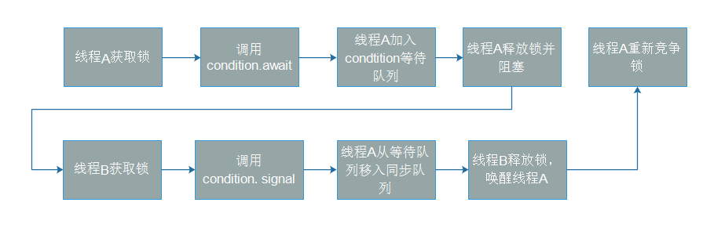

> 本文由 [简悦 SimpRead](http://ksria.com/simpread/) 转码， 原文地址 https://www.jianshu.com/p/f2f7cb4c48cd

==在经典的生产者 - 消费者模式中，可以使用 Object.wait() 和 Object.notify() 阻塞和唤醒线程，但是这样的处理下只能有一个等待队列。在可重入锁 ReentrantLock 中，使用 AQS 的 condition 可以实现设置多个等待队列，使用 Lock.newCondition 就可以生成一个等待队列，相比较来说这种方式就很灵活==。

本篇文章将介绍 Condition 的实现原理和基本使用方法，基本过程如下：  
1、Condition 提供了 await() 方法将当前线程阻塞，并提供 signal() 方法支持另外一个线程将已经阻塞的线程唤醒。 
2、Condition 需要结合 Lock 使用。
3、线程调用 await() 方法前必须获取锁，调用 await() 方法时，将线程构造成节点加入等待队列，同时释放锁，并挂起当前线程 
4、其他线程调用 signal() 方法前也必须获取锁，当执行 signal() 方法时将等待队列的节点移入到同步队列，当线程退出临界区释放锁的时候，唤醒同步队列的首个节点

 image.png

关键源码分析：  
1、等待队列使用链表结构

```java
/** First node of condition queue. */
private transient Node firstWaiter;//首个等待节点
/** Last node of condition queue. */
private transient Node lastWaiter;//最后一个等待节点
```

2、调用 await 阻塞当前线程

```java
      public final void await() throws InterruptedException {
            if (Thread.interrupted())
                throw new InterruptedException();
            //将当前线程封装成Node加入到等待队列尾部
            Node node = addConditionWaiter();
            //释放锁
            int savedState = fullyRelease(node);
            int interruptMode = 0;
            //关键代码！！！
            //判断当前节点是否已经在同步队列中，如果是则退出循环，如果不是就阻塞当前线程
            //其他线程如果发出了signal信号之后，会把等待队列的线程移入同步队列，此时就会退出循环，进入下面的重新获取锁的acquireQueued
            while (!isOnSyncQueue(node)) {
                LockSupport.park(this);
                if ((interruptMode = checkInterruptWhileWaiting(node)) != 0)
                    break;
            }
            //其他发出signal信号的线程释放锁之后，该线程被唤醒并重新竞争锁
            //acquireQueued这个方法的解析在之前的关于可重入锁的文章中有介绍
            if (acquireQueued(node, savedState) && interruptMode != THROW_IE)
                interruptMode = REINTERRUPT;
            if (node.nextWaiter != null) // clean up if cancelled
                unlinkCancelledWaiters();
            if (interruptMode != 0)
                reportInterruptAfterWait(interruptMode);
        }

        //线程加入等待队列尾部
        private Node addConditionWaiter() {
            Node t = lastWaiter;
            // If lastWaiter is cancelled, clean out.
            if (t != null && t.waitStatus != Node.CONDITION) {//清除cancell态的节点
                unlinkCancelledWaiters();
                t = lastWaiter;//t指向最后一个状态正确的节点
            }
            Node node = new Node(Thread.currentThread(), Node.CONDITION);
            if (t == null)//列表为空，初始化为第一个节点
                firstWaiter = node;
            else
                t.nextWaiter = node;
            lastWaiter = node;
            return node;
        }
```

3、其他线程调用 signal/signalAll 方法，将等待队列的节点移入同步队列 (signalAll 只是循环执行 signal 而已)，signal 调用 doSignal

```java
        private void doSignal(Node first) {
            do {
                if ( (firstWaiter = first.nextWaiter) == null)
                    lastWaiter = null;
                first.nextWaiter = null;//得到firstWaiter
            } while (!transferForSignal(first) &&
                     (first = firstWaiter) != null);
        }
      //将节点从等待队列移入同步队列
      final boolean transferForSignal(Node node) {
        /*
         * If cannot change waitStatus, the node has been cancelled.
         */
        if (!compareAndSetWaitStatus(node, Node.CONDITION, 0))
            return false;//cas节点状态错误，说明已经cancell了，直接返回false

        /*
         * Splice onto queue and try to set waitStatus of predecessor to
         * indicate that thread is (probably) waiting. If cancelled or
         * attempt to set waitStatus fails, wake up to resync (in which
         * case the waitStatus can be transiently and harmlessly wrong).
         */
        Node p = enq(node);//加入同步队列
        int ws = p.waitStatus;
        //设置前置节点状态为signal，可重入锁那篇文章分析过，为了唤醒线程而设置
        if (ws > 0 || !compareAndSetWaitStatus(p, ws, Node.SIGNAL))
            LockSupport.unpark(node.thread);//特殊情况下唤醒线程并重新同步，一般情况下这里不会执行
        return true;
    }
```

4、线程发出 signal 信号之后，退出临界区释放锁（代码在可重入锁中有详细分析，这里仅贴出关键代码）

```java
public final boolean release(int arg) {
        if (tryRelease(arg)) {
            Node h = head;
            if (h != null && h.waitStatus != 0)
                //唤醒同步队列的首节点
                unparkSuccessor(h);
            return true;
        }
        return false;
    }
```

总结  
==1、condition 提供了类似 object.wait 和 notify 的线程通信机制，但是 condition 支持多个等待队列，使用上更加灵活== 
==2、condition 的 await 和 signal 的通信机制是 juc 中有界队列的实现基础，而有界队列又是线程池实现的基础，常用于生产者 - 消费者模式== 
==3、condition 依赖于锁而存在。==