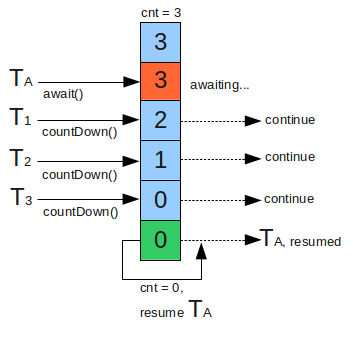

> 本文由 [简悦 SimpRead](http://ksria.com/simpread/) 转码， 原文地址 https://www.jianshu.com/p/15cb70390dea

在上一篇文章中，通过分析可重入锁 ReentrantLock 的实现原理，深入分析了同步器 AQS 同步队列和同步状态 state 的内部机制，本篇文章将分析一个非常有用的同步工具类：CountDownLatch 的实现原理，因为这个类的实现很简单，和 ReentrantLock 的机制非常相似，所以我放在连续的两篇文章中分析。

CountDownLatch 作为一个同步工具类，实际工作中经常会用到，就是允许一个或多个线程一直等待，直到其他线程的操作执行完后再执行。在 concurrent 包中，有相似的工具类 CyclicBarrier、Semaphore，后续写这两个类的实现原理，并对这三者做一个统一的总结和比较。

整体实现原理：  
1、内部类 Sync 继承 AQS 并实现关键的抽象方法 tryAcquire 和 tryRelease  
2、初始化一个计数器（实际上就是设置 volatile 修饰的同步状态 - state），计数器初始值是线程等待其他线程执行完成的数量。  
3、等待线程调用 await() 方法后被封装成 Node 加入 AQS 同步队列，自旋或者阻塞。  
4、每当一个线程完成了自己的任务后将计数器减 1，当计数器值到达 0 时，表示所有的线程已经完成，此时唤醒在 AQS 同步队列的所有节点（‘死循环’方式从 Head 开始逐个唤醒）。

 image.png

关键源码分析  
1、初始化，设置同步状态

```java
    public CountDownLatch(int count) {
        if (count < 0) throw new IllegalArgumentException("count < 0");
        this.sync = new Sync(count);//设置同步状态state=count
    }
```

2、等待线程调用 await() 进入等待

```
    public void await() throws InterruptedException {
        sync.acquireSharedInterruptibly(1);
    }

    public final void acquireSharedInterruptibly(int arg)
            throws InterruptedException {
        if (Thread.interrupted())
            throw new InterruptedException();
        //这里调用Sync实现的tryAcquire方法，很简单的逻辑state==0 ？ 1 : -1 
        if (tryAcquireShared(arg) < 0)
            //说明state>0，加入同步队列
            doAcquireSharedInterruptibly(arg);
    }

    //这个方法和之前介绍ReentrantLock分析的代码几乎一致，构造等待节点并加入
    //同步队列，自旋/挂起，具体源码分析可以参照我对可充入锁源码分析的文章
    private void doAcquireSharedInterruptibly(int arg)
        throws InterruptedException {
        final Node node = addWaiter(Node.SHARED);
        boolean failed = true;
        try {
            for (;;) {
                final Node p = node.predecessor();
                if (p == head) {
                    int r = tryAcquireShared(arg);
                    if (r >= 0) {
                        setHeadAndPropagate(node, r);
                        p.next = null; // help GC
                        failed = false;
                        return;
                    }
                }
                if (shouldParkAfterFailedAcquire(p, node) &&
                    parkAndCheckInterrupt())
                    throw new InterruptedException();
            }
        } finally {
            if (failed)
                cancelAcquire(node);
        }
    }


```

3、运行中的线程执行完成之后，调用 countDown() 将计数器减 1，该方法实际调用 AQS.releaseShared，当计数器最后一次释放之后，调用 AQS.doReleaseShared 唤醒同步队列的所有线程

```java
    public void countDown() {
        sync.releaseShared(1);
    }

    public final boolean releaseShared(int arg) {
        //如果计数器最后一次释放成功，唤醒同步队列中的线程AQS.doReleaseShared
        if (tryReleaseShared(arg)) {
            doReleaseShared();
            return true;
        }
        return false;
    }
        //计数器减1，使用死循环和cas的方式保证更新成功，避免出现死锁
        protected boolean tryReleaseShared(int releases) {
            // Decrement count; signal when transition to zero
            //死循环的方式保证cas成功
            for (;;) {
                int c = getState();
                if (c == 0) //计数器已经全部释放完毕，直接返回false
                    return false;
                int nextc = c-1;
                if (compareAndSetState(c, nextc))
                    return nextc == 0;//判断计数器是否是最后一次释放，是-true
            }
        }
    
    //和可重入锁ReentrantLock唤醒的代码几乎一致，死循环方式唤醒head的后继节点
    private void doReleaseShared() {
        for (;;) {//死循环方式唤醒同步队列所有节点
            Node h = head;
            if (h != null && h != tail) {
                int ws = h.waitStatus;
                if (ws == Node.SIGNAL) {
                    if (!compareAndSetWaitStatus(h, Node.SIGNAL, 0))
                        continue;            // loop to recheck cases
                    //唤醒h的后继节点
                    unparkSuccessor(h);
                }
                else if (ws == 0 &&
                         !compareAndSetWaitStatus(h, 0, Node.PROPAGATE))
                    continue;                // loop on failed CAS
            }
            if (h == head)                   // loop if head changed
                break;
        }
    }
```

总结：  
CountDownLatch 是一个常用的同步工具类，能让一个或多个线程等待其他一些线程执行完成之后再执行（此功能与 Thread.join() 类似，但是 join 是使用 wait 方式实现，每次只能等待一个线程，在多核环境下浪费资源）  
使用方法：等待线程调用 await() 将自身挂起，其他线程执行完成之后调用 countDown 通知计数器减 1（这个调用放入 finally 块中，确保永远会执行），当计数器为 0 时，等待线程自动被唤醒并继续执行任务。