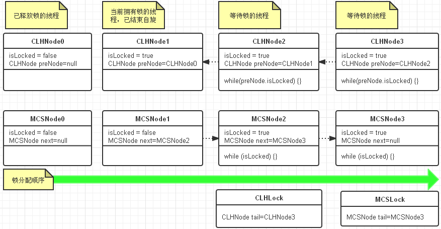

> 本文由 [简悦 SimpRead](http://ksria.com/simpread/) 转码， 原文地址 https://coderbee.net/index.php/concurrent/20131115/577

### 自旋锁（Spin lock）

自旋锁是指当一个线程尝试获取某个锁时，如果该锁已被其他线程占用，就一直循环检测锁是否被释放，而不是进入线程挂起或睡眠状态。

自旋锁适用于锁保护的临界区很小的情况，临界区很小的话，锁占用的时间就很短。

#### 简单的实现

```java
import java.util.concurrent.atomic.AtomicReference;

public class SpinLock {
   private AtomicReference<Thread> owner = new AtomicReference<Thread>();

   public void lock() {
       Thread currentThread = Thread.currentThread();

       // 如果锁未被占用，则设置当前线程为锁的拥有者
       while (!owner.compareAndSet(null, currentThread)) {
       }
   }

   public void unlock() {
       Thread currentThread = Thread.currentThread();

       // 只有锁的拥有者才能释放锁
       owner.compareAndSet(currentThread, null);
   }
}
```

SimpleSpinLock 里有一个 owner 属性持有锁当前拥有者的线程的引用，如果该引用为 null，则表示锁未被占用，不为 null 则被占用。

这里用 AtomicReference 是为了使用它的原子性的 compareAndSet 方法（CAS 操作），解决了多线程并发操作导致数据不一致的问题，确保其他线程可以看到锁的真实状态。  

#### 缺点

1.  CAS 操作需要硬件的配合；
2.  ==保证各个 CPU 的缓存（L1、L2、L3、跨 CPU Socket、主存）的数据一致性，通讯开销很大==，在多处理器系统上更严重；
3.  ==没法保证公平性==，不保证等待进程 / 线程按照 FIFO 顺序获得锁。
4.  ==自旋占用CPU，对CPU的消耗比较大==。

### Ticket Lock

==Ticket Lock 是为了解决上面的公平性问题，类似于现实中银行柜台的排队叫号==：锁拥有一个==服务号==，表示正在服务的线程，还有一个==排队号==；每个线程尝试获取锁之前先拿一个排队号，然后不断轮询锁的当前服务号是否是自己的排队号，如果是，则表示自己拥有了锁，不是则继续轮询。

当线程释放锁时，将服务号加 1，这样下一个线程看到这个变化，就退出自旋。

#### 简单的实现

```java
import java.util.concurrent.atomic.AtomicInteger;

public class TicketLock {
   private AtomicInteger serviceNum = new AtomicInteger(); // 服务号
   private AtomicInteger ticketNum = new AtomicInteger(); // 排队号

   public int lock() {
        // 首先原子性地获得一个排队号
        int myTicketNum = ticketNum.getAndIncrement();

        // 只要当前服务号不是自己的就不断轮询
        while (serviceNum.get() != myTicketNum) {
        }

        return myTicketNum;
    }

    public void unlock(int myTicket) {
        // 只有当前线程拥有者才能释放锁
        int next = myTicket + 1;
        serviceNum.compareAndSet(myTicket, next);
    }
}
```

#### 缺点

Ticket Lock 虽然解决了公平性的问题，但是多处理器系统上，==每个进程 / 线程占用的处理器都在读写同一个变量 serviceNum ，每次读写操作都必须在多个处理器缓存之间进行缓存同步，这会导致繁重的系统总线和内存的流量==，大大降低系统整体的性能。

下面介绍的 CLH 锁和 MCS 锁都是为了解决这个问题的。

MCS 来自于其发明人名字的首字母： John Mellor-Crummey 和 Michael Scott。

CLH 的发明人是：Craig，Landin and Hagersten。

### MCS 锁

MCS Spinlock 是一种基于链表的可扩展、高性能、公平的自旋锁，==申请线程只在本地变量上自旋，直接前驱负责通知其结束自旋，从而极大地减少了不必要的处理器缓存同步的次数，降低了总线和内存的开销==。

```java
import java.util.concurrent.atomic.AtomicReferenceFieldUpdater;

public class MCSLock {
    public static class MCSNode {
        volatile MCSNode next;
        volatile boolean isBlock = true; // 默认是在等待锁
    }

    volatile MCSNode queue;// 指向最后一个申请锁的MCSNode
    private static final AtomicReferenceFieldUpdater UPDATER = AtomicReferenceFieldUpdater
            .newUpdater(MCSLock.class, MCSNode.class, "queue");

    public void lock(MCSNode currentThread) {
        MCSNode predecessor = UPDATER.getAndSet(this, currentThread);// step 1
        if (predecessor != null) {
            predecessor.next = currentThread;// step 2

            while (currentThread.isBlock) {// step 3
            }
        }else { // 只有一个线程在使用锁，没有前驱来通知它，所以得自己标记自己为非阻塞
               currentThread. isBlock = false;
          }
    }

    public void unlock(MCSNode currentThread) {
        if (currentThread.isBlock) {// 锁拥有者进行释放锁才有意义
            return;
        }

        if (currentThread.next == null) {// 检查是否有人排在自己后面
            if (UPDATER.compareAndSet(this, currentThread, null)) {// step 4
                // compareAndSet返回true表示确实没有人排在自己后面
                return;
            } else {
                // 突然有人排在自己后面了，可能还不知道是谁，下面是等待后续者
                // 这里之所以要忙等是因为：step 1执行完后，step 2可能还没执行完
                while (currentThread.next == null) { // step 5
                }
            }
        }

        currentThread.next.isBlock = false;
        currentThread.next = null;// for GC
    }
}
```

### CLH 锁

CLH 锁也是一种基于链表的可扩展、高性能、公平的自旋锁，==申请线程只在本地变量上自旋，它不断轮询前驱的状态，如果发现前驱释放了锁就结束自旋==。

```java
import java.util.concurrent.atomic.AtomicReferenceFieldUpdater;

public class CLHLock {
    public static class CLHNode {
        private volatile boolean isLocked = true; // 默认是在等待锁
    }

    @SuppressWarnings("unused" )
    private volatile CLHNode tail;
    private static final AtomicReferenceFieldUpdater<CLHLock, CLHNode> UPDATER = AtomicReferenceFieldUpdater
                  .newUpdater(CLHLock.class, CLHNode .class , "tail");

    public void lock(CLHNode currentThread) {
        CLHNode preNode = UPDATER.getAndSet( this, currentThread);
        if(preNode != null) {//已有线程占用了锁，进入自旋
            while(preNode.isLocked ) {
            }
        }
    }

    public void unlock(CLHNode currentThread) {
        // 如果队列里只有当前线程，则释放对当前线程的引用（for GC）。
        if (!UPDATER.compareAndSet(this, currentThread, null)) {
            // 还有后续线程
            currentThread. isLocked = false ;// 改变状态，让后续线程结束自旋
        }
    }
}
```

### CLH 锁 与 MCS 锁 的比较

下图是 CLH 锁和 MCS 锁队列图示：  


差异：

1.  从代码实现来看，CLH 比 MCS 要简单得多。
2.  ==从自旋的条件来看，CLH 是在前驱节点的属性上自旋，而 MCS 是在本地属性变量上自旋==。
3.  从链表队列来看，CLH 的队列是隐式的，CLHNode 并不实际持有下一个节点；MCS 的队列是物理存在的。
4.  CLH 锁释放时只需要改变自己的属性，MCS 锁释放则需要改变后继节点的属性。

**注意：这里实现的锁都是独占的，且不能重入的。**