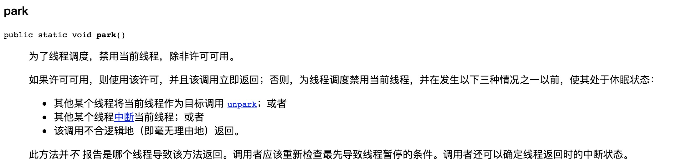
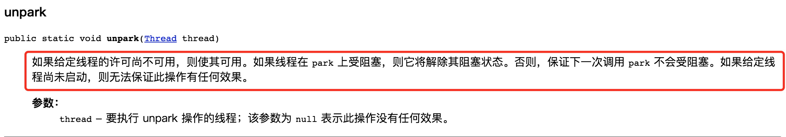

> 本文由 [简悦 SimpRead](http://ksria.com/simpread/) 转码， 原文地址 https://www.jianshu.com/p/f1f2cd289205

是什么
---

`LockSupport`是一个线程阻塞工具类，所有的方法都是静态方法，可以让线程在任意位置阻塞，当然阻塞之后肯定得有唤醒的方法。

有什么用
----

接下面我来看看`LockSupport`有哪些常用的方法。主要有两类方法：`park`和`unpark`。

```java
public static void park(Object blocker); // 暂停当前线程
public static void parkNanos(Object blocker, long nanos); // 暂停当前线程，不过有超时时间的限制
public static void parkUntil(Object blocker, long deadline); // 暂停当前线程，直到某个时间
public static void park(); // 无期限暂停当前线程
public static void parkNanos(long nanos); // 暂停当前线程，不过有超时时间的限制
public static void parkUntil(long deadline); // 暂停当前线程，直到某个时间
public static void unpark(Thread thread); // 恢复当前线程
public static Object getBlocker(Thread t);
```

为什么叫 park 呢，park 英文意思为停车。我们如果把 Thread 看成一辆车的话，park 就是让车停下，unpark 就是让车启动然后跑起来。

我们写一个例子来看看这个工具类怎么用的。

```java
public class LockSupportDemo {

    public static Object u = new Object();
    static ChangeObjectThread t1 = new ChangeObjectThread("t1");
    static ChangeObjectThread t2 = new ChangeObjectThread("t2");

    public static class ChangeObjectThread extends Thread {
        public ChangeObjectThread(String name) {
            super(name);
        }
        @Override public void run() {
            synchronized (u) {
                System.out.println("in " + getName());
                LockSupport.park();
                if (Thread.currentThread().isInterrupted()) {
                    System.out.println("被中断了");
                }
                System.out.println("继续执行");
            }
        }
    }

    public static void main(String[] args) throws InterruptedException {
        t1.start();
        Thread.sleep(1000L);
        t2.start();
        Thread.sleep(3000L);
        t1.interrupt();
        LockSupport.unpark(t2);
        t1.join();
        t2.join();
    }
}
```

运行的结果如下：

```
in t1
被中断了
继续执行
in t2
继续执行
```

这儿`park`和`unpark`其实实现了`wait`和`notify`的功能，不过还是有一些差别的。

1.  `park`不需要获取某个对象的锁
2.  因为中断的时候`park`不会抛出`InterruptedException`异常，所以需要在`park`之后自行判断中断状态，然后做额外的处理

我们再来看看`Object blocker`，这是个什么东西呢？这其实就是方便在线程 dump 的时候看到具体的阻塞对象的信息。

```
"t1" #10 prio=5 os_prio=31 tid=0x00007f95030cc800 nid=0x4e03 waiting on condition [0x00007000011c9000]
   java.lang.Thread.State: WAITING (parking)
    at sun.misc.Unsafe.park(Native Method)
    at java.util.concurrent.locks.LockSupport.park(LockSupport.java:304)
    // `下面的这个信息`
    at com.wtuoblist.beyond.concurrent.demo.chapter3.LockSupportDemo$ChangeObjectThread.run(LockSupportDemo.java:23) // 
    - locked <0x0000000795830950> (a java.lang.Object)
```

还有一个地方需要注意，相对于线程的`suspend和resume`，`park和unpark`的先后顺序并不是那么严格。==`suspend和resume`如果顺序反了，会出现死锁现象。而`park和unpark`却不会==。这又是为什么呢？还是看一个例子

```
public class LockSupportDemo {

    public static Object u = new Object();
    static ChangeObjectThread t1 = new ChangeObjectThread("t1");

    public static class ChangeObjectThread extends Thread {

        public ChangeObjectThread(String name) {
            super(name);
        }

        @Override public void run() {
            synchronized (u) {
                System.out.println("in " + getName());
                try {
                    Thread.sleep(1000L);
                } catch (InterruptedException e) {
                    e.printStackTrace();
                }
                LockSupport.park();
                if (Thread.currentThread().isInterrupted()) {
                    System.out.println("被中断了");
                }
                System.out.println("继续执行");
            }
        }
    }

    public static void main(String[] args) {
        t1.start();
        LockSupport.unpark(t1);
        System.out.println("unpark invoked");
    }
}


```

t1 内部有休眠 1s 的操作，所以 unpark 肯定先于 park 的调用，但是 t1 最终仍然可以完结。这是因为`park和unpark`会对每个线程维持一个许可（boolean 值）

1.  unpark 调用时，如果当前线程还未进入 park，则许可为 true
2.  park 调用时，判断许可是否为 true，如果是 true，则继续往下执行；如果是 false，则等待，直到许可为 true

我们再看看 jdk 的文档描述

 park 描述  unpark 描述

总结一下
----

1.  ==`park和unpark`可以实现类似`wait和notify`的功能，但是并不和`wait和notify`交叉，也就是说`unpark`不会对`wait`起作用，`notify`也不会对`park`起作用。==
2.  ==`park和unpark`的使用不会像suspend那样出现死锁的情况，但park是不可以重入的，连续执行两次park仍然可能死锁==
3.  ==blocker 的作用是在 dump 线程的时候看到阻塞对象的信息==