> 本文由 [简悦 SimpRead](http://ksria.com/simpread/) 转码， 原文地址 https://www.jianshu.com/p/c5058b6fe8e5

> 转载请注明原创出处，谢谢！  
> 简书占小狼  
> [http://www.jianshu.com/users/90ab66c248e6/latest_articles](https://www.jianshu.com/users/90ab66c248e6/latest_articles)

java 内部锁 synchronized 的出现，为多线程的并发执行提供了一个稳定的环境，有效的防止多个线程同时执行同一个逻辑，其实这篇文章应该写在[深入分析 Object.wait/notify 实现机制](https://www.jianshu.com/p/f4454164c017)之前，本文不会讲如何使用 synchronized，以 HotSpot1.7 的虚拟机为例，对 synchronized 的实现进行深入分析。

synchronized 的 HotSpot 实现依赖于对象头的 Mark Word，关于 Mark Word 的描述可以参考这篇文章[《java 对象头的 HotSpot 实现分析》](https://www.jianshu.com/p/9c19eb0ea4d8)

### synchronized 字节码实现

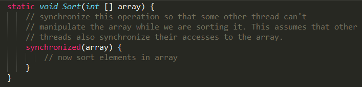

通过 javap 命令生成的字节码中包含 ** monitorenter ** 和 ** monitorexit ** 指令。

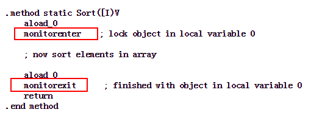

synchronized 关键字基于上述两个指令实现了锁的获取和释放过程，解释器执行 monitorenter 时会进入到`InterpreterRuntime.cpp`的`InterpreterRuntime::monitorenter`函数，具体实现如下：  

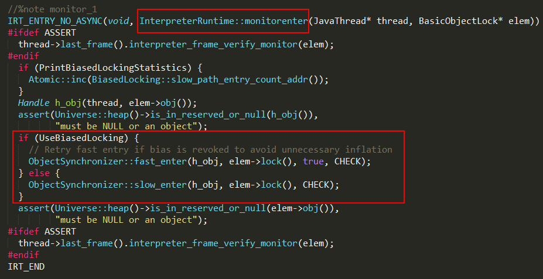

1、JavaThread thread 指向 java 中的当前线程；  
2、BasicObjectLock 类型的 elem 对象包含一个 BasicLock 类型_lock 对象和一个指向 Object 对象的指针_obj;

```
class BasicObjectLock {
  BasicLock _lock; 
  // object holds the lock;
  oop  _obj;   
}


```

3、BasicLock 类型_lock 对象主要用来保存_obj 指向 Object 对象的对象头数据；

```
class BasicLock {
    volatile markOop _displaced_header;
}


```

4、**UseBiasedLocking** 标识虚拟机是否开启偏向锁功能，如果开启则执行 fast_enter 逻辑，否则执行 slow_enter；

### 偏向锁

引入偏向锁的目的：在没有多线程竞争的情况下，尽量减少不必要的轻量级锁执行路径，轻量级锁的获取及释放依赖多次 CAS 原子指令，而偏向锁只依赖一次 CAS 原子指令置换 ThreadID，不过一旦出现多个线程竞争时必须撤销偏向锁，所以撤销偏向锁消耗的性能必须小于之前节省下来的 CAS 原子操作的性能消耗，不然就得不偿失了。JDK 1.6 中默认开启偏向锁，可以通过 - XX:-UseBiasedLocking 来禁用偏向锁。

在 HotSpot 中，偏向锁的入口位于 synchronizer.cpp 文件的`ObjectSynchronizer::fast_enter`函数：  

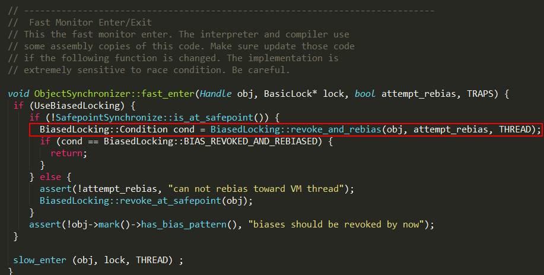

##### 偏向锁的获取

偏向锁的获取由`BiasedLocking::revoke_and_rebias`方法实现，由于实现比较长，就不贴代码了，实现逻辑如下：  
1、通过`markOop mark = obj->mark()`获取对象的 markOop 数据 mark，即对象头的 Mark Word；  
2、判断 mark 是否为可偏向状态，即 mark 的偏向锁标志位为 **1**，锁标志位为 **01**；  
3、判断 mark 中 JavaThread 的状态：如果为空，则进入步骤（4）；如果指向当前线程，则执行同步代码块；如果指向其它线程，进入步骤（5）；  
4、通过 CAS 原子指令设置 mark 中 JavaThread 为当前线程 ID，如果执行 CAS 成功，则执行同步代码块，否则进入步骤（5）；  
5、如果执行 CAS 失败，表示当前存在多个线程竞争锁，当达到全局安全点（safepoint），获得偏向锁的线程被挂起，撤销偏向锁，并升级为轻量级，升级完成后被阻塞在安全点的线程继续执行同步代码块；

##### 偏向锁的撤销

只有当其它线程尝试竞争偏向锁时，持有偏向锁的线程才会释放锁，偏向锁的撤销由`BiasedLocking::revoke_at_safepoint`方法实现：

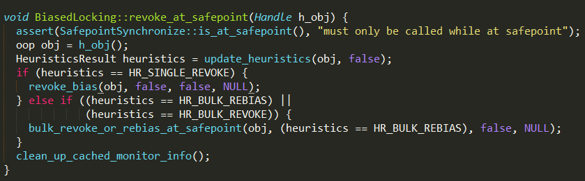

1、偏向锁的撤销动作必须等待全局安全点；  
2、暂停拥有偏向锁的线程，判断锁对象是否处于被锁定状态；  
3、撤销偏向锁，恢复到无锁（标志位为 **01**）或轻量级锁（标志位为 **00**）的状态；

偏向锁在 Java 1.6 之后是默认启用的，但在应用程序启动几秒钟之后才激活，可以使用`-XX:BiasedLockingStartupDelay=0`参数关闭延迟，如果确定应用程序中所有锁通常情况下处于竞争状态，可以通过`XX:-UseBiasedLocking=false`参数关闭偏向锁。

### 轻量级锁

引入轻量级锁的目的：在多线程交替执行同步块的情况下，尽量避免重量级锁引起的性能消耗，但是如果多个线程在同一时刻进入临界区，会导致轻量级锁膨胀升级重量级锁，所以轻量级锁的出现并非是要替代重量级锁。

##### 轻量级锁的获取

当关闭偏向锁功能，或多个线程竞争偏向锁导致偏向锁升级为轻量级锁，会尝试获取轻量级锁，其入口位于`ObjectSynchronizer::slow_enter`  

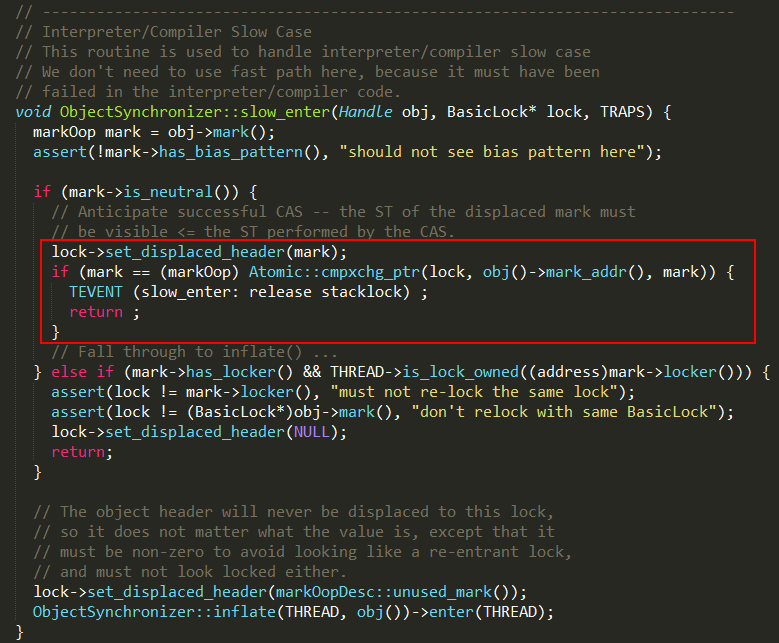

1、`markOop mark = obj->mark()`方法获取对象的 markOop 数据 mark；  
2、`mark->is_neutral()`方法判断 mark 是否为无锁状态：mark 的偏向锁标志位为 **0**，锁标志位为 **01**；  
3、如果 mark 处于无锁状态，则进入步骤（4），否则执行步骤（6）；  
4、把 mark 保存到 BasicLock 对象的_displaced_header 字段；  
5、通过 CAS 尝试将 Mark Word 更新为指向 BasicLock 对象的指针，如果更新成功，表示竞争到锁，则执行同步代码，否则执行步骤（6）；  
6、如果当前 mark 处于加锁状态，且 mark 中的 ptr 指针指向当前线程的栈帧，则执行同步代码，否则说明有多个线程竞争轻量级锁，轻量级锁需要膨胀升级为重量级锁；

**假设线程 A 和 B 同时执行到临界区`if (mark->is_neutral())`**：  
1、线程 AB 都把 Mark Word 复制到各自的_displaced_header 字段，该数据保存在线程的栈帧上，是线程私有的；  
2、`Atomic::cmpxchg_ptr`原子操作保证只有一个线程可以把指向栈帧的指针复制到 Mark Word，假设此时线程 A 执行成功，并返回继续执行同步代码块；  
3、线程 B 执行失败，退出临界区，通过`ObjectSynchronizer::inflate`方法开始膨胀锁；

##### 轻量级锁的释放

轻量级锁的释放通过`ObjectSynchronizer::fast_exit`完成。  

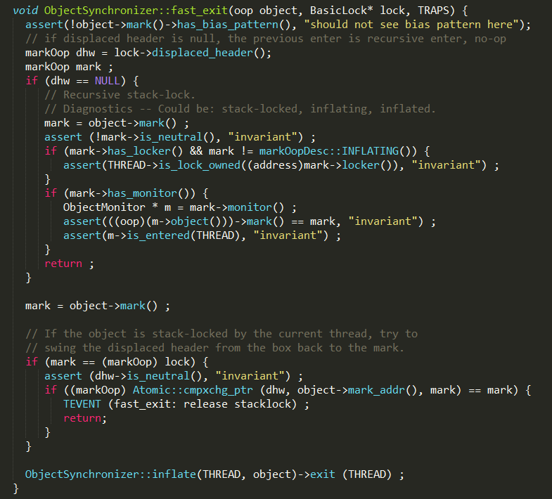

1、确保处于偏向锁状态时不会执行这段逻辑；

2、取出在获取轻量级锁时保存在 BasicLock 对象的 mark 数据 dhw；

3、通过 CAS 尝试把 dhw 替换到当前的 Mark Word，如果 CAS 成功，说明成功的释放了锁，否则执行步骤（4）；

4、如果 CAS 失败，说明有其它线程在尝试获取该锁，这时需要将该锁升级为重量级锁，并释放；

### 重量级锁

重量级锁通过对象内部的监视器（monitor）实现，其中 monitor 的本质是依赖于底层操作系统的 Mutex Lock 实现，操作系统实现线程之间的切换需要从用户态到内核态的切换，切换成本非常高。

##### 锁膨胀过程

锁的膨胀过程通过`ObjectSynchronizer::inflate`函数实现  

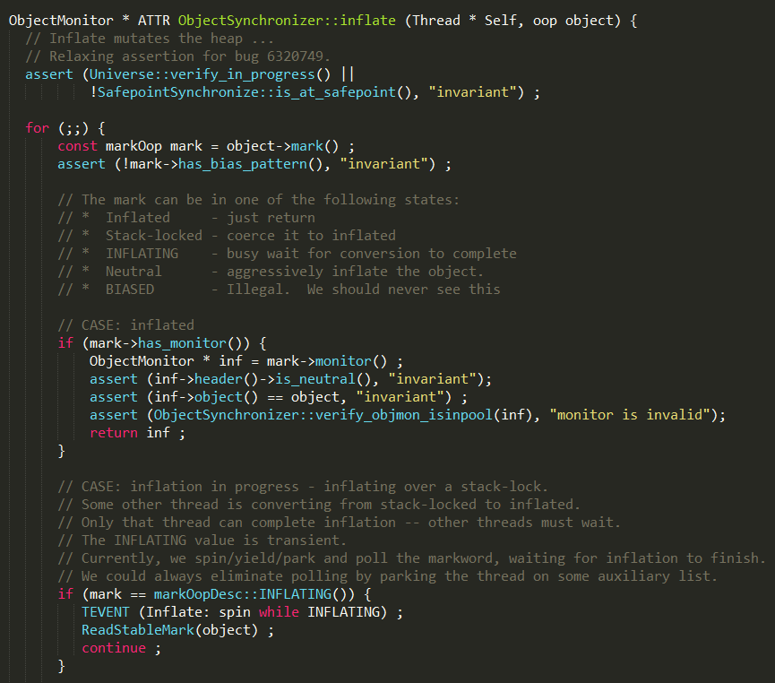

膨胀过程的实现比较复杂，截图中只是一小部分逻辑，完整的方法可以查看`synchronized.cpp`，大概实现过程如下：  
1、整个膨胀过程在自旋下完成；  
2、`mark->has_monitor()`方法判断当前是否为重量级锁，即 Mark Word 的锁标识位为 **10**，如果当前状态为重量级锁，执行步骤（3），否则执行步骤（4）；  
3、`mark->monitor()`方法获取指向 ObjectMonitor 的指针，并返回，说明膨胀过程已经完成；  
4、如果当前锁处于膨胀中，说明该锁正在被其它线程执行膨胀操作，则当前线程就进行自旋等待锁膨胀完成，这里需要注意一点，虽然是自旋操作，但不会一直占用 cpu 资源，每隔一段时间会通过 os::NakedYield 方法放弃 cpu 资源，或通过 park 方法挂起；如果其他线程完成锁的膨胀操作，则退出自旋并返回；  
5、如果当前是轻量级锁状态，即锁标识位为 **00**，膨胀过程如下：  

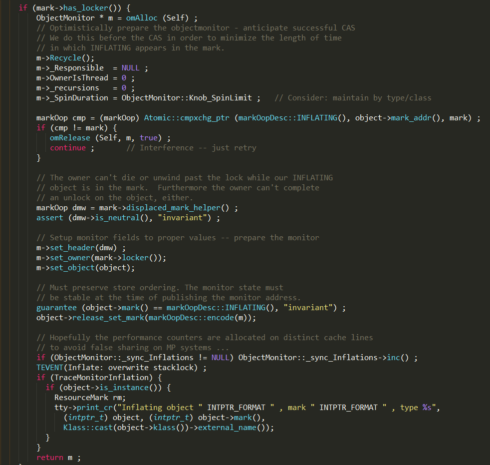

1、通过 omAlloc 方法，获取一个可用的 ObjectMonitor monitor，并重置 monitor 数据；  
2、通过 CAS 尝试将 Mark Word 设置为 markOopDesc:INFLATING，标识当前锁正在膨胀中，如果 CAS 失败，说明同一时刻其它线程已经将 Mark Word 设置为 markOopDesc:INFLATING，当前线程进行自旋等待膨胀完成；  
3、如果 CAS 成功，设置 monitor 的各个字段：_header、_owner 和_object 等，并返回；

##### monitor 竞争

当锁膨胀完成并返回对应的 monitor 时，并不表示该线程竞争到了锁，真正的锁竞争发生在`ObjectMonitor::enter`方法中。  

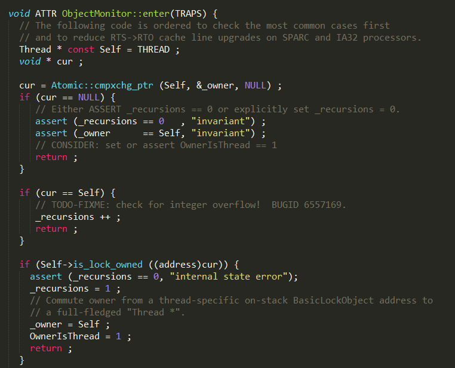

1、通过 CAS 尝试把 monitor 的_owner 字段设置为当前线程；  
2、如果设置之前的_owner 指向当前线程，说明当前线程再次进入 monitor，即重入锁，执行_recursions ++ ，记录重入的次数；  
3、如果之前的_owner 指向的地址在当前线程中，这种描述有点拗口，换一种说法：之前_owner 指向的 BasicLock 在当前线程栈上，说明当前线程是第一次进入该 monitor，设置_recursions 为 1，_owner 为当前线程，该线程成功获得锁并返回；  
4、如果获取锁失败，则等待锁的释放；

##### monitor 等待

monitor 竞争失败的线程，通过自旋执行`ObjectMonitor::EnterI`方法等待锁的释放，EnterI 方法的部分逻辑实现如下：  

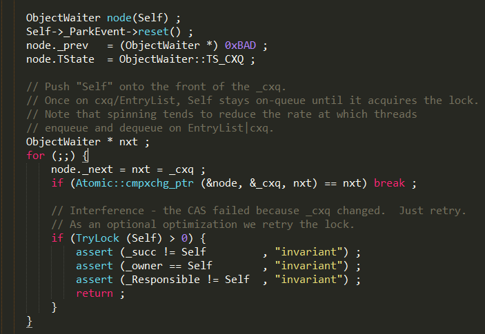

1、当前线程被封装成 ObjectWaiter 对象 node，状态设置成 ObjectWaiter::TS_CXQ；  
2、在 for 循环中，通过 CAS 把 node 节点 push 到_cxq 列表中，同一时刻可能有多个线程把自己的 node 节点 push 到_cxq 列表中；  
3、node 节点 push 到_cxq 列表之后，通过自旋尝试获取锁，如果还是没有获取到锁，则通过 park 将当前线程挂起，等待被唤醒，实现如下：

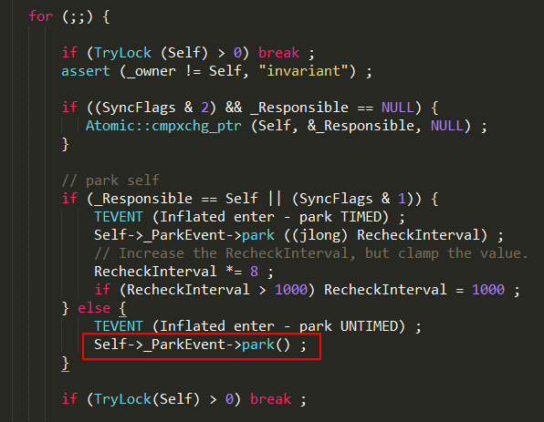

4、当该线程被唤醒时，会从挂起的点继续执行，通过`ObjectMonitor::TryLock`尝试获取锁，TryLock 方法实现如下：

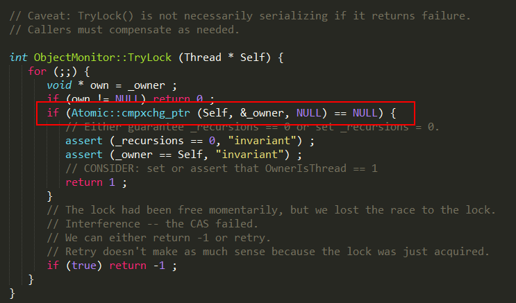

其本质就是通过 CAS 设置 monitor 的_owner 字段为当前线程，如果 CAS 成功，则表示该线程获取了锁，跳出自旋操作，执行同步代码，否则继续被挂起；

##### monitor 释放

当某个持有锁的线程执行完同步代码块时，会进行锁的释放，给其它线程机会执行同步代码，在 HotSpot 中，通过退出 monitor 的方式实现锁的释放，并通知被阻塞的线程，具体实现位于`ObjectMonitor::exit`方法中。

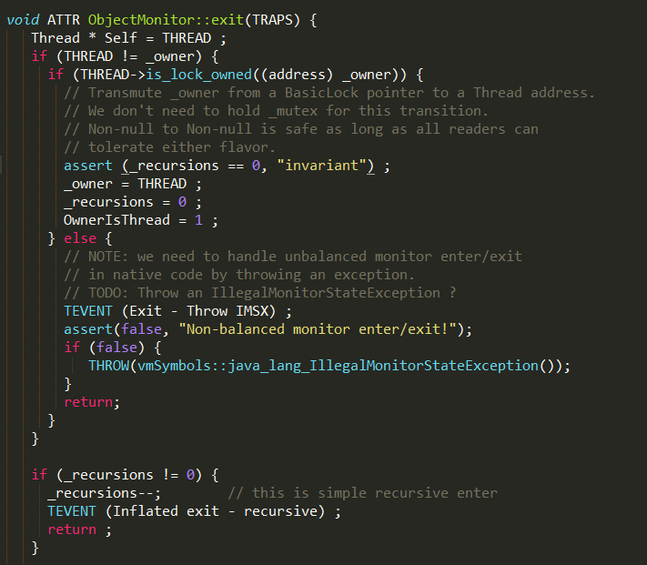

1、如果是重量级锁的释放，monitor 中的_owner 指向当前线程，即 THREAD == _owner；  
2、根据不同的策略（由 QMode 指定），从 cxq 或 EntryList 中获取头节点，通过`ObjectMonitor::ExitEpilog`方法唤醒该节点封装的线程，唤醒操作最终由 unpark 完成，实现如下：

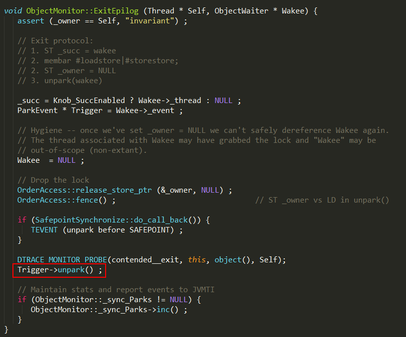

3、被唤醒的线程，继续执行 monitor 的竞争；

希望本文的分析可以让大家对 synchronized 关键字有更加深刻的理解。

我是占小狼  
坐标魔都，白天是上班族，晚上是知识的分享者  
如果读完觉得有收获的话，欢迎点赞加关注

 我的微信公众号