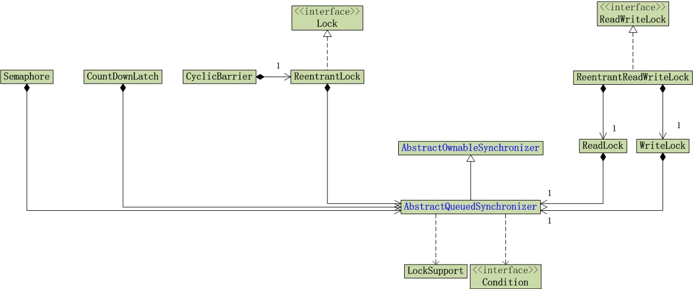
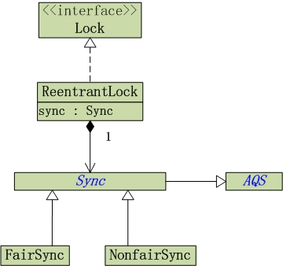
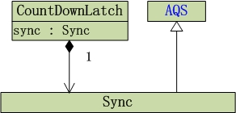
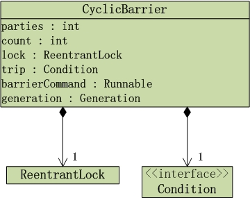
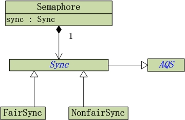

> 根据锁的添加到 Java 中的时间，Java 中的锁，可以分为 " [**同步锁**](http://www.cnblogs.com/skywang12345/p/3479202.html) "和"**JUC 包中的锁** "。
>

## **同步锁**

　　即通过 synchronized 关键字来进行同步，实现对竞争资源的互斥访问的锁。Java 1.0 版本中就已经支持同步锁了。

　　同步锁的原理是，对于每一个对象，有且仅有一个同步锁；不同的线程能共同访问该同步锁。但是，在同一个时间点，该同步锁能且只能被一个线程获取到。这样，获取到同步锁的线程就能进行 CPU 调度，从而在 CPU 上执行；而没有获取到同步锁的线程，必须进行等待，直到获取到同步锁之后才能继续运行。这就是，多线程通过同步锁进行同步的原理！

## **JUC 包中的锁** 

　　相比同步锁，JUC 包中的锁的功能更加强大，它为锁提供了一个框架，该框架允许更灵活地使用锁，只是它的用法更难罢了。

　　JUC 包中的锁，包括：Lock 接口，ReadWriteLock 接口，LockSupport 阻塞原语，Condition 条件，AbstractOwnableSynchronizer/AbstractQueuedSynchronizer/AbstractQueuedLongSynchronizer 三个抽象类，ReentrantLock 独占锁，ReentrantReadWriteLock 读写锁。由于 CountDownLatch，CyclicBarrier 和 Semaphore 也是通过 AQS 来实现的；因此，我也将它们归纳到锁的框架中进行介绍。

　　先看看锁的框架图，如下所示。

#### **01. Lock 接口**

　　JUC 包中的 Lock 接口支持那些语义不同 (重入、公平等) 的锁规则。所谓语义不同，是指锁可是有 "公平机制的锁"、"非公平机制的锁"、"可重入的锁" 等等。"公平机制" 是指 "不同线程获取锁的机制是公平的"，而 "非公平机制" 则是指 "不同线程获取锁的机制是非公平的"，"可重入的锁" 是指同一个锁能够被一个线程多次获取。

#### **02. ReadWriteLock**

　　ReadWriteLock 接口以和 Lock 类似的方式定义了一些读取者可以共享而写入者独占的锁。JUC 包只有一个类实现了该接口，即 ReentrantReadWriteLock，因为它适用于大部分的标准用法上下文。但程序员可以创建自己的、适用于非标准要求的实现。

#### 03. AbstractQueuedSynchronizer

　　AbstractQueuedSynchronizer 就是被称之为 **AQS** 的类，它是一个非常有用的超类，可用来定义锁以及依赖于排队阻塞线程的其他同步器；ReentrantLock，ReentrantReadWriteLock，CountDownLatch，CyclicBarrier 和 Semaphore 等这些类都是基于 AQS 类实现的。AbstractQueuedLongSynchronizer 类提供相同的功能但扩展了对同步状态的 64 位的支持。两者都扩展了类 AbstractOwnableSynchronizer（一个帮助记录当前保持独占同步的线程的简单类）。

#### **04. LockSupport**  

　　LockSupport 提供 “创建锁” 和“其他同步类的基本线程阻塞原语”。  
　　LockSupport 的功能和 "Thread 中的 Thread.suspend()和 Thread.resume()有点类似"，LockSupport 中的 park() 和 unpark() 的作用分别是阻塞线程和解除阻塞线程。但是 park()和 unpark()不会遇到 “Thread.suspend 和 Thread.resume 所可能引发的死锁” 问题。

#### **05. Condition**  

　　Condition 需要和 Lock 联合使用，它的作用是代替 Object 监视器方法，可以通过 await(),signal() 来休眠 / 唤醒线程。  
Condition 接口描述了可能会与锁有关联的条件变量。这些变量在用法上与使用 Object.wait 访问的隐式监视器类似，但提供了更强大的功能。需要特别指出的是，单个 Lock 可能与多个 Condition 对象关联。为了避免兼容性问题，Condition 方法的名称与对应的 Object 版本中的不同。

#### 06. ReentrantLock

　　ReentrantLock 是独占锁。所谓独占锁，是指只能被独自占领，即同一个时间点只能被一个线程锁获取到的锁。ReentrantLock 锁包括 "公平的 ReentrantLock" 和 "非公平的 ReentrantLock"。"公平的 ReentrantLock" 是指 "不同线程获取锁的机制是公平的"，而 "非公平的　　ReentrantLock" 则是指 "不同线程获取锁的机制是非公平的"，ReentrantLock 是 "可重入的锁"。  
　　ReentrantLock 的 UML 类图如下：

　　(01) ReentrantLock 实现了 Lock 接口。  
　　(02) ReentrantLock 中有一个成员变量 sync，sync 是 Sync 类型；Sync 是一个抽象类，而且它继承于 AQS。  
　　(03) ReentrantLock 中有 "公平锁类"FairSync 和 "非公平锁类"NonfairSync，它们都是 Sync 的子类。ReentrantReadWriteLock 中 sync 对象，是 FairSync 与 NonfairSync 中的一种，这也意味着 ReentrantLock 是 "公平锁" 或 "非公平锁" 中的一种，ReentrantLock 默认是非公平锁。

#### **07. ReentrantReadWriteLock**  

　　ReentrantReadWriteLock 是读写锁接口 ReadWriteLock 的实现类，它包括子类 ReadLock 和 WriteLock。ReentrantLock 是共享锁，而 WriteLock 是独占锁。  
　　ReentrantReadWriteLock 的 UML 类图如下：

  
　　(01) ReentrantReadWriteLock 实现了 ReadWriteLock 接口。  
　　(02) ReentrantReadWriteLock 中包含 sync 对象，读锁 readerLock 和写锁 writerLock。读锁 ReadLock 和写锁 WriteLock 都实现了 Lock 接口。  
　　(03) 和 "ReentrantLock" 一样，sync 是 Sync 类型；而且，Sync 也是一个继承于 AQS 的抽象类。Sync 也包括 "公平锁"FairSync 和 "非公平锁"NonfairSync。

#### **08. CountDownLatch**  

　　CountDownLatch 是一个同步辅助类，在完成一组正在其他线程中执行的操作之前，它允许一个或多个线程一直等待。  
　　CountDownLatch 的 UML 类图如下：

  
　　CountDownLatch 包含了 sync 对象，sync 是 Sync 类型。CountDownLatch 的 Sync 是实例类，它继承于 AQS。

#### **09. CyclicBarrier**  

　　CyclicBarrier 是一个同步辅助类，允许一组线程互相等待，直到到达某个公共屏障点 (common barrier point)。因为该 barrier 在释放等待线程后可以重用，所以称它为循环 的 barrier。  
　　CyclicBarrier 的 UML 类图如下：

  
　　CyclicBarrier 是包含了 "ReentrantLock 对象 lock" 和 "Condition 对象 trip"，它是通过独占锁实现的。  
　　**CyclicBarrier 和 CountDownLatch 的区别**是：  
　　(01) CountDownLatch 的作用是允许 1 或 N 个线程等待其他线程完成执行；而 CyclicBarrier 则是允许 N 个线程相互等待。  
　　(02) CountDownLatch 的计数器无法被重置；CyclicBarrier 的计数器可以被重置后使用，因此它被称为是循环的 barrier。

#### **10. Semaphore**  

　　Semaphore 是一个计数信号量，它的本质是一个 "共享锁"。  
　　信号量维护了一个信号量许可集。线程可以通过调用 acquire() 来获取信号量的许可；当信号量中有可用的许可时，线程能获取该许可；否则线程必须等待，直到有可用的许可为止。 线程可以通过 release() 来释放它所持有的信号量许可。  
　　Semaphore 的 UML 类图如下：

  
　　和 "ReentrantLock" 一样，Semaphore 包含了 sync 对象，sync 是 Sync 类型；而且，Sync 也是一个继承于 AQS 的抽象类。Sync 也包括 "公平信号量"FairSync 和 "非公平信号量"NonfairSync。