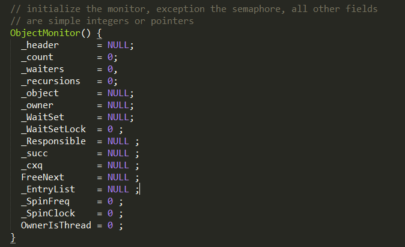
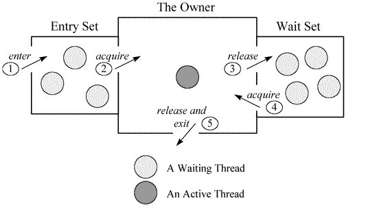
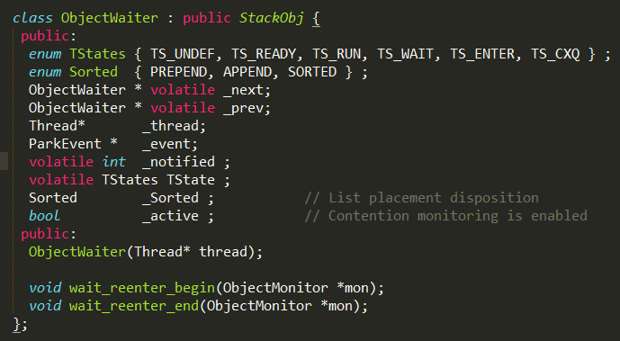
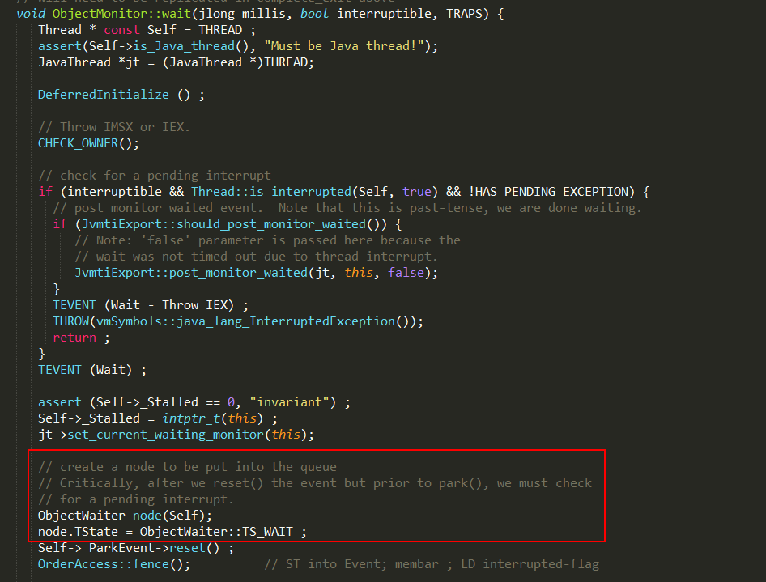
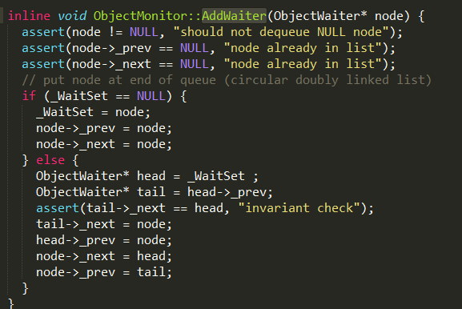
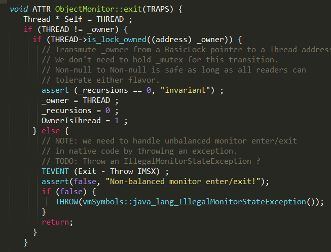
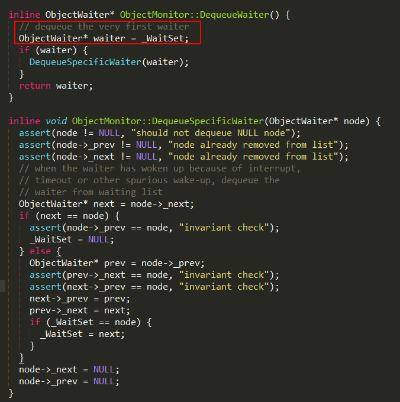

> 本文由 [简悦 SimpRead](http://ksria.com/simpread/) 转码， 原文地址 https://www.jianshu.com/p/f4454164c017

> 简书 [占小狼](https://www.jianshu.com/users/90ab66c248e6/latest_articles)  
> 转载请注明原创出处，谢谢！

最简单的东西，往往包含了最复杂的实现，因为需要为上层的存在提供一个稳定的基础，Object 作为 java 中所有对象的基类，其存在的价值不言而喻，其中 wait 和 notify 方法的实现多线程协作提供了保证。

```
public class WaitNotifyCase {
    public static void main(String[] args) {
        final Object lock = new Object();

        new Thread(new Runnable() {
            @Override
            public void run() {
                System.out.println("thread A is waiting to get lock");
                synchronized (lock) {
                    try {
                        System.out.println("thread A get lock");
                        TimeUnit.SECONDS.sleep(1);
                        System.out.println("thread A do wait method");
                        lock.wait();
                        System.out.println("wait end");
                    } catch (InterruptedException e) {
                        e.printStackTrace();
                    }
                }
            }
        }).start();

        new Thread(new Runnable() {
            @Override
            public void run() {
                System.out.println("thread B is waiting to get lock");
                synchronized (lock) {
                    System.out.println("thread B get lock");
                    try {
                        TimeUnit.SECONDS.sleep(5);
                    } catch (InterruptedException e) {
                        e.printStackTrace();
                    }
                    lock.notify();
                    System.out.println("thread B do notify method");
                }
            }
        }).start();
    }
}


```

##### 执行结果：

> thread A is waiting to get lock  
> thread A get lock  
> thread B is waiting to get lock  
> thread A do wait method  
> thread B get lock  
> thread B do notify method  
> wait end

**前提**：由同一个 lock 对象调用 wait、notify 方法。  
1、当线程 A 执行 wait 方法时，该线程会被挂起；  
2、当线程 B 执行 notify 方法时，会唤醒一个被挂起的线程 A；

lock 对象、线程 A 和线程 B 三者是一种什么关系？根据上面的结论，可以想象一个场景：  
1、lock 对象维护了一个等待队列 list；  
2、线程 A 中执行 lock 的 wait 方法，把线程 A 保存到 list 中；  
3、线程 B 中执行 lock 的 notify 方法，从等待队列中取出线程 A 继续执行；  
当然了，Hotspot 实现不可能这么简单。

##### 上述代码中，存在多个疑问：

1、进入 wait/notify 方法之前，为什么要获取 synchronized 锁？  
2、线程 A 获取了 synchronized 锁，执行 wait 方法并挂起，线程 B 又如何再次获取锁？

##### 为什么要使用 synchronized?

```
static void Sort(int [] array) {
    // synchronize this operation so that some other thread can't
    // manipulate the array while we are sorting it. This assumes that other
    // threads also synchronize their accesses to the array.
    synchronized(array) {
        // now sort elements in array
    }
}


```

synchronized 代码块通过 javap 生成的字节码中包含 ** monitorenter ** 和 ** monitorexit ** 指令。


执行 monitorenter 指令可以获取对象的 monitor，而 lock.wait() 方法通过调用 native 方法 wait(0) 实现，其中接口注释中有这么一句：

> The current thread must own this object's monitor.

表示线程执行 lock.wait() 方法时，必须持有该 lock 对象的 monitor，如果 wait 方法在 synchronized 代码中执行，该线程很显然已经持有了 monitor。

##### 代码执行过程分析

1、在多核环境下，线程 A 和 B 有可能同时执行 monitorenter 指令，并获取 lock 对象关联的 monitor，只有一个线程可以和 monitor 建立关联，假设线程 A 执行加锁成功；  
2、线程 B 竞争加锁失败，进入等待队列进行等待；  
3、线程 A 继续执行，当执行到 wait 方法时，会发生什么？wait 接口注释：

> This method causes the current thread to place itself in the wait set for this object and then to relinquish any and all synchronization claims on this object.

wait 方法会将当前线程放入 wait set，等待被唤醒，并放弃 lock 对象上的所有同步声明，意味着线程 A 释放了锁，线程 B 可以重新执行加锁操作，不过又有一个疑问：在线程 A 的 wait 方法释放锁，到线程 B 获取锁，这期间发生了什么？线程 B 是如何知道线程 A 已经释放了锁？好迷茫....

4、线程 B 执行加锁操作成功，对于 notify 方法，JDK 注释：notify 方法会选择 wait set 中任意一个线程进行唤醒；

> Wakes up a single thread that is waiting on this object's monitor. If any threads are waiting on this object, one of them is chosen to be awakened. The choice is arbitrary and occurs at the discretion of the implementation

notifyAll 方法的注释：notifyAll 方法会唤醒 monitor 的 wait set 中所有线程。

> Wakes up all threads that are waiting on this object's monitor.

5、执行完 notify 方法，并不会立马唤醒等待线程，在 notify 方法后面加一段 sleep 代码就可以看到效果，如果线程 B 执行完 notify 方法之后 sleep 5s，在这段时间内，线程 B 依旧持有 monitor，线程 A 只能继续等待；

**那么 wait set 的线程什么时候会被唤醒？**

> 想要解答这些疑问， 需要分析 jvm 的相关实现，本文以 HotSpot 虚拟机 1.7 版本为例

##### 什么是 monitor？

在 HotSpot 虚拟机中，monitor 采用 ObjectMonitor 实现。



每个线程都有两个 ObjectMonitor 对象列表，分别为 free 和 used 列表，如果当前 free 列表为空，线程将向全局 global list 请求分配 ObjectMonitor。

ObjectMonitor 对象中有两个队列：_WaitSet 和 _EntryList，用来保存 ObjectWaiter 对象列表；_owner 指向获得 ObjectMonitor 对象的线程。  



**_WaitSet ** ：处于 wait 状态的线程，会被加入到 wait set；

**_EntryList**

：处于等待锁 block 状态的线程，会被加入到 entry set；

#### ObjectWaiter



ObjectWaiter 对象是双向链表结构，保存了_thread（当前线程）以及当前的状态 TState 等数据， 每个等待锁的线程都会被封装成 ObjectWaiter 对象。

#### wait 方法实现

`lock.wait()`方法最终通过 ObjectMonitor 的`void wait(jlong millis, bool interruptable, TRAPS);`实现：  
1、将当前线程封装成 ObjectWaiter 对象 node；  



2、通过`ObjectMonitor::AddWaiter`方法将 node 添加到_WaitSet 列表中；  



3、通过`ObjectMonitor::exit`方法释放当前的 ObjectMonitor 对象，这样其它竞争线程就可以获取该 ObjectMonitor 对象。  



4、最终底层的 park 方法会挂起线程；

#### notify 方法实现

`lock.notify()`方法最终通过 ObjectMonitor 的`void notify(TRAPS)`实现：  
1、如果当前_WaitSet 为空，即没有正在等待的线程，则直接返回；  
2、通过`ObjectMonitor::DequeueWaiter`方法，获取_WaitSet 列表中的第一个 ObjectWaiter 节点，实现也很简单。  
**这里需要注意的是，在 jdk 的 notify 方法注释是随机唤醒一个线程，其实是第一个 ObjectWaiter 节点**  



3、根据不同的策略，将取出来的 ObjectWaiter 节点，加入到_EntryList 或则通过

`Atomic::cmpxchg_ptr`

指令进行自旋操作 cxq，具体代码实现有点长，这里就不贴了，有兴趣的同学可以看 objectMonitor::notify 方法；

#### notifyAll 方法实现

`lock.notifyAll()`方法最终通过 ObjectMonitor 的`void notifyAll(TRAPS)`实现：  
通过 for 循环取出_WaitSet 的 ObjectWaiter 节点，并根据不同策略，加入到_EntryList 或则进行自旋操作。

从 JVM 的方法实现中，可以发现：notify 和 notifyAll 并不会释放所占有的 ObjectMonitor 对象，其实真正释放 ObjectMonitor 对象的时间点是在执行 monitorexit 指令，一旦释放 ObjectMonitor 对象了，entry set 中 ObjectWaiter 节点所保存的线程就可以开始竞争 ObjectMonitor 对象进行加锁操作了。

我是占小狼  
坐标魔都，白天是上班族，晚上是知识的分享者  
如果读完觉得有收获的话，欢迎点赞加关注

 我的微信公众号