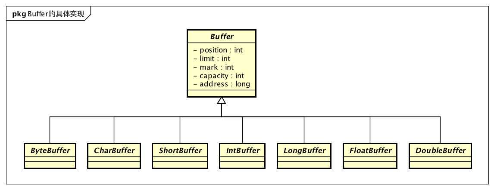

# JDK源码阅读-ByteBuffer

Aug 7, 2018 | [Java](http://imushan.com/categories/Java/)[JDK源码阅读](http://imushan.com/categories/Java/JDK源码阅读/) | 阅读

[0 条评论](http://imushan.com/2018/08/07/java/language/JDK源码阅读-ByteBuffer/#SOHUCS)

文章目录

1. [1. Buffer](http://imushan.com/2018/08/07/java/language/JDK源码阅读-ByteBuffer/#Buffer)
2. [2. ByteBuffer的具体实现](http://imushan.com/2018/08/07/java/language/JDK源码阅读-ByteBuffer/#ByteBuffer的具体实现)
3. [3. 读写Buffer](http://imushan.com/2018/08/07/java/language/JDK源码阅读-ByteBuffer/#读写Buffer)
4. [4. Buffer的模式](http://imushan.com/2018/08/07/java/language/JDK源码阅读-ByteBuffer/#Buffer的模式)
5. [5. 总结](http://imushan.com/2018/08/07/java/language/JDK源码阅读-ByteBuffer/#总结)
6. [6. 参考资料](http://imushan.com/2018/08/07/java/language/JDK源码阅读-ByteBuffer/#参考资料)

Buffer是Java NIO中对于缓冲区的封装。在Java BIO中，所有的读写API，都是直接使用byte数组作为缓冲区的，简单直接。但是在Java NIO中，缓冲区这一概念变得复杂，可能是对应Java堆中的一块内存，也可能是对应本地内存中的一块内存。而byte数组只能用来指定Java堆中的一块内存，所以Java NIO中设计了一个新的缓冲区抽象，涵盖了不同类型缓冲区，这个抽象就是Buffer。


## Buffer

Buffer是Java NIO中对于缓冲区的抽象。是一个用于存储特定基本数据类型的容器。Buffer是特定基本数据类型的线性有限序列。

Java有8中基本类型：byte,short,int,long,float,double,char,boolean，除了boolean类型外，其他的类型都有对应的Buffer具体实现：

[](http://imushan.com/img/java/sourct/buffers.png)

Buffer抽象类定义了所有类型的Buffer都有的属性和操作，属性如下：

- `capacity`：缓冲区的容量，在缓冲区建立后就不能改变
- `limit`：表示第一个不能读写的元素位置，limit不会大于capacity
- `position`：表示下一个要读写的元素位置，position不会大于limit
- `mark`：用于暂存一个元素位置，和书签一样，用于后续操作

所有的Buffer操作都围绕这些属性进行。这些属性满足一个不变式：`0<=mark<=position<=limit<=capacity`。

新建的Buffer这些属性的取值为：

- position=0
- limit=capacity=用户设置的容量
- mark=-1

直接看定义比较抽象，可以看一下示意图，下图是一个容量为10的Buffer：

[](http://imushan.com/img/java/source/buffer-init.png)

## ByteBuffer的具体实现

所有Buffer实现中，最重要的实现是ByteBuffer，因为操作系统中所有的IO操作都是对字节的操作。当我们需要从字节缓冲区中读取别的数据类型才需要使用其他具体类型的Buffer实现。

ByteBuffer也是一个抽象类，具体的实现有HeapByteBuffer和DirectByteBuffer。分别对应Java堆缓冲区与堆外内存缓冲区。Java堆缓冲区本质上就是byte数组，所以实现会比较简单。而堆外内存涉及到JNI代码实现，较为复杂，本次我们以HeapByteBuffer为例来分析Buffer的相关操作，后续专门分析DirectByteBuffer。

ByteBuffer的类图如下：

[](http://imushan.com/img/java/source/bytebuffer-impl.png)

## 读写Buffer

Buffer作为缓冲区，最主要的作用是用于传递数据。Buffer提供了一系列的读取与写入操作。因为不同类型的Buffer读写的类型不同，所以具体的方法定义是定义在Buffer实现类中的。与读写相关的API如下：

```
byte get()
byte get(int index)
ByteBuffer get(byte[] dst, int offset, int length)
ByteBuffer get(byte[] dst)

ByteBuffer put(byte b)
ByteBuffer put(int index, byte b)
ByteBuffer put(ByteBuffer src) 
ByteBuffer put(byte[] src, int offset, int length)
```

Buffer的读写操作可以按照两种维度分类：

- 单个/批量：
  - 单个：一次读写一个字节
  - 批量：一次读写多个字节
- 相对/绝对：
  - 相对：从Buffer维护的position位置开始读写，读写时position会随之变化
  - 绝对：直接指定读写的位置。指定index的API就是绝对API

接着我们来看看这些函数在HeapByteBuffer中是如何实现的：

```
final byte[] hb;    // 作为缓冲区的byte数组              
final int offset;   // 指定缓冲区的起始位置

public byte get() {
    // get操作就是直接从数组中获取数据
    return hb[ix(nextGetIndex())];
}

public byte get(int i) {
    // 从指定位置获取数据，是绝对操作，只需检查下标是否合法
    return hb[ix(checkIndex(i))];
}

// 获取下一个要读取的元素的下标
// position的定义就是下一个要读写的元素位置，
// 所以这里是返回position的当前值，然后再对position进行加一操作
final int nextGetIndex() {                          // package-private
    if (position >= limit)
        throw new BufferUnderflowException();
    return position++;
}

// 因为支持偏移量，所以算出来的下标还需要加上偏移量
protected int ix(int i) {
    return i + offset;
}
```

单字节put与get逻辑一样。看一下批量get是如何实现的：

```
public ByteBuffer get(byte[] dst) {
    return get(dst, 0, dst.length);
}

public ByteBuffer get(byte[] dst, int offset, int length) {
    // 检查参数是否越界
    checkBounds(offset, length, dst.length);
    // 检查要获取的长度是否大于Buffer中剩余的数据长度
    if (length > remaining())
        throw new BufferUnderflowException();
    // 调用System.arraycopy进行数组内容拷贝
    System.arraycopy(hb, ix(position()), dst, offset, length);
    // 更新position
    position(position() + length);
    return this;
}
```

可以看出，HeapByteBuffer是封装了对byte数组的简单操作。对缓冲区的写入和读取本质上是对数组的写入和读取。使用HeapByteBuffer的好处是我们不用做各种参数校验，也不需要另外维护数组当前读写位置的变量了。

同时我们可以看到，Buffer中对于position的操作没有使用锁进行保护，所以Buffer不是线程安全的。

## Buffer的模式

虽然JDK的Java Doc并没有提到Buffer有模式，但是Buffer提供了flip等操作用于切换Buffer的工作模式。在正确使用Buffer时，一定要注意Buffer的当前工作模式。否则会导致数据读写不符合你的预期。

Buffer有两种工作模式，一种是接收数据模式，一种是输出数据模式。

新建的Buffer处于接收数据的模式，可以向Buffer放入数据，放入一个对应基本类型的数据后，position加一，如果position已经等于limit了还进行put操作，则会抛出BufferOverflowException异常。

这种模式的Buffer可以用于Channel的read操作缓冲区，或者是用于相对put操作。

比如向一个接受数据模式的Buffer put5个byte后的示例图：

[](http://imushan.com/img/java/source/bytebuffer-flip.png)

因为Buffer的设计是读写的位置变量都使用position这个变量，所以如果要从Buffer中读取数据，要切换Buffer到输出数据模式。Buffer提供了flip方法用于这种切换。

```
public final Buffer flip() {
    limit = position;
    position = 0;
    mark = -1;
    return this;
}
```

切换后的效果图：

[](http://imushan.com/img/java/source/bytebuffer-afterflip.png)

然后就可以从Buffer中读取数据了。每次读取一个元素，position就会加一，如果position已经等于limit还进行读取，会抛出BufferUnderflowException异常。

可以看出Buffer本身没有一个用于存储模式的变量，模式的切换只是position和limit的变换而已。

flip方法只会把Buffer从接收模式切换到输出模式，如果要从输出模式切换到接收模式，可以使用`compact`或者`clear`方法，如果数据已经读取完毕或者数据不要了，使用`clear`方法，如果已读的数据需要保留，同时需要切换到接收数据模式，使用`compat`方法。

```
// 压缩Buffer，去掉已经被读取的数据
// 压缩后的Buffer处于接收数据模式
public ByteBuffer compact() {
    System.arraycopy(hb, ix(position()), hb, ix(0), remaining());
    position(remaining());
    limit(capacity());
    discardMark();
    return this;
}

// 清空Buffer，去掉所有数据(没有做清理工作，是指修改位置变量)
// 清空后的Buffer处于接收数据模式
public final Buffer clear() {
    position = 0;
    limit = capacity;
    mark = -1;
    return this;
}
```

## 总结

- Buffer是Java NIO对缓冲区的抽象
- 除了boolean类型，其他的基本类型都有对应的Buffer实现
- 最常用的Buffer实现是ByteBuffer，具体的实现有HeapByteBuffer和DirectByteBuffer，分别对应Java堆缓冲区与对外内存缓冲区
- HeapByteBuffer是对byte数组的封装，方便使用
- Buffer不是线程安全的
- Buffer有两种模式一种是接收数据模式，一种是输出数据模式。新建的Buffer处于接收数据模式，使用`flip`方法可以切换Buffer到输出数据模式。使用`compact`或者`clear`方法可以切换到接收数据模式。