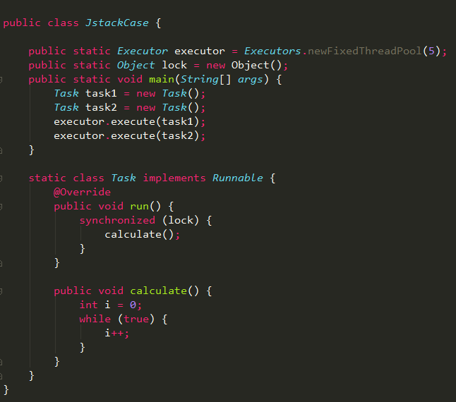
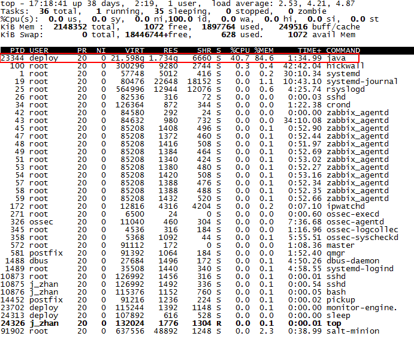
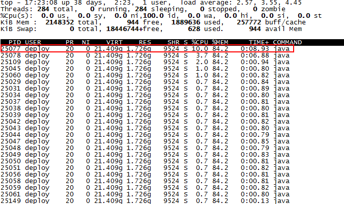
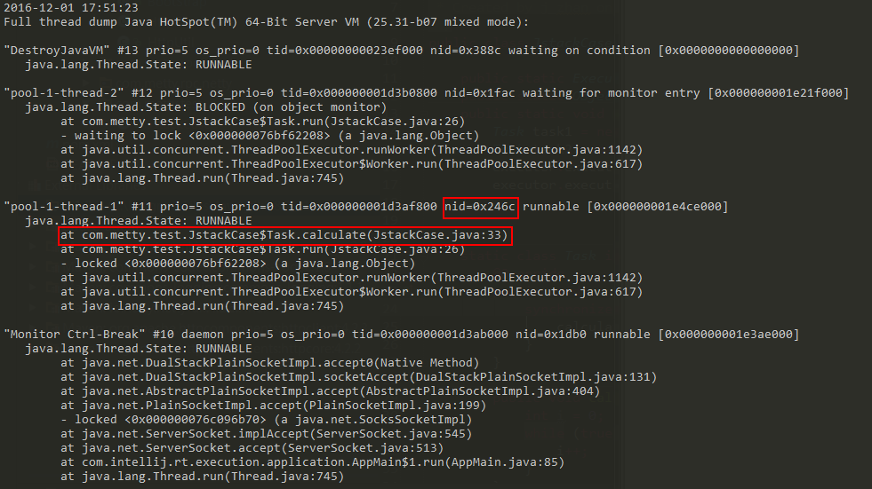
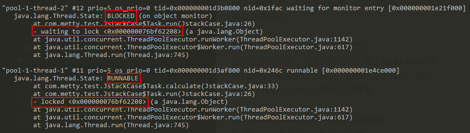
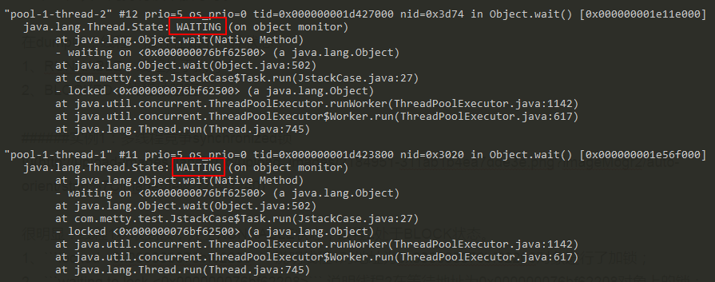

> 本文由 [简悦 SimpRead](http://ksria.com/simpread/) 转码， 原文地址 https://www.jianshu.com/p/6690f7e92f27

> 转载请注明原创出处，谢谢！  
> 简书占小狼  
> [http://www.jianshu.com/users/90ab66c248e6/latest_articles](https://www.jianshu.com/users/90ab66c248e6/latest_articles)

### 背景

记得前段时间，同事说他们测试环境的服务器 cpu 使用率一直处于 100%，本地又没有什么接口调用，为什么会这样？cpu 使用率居高不下，自然是有某些线程一直占用着 cpu 资源，那又如何查看占用 cpu 较高的线程？



当然一个正常的程序员不会写出上述代码，这里只是为了让一个线程占用较高的 cpu 资源。

### top 命令

在 linux 环境下，可以通过`top`命令查看各个进程的 cpu 使用情况，默认按 cpu 使用率排序



1、上图中可以看出 pid 为 23344 的 java 进程占用了较多的 cpu 资源；  
2、通过`top -Hp 23344`可以查看该进程下各个线程的 cpu 使用情况；



上图中可以看出 pid 为 25077 的线程占了较多的 cpu 资源，利用 jstack 命令可以继续查看该线程当前的堆栈状态。

### jstack 命令

通过 top 命令定位到 cpu 占用率较高的线程之后，继续使用`jstack pid`命令查看当前 java 进程的堆栈状态



jstack 命令生成的 thread dump 信息包含了 JVM 中所有存活的线程，为了分析指定线程，必须找出对应线程的调用栈，**应该如何找？**

在 top 命令中，已经获取到了占用 cpu 资源较高的线程 pid，将该 pid 转成 16 进制的值，在 thread dump 中每个线程都有一个 nid，找到对应的 nid 即可；隔段时间再执行一次 stack 命令获取 thread dump，区分两份 dump 是否有差别，在 nid=0x246c 的线程调用栈中，发现该线程一直在执行 JstackCase 类第 33 行的 calculate 方法，得到这个信息，就可以检查对应的代码是否有问题。

### 通过 thread dump 分析线程状态

除了上述的分析，大多数情况下会基于 thead dump 分析当前各个线程的运行情况，如是否存在死锁、是否存在一个线程长时间持有锁不放等等。

在 dump 中，线程一般存在如下几种状态：  
1、RUNNABLE，线程处于执行中  
2、BLOCKED，线程被阻塞  
3、WAITING，线程正在等待

###### 实例 1：多线程竞争 synchronized 锁



很明显：线程 1 获取到锁，处于 RUNNABLE 状态，线程 2 处于 BLOCK 状态  
1、`locked <0x000000076bf62208>`说明线程 1 对地址为 0x000000076bf62208 对象进行了加锁；  
2、`waiting to lock <0x000000076bf62208>` 说明线程 2 在等待地址为 0x000000076bf62208 对象上的锁；  
3、`waiting for monitor entry [0x000000001e21f000]`说明线程 1 是通过 synchronized 关键字进入了监视器的临界区，并处于 "Entry Set" 队列，等待 monitor，具体实现可以参考[深入分析 synchronized 的 JVM 实现](https://www.jianshu.com/p/c5058b6fe8e5)；

###### 实例 2：通过 wait 挂起线程

```
static class Task implements Runnable {
    @Override
    public void run() {
        synchronized (lock) {
            try {
                lock.wait();
                //TimeUnit.SECONDS.sleep(100000);
            } catch (InterruptedException e) {
                e.printStackTrace();
            }
        }
    }
}


```

###### dump 结果



线程 1 和 2 都处于 WAITING 状态  
1、线程 1 和 2 都是先`locked <0x000000076bf62500>`，再`waiting on <0x000000076bf62500>`，之所以先锁再等同一个对象，是因为 wait 方法需要先通过 synchronized 获得该地址对象的 monitor；  
2、`waiting on <0x000000076bf62500>`说明线程执行了 wait 方法之后，释放了 monitor，进入到 "Wait Set" 队列，等待其它线程执行地址为 0x000000076bf62500 对象的 notify 方法，并唤醒自己，具体实现可以参考[深入分析 Object.wait/notify 实现机制](https://www.jianshu.com/p/f4454164c017)；

我是占小狼  
坐标魔都，白天上班族，晚上是知识的分享者  
如果读完觉得有收获的话，欢迎点赞加关注

