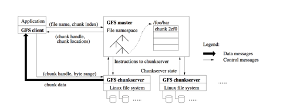

# Google文件系统--GFS详解

2018.08.03 22:37:28字数 3255阅读 1243

  Google File System(简称GFS)是适用于大规模且可扩展的分布式文件系统，可以部署在廉价的商务服务器上，在保证系统可靠性和可用 性的同时，大大降低了系统的成本。GFS的设计目标是高性能、高可靠、高可用性。
  GFS把机器故障视为正常现象，可以很好地处理系统故障。GFS系统通常会部署在上百台甚至上千台廉价服务器上，并会有相当多台廉价服务器上部署GFS Client来访问GFS服务，所以应用故障、操作系统bug、连接故障、网络故障、甚至机器供电故障都是经常发生的故障。GFS系统可以支持系统监控、故障检测、故障容忍和自动恢复，提供了非常高的可靠性。其次，GFS系统中的文件一般都是大文件，且文件操作大部分场景下都是append而不是overwrite。一旦文件写入完成后，大部分操作都是读文件且是顺序读。
  GFS提供了非标准（比如POSIX）的文件系统接口，支持 create、delete、open、close、read以及write。另外GFS支持snapshot和record append操作。snapshot可以以很低的代价创建文件或者目录树的拷贝，record append可以支持多个client并发地向同一个文件append data，同时还能保证每个client的append操作的原子性。

# 一、GFS架构

​	<u>GFS系统包括master、多个chunkserver以及多个client</u>。文件被切分为固定大小的小文件（chunk）。每个chunk创建时，master会分配一个64bit的全局唯一且不可修改的chunk handler来标志这个chunk。chunkserver负责将chunk存储在本地磁盘的Linux文件中，并通过chunk hander和byte range来读写chunk文件。为了提高可靠性，每个chunk都是多副本存储在多个chunkserver上，默认情况下是<u>三副本</u>。用户可以为不同名字空间下的文件配置不同的副本数。

  master记录了文件系统的metadata，包括名字空间、权限控制信息、文件到chunk的mapping以及chunk的分布。master也负责chunk的lease管理、无用chunk的垃圾回收、chunk迁移等。master定期与chunkserver通信，向chunkserver发送指令并搜集chunkserver的状态。GFS client通过GFS的API与GFS系统通信（读写数据）。client向master请求获取metadata，真正的读写数据是直接与chunkserver交互。client和chunkserver都不cache文件数据。因为大部分应用都是基于API来streaming read 大文件且系统的文件数据太多，所以client缓存文件数据没有意义。chunkserver所在机器的Linux的buffer cache以及cache了频繁访问的数据，chunkserver也是没有去cache文件数据的。

# 二、Single Master

  <u>单点master大大简化了系统设计，因为master知晓所有的meta信息</u>，所以可以执行更加复杂的chunk位置分配和副本策略。但是，在读写数据时必须降低master的参与，以避免单点的master称为系统瓶颈。client不会通过master来读写文件数据，但是client会向master发送查询chunk位置分布的请求，然后client端缓存chunk的分布信息，然后直接向chunkserver读写数据。大致的读过程如下：
1、client根据文件名、byte offset以及chunk size计算出要读取的文件的chunk index
2、client通过文件名、chunk index向master查询chunk的分布
3、master回复chunk handler以及副本分布
4、client 缓存chunk的meta信息，key由文件名和chunk index组成
5、client从chunk的分布信息中查找距离自己最新的chunkserver，并发送查询请求。查询请求中包括chunk hander以及byte range。后续对相同chunk的查询不需要再次向master查询meta信息，因为client已经缓存了meta信息。

# 三、chunk size

  chunk size是GFS系统的关键参数，通常设置为64MB，远大于文件系统的block大小。每个chunk的副本都chunkserver所在机器上以Linux file存储。之所为将chunk size定为64MB，主要有以下考虑：
1、可以减少client访问master查询meta信息的次数，降低master的访问压力。因为chunk size设计比较大，顺序访问一个超大文件时因为chunk数较少且client缓存了chunk meta信息，所以访问master的次数就会降低。甚至，client可以缓存所有文件的chunk的meta信息，就算是随机读文件，master也不会成为系统性能瓶颈。
2、可以减少网络开销，保持client与chunkserver的TCP连接，可以执行更多的chunk操作。
3、可以减少master上需要在内存中记录的meta data数据量，降低master的内存占用。
   size大的缺点是：小文件包含很少的chunk，甚至只有一个。这样的话，在多个client高并发查询该小文件时对应的chunk会成为热点。实际上，这种情况在GFS系统中很少发生，因为大部分client的操作都是顺序读大文件。但是，考虑以下场景，我们部署一个服务的二进制文件到GFS系统中，然后数百台的服务器同时查询二进制文件并启动服务，此时该二进制文件副本所在的chunkserver立马就会成为查询瓶颈。当然，可以通过增加副本数和分散服务器的查询时间来解决这种场景下的问题。

# 四、Metadata

  master主要存储三种类型的metadata：file和chunk的名字空间，file到chunk的mapping信息以及chunk的副本分布。所有的metadata都在master的内存中存储。前两种meta信息可以持久化存储，将操作日志存储在master的本地磁盘以及将备份日志存储在远端机器上。master不持久化存储chunk的副本分布信息，而是通过与chunkserver交互来获取chunkserver上的chunk信息。

### 4.1 in-memory data structure

  meta信息在内存中，所有master的操作很快。另外，master可以高效地定期在后台scan所有的meta数据，来执行垃圾回收、副本修复、均衡等。metadata都记录在内存中，所以GFS系统会比较关注chunk的数量以及master的可用内存量。但是在实际场景下，这不是问题。每个64MB的chunk的metadata小于64字节，大部分的chunk都是满负荷存储的，除了文件最后一个chunk的空间是没有完全被占用。由于文件的名字空间采用了前缀压缩的方式存储，单个文件的meta信息也是小于64字节。如果需要扩大系统规模的话，可以很简单地通过增大master的内存就可以了。相比于系统的高可靠、高性能和简洁性，增加内存是很最小的代价了。

### 4.2 chunk 分布

  并没有持久化存储chunk的副本分布信息，而是在master启动时向chunkserver查询其chunk信息，然后通过heartbeat来持续更新master的副本分布信息，以与chunkserver数据保持一致。GFS起初设计时尝试将chunk的分布信息持久化存储在master端，随后发现通过master启动时拉取然后通过heartbeat同步chunk信息的方式更简单。因为，当chunkserver加入、退出、名字改变、重启等行为经常发生，这会导致维护master的chunk meta数据的正确性是非常困难的。从另一个角度考虑就是，只有chunkserver汇报的chunk信息才是集群中最真实的chunk分布，因为master不需要自己维护一个chunk分布状态，只需要以chunkserver的状态汇报为准即可。

### 4.3 操作日志

  日志记录了GFS集群数据更改的历史记录。操作日志对GFS来说是至关重要的，因为它不仅是metadata的持久化记录，还记录了并发操作的时序。因为操作日志很重要，所以必须可靠地存储。在metadata的change没有持久化之前，client是不能看到的数据的更改。当client修改数据时，操作记录需要保存在多个远端机器上，而且只有当操作记录持久化存储在本地和远端以后，才会回复client数据更改成功。
  可以通过回放操作日志来恢复文件系统。为了减少系统启动时replay的时间，必须缩减回放的日志量。master可以定期存储metadata的checkpoint，master重启时可以从checkpoint加载metadata，然后回放checkpoint之后的少量日志即可。

# 五、租约和数据更改

​	数据更改主要指chunk的write或者append操作。数据的修改会在chunk的所有副本上执行，GFS使用lease机制来保证chunk副本上修改操作的执行顺序。master将lease颁发给chunk的一个副本，称之为primary，primary然后选择chunk上其他副本的修改执行顺序。大概的执行逻辑如下：

1、client向master查询chunk的primary所在的chunkserver以及其他副本的分布，如果没有primary的花，master会选择一个作为该chunk的primary
2、master回复client primary和其他副本的分布信息。client会cache返回的metadata
3、client将数据发送所有的副本。client可以以任意顺序执行。每个chunkserser都会在内存的LRUbuffer中记录数据。
4、当所有的副本都返回已经接收数据成功后，client会向primary发送一个写请求。primary会为每一个数据更改的请求附加一个序列号，数据更改是按照序列号的顺序执行的。
5、primary将数据更改同步到其他副本中，副本也是按照序列号执行数据更改操作。
6、primary接收到其他副本回复的数据操作完成
7、primary返回client结果。期间发生的所有错误都会报给client。

# 六、副本分布

   GFS集群一般都会有上百台的chunkserver，分布在多个机架上。chunkserver也会接收来自本机架或者其他机架的上百个client的查询请求。不同机架的服务器通信可能会途径一个或者多个交换机转发。chunk的副本分布选择策略主要目的是尽量提高数据的可靠性和可用性，同时最大化地充分利用网络带宽。所以，仅仅将副本跨机器部署是不够的。GFS将副本是跨机架部署的，这样可以保证在一个机架被损坏或者下线时，chunk至少会有副本是可用的。
   chunk的副本在下列情况下会被创建：创建chunk、副本修复、rebalance。当master创建chunk时，会选择存储该chunk副本的chunkserver。主要考虑以下几点：
1、新副本所在chunkserver的磁盘利用率低于系统的平均水平
2、限制每个chunkserver最近一段时间创建chunk的数量
3、每个chunk的所有副本不能都在一个机架
   chunk的副本数少于一定数量是，master会复制一个副本。这可能发生在chunkserver宕机或者chunkserver汇报自己的副本损坏或者chunkserver所在机器的磁盘损坏等等。每个chunk 复制任务都有优先级，按照优先级由高到低子master中排队等待执行。master还会定期扫描当前副本的分布情况，一旦发现磁盘使用量或者机器负载不均衡，就会发起负载均衡操作。无论是chunk创建、chunk复制还是负载均衡，选择chunk副本的位置的策略都是相同的，并且需要限制副本修复和均衡的速度，否则会影响系统的正常读写服务。

  Google的成功表明单master的设计师可行的。这不仅简化了系统，而且能够较好地实现一致性，给予性能考虑，GFS提出了“记录至少原子性追加一次”的一致性模型。通过租约的方式将每个chunk的修改授权到chunkserver从而减少了master的负载，通过流水线的方式复制多个副本以减少延时。master维护的元数据很多，需要设计高效的数据结构，且要保证占用内存小和支持快照操作。支持COW的B树可以满足需求，但是实现确实相当复杂。

# 七、与zookeeper事务区别