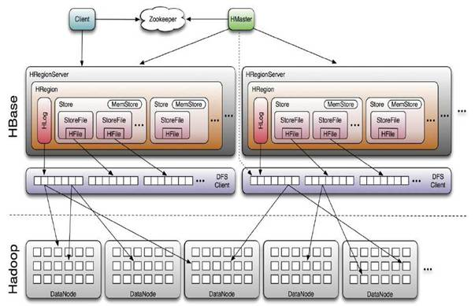

## 一、mongo

我们知道，分片集群由三个组件构成：

【分片】：官方建议采用副本集，提供数据冗余和高可用，主要存储业务数据。

【配置服务器】：官方建议采用副本集，存储集群的元数据。很重要，能够影响集群的使用。

【mongos instances】：是应用程序的接口，通过它，应用程序与整个集群是透明的，故一般每个应用服务器对应一个实例，可以跟应用部署到一台服务器上。它主要读取或缓存配置服务器中元数据，提供查询路由到每个分片的功能。

## 二、hbase

## 三、kafka

## 四、redis

## 五、zookeeper

## 六、ElasticSearch

## 七、Cassandra