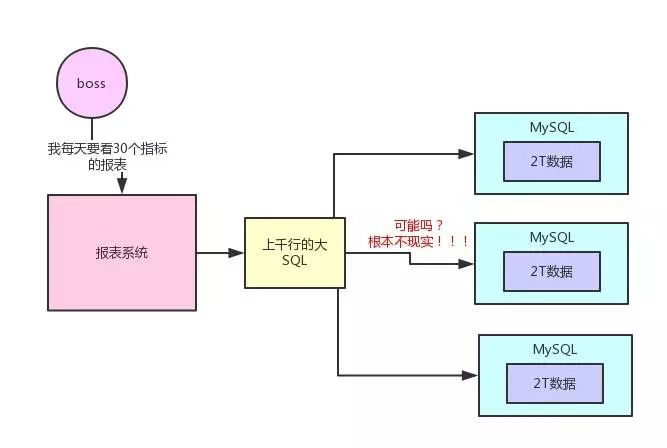
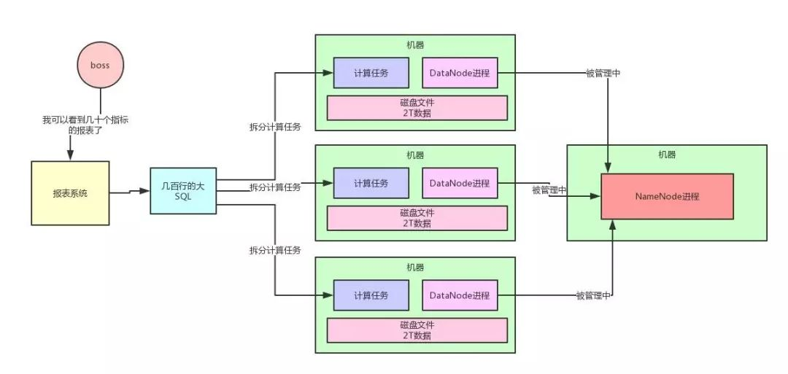
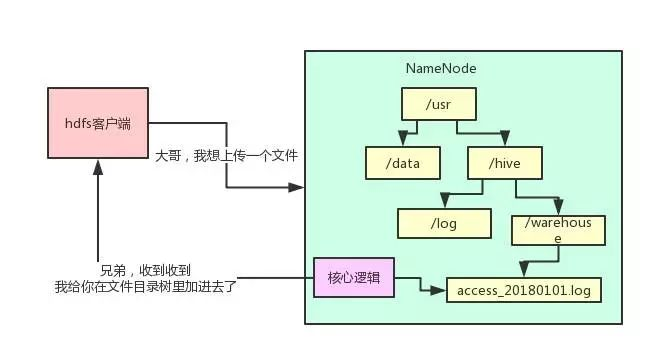
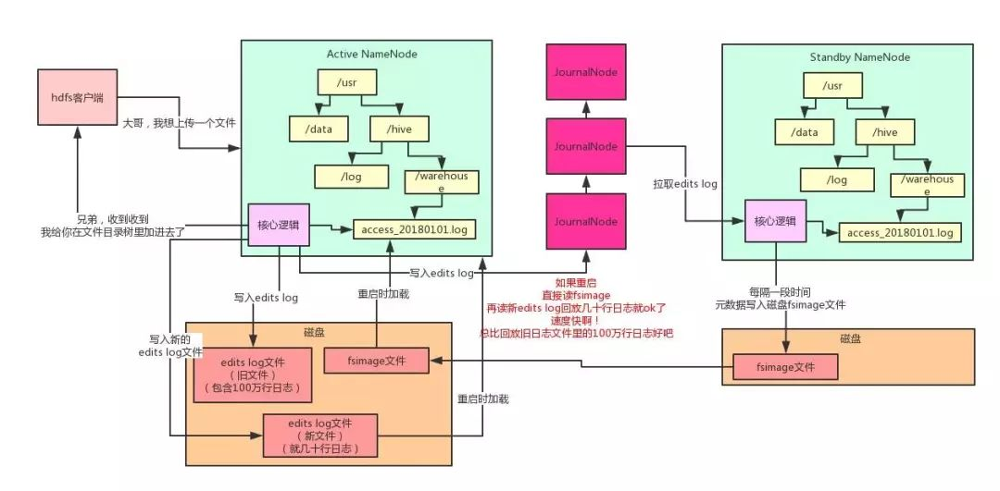
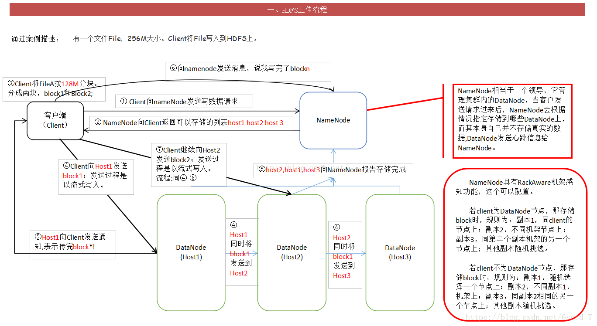
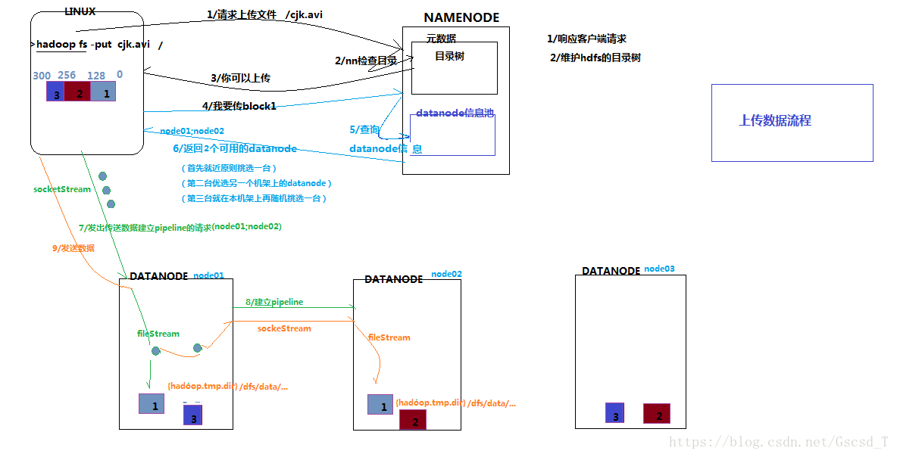

## 前言

Hadoop 是目前大数据领域最主流的一套技术体系，包含了多种技术，例如 HDFS（分布式文件系统），YARN（分布式资源调度系统），MapReduce（分布式计算系统）等等。

有些朋友可能听说过 Hadoop，但是却不太清楚它到底是个什么东西，这篇文章就用大白话给各位阐述一下。

假如你现在公司里的数据都是放在 MySQL 里的，那么就全部放在一台数据库服务器上，我们就假设这台服务器的磁盘空间有 2T 吧，大家先看下面这张图。

现在问题来了，你不停的往这台服务器的 MySQL 里放数据，结果数据量越来越大了，超过了 2T 的大小了，现在咋办？

你说，我可以搞多台 MySQL 数据库服务器，分库分表啊！每台服务器放一部分数据不就得了。如上图所示！

好，没问题，那咱们搞 3 台数据库服务器，3 个 MySQL 实例，然后每台服务器都可以 2T 的数据。

现在我问你一个问题，所谓的大数据是在干什么？我们来说一下大数据最初级的一个使用场景。

假设你有一个电商网站，要把这个电商网站里所有的用户在页面和 App 上的点击、购买、浏览的行为日志都存放起来分析。

你现在把这些数据全都放在了 3 台 MySQL 服务器上，数据量很大，但还是勉强可以放的下。

某天早上，你的 Boss 来了。要看一张报表，比如要看每天网站的 X 指标、Y 指标、Z 指标，等等，二三十个数据指标。

好了，兄弟，现在你尝试去从那些点击、购买、浏览的日志里，通过写一个 SQL 来分析出那二三十个指标试试看？

我跟你打赌，你绝对会写出来一个几百行起步，甚至上千行的超级复杂大 SQL。这个 SQL，你觉得他能运行在分库分表后的 3 台 MySQL 服务器上么？

如果你觉得可以的话，那你一定是不太了解 MySQL 分库分表后有多坑，几百行的大 SQL 跨库 Join，各种复杂的计算，根本不现实。

所以说，大数据的存储和计算压根儿不是靠 MySQL 来搞的，因此 Hadoop、Spark 等大数据技术体系才应运而生。

本质上，Hadoop、Spark 等大数据技术，其实就是一系列的分布式系统。比如 Hadoop 中的 HDFS，就是大数据技术体系中的核心基石，负责分布式存储数据，这是啥意思？别急，继续往下看。

HDFS 全称是 Hadoop Distributed File System，是 Hadoop 的分布式文件系统。

它由很多机器组成，`每台机器上运行一个 DataNode 进程`，负责管理一部分数据。

然后有一台机器上运行了 NameNode 进程，NameNode 大致可以认为是负责管理整个 HDFS 集群的这么一个进程，它里面存储了 HDFS 集群的所有元数据。

然后有很多台机器，每台机器存储一部分数据！好，HDFS 现在可以很好的存储和管理大量的数据了。

这时候你肯定会有疑问：MySQL 服务器不也是这样的吗？你要是这样想，那就大错特错了。

这个事情不是你想的那么简单的，HDFS 天然就是分布式的技术，所以你上传大量数据，存储数据，管理数据，天然就可以用 HDFS 来做。

如果你硬要基于 MySQL 分库分表这个事儿，会痛苦很多倍，因为 MySQL 并不是设计为分布式系统架构的，它在分布式数据存储这块缺乏很多数据保障的机制。

好，你现在用 HDFS 分布式存储了数据，接着不就是要分布式来计算这些数据了吗？

对于分布式计算：

- 很多公司用 Hive 写几百行的大 SQL（底层基于 MapReduce）。
- 也有很多公司开始慢慢的用 Spark 写几百行的大 SQL（底层是 Spark Core 引擎）。

总之就是写一个大 SQL，然后拆分为很多的计算任务，放到各个机器上去，每个计算任务就负责计算一小部分数据，这就是所谓的分布式计算。

这个，绝对比你针对分库分表的 MySQL 来跑几百行大 SQL 要靠谱的多。

对于上述所说的分布式存储与分布式计算，老规矩，同样给大家来一张图，大伙儿跟着图来仔细捋一下整个过程。

## HDFS 的 NameNode 架构原理

好了，前奏铺垫完之后，进入正题。本文主要就是讨论一下 HDFS 集群中的 NameNode 的核心架构原理。

NameNode 有一个很核心的功能：管理整个 HDFS 集群的元数据，比如说文件目录树、权限的设置、副本数的设置，等等。

下面就用最典型的文件目录树的维护，来给大家举例说明，我们看看下面的图。现在有一个客户端系统要上传一个 1TB 的大文件到 HDFS 集群里。

此时它会先跟 NameNode 通信，说：大哥，我想创建一个新的文件，它的名字叫“/usr/hive/warehouse/access_20180101.log”，大小是 1TB，你看行不？

然后 NameNode 就会在自己内存的文件目录树里，在指定的目录下搞一个新的文件对象，名字就是“access_20180101.log”。

这个文件目录树不就是 HDFS 非常核心的一块元数据，维护了 HDFS 这个分布式文件系统中，有哪些目录，有哪些文件，对不对？

但是有个问题，这个文件目录树是在 NameNode 的内存里的啊！这可坑爹了，你把重要的元数据都放在内存里，万一 NameNode 不小心宕机了可咋整？元数据不就全部丢失了？

可你要是每次都频繁的修改磁盘文件里的元数据，性能肯定是极低的啊！毕竟这是大量的磁盘随机读写！

没关系，我们来看看 HDFS 优雅的解决方案。每次内存里改完了，写一条 `edits log`，元数据修改的操作日志存到磁盘文件里，不修改磁盘文件内容，就是顺序追加，这个性能就高多了。

每次 NameNode 重启的时候，把 edits log 里的操作日志读到内存里回放一下，不就可以恢复元数据了？

大家顺着上面的文字，把整个过程，用下面这张图跟着走一遍：

但是问题又来了，那 edits log 如果越来越大的话，岂不是每次重启都会很慢？因为要读取大量的 edits log 回放恢复元数据！

所以 HDFS 说，我可以这样子啊，我引入一个新的磁盘文件叫做 fsimage，然后呢，再引入一个 `JournalNodes` 集群，以及一个 `Standby NameNode`（备节点）。

每次 Active NameNode（主节点）修改一次元数据都会生成一条 edits log，除了写入本地磁盘文件，还会写入 JournalNodes 集群。

然后 Standby NameNode 就可以从 JournalNodes 集群拉取 edits log，应用到自己内存的文件目录树里，跟 Active NameNode 保持一致。

然后每隔一段时间，Standby NameNode 都把自己内存里的文件目录树写一份到磁盘上的 fsimage，这可不是日志，这是完整的一份元数据。这个操作就是所谓的 `checkpoint` 检查点操作。

然后把这个 fsimage 上传到 Active NameNode，接着清空掉 Active NameNode 的旧的 edits log 文件，这里可能都有 100 万行修改日志了！

然后 Active NameNode 继续接收修改元数据的请求，再写入 edits log，写了一小会儿，这里可能就几十行修改日志而已！

如果说此时，Active NameNode 重启了，Bingo！没关系，只要把 Standby NameNode 传过来的 `fsimage` 直接读到内存里，这个 fsimage 直接就是元数据，不需要做任何额外操作，纯读取，效率很高！

然后把新的 edits log 里少量的几十行的修改日志回放到内存里就 OK 了！

这个过程的启动速度就快的多了！因为不需要回放大量上百万行的 edits log 来恢复元数据了！如下图所示。

此外，大家看看上面这张图，现在咱们有俩 NameNode：

- 一个是主节点对外提供服务接收请求。
- 另外一个纯就是接收和同步主节点的 edits log 以及执行`定期 checkpoint` 的备节点。

大家有没有发现！他们俩内存里的元数据几乎是一模一样的啊！所以呢，如果 Active NameNode 挂了，是不是可以立马切换成 Standby NameNode 对外提供服务？

这不就是所谓的 NameNode 主备高可用故障转移机制么！接下来大家再想想，HDFS 客户端在 NameNode 内存里的文件目录树，新加了一个文件。

但是这个时候，人家要把数据上传到多台 DataNode 机器上去啊，这可是一个 1TB 的大文件！咋传呢？

很简单，把 1TB 的大文件拆成 N 个 block，`每个 block 是 128MB`。1TB = 1024GB = 1048576MB，一个 block 是 128MB，那么就是对应着 8192 个 block。

这些 block 会分布在不同的机器上管理着，比如说一共有 100 台机器组成的集群，那么每台机器上放 80 个左右的 block 就 OK 了。

但是问题又来了，那如果这个时候 1 台机器宕机了，不就导致 80 个 block 丢失了？

也就是说上传上去的 1TB 的大文件，会丢失一小部分数据啊。没关系！HDFS 都考虑好了！

它会默认给每个 block 搞 3 个副本，一模一样的副本，分放在不同的机器上，如果一台机器宕机了，同一个 block 还有另外两个副本在其他机器上呢！

大伙儿看看下面这张图。每个 block 都在不同的机器上有 3 个副本，任何一台机器宕机都没事！还可以从其他的机器上拿到那个 block。

这下子，你往 HDFS 上传一个 1TB 的大文件，可以高枕无忧了吧！

OK，上面就是大白话加上一系列手绘图，给大家先聊聊小白都能听懂的 Hadoop 的基本架构原理。

## 大规模集群下 Hadoop NameNode 如何承载每秒上千次的高并发访问

上面我们已经初步给大家解释了 Hadoop HDFS 的整体架构原理，相信大家都有了一定的认识和了解。

下面我们来看看，如果大量客户端对 NameNode 发起高并发（比如每秒上千次）访问来修改元数据，此时 NameNode 该如何抗住？

### 问题源起

我们先来分析一下，高并发请求 NameNode 会遇到什么样的问题。

大家现在都知道了，每次请求 NameNode 修改一条元数据（比如说申请上传一个文件，那么就需要在内存目录树中加入一个文件），都要写一条 edits log。

包括如下两个步骤：

- **写入本地磁盘。**
- **通过网络传输给 JournalNodes 集群。**

但是如果对 Java 有一定了解的同学都该知道多线程并发安全问题吧？

NameNode 在写 edits log 时的第一条原则：必须保证每条 edits log 都有一个全局顺序递增的 **transactionId**（简称为 txid），这样才可以标识出来一条一条的 edits log 的先后顺序。

那么如果要保证每条 edits log 的 txid 都是递增的，就必须得加锁。

每个线程修改了元数据，要写一条 edits log 的时候，都必须按顺序排队获取锁后，才能生成一个递增的 txid，代表这次要写的 edits log 的序号。

好了，那么问题来了，大家看看下面的图。如果每次都是在一个加锁的代码块里，生成 txid，然后写磁盘文件 edits log，网络请求写入 JournalNodes 一条 edits log，会咋样？

不用说，这个绝对完蛋了！NameNode 本身用多线程接收多个客户端发送过来的并发的请求，结果多个线程居然修改完内存中的元数据之后，排着队写 edits log！

而且你要知道，写本地磁盘 + 网络传输给 JournalNodes，都是很耗时的啊！性能两大杀手：磁盘写 + 网络写！

如果 HDFS 的架构真要是这么设计的话，基本上 NameNode 能承载的每秒的并发数量就很少了，可能就每秒处理几十个并发请求处理撑死了！

### **HDFS** 优雅的解决方案

所以说，针对这个问题，人家 HDFS 是做了不少的优化的！

首先大家想一下，既然咱们不希望每个线程写 edits log 的时候，串行化排队生成 txid + 写磁盘 + 写 JournalNode，那么是不是可以搞一个内存缓冲？

也就是说，多个线程可以快速的获取锁，生成 txid，然后快速的将 edits log 写入内存缓冲。

接着就快速的释放锁，让下一个线程继续获取锁后，生成 id + 写 edits log 进入内存缓冲。

然后接下来有一个线程可以将内存中的 edits log 刷入磁盘，但是在这个过程中，还是继续允许其他线程将 edits log 写入内存缓冲中。

但是这里又有一个问题了，如果针对同一块内存缓冲，同时有人写入，还同时有人读取后写磁盘，那也有问题，因为不能并发读写一块共享内存数据！

所以 HDFS 在这里采取了 double-buffer 双缓冲机制来处理！将一块内存缓冲分成两个部分：

- **其中一个部分可以写入。**
- **另外一个部分用于读取后写入磁盘和 JournalNodes。**

大家可能感觉文字叙述不太直观，老规矩，咱们来一张图，按顺序给大家阐述一下。

#### **①分段加锁机制 + 内存双缓冲机制**

首先各个线程依次第一次获取锁，生成顺序递增的 txid，然后将 edits log 写入内存双缓冲的区域 1，接着就立马第一次释放锁了。

趁着这个空隙，后面的线程就可以再次立马第一次获取锁，然后立即写自己的 edits log 到内存缓冲。

写内存那么快，可能才耗时几十微妙，接着就立马第一次释放锁了。所以这个并发优化绝对是有效果的，大家有没有感受到？

接着各个线程竞争第二次获取锁，有线程获取到锁之后，就看看，有没有谁在写磁盘和网络？

如果没有，好，那么这个线程是个幸运儿！直接交换双缓冲的区域 1 和区域 2，接着第二次释放锁。这个过程相当快速，内存里判断几个条件，耗时不了几微秒。

好，到这一步为止，内存缓冲已经被交换了，后面的线程可以立马快速的依次获取锁，然后将 edits log 写入内存缓冲的区域 2，区域 1 中的数据被锁定了，不能写。

怎么样，是不是又感受到了一点点多线程并发的优化？

#### **②多线程并发吞吐量的百倍优化4**

接着，之前那个幸运儿线程，将内存缓冲的区域 1 中的数据读取出来（此时没人写区域 1 了，都在写区域 2），将里面的 edtis log 都写入磁盘文件，以及通过网络写入 JournalNodes 集群。

这个过程可是很耗时的！但是没关系啊，人家做过优化了，在写磁盘和网络的过程中，是不持有锁的！

因此后面的线程可以噼里啪啦的快速的第一次获取锁后，立马写入内存缓冲的区域 2，然后释放锁。

这个时候大量的线程都可以快速的写入内存，没有阻塞和卡顿！怎么样？并发优化的感觉感受到了没有！

#### **③缓冲数据批量刷磁盘 + 网络的优化**

那么在幸运儿线程吭哧吭哧把数据写磁盘和网络的过程中，排在后面的大量线程，快速的第一次获取锁，写内存缓冲区域 2，释放锁，之后，这些线程第二次获取到锁后会干嘛？

他们会发现有人在写磁盘啊，兄弟们！所以会立即休眠 1 秒，释放锁。

此时大量的线程并发过来的话，都会在这里快速的第二次获取锁，然后发现有人在写磁盘和网络，快速的释放锁，休眠。

怎么样，这个过程没有人长时间的阻塞其他人吧！因为都会快速的释放锁，所以后面的线程还是可以迅速的第一次获取锁后写内存缓冲！

Again！并发优化的感觉感受到了没有？

而且这时，一定会有很多线程发现，好像之前那个幸运儿线程的 txid 是排在自己之后的，那么肯定就把自己的 edits log 从缓冲里写入磁盘和网络了。

这些线程甚至都不会休眠等待，直接就会返回后去干别的事情了，压根儿不会卡在这里。这里又感受到并发的优化没有？

然后那个幸运儿线程写完磁盘和网络之后，就会唤醒之前休眠的那些线程。

那些线程会依次排队再第二次获取锁后进入判断，咦！发现没有人在写磁盘和网络了！

然后就会再判断，有没有排在自己之后的线程已经将自己的 edtis log 写入磁盘和网络了：

- 如果有的话，就直接返回了。
- 没有的话，那么就成为第二个幸运儿线程，交换两块缓冲区，区域 1 和区域 2 交换一下。
- 然后释放锁，自己开始吭哧吭哧的将区域 2 的数据写入磁盘和网络。

但是这个时候没有关系啊，后面的线程如果要写 edits log 的，还是可以第一次获取锁后立马写内存缓冲再释放锁。以此类推。

#### 总结

这套机制还是挺复杂的，涉及到了分段加锁以及内存双缓冲两个机制。

通过这套机制，NameNode 保证了多个线程在高并发的修改元数据之后写 edits log 的时候，不会说一个线程一个线程的写磁盘和网络，那样性能实在太差，并发能力太弱了！

所以通过上述那套复杂的机制，尽最大的努力保证，一个线程可以批量的将一个缓冲中的多条 edits log 刷入磁盘和网络。

在这个漫长的吭哧吭哧的过程中，其他的线程可以快速的高并发写入 edits log 到内存缓冲里，不会阻塞其他的线程写 edits log。

所以，正是依靠以上机制，最大限度优化了 NameNode 处理高并发访问修改元数据的能力！

## 一次HDFS命令运行流程图

首先用户即客户端想要上传文件，就先要给namenode发个请求，告诉它说我要上传文件了（即写数据），然后namenode会返回一个响应，这个响应是namenode根据自身情况，比如会先查一下namenode里面还能存数据吗？能存多少？有几个datanode能存？（心跳信息）然后返回一个可以存储的节点列表，意思是这些里面能存，但不是能存的datanode全部返回，它会根据上传文件的大小来适当的返回，客户端收到这个列表后，就向根据返回的列表里面的datanode中写数据，文件会分为多个块（block），写的过程是以流的方式写入的，一个块存入一个DataNode，存完后DataNode就会备份，我们默认的备份数是3，存完后，会告诉namenode说我存完了。这样就结束了hdfs文件上传的流程。

详细文字解释：

1.   客户端拿到一个文件，跟namenode说，我要上传这个文件，上传到哪个目录下。我们假设这个文件名为 cjk.avi，目录为 /hadoop/hdfs/
2.   namenode拿到这个文件后，获取文件名，然后去元数据中查找/hadoop/hdfs/中是否已经存在相同文件名的文件，如果没有，那么告诉客户端说你可以上传这个文件
3.   客户端接到可以上传文件的命令后，会将文件进行切分（hadoop2.X是128M），切分成N（N>=1）块，如果切成n块，那么除去最后一个，其它块的大小都是一样的。
4.   客户端拿到第一个块block01后，跟namenode说，我要上传block01，然后namenode去自身的datanode信息池中查找应该上传到哪几个datanode（备份数）中，然后将查询到的datanode的信息告诉客户端
5.   客户端拿到datanode的信息后，开辟一个socket流将block01上传到namenode返回的datanode中最近的一个datanode节点，然后这个datanode节点会对block01进行水平备份，也就是将数据从datanode本地复制到其他指定的机器上。
6.   datanode将数据水平备份完成之后，会通知客户端，说block01上传成功
7.   然后客户端会通知namenode说block01上传成功，此时namenode会将元数据（可以简单地理解为记录了block块存放到哪个datanode中）同步到内存中
8.   其他的block块循环上面的过程
9.   至此一个大文件就上传到hdfs中了

