<<<<<<< HEAD
## 前记

公司内部使用的是MapR版本的Hadoop生态系统，因而从MapR的官网看到了这篇文文章：[An In-Depth Look at the HBase Architecture](https://www.mapr.com/blog/in-depth-look-hbase-architecture#.VdMxvWSqqko)
HBase采用Master/Slave架构搭建集群，它隶属于Hadoop生态系统，由一下类型节点组成：HMaster节点、HRegionServer节点、ZooKeeper集群，而在底层，它将数据存储于HDFS中，因而涉及到HDFS的NameNode、DataNode等，总体结构如下：其中用于：

1. 管理HRegionServer，实现其负载均衡。
2. 管理和分配HRegion，比如在HRegion split时分配新的HRegion；在HRegionServer退出时迁移其内的HRegion到其他HRegionServer上。
3. 实现DDL操作（Data Definition Language，namespace和table的增删改，column familiy的增删改等）。
4. 管理namespace和table的元数据（实际存储在HDFS上）。
5. 权限控制（ACL）。

**HRegionServer节点**用于：

1. 存放和管理本地HRegion。
2. 读写HDFS，管理Table中的数据。
3. `Client直接通过HRegionServer读写数据`（从HMaster中获取元数据，找到RowKey所在的HRegion/HRegionServer后）。

**ZooKeeper集群是协调系统**，用于：

1. 存放整个 HBase集群的元数据以及集群的状态信息。
2. `实现HMaster主从节点的failover`。

HBase Client通过RPC方式和HMaster、HRegionServer通信；`一个HRegionServer可以存放1000个HRegion`；底层Table数据存储于HDFS中，而`HRegion所处理的数据尽量和数据所在的DataNode在一起，实现数据的本地化`；数据本地化并不是总能实现，比如在HRegion移动(如因Split)时，需要等下一次Compact才能继续回到本地化。
本着半翻译的原则，再贴一个《An In-Depth Look At The HBase Architecture》的架构图：

这个架构图比较清晰的表达了HMaster和NameNode都支持多个热备份，使用ZooKeeper来做协调；ZooKeeper并不是云般神秘，它一般由三台机器组成一个集群，内部使用PAXOS算法支持三台Server中的一台宕机，也有使用五台机器的，此时则可以支持同时两台宕机，既少于半数的宕机，然而随着机器的增加，它的性能也会下降；RegionServer和DataNode一般会放在相同的Server上实现数据的本地化。

## HRegion

HBase使用RowKey将表水平切割成多个HRegion，从HMaster的角度，每个HRegion都纪录了它的StartKey和EndKey（第一个HRegion的StartKey为空，最后一个HRegion的EndKey为空），由于RowKey是排序的，因而Client可以通过HMaster快速的定位每个RowKey在哪个HRegion中。HRegion由HMaster分配到相应的HRegionServer中，然后由HRegionServer负责HRegion的启动和管理，和Client的通信，负责数据的读(使用HDFS)。每个HRegionServer可以同时管理1000个左右的HRegion（这个数字怎么来的？没有从代码中看到限制，难道是出于经验？超过1000个会引起性能问题？**来回答这个问题**

HMaster没有单点故障问题，可以启动多个HMaster，通过ZooKeeper的Master Election机制保证同时只有一个HMaster出于Active状态，其他的HMaster则处于热备份状态。一般情况下会启动两个HMaster，非Active的HMaster会定期的和Active HMaster通信以获取其最新状态，从而保证它是实时更新的，因而如果启动了多个HMaster反而增加了Active HMaster的负担。前文已经介绍过了HMaster的主要用于HRegion的分配和管理，DDL(Data Definition Language，既Table的新建、删除、修改等)的实现等，既它主要有两方面的职责：

1. 协调HRegionServer
   1. 启动时HRegion的分配，以及负载均衡和修复时HRegion的重新分配。
   2. 监控集群中所有HRegionServer的状态(通过Heartbeat和监听ZooKeeper中的状态)。
2. Admin职能
   1. 创建、删除、修改Table的定义。

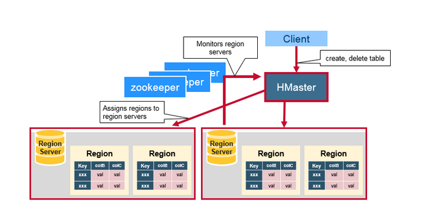
ZooKeeper为HBase集群提供协调服务，它管理着HMaster和HRegionServer的状态(available/alive等)，并且会在它们宕机时通知给HMaster，从而HMaster可以实现HMaster之间的failover，或对宕机的HRegionServer中的HRegion集合的修复(将它们分配给其他的HRegionServer)。ZooKeeper集群本身使用一致性协议(PAXOS协议)保证每个节点状态的一致性。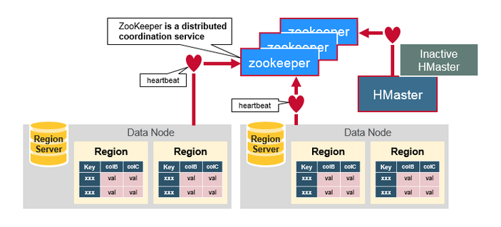

## How The Components Work Together

ZooKeeper协调集群所有节点的共享信息，在HMaster和HRegionServer连接到ZooKeeper后创建Ephemeral节点，并使用Heartbeat机制维持这个节点的存活状态，如果某个Ephemeral节点实效，则HMaster会收到通知，并做相应的处理。

在HBase 0.96以前，HBase有两个特殊的Table：-ROOT-和.META.（如中的设计），其中-ROOT- Table的位置存储在ZooKeeper，它存储了.META. Table的RegionInfo信息，并且它只能存在一个HRegion，而.META. Table则存储了用户Table的RegionInfo信息，它可以被切分成多个HRegion，因而对第一次访问用户Table时，首先从ZooKeeper中读取-ROOT- Table所在HRegionServer；然后从该HRegionServer中根据请求的TableName，RowKey读取.META. Table所在HRegionServer；最后从该HRegionServer中读取.META. Table的内容而获取此次请求需要访问的HRegion所在的位置，然后访问该HRegionSever获取请求的数据，这需要三次请求才能找到用户Table所在的位置，然后第四次请求开始获取真正的数据。当然为了提升性能，客户端会缓存-ROOT- Table位置以及-ROOT-/.META. Table的内容。如下图所示：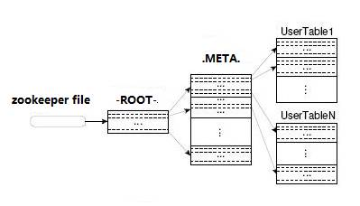可是即使客户端有缓存，在初始阶段需要三次请求才能直到用户Table真正所在的位置也是性能低下的，而且真的有必要支持那么多的HRegion吗？或许对Google这样的公司来说是需要的，但是对一般的集群来说好像并没有这个必要。在BigTable的论文中说，每行METADATA存储1KB左右数据，中等大小的Tablet(HRegion)在128MB左右，3层位置的Schema设计可以支持2^34个Tablet(HRegion)。即使去掉-ROOT- Table，也还可以支持2^17(131072)个HRegion， 如果每个HRegion还是128MB，那就是16TB，这个貌似不够大，但是现在的HRegion的最大大小都会设置的比较大，比如我们设置了2GB，此时支持的大小则变成了4PB，对一般的集群来说已经够了，因而在HBase 0.96以后去掉了-ROOT- Table，只剩下这个特殊的目录表叫做Meta Table(hbase:meta)，它存储了集群中所有用户HRegion的位置信息，而ZooKeeper的节点中(/hbase/meta-region-server)存储的则直接是这个Meta Table的位置，并且这个Meta Table如以前的-ROOT- Table一样是不可split的。这样，客户端在第一次访问用户Table的流程就变成了：

1. 从ZooKeeper(/hbase/meta-region-server)中获取hbase:meta的位置（HRegionServer的位置），缓存该位置信息。
2. 从HRegionServer中查询用户Table对应请求的RowKey所在的HRegionServer，缓存该位置信息。
3. 从查询到HRegionServer中读取Row。

从这个过程中，我们发现客户会缓存这些位置信息，然而第二步它只是缓存当前RowKey对应的HRegion的位置，因而如果下一个要查的RowKey不在同一个HRegion中，则需要继续查询hbase:meta所在的HRegion，然而随着时间的推移，客户端缓存的位置信息越来越多，以至于不需要再次查找hbase:meta Table的信息，除非某个HRegion因为宕机或Split被移动，此时需要重新查询并且更新缓存。

hbase:meta表存储了所有用户HRegion的位置信息，它的RowKey是：tableName,regionStartKey,regionId,replicaId等，它只有info列族，这个列族包含三个列，他们分别是：info:regioninfo列是RegionInfo的proto格式：regionId,tableName,startKey,endKey,offline,split,replicaId；info:server格式：HRegionServer对应的server:port；info:serverstartcode格式是HRegionServer的启动时间戳。

## HRegionServer详解

`HRegionServer一般和DataNode在同一台机器上运行，实现数据的本地性`。HRegionServer包含多个HRegion，由WAL(HLog)、BlockCache、MemStore、HFile组成。
虽然上面这张图展现的是最新的HRegionServer的架构(但是并不是那么的精确)，但是我一直比较喜欢看以下这张图，即使它展现的应该是0.94以前的架构。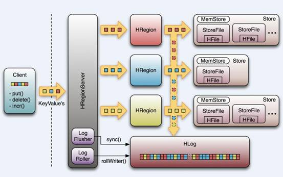

## HRegionServer中数据写流程图解

当客户端发起一个Put请求时，首先它从hbase:meta表中查出该Put数据最终需要去的HRegionServer。然后客户端将Put请求发送给相应的HRegionServer，在HRegionServer中它首先会将该`Put操作写入WAL日志`文件中(Flush到磁盘中)。

MemStore是一个In Memory Sorted Buffer，在每个HStore中都有一个MemStore，即它是一个HRegion的一个Column Family对应一个实例。它的排列顺序以RowKey、Column Family、Column的顺序以及Timestamp的倒序，如下所示：每一次Put/Delete请求都是先写入到MemStore中，当MemStore满后会Flush成一个新的StoreFile(底层实现是HFile)，即一个HStore(Column Family)可以有0个或多个StoreFile(HFile)。有以下三种情况可以触发MemStore的Flush动作，。据说这是Column Family有个数限制的其中一个原因，估计是因为太多的Column Family一起Flush会引起性能问题？具体原因有待考证。

1. 当一个HRegion中的所有MemStore的大小总和超过了hbase.hregion.memstore.flush.size的大小，默认128MB。此时当前的HRegion中所有的MemStore会Flush到HDFS中。
2. 当全局MemStore的大小超过了hbase.regionserver.global.memstore.upperLimit的大小，默认40％的内存使用量。此时当前HRegionServer中所有HRegion中的MemStore都会Flush到HDFS中，Flush顺序是MemStore大小的倒序（一个HRegion中所有MemStore总和作为该HRegion的MemStore的大小还是选取最大的MemStore作为参考？有待考证），直到总体的MemStore使用量低于hbase.regionserver.global.memstore.lowerLimit，默认38%的内存使用量。
3. 当前HRegionServer中WAL的大小超过了hbase.regionserver.hlog.blocksize * hbase.regionserver.max.logs的数量，当前HRegionServer中所有HRegion中的MemStore都会Flush到HDFS中，Flush使用时间顺序，最早的MemStore先Flush直到WAL的数量少于hbase.regionserver.hlog.blocksize * hbase.regionserver.max.logs。[这里](http://blog.sematext.com/2012/07/16/hbase-memstore-what-you-should-know/)说这两个相乘的默认大小是2GB，查代码，hbase.regionserver.max.logs默认值是32，而hbase.regionserver.hlog.blocksize是HDFS的默认blocksize，32MB。但不管怎么样，因为这个大小超过限制引起的Flush不是一件好事，可能引起长时间的延迟，因而这篇文章给的建议：“**Hint**: keep hbase.regionserver.hlog.blocksize * hbase.regionserver.maxlogs just a bit above hbase.regionserver.global.memstore.lowerLimit * HBASE_HEAPSIZE.”。并且需要注意，[这里](http://hbase.apache.org/book.html#_memstore_flush)给的描述是有错的(虽然它是官方的文档)。

在MemStore Flush过程中，还会在尾部追加一些meta数据，其中就包括Flush时最大的WAL sequence值，以告诉HBase这个StoreFile写入的最新数据的序列，那么在Recover时就直到从哪里开始。在HRegion启动时，这个sequence会被读取，并取最大的作为下一次更新时的起始sequence。

HBase的数据以KeyValue(Cell)的形式顺序的存储在HFile中，在MemStore的Flush过程中生成HFile，由于MemStore中存储的Cell遵循相同的排列顺序，因而Flush过程是顺序写，我们直到磁盘的顺序写性能很高，因为不需要不停的移动磁盘指针。HFile参考BigTable的SSTable和Hadoop的实现，从HBase开始到现在，HFile经历了三个版本，其中V2在0.92引入，V3在0.98引入。首先我们来看一下V1的格式：V1的HFile由多个Data Block、Meta Block、FileInfo、Data Index、Meta Index、Trailer组成，其中Data Block是HBase的最小存储单元，在前文中提到的BlockCache就是基于Data Block的缓存的。一个Data Block由一个魔数和一系列的KeyValue(Cell)组成，魔数是一个随机的数字，用于表示这是一个Data Block类型，以快速监测这个Data Block的格式，防止数据的破坏。Data Block的大小可以在创建Column Family时设置(HColumnDescriptor.setBlockSize())，默认值是64KB，大号的Block有利于顺序Scan，小号Block利于随机查询，因而需要权衡。Meta块是可选的，FileInfo是固定长度的块，它纪录了文件的一些Meta信息，例如：AVG_KEY_LEN, AVG_VALUE_LEN, LAST_KEY, COMPARATOR, MAX_SEQ_ID_KEY等。Data Index和Meta Index纪录了每个Data块和Meta块的其实点、未压缩时大小、Key(起始RowKey？)等。Trailer纪录了FileInfo、Data Index、Meta Index块的起始位置，Data Index和Meta Index索引的数量等。其中FileInfo和Trailer是固定长度的。

**随着HFile版本迁移，KeyValue(Cell)的格式并未发生太多变化，只是在V3版本，尾部添加了一个可选的Tag数组**
HFileV1版本的在实际使用过程中发现它占用内存多，并且Bloom File和Block Index会变的很大，而引起启动时间变长。其中每个HFile的Bloom Filter可以增长到100MB，这在查询时会引起性能问题，因为每次查询时需要加载并查询Bloom Filter，100MB的Bloom Filer会引起很大的延迟；另一个，Block Index在一个HRegionServer可能会增长到总共6GB，HRegionServer在启动时需要先加载所有这些Block Index，因而增加了启动时间。为了解决这些问题，在0.92版本中引入HFileV2版本：在这个版本中，Block Index和Bloom Filter添加到了Data Block中间，而这种设计同时也减少了写的内存使用量；另外，为了提升启动速度，在这个版本中还引入了延迟读的功能，即在HFile真正被使用时才对其进行解析。
[这里](http://hbase.apache.org/book.html#_hfile_format_2)
对HFileV2格式具体分析，它是一个多层的类B+树索引，采用这种设计，可以实现查找不需要读取整个文件：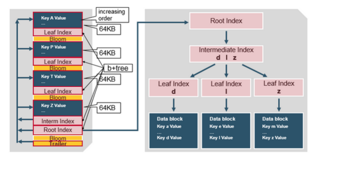Data Block中的Cell都是升序排列，每个block都有它自己的Leaf-Index，每个Block的最后一个Key被放入Intermediate-Index中，Root-Index指向Intermediate-Index。在HFile的末尾还有Bloom Filter用于快速定位那么没有在某个Data Block中的Row；TimeRange信息用于给那些使用时间查询的参考。在HFile打开时，这些索引信息都被加载并保存在内存中，以增加以后的读取性能。

## HBase读的实现

通过前文的描述，我们知道在HBase写时，`相同Cell(RowKey/ColumnFamily/Column相同)并不保证在一起`，甚至删除一个Cell也只是写入一个新的Cell，它含有Delete标记，而不一定将一个Cell真正删除了，因而这就引起了一个问题，如何实现读的问题？要解决这个问题，我们先来分析一下相同的Cell可能存在的位置：首先对新写入的Cell，它会存在于MemStore中；然后对之前已经Flush到HDFS中的Cell，它会存在于某个或某些StoreFile(HFile)中；最后，对刚读取过的Cell，它可能存在于`BlockCache`中。既然相同的Cell可能存储在三个地方，在读取的时候只需要扫瞄这三个地方，然后将结果合并即可(Merge Read)，在HBase中扫瞄的顺序依次是：BlockCache、MemStore、StoreFile(HFile)。其中StoreFile的扫瞄先会使用Bloom Filter过滤那些不可能符合条件的HFile，然后使用Block Index快速定位Cell，并将其加载到BlockCache中，然后从BlockCache中读取。我们知道一个HStore可能存在多个StoreFile(HFile)，此时`需要扫瞄多个HFile`，如果HFile过多又是会引起性能问题。

MemStore每次Flush会创建新的HFile，而过多的HFile会引起读的性能问题，那么如何解决这个问题呢？HBase采用`Compaction机制`来解决这个问题，有点类似Java中的GC机制，起初Java不停的申请内存而不释放，增加性能，然而天下没有免费的午餐，最终我们还是要在某个条件下去收集垃圾，很多时候需要Stop-The-World，这种Stop-The-World有些时候也会引起很大的问题，比如参考本人写的，因而设计是一种权衡，没有完美的。还是类似Java中的GC，在HBase中Compaction分为两种：Minor Compaction和Major Compaction。

1. Minor Compaction是指选取一些小的、相邻的StoreFile将他们合并成一个更大的StoreFile，在这个过程中不会处理已经Deleted或Expired的Cell。一次Minor Compaction的结果是更少并且更大的StoreFile。（这个是对的吗？BigTable中是这样描述Minor Compaction的：As write operations execute, the size of the memtable in- creases. When the memtable size reaches a threshold, the memtable is frozen, a new memtable is created, and the frozen memtable is converted to an SSTable and written to GFS. This *minor compaction* process has two goals: it shrinks the memory usage of the tablet server, and it reduces the amount of data that has to be read from the commit log during recovery if this server dies. Incom- ing read and write operations can continue while com- pactions occur. 也就是说它将memtable的数据flush的一个HFile/SSTable称为一次Minor Compaction）
2. Major Compaction是指将所有的StoreFile合并成一个StoreFile，在这个过程中，标记为Deleted的Cell会被删除，而那些已经Expired的Cell会被丢弃，那些已经超过最多版本数的Cell会被丢弃。`一次Major Compaction的结果是一个HStore只有一个StoreFile存在`。Major Compaction可以手动或自动触发，然而由于它会引起很多的IO操作而引起性能问题，因而它一般会被安排在周末、凌晨等集群比较闲的时间。

更形象一点，如下面两张图分别表示Minor Compaction和Major Compaction。
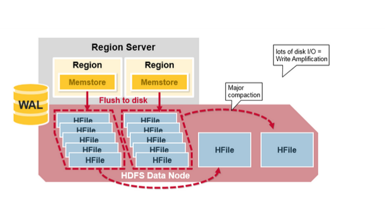

## HRegion Split

最初，一个Table只有一个HRegion，随着数据写入增加，如果一个HRegion到达一定的大小，就需要Split成两个HRegion，这个大小由hbase.hregion.max.filesize指定，默认为10GB。当split时，两个新的HRegion会在同一个HRegionServer中创建，它们各自包含父HRegion一半的数据，当Split完成后，父HRegion会下线，而新的两个子HRegion会向HMaster注册上线，处于负载均衡的考虑，这两个新的HRegion可能会被HMaster分配到其他的HRegionServer中。关于Split的详细信息，可以参考这篇文章：[《Apache HBase Region Splitting and Merging》](http://hortonworks.com/blog/apache-hbase-region-splitting-and-merging/)

在HRegion Split后，两个新的HRegion最初会和之前的父HRegion在相同的HRegionServer上，出于负载均衡的考虑，HMaster可能会将其中的一个甚至两个重新分配的其他的HRegionServer中，此时会引起有些HRegionServer处理的数据在其他节点上，直到下一次Major Compaction将数据从远端的节点移动到本地节点。

当一台HRegionServer宕机时，由于它不再发送Heartbeat给ZooKeeper而被监测到，此时ZooKeeper会通知HMaster，HMaster会检测到哪台HRegionServer宕机，它将宕机的HRegionServer中的HRegion重新分配给其他的HRegionServer，同时HMaster会把宕机的HRegionServer相关的WAL拆分分配给相应的HRegionServer(将拆分出的WAL文件写入对应的目的HRegionServer的WAL目录中，并并写入对应的DataNode中），从而这些HRegionServer可以Replay分到的WAL来重建MemStore。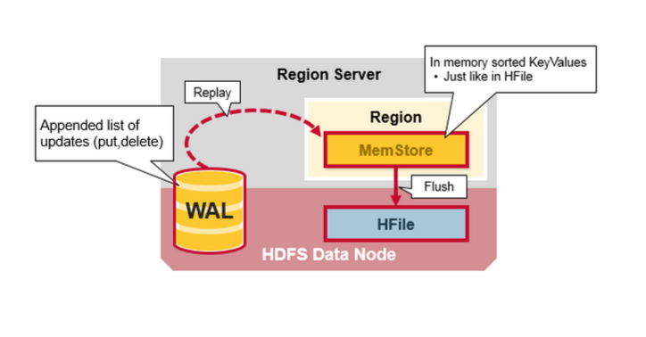

## HBase架构简单总结

在NoSQL中，存在著名的CAP理论，即Consistency、Availability、Partition Tolerance不可全得，目前市场上基本上的NoSQL都采用Partition Tolerance以实现数据得水平扩展，来处理Relational DataBase遇到的无法处理数据量太大的问题，或引起的性能问题。因而只有剩下C和A可以选择。HBase在两者之间选择了Consistency，然后使用多个HMaster以及支持HRegionServer的failure监控、ZooKeeper引入作为协调者等各种手段来解决Availability问题，然而当网络的Split-Brain(Network Partition)发生时，它还是无法完全解决Availability的问题。从这个角度上，Cassandra选择了A，即它在网络Split-Brain时还是能正常写，而使用其他技术来解决Consistency的问题，如读的时候触发Consistency判断和处理。这是设计上的限制。
从实现上的优点：

1. HBase采用强一致性模型，在一个写返回后，保证所有的读都读到相同的数据。
2. 通过HRegion动态Split和Merge实现自动扩展，并使用HDFS提供的多个数据备份功能，实现高可用性。
3. 采用HRegionServer和DataNode运行在相同的服务器上实现数据的本地化，提升读写性能，并减少网络压力。
4. 内建HRegionServer的宕机自动恢复。采用WAL来Replay还未持久化到HDFS的数据。
5. 可以无缝的和Hadoop/MapReduce集成。

实现上的缺点：
=======
HBase是Apache Hadoop的数据库，能够对大型数据提供随机、实时的读写访问。HBase的目标是存储并处理大型的数据。HBase是一个开源的，分布式的，多版本的，面向列的存储模型。它存储的是松散型数据。

## 一、HBase架构

**HBase特性：**

1 高可靠性

2 高效性

3 面向列

4 可伸缩

5 可在廉价PC Server搭建大规模结构化存储集群

**HBase是Google BigTable的开源实现**，其相互对应如下：

　　　　　　　　　　**Google 　　　　　　　　　　 HBase**
文件存储系统 　　　  GFS 　　　　　　　　　　　  HDFS
海量数据处理 　　　  MapReduce Hadoop 　　　　MapReduce
协同服务管理　　　　Chubby 　　　　　　　　　　Zookeeper

 

**HBase关系图：**

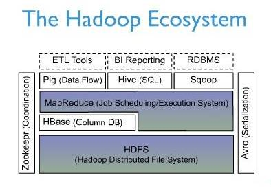

HBase位于结构化存储层，围绕HBase，各部件对HBase的支持情况：
**Hadoop部件　　　　　　　　　　　　作用**
HDFS　　　　　　　　　　　　　　高可靠的底层存储支持
MapReduce 　　　　　　　　　　   高性能的计算能力
Zookeeper 　　　　　　　　　　　  稳定服务和failover机制
Pig&Hive　　　　　　　　　　　　  高层语言支持，便于数据统计
Sqoop　　　　　　　　　　　　　  提供RDBMS数据导入，便于传统数据库向HBase迁移

**访问HBase的接口**

**方式　　　　　　　　　　　　特点　　　　　　　　　　　　　　场合**
Native Java API　　　　　　最常规和高效 　　　　　　　　　　 Hadoop MapReduce Job并行处理HBase表数据
HBase Shell　　　　　　　  最简单接口 　　　　　　　　　　　 HBase管理使用
Thrift Gateway　　　　　　利用Thrift序列化支持多种语言 　　  异构系统在线访问HBase表数据
Rest Gateway　　　　　　 解除语言限制 　　　　　　　　　　 Rest风格Http API访问
Pig　　　　　　　　　　　　Pig Latin六十编程语言处理数据 　　数据统计
Hive　　　　　　　　　　　 简单，SqlLike

**HBase 数据模型**

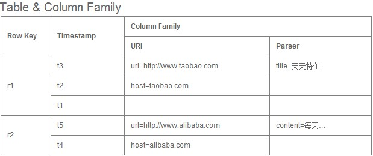

组成部件说明：

Row Key：　　 　　Table主键 行键 Table中记录按照Row Key排序
Timestamp：  　每次对数据操作对应的时间戳，也即数据的version number
Column Family： 　列簇，一个table在水平方向有一个或者多个列簇，列簇可由任意多个Column组成，列簇支持动态扩展，无须预定义数量及类型，二进制存储，用户需自行进行类型转换

**Table&Region**

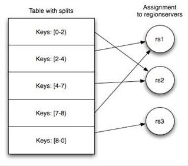

1. Table随着记录增多不断变大，会自动分裂成多份Splits，成为Regions
2. 一个region由[startkey，endkey)表示
3. 不同region会被Master分配给相应的RegionServer进行管理

**两张特殊表：-ROOT- & .META.**

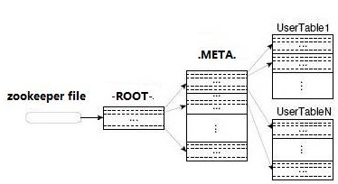

.META. 　　记录用户表的Region信息，同时，.META.也可以有多个region
-ROOT- 　 记录.META.表的Region信息，但是，-ROOT-只有一个region
Zookeeper中记录了-ROOT-表的location
客户端访问数据的流程：
Client -> Zookeeper -> -ROOT- -> .META. -> 用户数据表
多次网络操作，不过client端有cache缓存

**HBase 系统架构图**

组成部件说明
**Client：**
使用HBase RPC机制与HMaster和HRegionServer进行通信
Client与HMaster进行通信进行管理类操作
Client与HRegionServer进行数据读写类操作

**Zookeeper：**
Zookeeper Quorum存储-ROOT-表地址、HMaster地址
<u>HRegionServer把自己以Ephedral方式注册到Zookeeper中，</u><u>HMaster随时感知各个HRegionServer的健康状况</u>
Zookeeper避免HMaster单点问题

**HMaster：**
<u>HMaster没有单点问题，HBase中可以启动多个HMaster，通过Zookeeper的Master Election机制保证总有一个Master在运行</u>
主要负责Table和Region的管理工作：
1 管理用户对表的增删改查操作
2 管理HRegionServer的负载均衡，调整Region分布
3 Region Split后，负责新Region的分布
4 在HRegionServer停机后，负责失效HRegionServer上Region迁移

**HRegionServer：**
HBase中最核心的模块，主要负责响应用户I/O请求，向HDFS文件系统中读写数据

HRegionServer管理一些列HRegion对象；
每个HRegion对应Table中一个Region，HRegion由多个HStore组成；
<u>每个HStore对应Table中一个Column Family的存储</u>；
Column Family就是一个集中的存储单元，故将具有相同IO特性的Column放在一个Column Family会更高效

**HStore：**
HBase存储的核心。由MemStore和StoreFile组成。
MemStore是Sorted Memory Buffer。用户写入数据的流程：

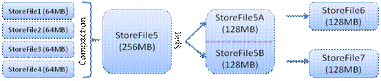

<u>Client写入 -> 存入MemStore，一直到MemStore满 -> Flush成一个StoreFile</u>，直至增长到一定阈值 -> 出发Compact合并操作 -> 多个StoreFile合并成一个StoreFile，同时进行版本合并和数据删除 -> 当StoreFiles Compact后，逐步形成越来越大的StoreFile -> 单个StoreFile大小超过一定阈值后，触发Split操作，把当前Region Split成2个Region，Region会下线，新Split出的2个孩子Region会被HMaster分配到相应的HRegionServer上，使得原先1个Region的压力得以分流到2个Region上
由此过程可知，HBase只是增加数据，有所得更新和删除操作，都是在Compact阶段做的，所以，用户写操作只需要进入到内存即可立即返回，从而保证I/O高性能。

**HLog**
引入HLog原因：
在分布式系统环境中，无法避免系统出错或者宕机，<u>一旦HRegionServer以外退出，MemStore中的内存数据就会丢失，引入HLog就是防止这种情况</u>
工作机制：
<u>每个HRegionServer中都会有一个HLog对象</u>，HLog是一个实现Write Ahead Log的类，每次用户操作写入Memstore的同时，也会写一份数据到HLog文件，HLog文件定期会滚动出新，并删除旧的文件(已持久化到StoreFile中的数据)。当HRegionServer意外终止后，HMaster会通过Zookeeper感知，HMaster首先处理遗留的HLog文件，将不同region的log数据拆分，分别放到相应region目录下，然后再将失效的region重新分配，领取到这些region的HRegionServer在Load Region的过程中，会发现有历史HLog需要处理，因此会Replay HLog中的数据到MemStore中，然后flush到StoreFiles，完成数据恢复。

**HBase存储格式**
HBase中的所有数据文件都存储在Hadoop HDFS文件系统上，格式主要有两种：
1 HFile HBase中KeyValue数据的存储格式，HFile是Hadoop的二进制格式文件，实际上StoreFile就是对HFile做了轻量级包装，即StoreFile底层就是HFile
2 HLog File，HBase中WAL（Write Ahead Log） 的存储格式，物理上是Hadoop的Sequence File

**HFile**

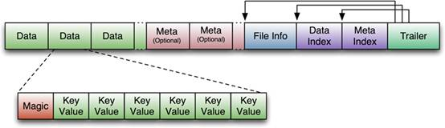

图片解释：
HFile文件不定长，长度固定的块只有两个：Trailer和FileInfo
Trailer中指针指向其他数据块的起始点
File Info中记录了文件的一些Meta信息，例如：AVG_KEY_LEN, AVG_VALUE_LEN, LAST_KEY, COMPARATOR, MAX_SEQ_ID_KEY等
Data Index和Meta Index块记录了每个Data块和Meta块的起始点
Data Block是HBase I/O的基本单元，为了提高效率，HRegionServer中有基于LRU的Block Cache机制
每个Data块的大小可以在创建一个Table的时候通过参数指定，大号的Block有利于顺序Scan，小号Block利于随机查询
每个Data块除了开头的Magic以外就是一个个KeyValue对拼接而成, Magic内容就是一些随机数字，目的是防止数据损坏

HFile里面的每个KeyValue对就是一个简单的byte数组。这个byte数组里面包含了很多项，并且有固定的结构。

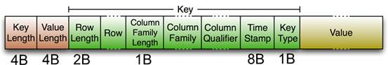

KeyLength和ValueLength：两个固定的长度，分别代表Key和Value的长度
Key部分：Row Length是固定长度的数值，表示RowKey的长度，Row 就是RowKey
Column Family Length是固定长度的数值，表示Family的长度
接着就是Column Family，再接着是Qualifier，然后是两个固定长度的数值，表示Time Stamp和Key Type（Put/Delete）
Value部分没有这么复杂的结构，就是纯粹的二进制数据

**HLog File**

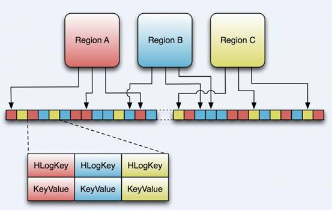

HLog文件就是一个普通的Hadoop Sequence File，Sequence File 的Key是HLogKey对象，HLogKey中记录了写入数据的归属信息，除了table和region名字外，同时还包括 sequence number和timestamp，timestamp是“写入时间”，sequence number的起始值为0，或者是最近一次存入文件系统中sequence number。
HLog Sequece File的Value是HBase的KeyValue对象，即对应HFile中的KeyValue

## 二、存储模型

有了架构层面的保证，接下来的事情就只是关注于数据的具体存储了。这里就是每个Region所承担的工作了。

- 我们知道一个Region代表的是一张 Hbase表中特定Rowkey范围内的数据，

- 而Hbase是面向列存储的数据库，所以在一个Region中，有多个文件来存储这些列。

- Hbase中

  数据 列是由列簇来组织

  的，所以

  每一个列簇都会有对应的一个数据结构

  ，

  -  Hbase将列簇的存储数据结构抽象为Store，一个Store代表一个列簇。

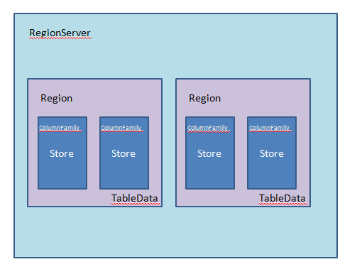

所以在这里也可以看出为什么在我们查询的时候要尽量减少不需要的列，

而经常一起查询的列要组织到一个列簇里：因为要需要查询的列簇越多，意味着要扫描越多的Store文件，这就需要越多的时间。

我们来深入Store中存储数据的方式。

Hbase的实现是用了一种LSM 树的结构！

LSM树是由B+树改进

首先来简单的看看B+树：

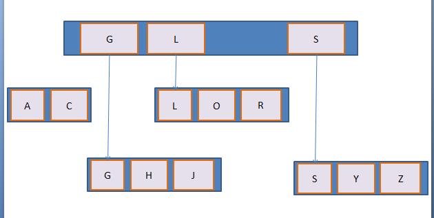

这是一颗简单的B+树，含义不言而喻，这里不多分析，但是这种数据结构并不适合Hbase中的应用场景。

这样的数据结构在内存中效率是很高的，但是 Hbase中数据是存储在文件中的，如果按照这样的结构来存储，意味着我们每一次插入数据都要由一级索引找到文件再在文件中间作操作来保证数据的有序性， 这无疑是效率低下的。

所以Hbase采用的是LSM树的结构，这种结构的关键是，

- 每一次的插入操作都会先进入MemStore（内存缓冲区），
- 当 MemStore达到上限的时候，Hbase会将内存中的数据输出为有序的StoreFile文件数据（根据Rowkey、版本、列名排序，这里已经和列 簇无关了因为Store里都属于同一个列簇）。
- 这样会在Store中形成很多个小的StoreFile，当这些小的File数量达到一个阀值的时 候，Hbase会用一个线程来把这些小File合并成一个大的File。

这样，Hbase就把效率低下的文件中的插入、移动操作转变成了单纯的文件输出、 合并操作。

 由上可知，在Hbase底层的Store数据结构中，

- 每个StoreFile内的数据是有序的，
- 但是StoreFile之间不一定是有序的，
- Store只 需要管理StoreFile的索引就可以了。

这里也可以看出为什么指定版本和Rowkey可以加强查询的效率，因为指定版本和Rowkey的查询可以利用 StoreFile的索引跳过一些肯定不包含目标数据的数据。

 

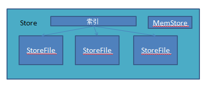
>>>>>>> e8982134f494473af0d7cf9a965349ed50a7c8de
