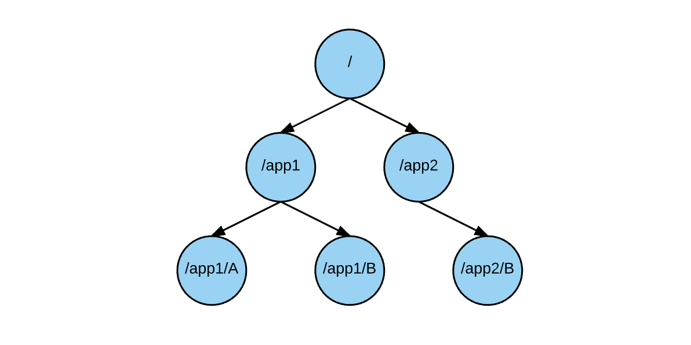
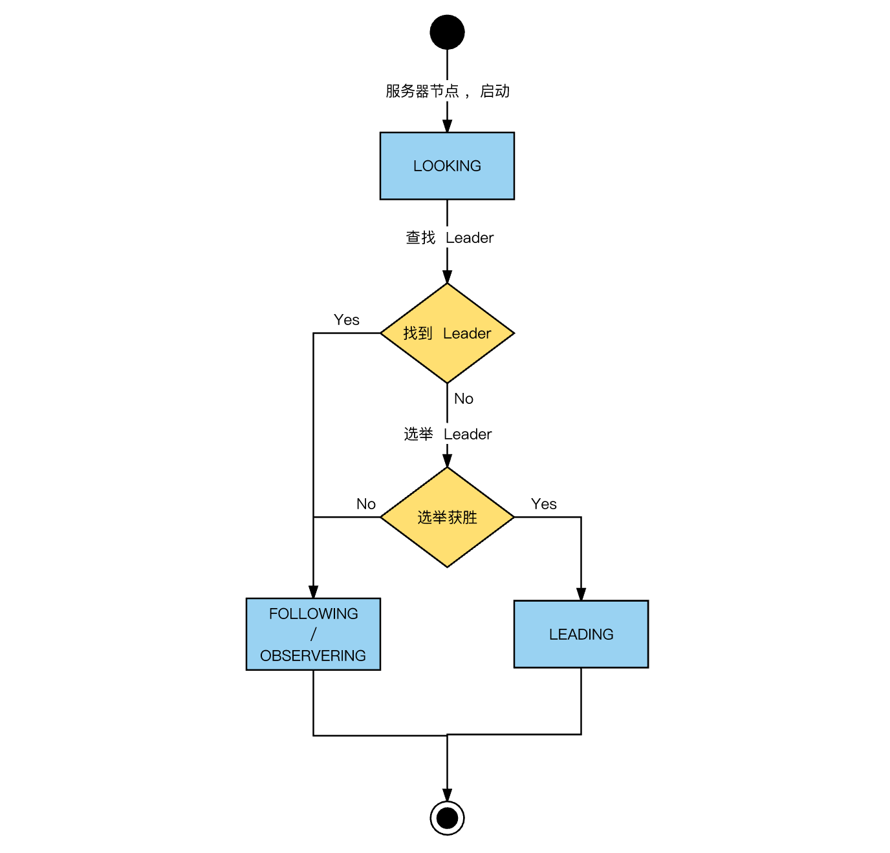
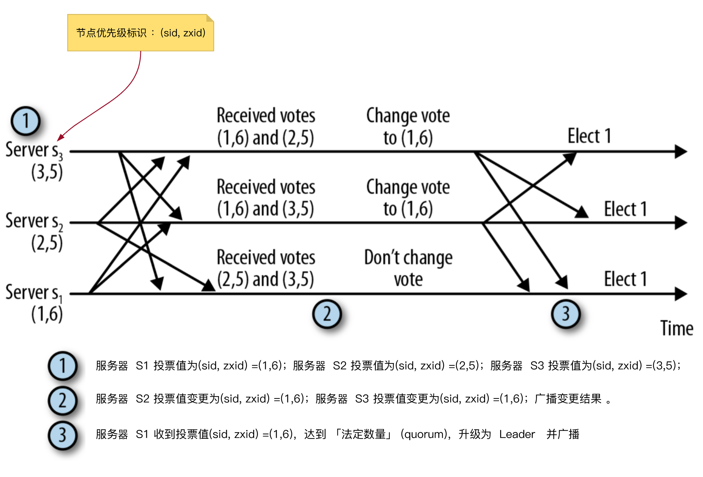
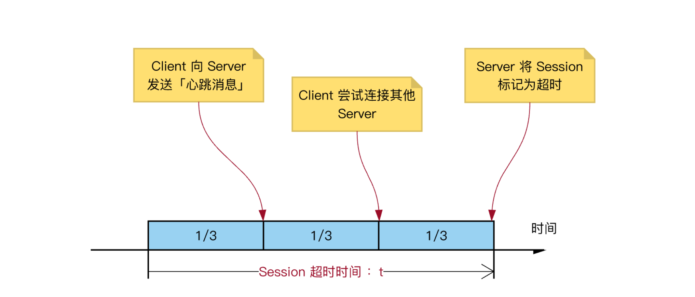
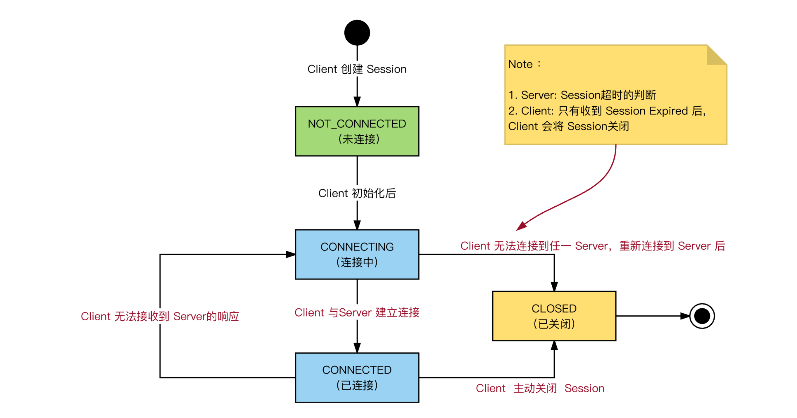
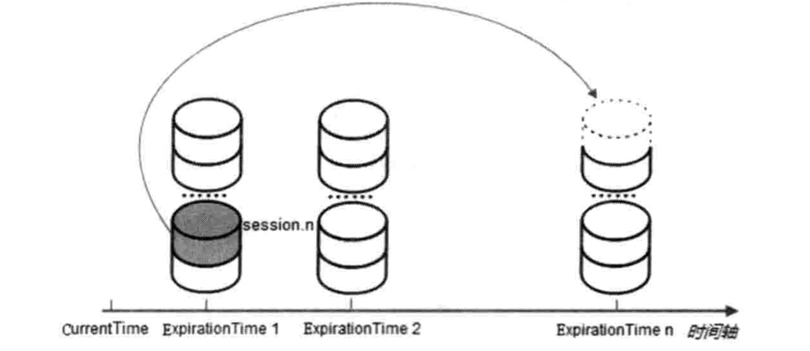

## 1. Zookeeper 核心思路

常见的典型问题：

- zookeeper是如何保证事务的顺序一致性的
  - 怎么表示事务
  - 如何唯一标识
  - 如何保证顺序？集中式？
- zookeeper是如何选取主leader的？
  - 什么时候 leader 选举？
  - 选举的过程？
  - 选举过程中，是否能提供服务？
  - 选举结果，是否会丢失数据？
- zk中znode类型
  - 有几种
  - 每种的使用场景？
  - 每种底层原理如何实现？
- zk的通知机制
  - 如何实现发布/订阅
  - 是否会有消息丢失？
- 机器中为什么会有master？
  - 在分布式环境中，有些业务逻辑只需要集群中的某一台机器进行执行，其他的机器可以共享这个结果，这样可以大大减少重复计算，提高性能，于是就需要进行master选举。

ZK 的应用场景，以及实现基本原理：

- zk的配置管理：使用 ZK znode 进行配置管理的详细过程
  - 如何修改配置？
  - 如何通知其他 client 同步修改配置？
- zk的命名服务：命名服务是指通过指定的名字来获取资源或者服务的地址
  - 利用 ZK 创建一个全局路径，路径就作为一个名字，映射到资源或者服务地址
- 分布式通知和协调：
  - 对于系统调度来说：操作人员发送通知实际是通过控制台改变某个节点的状态，然后zk将这些变化发送给注册了这个节点的watcher的所有客户端。
  - 对于执行情况汇报：每个工作进程都在某个目录下创建一个临时节点。并携带工作的进度数据，这样汇总的进程可以监控目录子节点的变化获得工作进度的实时的全局情况。

## 2. ZooKeeper 特性

### 2.1 ZooKeeper 解决的本质问题

==分布式系统的一致性问题==：

1. ==消息传递：延迟性==，先发送的消息，不一定先到达；
2. ==消息传递：丢失性==，发送的消息，可能丢失；
3. ==节点崩溃==：分布式系统内，任何一个节点都可能崩溃；

在这种情况下，如何保证数据的一致性？

1. 提案投票：基于投票策略，2PC
2. 选举投票：基于投票策略，投出`优先级最高的节点`（包含最新数据的节点）

> **Paxos 目标**：解决`分布式一致性`问题，提高分布式系统`容错性`的一致性算法。
>
> **Paxos 本质**：基于`消息传递`的`高度容错`的`一致性算法`

### 2.2 ZooKeeper 定位

ZooKeeper 是：

1. 分布式协调服务
2. 高效、可靠
3. 方便应用程序，聚焦`业务逻辑开发`，而不需要过多关注`分布式进程间协作细节`

ZooKeeper 不直接暴露`原语`，而是，暴露一部分`调用方法`组成的 API，类似文件系统的 API，支持应用程序实现自己的`原语`。

### 2.3 ZooKeeper 特性

ZooKeeper 可以保证如下分布式一致性特性：

- 顺序一致性：同一个 Client 发起的事务请求，严格按照发起顺序执行
- 原子性：事务请求，要么应用到所有节点，要么一个节点都没有应用
- ==单一视图==：Client 无论连接到哪个节点，看到的服务端数据都是一致的（Note：不准确，其实是**最终一致性**）
- 可靠性：事务一旦执行成功，状态永久保留
- 实时性：事务一旦执行成功，Client 并不能立即看到最新数据，但 ZooKeeper 保证**最终一致性**

### 2.4 ZooKeeper 设计目标

ZooKeeper 致力于提供`高性能`、`高可用`、`顺序一致性`的分布式协调服务，保证数据`最终一致性`。

#### 目标一：高性能（简单的数据模型）

1. 采用`树形结构`组织数据节点；
2. ==全量数据节点，都存储在内存中==；
3. ==Follower 和 Observer 直接处理非事务请求==；

#### 目标二：高可用（构建集群）

1. 半数以上机器存活，服务就能正常运行
2. 自动进行 Leader 选举

#### 目标三：顺序一致性（事务操作的顺序）

1. ==每个事务请求，都会转发给 Leader 处理==
2. ==每个事务，会分配全局唯一的递增id==（zxid，64位：epoch + 自增 id）

#### 目标四：最终一致性

1. 通过提议投票方式，保证事务提交的可靠性
2. 提议投票方式，只能保证 Client 收到事务提交成功后，半数以上节点能够看到最新数据

## 3. 数据模型

### 3.1 数据节点

ZooKeeper 上记录信息，都是以「数据节点」（ZNode）为最小单元存储的：

1. ZNode 是数据存储最小单元
2. ZNode 既可以存储数据，也可以挂载子节点，形成「节点树」结构



==每个 ZNode 都有生命周期，根据生命周期不同，ZNode 可以划分为==：

- 持久节点（Persistent）：创建之后，需要**主动**删除
- 临时节点（Ephemeral）：跟客户端的 Session 生命周期一致，只能作为叶子节点
- 持久顺序节点（Persistent Sequential）
- 临时顺序节点（Ephemeral Sequential）

关于**顺序节点**：

- `顺序节点`，父节点会维护第一级子节点的创建顺序
- 顺序节点实现方式：父节点自动为**子节点名**添加**数字后缀**，作为新的、完整的名字
- 同一级顺序节点的个数，有上限：整型的最大值。

关于**临时节点**：

- 跟客户端的 Session 生命周期一致；
- ==Client Session 失效，则临时节点会自动清除==；
- ==Session 失效，并不是指 TCP 连接断开==；
- 临时节点，不能包含子节点，只能为叶子节点。

数据节点，存储的信息：

1. 数据信息
2. 节点自身状态信息

节点中存储的具体信息：

```
[zk: localhost:2181(CONNECTED) 5] get /zk_test
哈哈哈
cZxid = 0x2
ctime = Tue Jan 24 16:39:15 CST 2017
mZxid = 0x2
mtime = Tue Jan 24 16:39:15 CST 2017
pZxid = 0x2
cversion = 0
dataVersion = 0
aclVersion = 0
ephemeralOwner = 0x0
dataLength = 9
numChildren = 0
```

其中，包含几类信息：

1. 当前节点创建和修改：创建、修改的`时间`和`事务`；
2. 当前节点版本号：`数据版本`、`ACL 版本`
3. 子节点个数、子节点列表变更：子节点个数变更和子节点列表变更的`事务`
4. 子节点版本号：子节点的`数据版本`
5. 临时节点的 Session ID：创建临时节点的 `ephemeralOwner`

### 3.2 事务

事务：

1. ZK中，事务操作，是指：能够`改变` ZooKeeper `服务器状态`的操作
2. 事务操作，包含：
   - 创建 ZNode
   - 删除 ZNode
   - 修改 ZNode 上的数据
   - Session 的创建
   - Session 的失效
3. ZK中，每个事务请求，ZK 都会为其分配一个**全局唯一**的事务ID，ZXID，64位数字。
4. 通过 ZXID，表示事务的全局顺序。

思考：

> 1. 事务的 ZXID 是怎么分配的？
> 2. 如何保证事务的时序性？（顺序执行）

特别说明：事务是跟 ZK 中服务器角色相关的，ZK 服务器角色有 3 种：Leader、Follower、Observer，其中，==所有的**事务操作**都会被转发给 Leader，由 Leader 执行事务，完成 ZK 状态的变更==。

> Note：`事务请求转发`只发生在 Leader 跟 Follower/Observer 之间，不会发生在 Leader 跟 Client 之间。

事务请求的详细处理过程：

1. 一个事务为一个单位，以原子方式操作，需要保证同时变更`节点数据`和`节点版本号`，保证事务之间相互隔离；
2. ==ZK 中事务操作，没有回滚机制==；但 Leader 跟 Follower 之间，有 Truncate 机制，当 Follower 的事务执行，比 Leader 新时，Leader 会发送 TRUNC 命令，让 Follower 截断事务；==ZK 中，事务采取 2PC 策略，先写事务日志，然后发起 Proposal 投票，最后，听 Leader 号令 commit 事务==。
3. 事务执行的**顺序性**：统一 Leader 执行所有的事务操作，并且 Leader 上，启用==单线程执行所有事务==，保证事务顺序；最近 ZK 增加了`多线程`的支持，提高事务处理的速度。
4. ==ZK 中事务，具有幂等性==：同一个事务，执行多次，得到结果相同；多个事务，保证同一执行顺序，执行结果相同；
5. Leader 为每一个事务请求，分配 ZXID，保证不同 ZXID 有序
6. ==ZK Leader 选举过程中，通过交换 ZXID 判断，哪个 Follower 的数据最新==
7. ZXID 为 long 型（64位）整数，2 部分（每个32位）：时间戳（epoch） + 计数器（counter）
   1. Leader 选举，会产生新的 epoch（自增）
   2. 同一个 Leader 生成的 ZXID，epoch 相同，counter 自增

### 3.3 会话

客户端会话（Session）：ZK Client 与 ZK Server 之间，创建并保持 TCP 连接，即创建了一个 Session。 Session 跟下面几点，息息相关：

1. 临时节点的生命周期
2. 客户端请求的顺序执行
3. Watcher 通知机制

Session 在整个运行过程中，会在不同状态之间切换，即：Session 有一个`状态转移图`。

## 4. 服务器角色

### 4.1 角色

ZK 集群中，服务器节点，有 3 中角色：

1. Leader：ZK 集群工作机制的核心，主要工作：
   - 调度者：集群内部各个服务节点的调度者
   - 事务请求：事务请求的唯一调度和处理者，保证集群事务处理的顺序性
2. Follower：主要职责：
   - 非事务请求：Follower 直接处理非事务请求，对于事务请求，转发给 Leader
   - Proposal 投票：Leader 上执行事务时，需要 Follower 投票，Leader 才真正执行
   - Leader 选举投票
3. Observer：ZK `3.3.0+`版本开始引入，提升 ZK 集群的非事务处理能力，主要职责：
   - 非事务请求：Follower 直接处理非事务请求，对于事务请求，转发给 Leader

特别说明：Observer 跟 Follower 的唯一区别：

1. Follower 参与投票：Leader 选举、Proposal 提议投票（事务执行确认）
2. ==Observer 不参与投票==：只用于提供非事务请求的处理

==节点成为Observer是配置文件中设定的，可以提供zookeeper集群的写性能，减少投票次数==。

### 4.2 Leader 选举

#### 4.2.1 时机

下面任何一种情况，都会触发 Leader 选举：

1. 启动时，集群服务器刚启动
2. 运行时，Leader 崩溃

服务器的状态流转：



#### 4.2.2 过程

==Leader 选举过程，本质就是广播`优先级消息`的过程，选出**数据最新的服务节点**，选出**优先级最高的服务节点**==，基本步骤：

1. 各个服务器节点，广播自己的优先级标识 `(sid，zxid)`
2. 服务器节点收到其他广播消息后，跟自己的优先级对比，自己优先级低，则变更当前节点投票的优先级`(sid，zxid)` ，并广播变更后的结果
3. 当任意一个服务器节点收到的投票数，超过了`法定数量`(quorum)，则，升级为 Leader，并广播结果。

疑问：`法定数量`（quorum），一般设置为集群规模大小的半数以上，quorum 在哪配置的？

特别说明：

1. 服务器节点的优先级标识：`(sid，zxid)`
2. 优先比较 `zxid` （事务 ID），其次比较`sid`（服务器ID）
3. `sid` (服务器 ID) 是节点配置文件中设定的
4. 当前服务器上的 `zxid` 是什么时候设定的？是在 Leader 执行事务过程中，向当前服务器同步的？如何获得当前服务器上的 `zxid`？

具体选举过程：



补充说明：

1. 由于网络延时，节点得不到足够多广播信息时，会做出错误的投票判断，纠正过程更耗时
2. 选举过程中，服务器节点会**等待一定时间**，再广播投票信息，时间间隔一般设定为 `200 ms`
3. 上面 Leader 选举，采取事件触发==Push 方式广播消息==，称为 `快速 Leader 选举`，因为之前的 Leader 选举，采用 `Pull 方式`，每隔 `1s` 拉取一次。

疑问：

> 服务器节点，等待 `200ms` 的起始时间点是什么？是收到一轮新投票消息，开始计时？
>
> RE：
>
> 1. 正常情况下，**投票信息**是`事件触发`，广播出去的；
> 2. 当某个服务器节点，判断**支持当前节点的投票**数量 >= `法定数量`（quorum），则，仍然等待 `200ms`，确认是否有更优的投票。

真正的投票信息：

| 属性          | 说明                                   |
| :------------ | :------------------------------------- |
| id            | 被推举 Leader 的 sid                   |
| zxid          | 被推举 Leader 的事务ID                 |
| electionEpoch | 投票的轮数，约束：同一轮投票，计数有效 |
| peerEpoch     | 被推举 Leader 的 epoch                 |
| state         | 当前服务器的状态                       |

一次 Leader 选举过程，属于同一个 `electionEpoch`，结束时，会选出新的 Leader；服务器节点，在比较 `(sid，zxid)` 之前，会先比较选举轮次 `electionEpoch`，只有同一轮次的 Leader 投票信息才是有效的：

1. 外部投票轮次 > 内部投票轮次，更新内部投票，并且触发当前节点投票信息的**重新广播**
2. 外部投票轮次 < 内部投票轮次，直接忽略当前的外部投票
3. 外部投票轮次 = 内部投票轮次，进一步比较 `(sid，zxid)`

疑问：Leader 负责执行所有的事务操作，一次事务操作，

1. Leader 如何将事务操作同步到 Follower 和 Observer ？同步、异步？
2. 如何保证同步过程中，事务一定执行成功？事务失败的影响？

Leader 上执行的事务状态，通过 `Zab` 状态更新的广播协议，更新到 Follower 和 Observer。

#### 4.2.3 Leader 选举脑裂

脑裂（split brain）：服务器集群的 2 个子集，能够同时独立选举 Leader，并正常运行，形成 2 个集群。

解决办法：Leader 选举的`法定数量`（quorum），超过正常集群的半数。

Leader 选举的必要条件：节点数量 > `法定数量`。

## 5. 会话

### 5.1 Session 的用途

Session 的作用？

- `临时节点`的生命周期
- `Watcher` 通知机制
- Client 请求的执行顺序

==本质上，就是Session 映射到一个 TCP 长连接，并且标识这条长连接==

- 通过 TCP 长连接，发送请求、接受响应
- 接收来自 Server 的 Watcher 事件通知

### 5.2 Session 的创建

Session 创建的时机和实现细节：

1. Client 连接到 ZK Server，创建 TCP 长连接，并创建 Session；
2. Client 侧，创建 Session ？保存 Session？
   - Client 发起`创建 Session`的事务请求
   - ==Client 和 Server 都会保留一份 Session 内容==

==ZK Server 节点异常时，Client 会将会话透明的转移到其他服务节点上==。疑问：如何透明的转到其他服务节点的？

### 5.3 Session 连接保持

1. Client 创建会话时，会指定 Session 的`超时时间 t`；
2. Server 侧：经过 `t` 时间后，Server 收不到 Client 的任何消息，Server 判定：Session 过期；
3. Cleint 侧：经过 `t/3` 时间后，未收到任何消息，则，Client 会主动向 Server 发送心跳信息；
4. Client 侧：经过 `2t/3` 时间后，会尝试连接其他 Server 节点，此时，还有 `t/3` 时间；

Client 尝试连接其他 Server 时，要保证新的 Server 能看到的`最新事务` >＝ 之前 Server看到的`最新事务`，所以，==Client 连接到 Server 后，会先判断 `最新事务`的 zxid 是否满足 `Client 上的最新 zxid` >= `Server 上的最新 zxid`==；若不符合条件，则尝试连接到另一个 Server。

具体 Session 保持流程：



Note：

> ==创建会话、删除会话，本身就是事务请求，任意时刻，在 ZK 集群中，都有法定数量（Quorum）的服务器节点，保存有 Session 的信息==。

### 5.4 Session 状态转移图

Session 同时保存在 Client 和 Server 侧。

从 Client 看， Session 的状态转移图：



特别说明：

1. Server 负责判断：Session 超时
2. Client 不会判断 Session 超时
3. ==Client 负责关闭 Session==
   - ==Client 主动关闭 Session==
   - ==Client 收到 Server 的 Session Expired 指令==

### 5.5 Session 管理

关于 Session 管理：

1. Session 管理内容：包括：`会话创建`、`会话激活`、`会话删除`
2. ==Session 管理者：只由 `Leader` 独立负责==；其他 Server 节点，将会话信息转发给 `Leader`，上报 Session 的激活信息。

> Note：`事务请求转发`只发生在 Leader 跟 Follower/Observer 之间，不会发生在 Leader 跟 Client 之间。

### 5.6 Session 结构

ZK Server 侧，保存了 Session 对象，其中，包含属性：

1. sessionID：服务节点启动时，时间戳 + sid（`myid`中的数字），经过一定算法计算得到 `基准 sessionID` 之后的 SessionID，都为`基准 SessionID`自增得到。
2. TimeOut：超时时间，时间段
3. TickTime：下次超时时间点，`TickTime 约为 currentTime + TimeOut`，方便 ZK Server 对会话`分桶策略`管理，高效的进行会话检查和清理。
4. isClosing：ZK Server 判定 Session 超时后，将会话标记为`已关闭`，确保不再处理其新请求；

### 5.7 Session 清理：分桶策略管理

ZK 中 `Leader 服务器`，`定期清理`会话，为了高效处理，采用`分桶策略`：

1. 定期清理会话：时间间隔 ExpirationInterval，默认时 tickTime （默认 2s）
2. 会话组织：过期时间点 ExpirationTime（（currentTime + timeOut） ExpirationInterval 向上取整）
3. 会话清理策略：当前时间点 >= ExpirationTime, 清理分桶

Note：`分桶策略`本质是`批量处理策略`，提升效率。

补充信息：对于 `会话超时清理`，通用策略有 3 种：`定期清理`、`定时清理`、`惰性清理`，每一种的清理时机不同，有的采用`组合方式`进行清理；ZK 中，只采用`定期清理`策略。

### 5.8 Session 激活：更新所属分桶

Client 定期发送心跳信息，更新 Session 所在的分桶。



## 10 问题

几个问题：

1. ZK 中数据是如何存储的？最小存储单元？
2. 每个存储单元，内部存储了哪些信息？
3. 每个节点，有版本的概念吗？版本用来解决什么问题？
4. Watcher 机制，如何实现的？
5. 权限 ACL 如何实现？有什么作用？

几个问题，引发思考：

1. 什么时候 leader 选举？
2. 选举的过程？
3. 选举过程中，是否能提供服务？
4. 选举结果，是否会丢失数据？

2 个小问题：

1. 服务器节点有多少角色？
2. 每个角色的作用？

2 个小问题：

1. 什么时候，进行 Leader 选举？
2. Leader 选举的具体过程，是什么？

疑问：Leader 负责执行所有的事务操作，一次事务操作，

1. Leader 如何将事务操作同步到 Follower 和 Observer ？同步、异步？
2. 如何保证同步过程中，事务一定执行成功？事务失败的影响？

疑问：

1. Session 是如何创建的？
2. 遇到 TCP 连接异常，Session 如何处理？
3. Session 有什么特性？