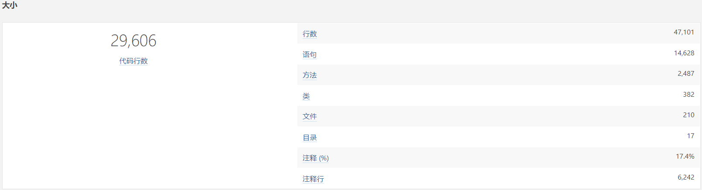
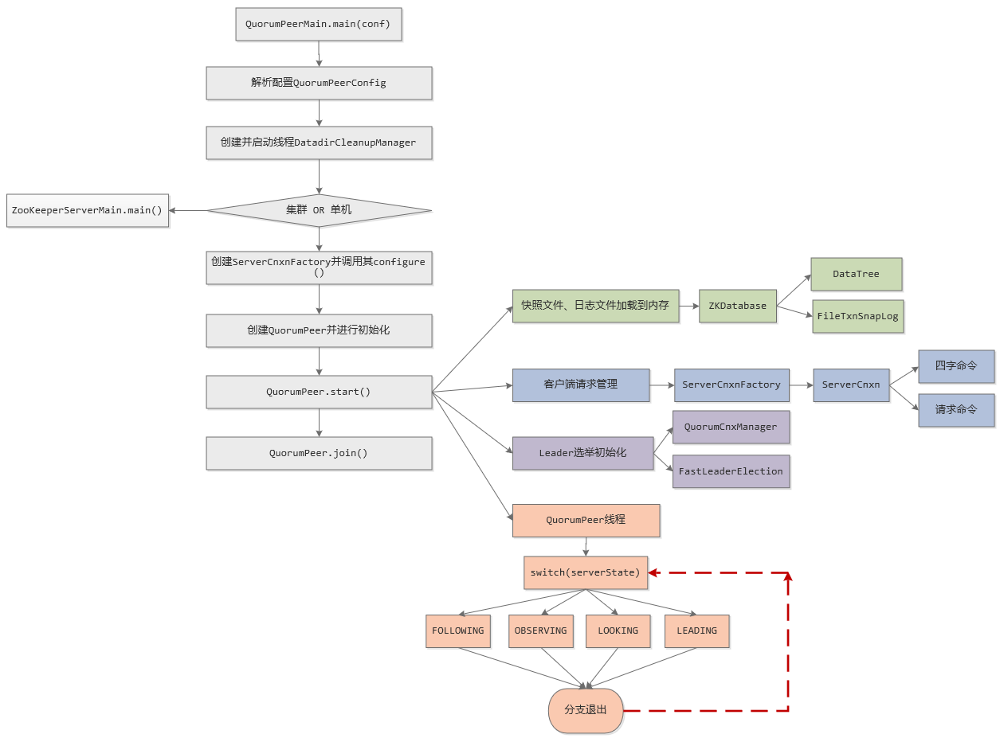

# 源码分析

## 概述

分布式架构、大数据架构在软件开发中使用频率越来越高，然而在解决分布式数据一致性上，Zookeeper是最为成熟稳定且被大规模应用的解决方案，无论从性能、易用性还是稳定性上来说，Zookeeper都已经达到了一个工业级产品的标准。

Zookeeper是由Hadoop的子项目发展而来，于2010年11月正式成为了Apache的顶级项目。Zookeeper为分布式应用提供了高效且可靠的分布式协调访问，是一个典型的分布式数据一致性的解决方案，分布式应用程序可以基于其实现诸如数据发布/订阅、负载均衡、分布式协调/通知、集群管理、分布式锁和分布式队列等功能。

在解决分布式数据一致性方面，Zookeeper采用了一种被成为ZAB(Zookeeper Atomic Broadcast)的一致性协议。Zookeeper的设计目标是将那些复杂且容易出错的分布式一致性服务封装起来，构成一个高效可靠的原语集，并以一些列简单易用的接口提供给用户使用。

Zookeeper可以保证如下分布式一致性特性：
​ 顺序一致性：从同一个客户端发起的事务请求，最终将会严格地按照其发起顺序被应用到Zookeeper中去；
​ 原子性：所有事务请求的处理结果在整个集群中的所有机器上的应用情况是一致的，不会出现集群中部分机器应用了该事务，而另外一部分没有应用的情况；
​ 单一视图：无论客户端连接的是哪个Zookeeper服务器，其看到的服务端数据模型都是一致的；
​ 可靠性：一旦服务端成功应用了一个事务，并完成对客户端的访问，那么该事务所引起的服务端状态变更将会被一直保留下来，除非有另一个事务又对其进行了变更；
​ 实时性：Zookeeper仅仅保证在一定的时间段内，客户端最终一定能够从服务端上读取到最新的数据状态

分布式系统就像一个动物园，混乱且难以管理，而ZooKeeper就是将这一切变得可控，由此理解，Zookeeper这个名字起的还是比较贴切的。Zookeeper作为一个轻量实用的工具，在Hadoop、HBase、Kafka、Dubbo等产品中都得以应用，可谓是大数据、分布式领域的一把利器。

下面将会从源码层次研究分析Zookeeper，通过源码帮助我们深入理解Zookeeper实现思路，并提高我们对分布式一致性问题的认识。

## 代码量

下图是使用Sonar扫描Zookeeper源码的大小情况统计信息：

[](https://blog.reactor.top/2018/03/15/Zookeeper源码-总体流程概览/images/1521039502208.png)

从上图统计信息可以看出Zookeeper代码行数不到3万行，有效代码行大致只有1万4千行，涉及到的类有382个，源码文件210个，总体来看代码量偏少，比较适合源码研究分析。

## 总体流程

[](https://blog.reactor.top/2018/03/15/Zookeeper源码-总体流程概览/images/1521034934473.png)

上图就是基于Zookeeper源码绘制的运行的总体流程：

 1、Zookeeper启动类是QuorumPeerMain，并将配置文件通过参数方式传入：

```
QuorumPeerMain.main(new String[]{"D:\\Tools\\Zookeeper\\zookeeper-3.4.9\\conf\\zoo1.cfg"});
```

 2、然后将传入的配置文件进行解析获取到QuorumPeerConfig配置类

 3、然后启动DatadirCleanupManager线程，由于Zookeeper的任何一个变更操作(增、删、改)都将在transaction log中进行记录，因为内存中的数据掉电后会丢失，必须写入到硬盘上的transaction log中；当写操作达到一定量或者一定时间间隔后，会对内存中的数据进行一次快照并写入到硬盘上的snap log中，主要为了缩短启动时加载数据的时间从而加快系统启动，另一方面避免transaction log日志数量过度膨胀。随着运行时间的增长生成的transaction log和snapshot将越来越多，所以要定期清理，DatadirCleanupManager就是启动一个TimeTask定时任务用于清理DataDir中的snapshot及对应的transaction log

```
DatadirCleanupManager主要有两个参数：
	snapRetainCount:清理后保留的snapshot的个数,对应配置:autopurge.snapRetainCount,大于等于3,默认3
	purgeInterval:清理任务TimeTask执行周期,即几个小时清理一次,对应配置:autopurge.purgeInterval,单位:小时
```

 4、根据配置中的servers数量判断是集群环境还是单机环境，如果单机环境以standalone模式运行直接调用ZooKeeperServerMain.main()方法，这里就不细说，生产环境下主要是利用Zookeeper的集群环境，下面也主要是分析Zookeeper的集群环境下运行流程

```
#如果zoo.cfg中配置如下信息，代码中servers就会大于0，就会以集群环境运行；否则以standalone模式运行
server.1=127.0.0.1:2887:3887
server.2=127.0.0.1:2888:3888
server.3=127.0.0.1:2889:3889
```

 5、创建ServerCnxnFactory实例，ServerCnxnFactory从名字就可以看出其是一个工厂类，负责管理ServerCnxn，ServerCnxn这个类代表了一个客户端与一个server的连接，每个客户端连接过来都会被封装成一个ServerCnxn实例用来维护了服务器与客户端之间的Socket通道。首先要有监听端口，客户端连接才能过来，ServerCnxnFactory.configure()方法的核心就是启动监听端口供客户端连接进来，端口号由配置文件中clientPort属性进行配置，默认是2181：

```
#zoo.cfg
clientPort=2181
```

 6、初始化QuorumPeer，Quorum在Zookeeper中代表集群中大多数节点的意思，即一半以上节点，Peer是端、节点的意思，Zookeeper集群中一半以上的节点其实就可以代表整个集群的状态，QuorumPeer就是管理维护的整个集群的一个核心类，这一步主要是创建一个QuorumPeer实例，并进行各种初始化工作，大致代码如下：

```
quorumPeer = getQuorumPeer();//创建QuorumPeer实例

quorumPeer.setQuorumPeers(config.getServers());
quorumPeer.setTxnFactory(new FileTxnSnapLog(//FileTxnSnapLog主要用于snap和transaction log的IO工具类
                  new File(config.getDataDir()),
                  new File(config.getDataLogDir())));
quorumPeer.setElectionType(config.getElectionAlg());//选举类型，用于确定选举算法
quorumPeer.setMyid(config.getServerId());//myid用于区分不同端
quorumPeer.setTickTime(config.getTickTime());
quorumPeer.setInitLimit(config.getInitLimit());
quorumPeer.setSyncLimit(config.getSyncLimit());
quorumPeer.setQuorumListenOnAllIPs(config.getQuorumListenOnAllIPs());
quorumPeer.setCnxnFactory(cnxnFactory);//ServerCnxnFactory客户端请求管理工厂类
quorumPeer.setQuorumVerifier(config.getQuorumVerifier());
quorumPeer.setClientPortAddress(config.getClientPortAddress());
quorumPeer.setMinSessionTimeout(config.getMinSessionTimeout());
quorumPeer.setMaxSessionTimeout(config.getMaxSessionTimeout());
quorumPeer.setZKDatabase(new ZKDatabase(quorumPeer.getTxnFactory()));//ZKDatabase维护ZK在内存中的数据结构
quorumPeer.setLearnerType(config.getPeerType());
quorumPeer.setSyncEnabled(config.getSyncEnabled());
```

 7、QuorumPeer初始化完成后执行：

```
quorumPeer.start();
quorumPeer.join();
```

QuorumPeer.start()是Zookeeper中非常重要的一个方法入口，其代码如下：

```
public synchronized void start() {
	loadDataBase();//从事务日志目录dataLogDir和数据快照目录dataDir中恢复出DataTree数据
	cnxnFactory.start(); //开启对客户端的连接端口,启动ServerCnxnFactory主线程
	startLeaderElection();//创建出选举算法
	super.start();//启动QuorumPeer线程，在该线程中进行服务器状态的检查
}
```

start方法实现的业务主要包含四个方面：

 1、loadDataBase：涉及到的核心类是ZKDatabase，并借助于FileTxnSnapLog工具类将snap和transaction log反序列化到内存中，最终构建出内存数据结构DataTree

 2、cnxnFactory.start：之前介绍过ServerCnxnFactory作用，ServerCnxnFactory本身也可以作为一个线程，其run方法实现的大致逻辑是：构建reactor模型的EventLoop，Selector每隔1秒执行一次select方法来处理IO请求，并分发到对应的代表该客户端的ServerCnxn中并利用doIO进行处理。其核心代码我简化如下：

```
while (!ss.socket().isClosed()) {
                selector.select(1000);
                Set<SelectionKey> selected;
                selected = selector.selectedKeys();
                for (SelectionKey k : selected) {
                    if ((k.readyOps() & SelectionKey.OP_ACCEPT) != 0) {//接收ACCEPT
                        //新连接进入，创建一个ServerCnxn封装用于维护该客户端连接
                    } else if ((k.readyOps() & (SelectionKey.OP_READ | SelectionKey.OP_WRITE)) != 0) {
                        //客户端有读写请求时，分发到代表相应客户端ServerCnxn中，使用doIO进行处理客户端请求
                        NIOServerCnxn c = (NIOServerCnxn) k.attachment();
                        c.doIO(k);
                    }
                }
}
```

 3、startLeaderElection()：这个主要是初始化一些Leader选举工作，这部分的关键代码在QuorumPeer.createElectionAlgorithm，大致如下：

```
QuorumCnxManager qcm = createCnxnManager();//创建一个QuorumCnxManager实例
QuorumCnxManager.Listener listener = qcm.listener;
if(listener != null){
	listener.start();//Listener是一个线程，这里启动Listener线程，主要启动选举监听端口并处理连接进来的Socket
	le = new FastLeaderElection(this, qcm);//选举算法使用FastLeaderElection，存在好几种算法实现，但是其它集中算法实现都已经慢慢废弃
} else {
	LOG.error("Null listener when initializing cnx manager");
}
```

Leader选举涉及到节点间的网络IO，QuorumCnxManager就是负责集群中各节点的网络IO，QuorumCnxManager包含一个内部类Listener，Listener是一个线程，这里启动Listener线程，主要启动选举监听端口并处理连接进来的Socket；FastLeaderElection就是封装了具体选举算法的实现。

 4、super.start()：QuorumPeer本身也是一个线程，其继承了Thread类，这里就是启动QuorumPeer线程，就是执行QuorumPeer.run方法，其伪代码大致逻辑如下：

```
while (running) {
	switch (getPeerState()) {
	case LOOKING:
		当前节点进入Leader选举状态，执行选举分支流程
		break;
	case OBSERVING:
		当前节点成为Observer角色时执行分支流程
		break;
	case FOLLOWING:
		当前节点成为Follower角色时执行分支流程
		break;
	case LEADING:
		当前节点成为Leader角色时执行分支流程
		break;
	}
}
```

QuorumPeer线程进入到一个无限循环模式，不停的通过getPeerState方法获取当前节点状态，然后执行相应的分支逻辑。大致流程可以简单描述如下：

 a.首先系统刚启动时serverState默认是LOOKING，表示需要进行Leader选举，这时进入Leader选举状态中，会调用FastLeaderElection.lookForLeader方法，lookForLeader方法内部也包含了一个循环逻辑，直到选举出Leader才会跳出lookForLeader方法，如果选举出的Leader就是本节点，则将serverState=LEADING赋值，否则设置成FOLLOWING或OBSERVING

 b.然后，QuorumPeer.run进行下一轮次循环，通过getPeerState获取当前serverState状态，如果是LEADING，则表示当前节点当选为LEADER，则进入Leader角色分支流程，执行作为一个Leader该干的任务；如果是FOLLOWING或OBSERVING，则进入Follower或Observer角色，并执行其相应的任务。注意：进入分支路程会一直阻塞在其分支中，直到角色转变才会重新进行下一轮次循环，比如Follower监控到无法与Leader保持通信了，会将serverState赋值为LOOKING，跳出分支并进行下一轮次循环，这时就会进入LOOKING分支中重新进行Leader选举

## 总结

到这里，已经对Zookeeper的执行流程有了一个简单粗糙的分析，这一节主要是概览性介绍，并没有深入分析每个分支具体的实现细节，主要是对Zookeeper运行的主体轮廓有个大体认识。Zookeeper的实现细节还是有很多复杂性的，后面会通过专题的方式分析每个分支、每个流程实现逻辑及核心思想。

摘自：[https://blog.reactor.top/2018/03/15/Zookeeper源码-总体流程概览/](https://blog.reactor.top/2018/03/15/Zookeeper源码-总体流程概览/)。

