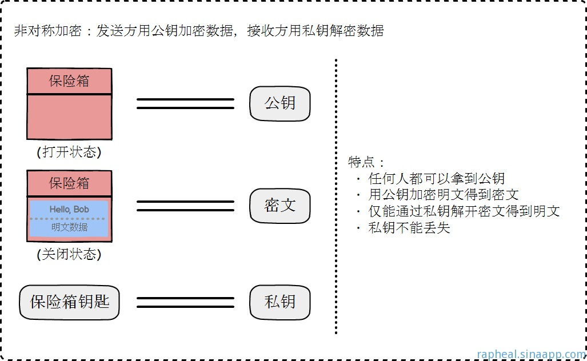

## 资料：

1. 完全图解 HTTPS 【https://juejin.im/post/5c889918e51d45346459994d】

## **HTTPS协议的工作原理**

Https是一种基于SSL/TLS的Http协议，所有的http数据都是在**SSL/TLS协议**封装之上传输的。

Https协议在Http协议的基础上，添加了SSL/TLS握手以及数据加密传输，也属于应用层协议。

**——>HTTP协议运行在TCP之上，所有传输的内容都是明文，客户端和服务器端都无法验证对方的身份。**

**——>HTTPS是运行在SSL/TLS之上的HTTP协议，SSL/TLS运行在TCP之上。所有传输的内容都经过加密，加密采用对称加密，但对称加密的密钥用服务器方的证书进行了非对称加密。**

**TLS/SSL中使用了非对称加密，对称加密以及HASH算法**。

### （1）对称加密和非对称加密

对称加密是指加密和解密使用的密钥是同一个密钥，或者可以相互推算。
对称加密的优点是算法简单，加解密效率高，系统开销小，适合对大数据量加密。
缺点是解密加密使用同一个密钥，需要考虑远程通信的情况下如何安全的交换密钥，如果密钥丢失，
所谓的加密解密就失效了。

非对称加密和解密使用的密钥不是同一密钥，其中一个对外界公开，被称为公钥，另一个只有所有者知道，
称作私钥。
用公钥加密的信息必须用私钥才能解开，反之，用私钥加密的信息只有用公钥才能解开。

### **（2）握手过程的简单描述**

1.浏览器将自己支持的一套加密规则发送给网站。

2.网站从中选出一组加密算法与HASH算法，并将自己的身份信息以证书的形式发回给浏览器。证书里面包含了网站地址，加密公钥，以及证书的颁发机构等信息。

3.获得网站证书之后浏览器要做以下工作：

**a) 验证证书的合法性（颁发证书的机构是否合法，证书中包含的网站地址是否与正在访问的地址一致等），如果证书受信任，则浏览器栏里面会显示一个小锁头，否则会给出证书不受信的提示。**

**b) 如果证书受信任，或者是用户接受了不受信的证书，浏览器会生成一串随机数的密码，并用证书中提供的公钥加密。**

**c) 使用约定好的HASH计算握手消息，并使用生成的随机数对消息进行加密，最后将之前生成的所有信息发送给网站。**

4.网站接收浏览器发来的数据之后要做以下的操作：

a) 使用自己的私钥将信息解密取出密码，使用密码解密浏览器发来的握手消息，并验证HASH是否与浏览器发来的一致。

b) 使用密码加密一段握手消息，发送给浏览器。

5.浏览器解密并计算握手消息的HASH，如果与服务端发来的HASH一致，

此时握手过程结束，之后所有的通信数据将由之前浏览器生成的随机密码并利用对称加密算法进行加密。

这里浏览器与网站互相发送加密的握手消息并验证，目的是为了保证双方都获得了一致的密码，并且可以正常的加密解密数据，为后续真正数据的传输做一次测试。

 

**HTTPS一般使用的加密与HASH算法如下：**

**非对称加密算法：RSA，DSA/DSS**

**对称加密算法：AES，RC4，3DES**

**HASH算法：MD5，SHA1，SHA256**

 

**其中非对称加密算法用于在握手过程中加密生成的密码，对称加密算法用于对真正传输的数据进行加密，而HASH算法用于验证数据的完整性。**

****

由于浏览器生成的密码是整个数据加密的关键，因此在传输的时候使用了非对称加密算法对其加密。

非对称加密算法会生成公钥和私钥，公钥只能用于加密数据，因此可以随意传输，而网站的私钥用于对数据进行解密，所以网站都会非常小心的保管自己的私钥，防止泄漏。

TLS握手过程中如果有任何错误，都会使加密连接断开，从而阻止了隐私信息的传输。