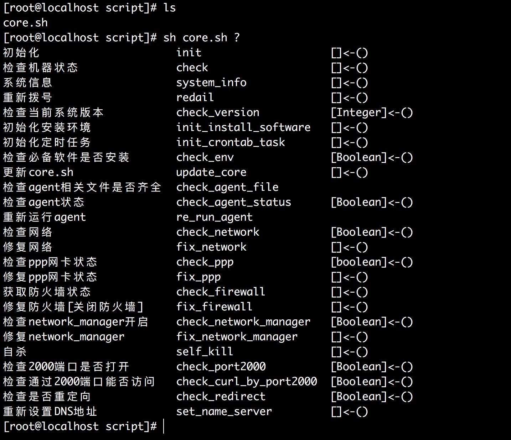

> 本文由 [简悦 SimpRead](http://ksria.com/simpread/) 转码， 原文地址 https://www.jianshu.com/p/161618366866

0.2962018.02.27 23:00:05 字数 4222 阅读 2451

[原文地址](https://link.jianshu.com/?t=http%3A%2F%2Fchen-shang.github.io%2F2017%2F12%2F17%2F%25E8%25BF%2599%25E4%25B9%2588%25E4%25BA%259B%25E5%25B9%25B4%25E7%259A%2584%25E6%258A%2580%25E6%259C%25AF%25E6%2580%25BB%25E7%25BB%2593%2F2Linux%2FShell%25E7%25BC%2596%25E7%25A8%258B%25E8%25A7%2584%25E8%258C%2583%2F)  
Shell 是用户与 Linux 或 Unix 内核通信的工具, shell 编程指的并不是编写这个工具, 而是指利用现有的 shell 工具进行编程, 写出来的程序是轻量级的脚本, 我们叫做 shell 脚本。  
==Shell 的语法是从 C 语言继承过来的==, 因此我们在写 shell 脚本的时候往往能看到 c 语言的影子。  
Shell 脚本实在是太灵活了, 相比标准的 Java、C、C++ 等, 它不过是一些现有命令的堆叠, 这是他的优势也是他的劣势, 太灵活导致不容易书写规范。本人在写 shell 脚本的过程中形成了自己一些规范, 这些规范还在实践中, 在此分享出来, 以期更多的人来帮助我完善。

一些收集整理的 shell 脚本, 在此项目的基础上大家可以轻松的构建自己的 shell 脚本, 希望多多提意见  
[https://github.com/chen-shang/baseshell](https://link.jianshu.com/?t=https%3A%2F%2Fgithub.com%2Fchen-shang%2Fbaseshell)

[什么是 shell](https://link.jianshu.com/?t=http%3A%2F%2Fchen-shang.github.io%2F%252F2016%252F05%252F07%252F%25E8%25BF%2599%25E4%25B9%2588%25E4%25BA%259B%25E5%25B9%25B4%25E7%259A%2584%25E6%258A%2580%25E6%259C%25AF%25E6%2580%25BB%25E7%25BB%2593%252F2Linux%252F%25E4%25BB%2580%25E4%25B9%2588%25E6%2598%25AFshell%252F)

1.  命名只能使用字母, 数字和下划线, 首个字符不能以数字开头。
2.  中间不能有空格, 不能使用标点符号, 不能使用汉字, 可以使用下划线 `_` , 所以我们往往使用 `_` 作为分词的标识 例如 user_name、city_id 等等
3.  不能使用 bash 里的关键字 (可用 help 命令查看保留关键字)。
4.  脚本中的所有变量风格统一使用下划线命名风格。(不强制, 视情况而定)

> 统一的风格是好的编程习惯的开始, 这样程序给人一种清爽的感觉, 至于使用`驼峰`格式还是使用`下划线`格式, 仁者见仁智者见智。

```
local user
local user_
function log_info(){
  # todo
}
function logInfo(){
  # todo
}
function get_user_info(){
  # todo
}
function getUserInfo(){
  # todo
}


```

对比一下就感觉 `userName` 比 `user_name` 简洁; 函数名 `log_info` 比 `logInfo` 更加贴切,  
我们 Java 中打印日志的时候一般这样写 `log.info("")` 或者 `log.error("")`, 所以在 shell 中使用 `log_info ""` 这种写法更像 Java 的习惯; `getUserInfo` 比 `get_user_info` 更加紧凑, 使用起来更像 Java 的函数命名风格。

虽然这样, 但是本规约还是规定使用下划线风格 (特殊情况特殊处理, 不强制), 因为你可以看看 Linux 自带的一些脚本, 定义变量的时候都使用下划线分割。

1.  使用 #!/usr/bin/env bash

我们往往看到大多数 shell 脚本的第一行是 `#!/bin/bash` 这句话, 当然也有 `#!/bin/sh`、`#!/usr/bin/bash`, 这几种写法也都算是正确, 当然还有一些野路子的写法, 为了避免误导这里就不示例了。本 shell 规约并不推荐使用上面的任何一种, 而是使用`#!/usr/bin/env bash` 这种。

```
#!/usr/bin/env bash
# 主函数 []<-()
function main(){
  echo "Hello World!!!"
}


```

shell 脚本的第一行用来指定执行脚本的时候使用的默认解析器是什么, `#!/bin/bash`这样写就是指定使用 `/bin` 目录下的 `bash`来解析。大多数 linux 发行版中默认的 shell 就是 bash, 不同的 shell 下可用的命令不同, 比如 ==sh 就比 bash 可用的基础命令少很多, 这也就是为什么虽然 sh 是始祖却用的人很少, 而它的增强版 bash 能够后来居上的原因==。

shell 脚本是逐行解释执行的, 在遇到第一行是 `#!/bin/bash` 的时候就会加载 bash 相关的环境, 在遇到 `#!/bin/sh` 就会加载 sh 相关的环境, 避免在执行脚本的时候遇到意想不到的错误。但一开始我并不知道我电脑上安装了哪些 shell, 默认使用的又是哪一个 shell, 我脚本移植到别人的计算机上执行, 我更不可能知道别人的计算机是 Ubuntu 还是 Arch 或是 Centos。为了提高程序的移植性, 本 shell 规约规定使用 `#!/usr/bin/env bash`, `#!/usr/bin/env bash` 会自己判断使用的 shell 是什么, 并加载相应的环境变量。

我们看一下下面一段脚本, 在改变第一行头部的时候, shellcheck 给出的建议是什么  
$ cat test.sh

```shell
function main(){
  local string="Hello World!!!"
  echo $string
}
```

> 使用 #!/bin/bash 或 #!/usr/bin/env bash

```shell
$ shellchek test.sh
In base_file.sh line 4:
  echo $string
       ^-- SC2086: Double quote to prevent globbing and word splitting.
```

> 使用 #!/bin/zsh

```
$ shellchek test.sh
In base_file.sh line 1:
#!/bin/zsh
^-- SC1071: ShellCheck only supports sh/bash/dash/ksh scripts. Sorry!
```

> 使用 #!/bin/sh

```
$ shellchek test.sh
In base_file.sh line 2:
function main(){
^-- SC2112: 'function' keyword is non-standard. Delete it.
In base_file.sh line 3:
  local string="Hello World!!!"
  ^-- SC2039: In POSIX sh, 'local' is undefined.
In base_file.sh line 4:
  echo $string
       ^-- SC2086: Double quote to prevent globbing and word splitting.
```

这一行不写大多数时候我们运行脚本的时候也没有问题, 但在使用 shellcheck 进行检查的时候, 会提示

```
^-- SC2148: Tips depend on target shell and yours is unknown. Add a shebang.
```

如果使用 Intellij IDEA 也会提示


shebang.jpg

当你点击 Add shebangline 的时候它会自动添加 `#!/usr/bin/env bash` , 这也是为什么本 shell 规约推荐使用 `#!/usr/bin/env bash` 的原因之一

> shebang 维基百科
>
> > 在计算机科学中，Shebang（也称为 Hashbang ）是一个由井号和叹号构成的字符序列 #! ，其出现在文本文件的第一行的前两个字符。 在文件中存在 Shebang 的情况下，类 Unix 操作系统的程序载入器会分析 Shebang 后的内容，将这些内容作为解释器指令，并调用该指令，并将载有 Shebang 的文件路径作为该解释器的参数 [1]。

> > 例如，以指令`#!/bin/sh`开头的文件在执行时会实际调用 `/bin/sh` 程序（通常是 Bourne shell 或兼容的 shell，例如 bash、dash 等）来执行。这行内容也是 shell 脚本的标准起始行。

1.  除脚本首行外, 所有以 `#` 开头的语句都将成为注释。
2.  函数必须有注释标识该函数的用途、入参变量、函数的返回值类型, 且必须简单在一行内写完。
3.  函数的注释 `#` 顶格写, 井号后面紧跟一个空格 , 对于该格式的要求是为了最后生成函数的帮助文档是用的 (markdown 语法), 然后是注释的内容, 注释尽量简短且在一行, 最后跟的是函数的类型。
4.  函数内注释 `#` 与缩进格式对整齐
5.  变量的注释紧跟在变量的后面

```
# 主函数 []<-()                  <-------函数注释这样写
function main(){
  local var="Hello World!!!"
  echo ${var}
}
# info级别的日志 []<-(msg:String)  <-------带入参的函数注释
log_info(){
  echo "[$(date +'%Y-%m-%dT%H:%M:%S%z')][$$]: [info] $*" >&2
}
# error级别的日志 []<-(msg:String) <-------带入参的函数注释
log_error(){
  # todo [error]用红色显示         <------函数内注释
  local msg=$1 # 将要输出的日志内容  <------变量的注释紧跟在变量的后面
  if [[ x"${msg}" != x"" ]];then
    # 注释                        <-------函数内注释 `#` 与缩进格式对整齐
    echo "[$(date +'%Y-%m-%dT%H:%M:%S%z')][$$]:[error] $*" >&2
  fi
}
```

1.  使用两个空格进行缩进, 不适用 tab 缩进
2.  ==不在一行的时候使用 `\` 进行换行, 使用 `\` 换行的原则是整齐美观==

```shell
#!/usr/bin/env bash
# 脚本使用帮助文档 []<-()
manual(){
  cat "$0"|grep -v "less \"\$0\"" \
          |grep -B1 "function "   \
          |grep -v "\\--"         \
          |sed "s/function //g"   \
          |sed "s/(){//g"         \
          |sed "s/#//g"           \
          |sed 'N;s/\n/ /'        \
          |column -t              \
          |awk '{print $1,$3,$2}' \
          |column -t
}
function search_user_info(){
  local result=$(httpclient_get --cookie "${cookie}" \
                                         "${url}/userName=${user_name}")
}
```

1.  变量赋值使用 `=` 等号, 左右不能留有空格
2.  使用变量的值用`$`取值符号
3.  ==使用变量的时候, 变量名一定要用`{}`包裹==
4.  ==使用变量的时候一定要用 双引号 `"${}"`包裹==

```shell
    var1="Hello World"   #正确,推荐使用双引号
    var2='Hello World'   #正确,不推荐使用单引号
    var3="${var1}"       #应用前面定义的变量的时候也要使用双引号包裹
    var4=6            
    var5=6.70            #小数
    var3=${var1}         #正确,不推荐
```

注意: 单引号和双引号的区别  
单引号里的任何字符都会原样输出, 单引号字符串中的变量是无效的, 单引号字串中不能出现单引号（对单引号使用转义符后也不行）。  
双引号中的普通字符都会原样输出, 双引号中的使用 $ 取值的变量会替换成响应变量的真实值得, 然后在进行输出, 双引号中可以出现单引号

5.  ==常量一定要定义成 readonly==, 这种变量不能使用 source 跨 shell 使用  
    比如一个 a.sh 中定义了一个全局的变量 readonly TURE=0,b.sh 中在一开始使用 source a.sh 引入的 a.sh 的内容, 则在 b.sh 中无需重复定义 readonly local TRUE=0, 否则会报错
    
6.  ==函数中的变量要用 local 修饰, 定义成局部变量, 这样在外部遇到重名的变量也不会影响==

```
web="www.chen-shang.github.io"
function main(){
  local  #这里使用local定义一个局部变量
  local web="${web}"     #这里${}内的web是全局变量,之后在函数中在使用web变量都是使用的局部变量
  local web2="${web}"    #对于全局变量,虽然在使用的时候直接使用即可,但还是推荐使用一个局部变量进行接收，然后使用局部变量，以防止在多线程操作的时候出现异常（相当于java中的静态变量在多线程中的时候需要注意线程安全一样，但常量除外）
}


```

7.  变量一经定义, 不允许删除 (也就是==禁用 unset 命令==, 因为到目前我还没遇到过什么情况必须 unset 的)

先在这儿声明一下, shell 脚本并没有什么复杂的数据类型和数据结构, shell 的数据类型仅仅包括 字符串、数值。shell 并没有像 布尔类型、长整型、短整形等 Java 中的基本数据类型, 数值类型也没有明确的 float 和 double 之分。shell 比较复杂的数据类型就是数组和 Map 了, 但 Map 这种数据类型或者说数据结构只有在高版本的 shell 解析器才拥有, 像我们现在使用的 Linux 系统往往是不支持 Map 的。  
shell 中变量的基本类型就是 String 、数值 (可以自己看做 Int、Double 之类的) 、Boolean。Boolean 其实是 Int 类型的变种, 在 shell 中 0 代表真、非 0 代表假, 所以往往 我会在 shell 脚本中 用 `readonly TURN=0 && readonly FALSE=1`

1.  定义在函数中的我们称之为函数局部变量; 定义在函数外部，shell 脚本中变量我们称之为脚本全局变量
2.  环境变量 所有的程序，包括 shell 启动的程序，都能访问环境变量，有些程序需要环境变量来保证其正常运行。必要的时候 shell 脚本也可以定义环境变量。

> 函数的写法

函数定义的形式是

```
function main(){
  #函数执行的操作
  #函数的返回结果
}
```

或

```
main(){
  #函数执行的操作
  #函数的返回结果
}
```

1.  ==使用关键字 `function` 显示定义的函数为 public 的函数, 可以供 外部脚本以 `sh 脚本 函数 函数入参` 的形式调用==
2.  未使用关键字 `function` 显示定义的函数为 privat 的函数, 仅供本脚本内部调用, 注意这种 privat 是人为规定的, 并不是 shell 的语法, 不推荐以 `sh 脚本 函数 函数入参` 的形式调用, ==注意是不推荐而不是不能==。

> 本 shell 规约这样做的目的就在于使脚本具有一定的封装性, 看到 `function` 修饰的就知道这个函数能被外部调用, 没有被修饰的函数就仅供内部调用。你就知道如果你修改了改函数的影响范围. 如果是 被 function 修饰的函数, 修改后可能影响到外部调用他的脚本, 而修改未被 function 修饰的函数的时候, 仅仅影响本文件中其他函数。

如 core.sh 脚本内容如下是

```java
# 重新设置DNS地址 []<-()
function set_name_server(){
  > /etc/resolv.conf
  echo nameserver 114.114.114.114 >> /etc/resolv.conf
  echo nameserver 8.8.8.8 >> /etc/resolv.conf
  cat /etc/resolv.conf
}
# info级别的日志 []<-(msg:String)
log_info(){
  echo -e "[$(date +'%Y-%m-%dT%H:%M:%S%z')][$$]: \033[32m [info] \033[0m $*" >&2
}
# error级别的日志 []<-(msg:String)
log_error(){
  # todo [error]用红色显示
  echo -e "[$(date +'%Y-%m-%dT%H:%M:%S%z')][$$]: \033[31m [error] \033[0m $*" >&2
}
```

则我可以使用 `sh core.sh set_name_server` 的形式调用 `set_name_server` 函数, 但就不推荐使用 `sh core.sh log_info "Hello World"` 的形式使用 `log_info` 和 `log_error` 函数, 注意是不推荐不是不能。

如何使用脚本单独调用函数中的某个函数
------------------

```shell
#!/usr/bin/env bash
# shellcheck disable=SC1091,SC2155
readonly local TRUE=0 && readonly local FALSE=1
# 脚本使用帮助文档
manual(){
  cat "$0"|grep -v "less \"\$0\"" \
          |grep -B1 "function "   \
          |grep -v "\\--"         \
          |sed "s/function //g"   \
          |sed "s/(){//g"         \
          |sed "s/#//g"           \
          |sed 'N;s/\n/ /'        \
          |column -t              \
          |awk '{print $1,$3,$2}' \
          |column -t
}
######################################################################
# 主函数
main(){
  (manual)
}
######################################################################
# 执行函数 [Any]<-(function_name:String,function_parameters:List<Any>)
execute(){
  function_name=$1
  shift # 参数列表以空格为分割左移一位,相当于丢弃掉第一个参数
  function_parameters=$*
  (${function_name} "${function_parameters}")
}
case $1 in
  "-h" | "--help" | "?") (manual);;
  "") (main) ;;
  *) (execute "$@") ;;
esac
```

使用如上的框架, 只需要在 两个 `######################################################################` 之间写函数, 就可以使用 `sh 脚本名称 脚本中的某个函数 脚本中的某个函数的入参` 的形式调用函数了。  
使用 `sh 脚本名称 ?` 或者 `sh 脚本名称 -h/--help` 就可以查看这个脚本中的函数说明了。



image

3.  在函数内部首先使用有意义的变量名接受参数, 然后在使用这些变量进行操作, 禁止直接操作 $1,$2 等，除非这些变量只用一次
4.  函数的注释  
    函数类型的概念是从函数编程语言中的概念偷过来的, shell 函数的函数类型指的是函数的输入到函数的输入的映射关系

```java
# 主函数 []<-()                  <-------函数注释这样写
function main(){
  local var="Hello World!!!"
  echo ${var}
}
# info级别的日志 []<-(msg:String)  <-------带入参的函数注释
log_info(){
  echo "[$(date +'%Y-%m-%dT%H:%M:%S%z')][$$]: [info] $*" >&2
}
```

main 函数的函数类型是 []<-() , <- 左侧表的是函数的返回值类型 用 [] 包裹, 右侧是函数的参数类型 用 () 包裹, 多个参数用 ',' 分隔,  
参数的描述是从 Scala 语言中偷过来, 先是参数名称 然后是参数类型 中间用: 分隔

对于 main 函数的注释来说, `#` 顶格写, 后面紧跟一个空格, 其实这样写是遵循的 markdown 的语法, 后面再跟一个空格, 然后是 []<-(), 代表这个函数没有入参也没有返回值, 这个函数的目的就是执行这个这个函数中的命令, 但我不关心这个函数的返回值。也就是利用函数的副作用来完成我们想要的操作。

对于 log_info 也是一样 不过 最后的函数类型是 []<-(msg:String) 代表入参是一个 string 类型的信息, 然后也没有返回值。  
关于函数的返回值, 我理解的函数的返回值有两种形式, 一种是显示的 return 一种是隐式的 echo

以下是几种常见的写法

```
[]<-()
[String]<-(var1:String,var2:String)
[Boolean]<-(var1:String,var2:Int)
[]<-(var1:String)
```

shell 函数的返回值比较复杂, 获取函数的返回值又有多种方式  
我们先来说, 我们执行一条命令的时候, 比如 pwd 正常情况下它输出的结果是 当前所处的目录

```
Last login: Sat Jan 20 17:39:16 on ttys000
chenshang@chenshangMacBook-Pro:~$ pwd
/Users/chenshang
```

注意我说的是正常情况下, 那异常情况下呢? 输出的结果又是什么? 输出的结果有可能五花八门!  
所以, shell 中必然有一种状态来标识一条命令是否执行成功, 也就是命令执行结果的状态。  
那这种状态是怎么标识的的, 这就引出了 shell 中一个反人类的规定, 也不算反人类, 只能是在变种语言中算是另类, 就是 0 代表真、成功的含义。非零代表假、失败的含义。  
所以 pwd 这条命令如果执行成功的话, 命令的执行结果状态一定是 0, 然后返回值才是当前目录。如果这条命令执行失败的话, 命令的执行结果状态一定不是 0, 有可能是 1 代表命令不存在，然后输出 not found，也有可能执行结果状态是 2 代表超时，然后什么也不输出。(不要以为 pwd 这种 linux 内带的命令就一定执行成功, 有可能你拿到的就是一台阉割版的 linux 呢)  
那怎么获取这个命令的执行结果和执行结果的状态呢?

```
function main(){
  pwd
}
```

执行 main 函数就会在控制台输出当前目录  
如果想要将 pwd 的内容获取到变量中以供后续使用呢

```
function main(){
  local dir=$(pwd)
  echo "dir is ${dir}"
}
```

如果想要获取 pwd 的执行结果的状态呢

```
function main(){
  local dir=$(pwd)
  local status=$?
  echo "pwd run status is ${status}" #这个stauts一定有值,且是int类型,取值范围在0-255之间
  echo "dir is ${dir}"
}
```

### 显示 return

return 用来显示的返回函数的返回结果, 例如

```shell
# 检查当前系统版本 [Integer]<-()
function check_version(){
  (log_info "check_version ...") #log_info是我写的工具类中的一个函数
  local version #这里是先定义变量,在对变量进行赋值,我们往往是直接初始化,而不是像这样先定义在赋值,这里只是告诉大家可以这么用
  version=$(sed -r 's/.* ([0-9]+)\..*/\1/' /etc/redhat-release)
  (log_info "centos version is ${version}")
  return "${version}"
}
```

这样这个函数的返回值是一个数值类型, 我在脚本的任何地方调用 check_version 这个函数后, 使用 $? 获取返回值

```
check_version
local version=$?
echo "${version}"
```

注意这里不用 local version=$(check_version) 这种形式获取结果, 这样也是获取不到结果的, 因为显示的 return 结果, 返回值只能是 [0-255] 的数值, 这对于我们一般的函数来说就足够了, 因为我们使用显示 return 的时候往往是知道返回结果一定是数字且在 [0-255] 之间的，常常用在状态判断的时候。  
所以  
本 shell 规约规定:

1.  明确返回结果是在 [0-255] 之间的数值类型的时候使用显示 reuturn 返回结果
2.  返回结果类型是 Boolean 类型, 也就是说函数的功能是起判断作用, 返回结果是真或者假的时候使用显示 return 返回结果

例如

```
# 检查网络 [Boolean]<-()
function check_network(){
  (log_info "check_network ...")
  for((i=1;i<=3;i++));do
    http_code=$(curl -I -m 10 -o /dev/null -s -w %\{http_code\}  www.baidu.com)
    if [[ ${http_code} -eq 200 ]];then
      (log_info "network is ok")
      return ${TRUE}
    fi
  done
  (log_error "network is not ok")
  return ${FALSE}
}
# 获取数组中指定元素的下标 [int]<-(TABLE:Array,target:String)
function get_index_of(){
  readonly local array=($1)
  local target=$2
  local index=-1 # -1其实是255
  local size=${#array[@]}
  for ((i=0;i<${size};i++));do
    if [[ ${array[i]} == ${target} ]];then
      return ${i}
    fi
  done
  return ${index}
}


```

### 隐式 echo

return 用来显示的返回函数的返回结果, 例如

```
# 将json字符串格式化树形结构 [String]<-(json_string:String)
function json_format(){
  local json_string=$1
  echo "${json_string}"|jq . #jq是shell中处理json的一个工具
}
```

函数中所有的 echo 照理都应该输出到控制台上 例如

```
json_format "{\"1\":\"one\"}"
```

你会在控制台上看到如下输出

```
{
  "1": "one"
}
```

但是一旦你用变量接收函数的返回值, 这些本该输出到控制台的结果就都会存储到你定义的变量中 例如

```
json=$(json_format "{\"1\":\"one\"}")
echo "${json}" #如果没有这句,上面的语句执行完成后,不会在控制台有任何的输出
```

我们把 json_format 改造一下

```
# 将json字符串格式化树形结构 [String]<-(json_string:String)
function json_format(){
  local json_string=$1
  echo "为格式化之前:${json_string}" #其实新添加的只一句只是用来记录一行日志的
  echo "${json_string}"|jq . #jq是shell中处理json的一个工具
}
```

echo "为格式化之前:${json_string}" 其实新添加的只一句只是用来记录一行日志的, 但是 json=$(json_format "{"1":"one"}")  
json 也会将这句话作为返回结果进行接收, 但这是我不想要看到的。  
解决这个问题需要了解 父子 shell 的 概念  
shell 中 子 shell 可以理解成闭包, 可以捕获父 shell 的变量, 但不能改变父 shell 的变量, 使用 () 将代码块包裹, 包裹的代码块将在子 shell 中运行, 子 shell 相当于独立的一个环境, 其中的代码爱怎么玩儿怎么玩, 不会影响到父 shell 的结果  
所以如果我不想让 echo "为格式化之前:${json_string}" 这句话也作为结果的话, 我就只需要用 () 将代码块儿包裹即可

```
# 将json字符串格式化树形结构 [String]<-(json_string:String)
function json_format(){
  local json_string=$1
  (echo "为格式化之前:${json_string}") #其实新添加的只一句只是用来记录一行日志的
  echo "${json_string}"|jq . #jq是shell中处理json的一个工具
}
```

1.  整数计算使用 `$(())`
2.  小数计算使用 bc 计算器

```
HEAD_KEYWORD parameters; BODY_BEGIN
  BODY_COMMANDS
BODY_END
```

*   将 HEAD_KEYWORD 和初始化命令或者参数放在第一行；
*   将 BODY_BEGIN 同样放在第一行；
*   复合命令中的 BODY 部分以 2 个空格缩进；
*   BODY_END 部分独立一行放在最后；

1.  if  
    if 的一般模式

```
if [[ condition ]]; then
  # statements
fi

if [[ condition ]]; then
  # statements
else
  # statements
fi

if [[ condition ]]; then
  # statements
elif [[ condition ]]; then
  # statements
else
  # statements
fi
```

*   if 后面的判断 使用 双中括号`[[]]`
*   `if [[ condition ]]; then` 写在一行

2.  while

```
while [[ condition ]]; do
  # statements
done

while read -r item ;do
  # statements
done < 'file_name'
```

3.  until

```
until [[ condition ]]; do
  # statements
done
```

4.  for

```
for (( i = 0; i < 10; i++ )); do
  # statements
done

for item in ${array}; do
  # statements
done
```

5.  case

```
case word in
  pattern )
    #statements
    ;;
    *)
    #statements
    ;;
esac
```
